# Cpp

* https://modoocode.com/134 
* C with class Bjarne Stroustrup developed 

## Terms

> Identifier

* can be used to name objects, references, functions, enumerators, types, class members, namespaces, templates, template specializations, parameter packs, goto labels, and other entities
* keywords cannot be used for other purposes
* a double underscore anywhere are reserved
* begin with an underscore followed by an uppercase letter are reserved
* begin with an underscore are reserved in the global namespace

> IEEE

$$
10010.101_{(2)}=2^{4}+2^{1}+2^{-1}+2^{-3}=18.6875 \\
-118.625=-1110110.101_{(2)}
$$

* special numbers
  * NaN       (1 / not 0)
  * infinity  (1 / 0)
  * Denormalized number (0 / not 0)

```cpp
void main() {
  float a = 1. / 0.f;
  printf("a : %f \n", a);
}
```

> Variable

* a variable that directly references (mutable) data, const will prevent that data from being changed
* demoting variable works without cast
* uninitialized local variable will not throw error but gives you unexpected value
* global variables can be declared outside of functions and classes
* global variable always initialized to zero

> Lvalue

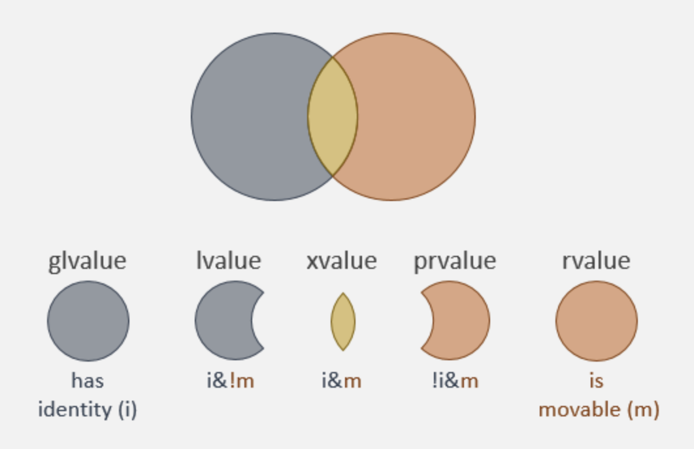

* addressable (&) and assignable (=) (ex. variable)

```cpp
int i = 42;    // i = 43; int* p = &i;
int& foo();    // foo() = 42; int* p1 = &foo(); works
```

> non-modifiable lvalue

* addressable, but not assignable. (ex. const)

> rvalue

* neither addressable nor assignable. (ex. literal)
* can take the address of a const object
* prvalue (“pure” rvalue) is an rvalue that is not a xvalue.
* glvalue (“generalized” lvalue) is an lvalue or a xvalue.
* An xvalue (an “eXpiring” value) also refers to an object, usually near the end of its lifetime
* prvalue (“pure” rvalue) is an rvalue that is not an xvalue


> Right left rule

* Find identifier
* Move right until out of symbols or hit right parenthesis.
* Move left until you run out of symbols or hit a left parenthesis.

```cpp
// []() - cannot have an array of functions
// ()() - cannot have a function that returns a function
// ()[] - cannot have a function that returns an array

int *p          // int pointer (ptr to an int)
int a[]         // array of ints
int f();        // function returning an int
int **pp;       // pointer to an int pointer (ptr to ptr to an int)
int (*pa)[];    // pointer to an array of ints
int (*pf)();    // pointer to a function returning an int
int *ap[];      // array of int pointers (array of ptrs to ints)
int aa[][];     // array of arrays of ints
int ***ppp;     // pointer to a pointer to an int pointer
int (**ppa)[];  // pointer to a pointer to an array of ints
int (**ppf)();  // pointer to a pointer to a function returning an int
int *(*pap)[];  // pointer to an array of int pointers
int (*paa)[][]; // pointer to an array of arrays of ints
int *(*pfp)();  // pointer to a function returning an int pointer
int **app[];    // array of pointers to int pointers
int (*apa[])[]; // array of pointers to arrays of ints
int (*apf[])(); // array of pointers to functions returning an int
int *aap[][];   // array of arrays of int pointers
int aaa[][][];  // array of arrays of arrays of ints
int **fpp();    // function returning a pointer to an int pointer
int (*fpa())[]; // function returning a pointer to an array of ints
int (*fpf())(); // function returning a pointer to a function returning an int
int (*pfa)()[]; // pointer to function returning an array of ints (ILLEGAL)
int (*pff)()(); // pointer to function returning function returning int (ILLEGAL)
int af[]();     // array of functions returning int (ILLEGAL)
int fa()[];     // function returning an array of ints (ILLEGAL)
int ff()();     // function returning a function returning an int (ILLEGAL)
```

> Twos complement

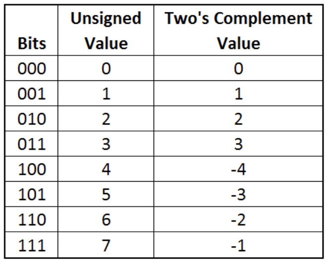

```cpp
int a = 2147483647;
printf("a : %d \n", a);   // 2147483647 
a++;
printf("a : %d \n", a);   // -2147483648
unsigned int b = -1;
printf("b  : %u \n", b);  // 4294967295
```

> Translation unit

* the ultimate input to a C or C++ compiler from which an object file is generated
* In casual usage it is sometimes referred to as a compilation unit

> Module

* header that is also a translation unit
* compiled separately and only once
* plugins or optional components that user may choose to be loaded or not

## Memory

* low memory address as chart goes down

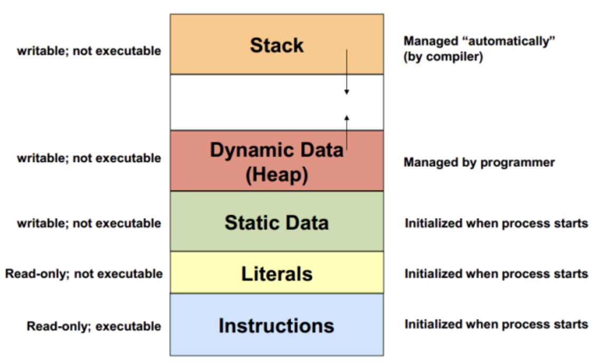

```cpp
#include <stdio.h>
int global = 3;
int main() {
  int i;
  char *str = "Hello";
  char arr[2] = "Hi";
  printf("global : %p \n", &global);	// 0x3e2300 
  printf("i : %p \n", &i);			      // 0x7fff9ebe5740 
  printf("str : %p \n", str);		      // 0x2339c0 → literal
  printf("arr : %p \n", arr);	      	// 0x7fff9ebe5750
}
```


> Heap 

* Large free pool of memory
* Must allocate and deallocate

> Stack

* local variables declared inside a function lives until terminates
* size of stack-frame is calculated when compiling


## Convention

* filename all lowercase
* functions, variables a lowercase + camel case 
* classes, structs, and typedefsStart  a capital letter + camelcase
* clang format

```sh
sudo apt install -y clang-format-7
sudo ln -s /usr/bin/clang-format-7 /usr/bin/clang-format

BasedOnStyle: google
UseTab: Never
IndentWidth: 4
CompactNamespaces: true   # doesn't indent after namespace {
ColumnLimit: 100          # break line after 100 char
```

> cppcheck

```
--enable=all 
--suppress=missingIncludeSystem 00_pointer.cpp
```


## Memory

* Endian
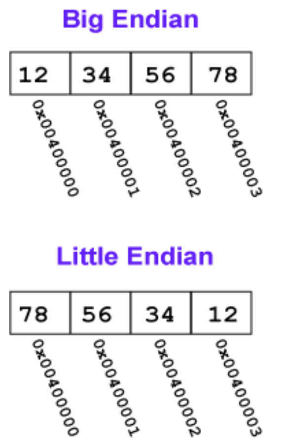

* Floating point
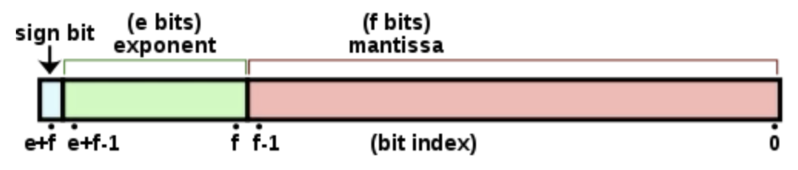
* float     # 1 / 8 / 23
* double    # 1 / 11 / 52


$$
10010.101_{(2)}=2^{4}+2^{1}+2^{-1}+2^{-3}=18.6875
$$

> Version

* C++98
    * firht standard
* C++11
    * lambdas, auto type deduction, list initialization, smart pointers, move semantics 
* C++14
    * return type deduction, binary literals, generic lambda expressions 
* C++17
    * binding, nested namespaces, inline variables, constexpr lambda

## Run

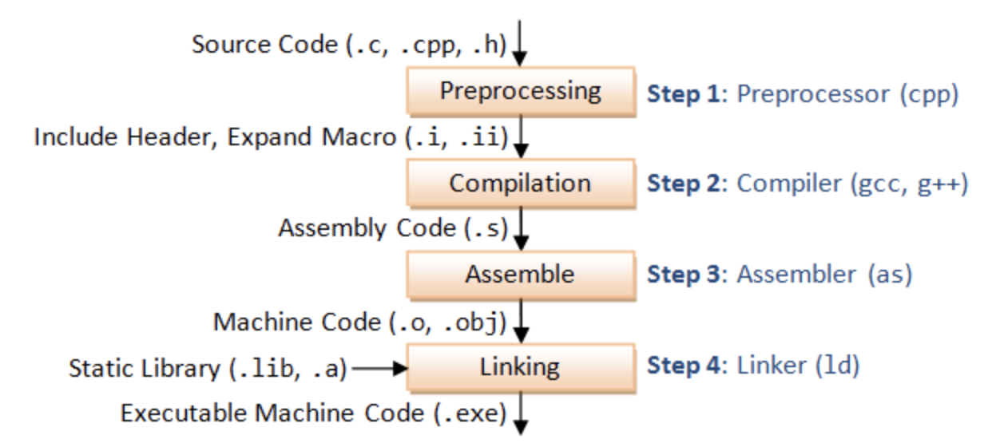

> Compile

* copy constructor / assignment operator / destructor / default constructor (when no other constructor)

```
Preprossess  # Include header, expand Macro (default source.suffix.gch)
Compilation  # assembly code (default source.s;)
Assemble     # generate machine code (default source.o;)
Linking      # .o / .obj (+ .lib / .a / static library) → .exe (default a.out)
```

> GCC

```
<.cpp> / <.o>   # compile / link files (gcc -xc++ -lstdc++ -shared-libgcc)
-c              # Compile / assemble the source files, but do not link (create .o)
-g              # enable gdb
-H              # Show header includes and nesting depth
-I dir          # Search dir for include (headers)
-l (lower L)    # link libraries
-L              # /path contains library files, .a, .so
-MD             # Create dependency
-o out_file     # preprocessed C source : stdout 
-std=c++11      # 11 version
-v              # Verbose Mode
-Wall / extra   # enable all warning / extra warnings
-Wfatal-errors  # causes compiler to abort compilation on the first error occurred
-Wpedantic / unused     # warnings demanded by strict ISO C and C++ / unused type definitions
-x              # Specify the language of the following input files
/W4             # all reasonable warnings
-Wl,aaa,bbb     # list of tokens as a space-separated list of arguments to the linker (ld aaa bbb)

-rpath=dir      # -Wl,-rpath aaa bbb -> gcc -Wl,aaa -Wl,bbb
# Add a directory to the runtime library search path
# used when linking an ELF executable with shared objects (dynamic linker can find the libraries)
# All -rpath arguments are concatenated and passed to the runtime linker, which uses them to locate shared objects at runtime.
```


> ELF file

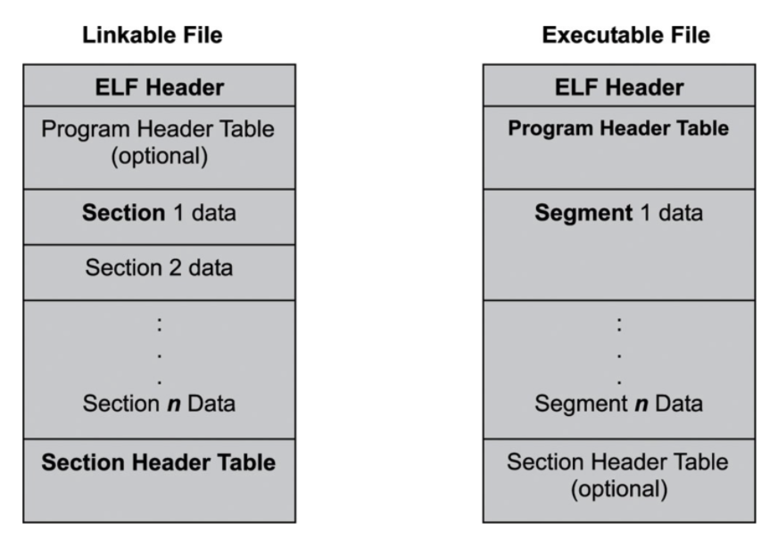

* Executable and linkable file
* use objdump and nm in terminal
* Headers tells which (shared lib, exe, *.o file) and give location of the section / program headers


## Link

* #include <fn> preprocessor searches directories pre-designated by the compiler/IDE (std library)
* #include "fn" preprocessor searches first in the same directory then search path (programmer-defined)
* A more complete description is available in the GCC

* added by the linking process 
* starts with lib followed by name 

```
/usr/lib
/usr/local/lib                # custom library
```

> Library

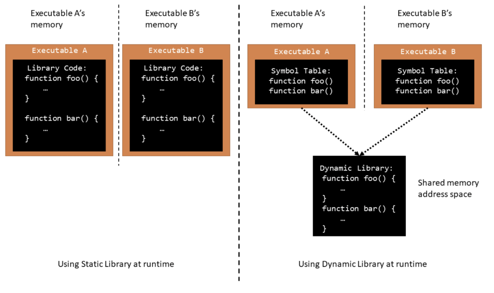

* static library
    * set of routines, external functions and variables which are resolved in a caller at compile-time 
    * copied into a target application by a compiler, linker, or binder
    * produce an object file and a stand-alone executable.

```cpp
// g++ -shared -o librandom.so random.cpp
// g++ main.cpp -lrandom -L.
// ./a.out

// main.cpp
#include <iostream>
#include "random.h"

int main() { std::cout << get_random_number(); }

// random.cpp
#include "random.h"
int get_random_number(void) { return 4; }

// random.h
int get_random_number();
```

* Dynamic Linrary
    * Linking postponed until execution time → useful for libraries 
    * stub replaces itself with address of routine, and executes routine
    * Window → .dll, Apple → dylib (Framework), Unix → so


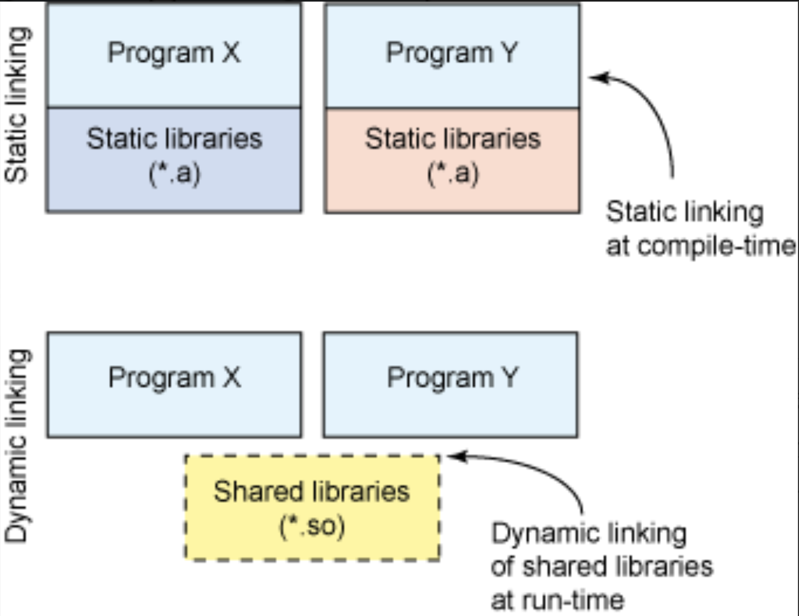

> Static linking

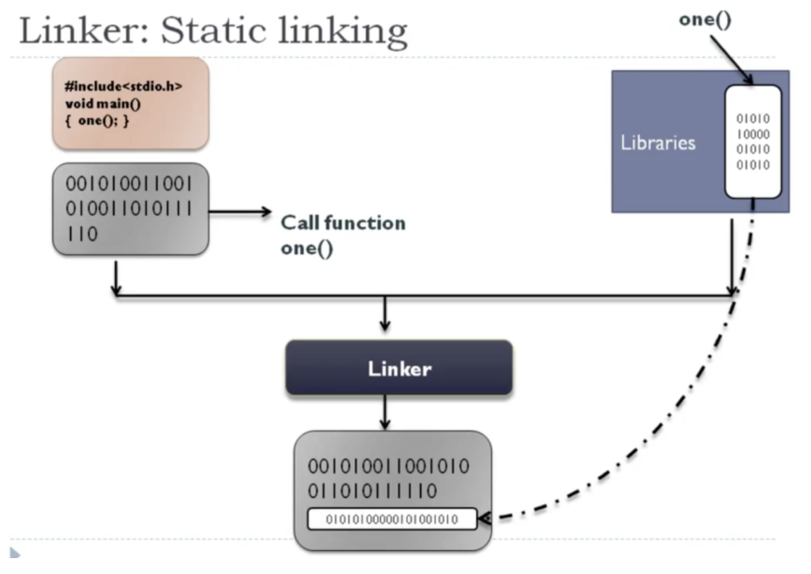

* Compile time
* Window → .lib or Unix → .a
* Bigger binary size, library can be erased

> Dynamic linking

* Run time

```cpp
// main.cpp
void moo()
void main() {
  moo();
}

// moo.h
#inlcude <iostream>
using namespace std;

__declspec(dllexport) void moo() {
  cout << "moo" << endl;
}
```

## Error


> Compile Error

* starts with C 

> gdb

* must be compiled using -g flags to see 

```
# Breakpoints
d N                    # Delete Nth breakpoint
enable / disable br    # enable / disable all br

# threads
info threads           # show all threads
b [LN] thread [BTNUM]  # set breakpoint of thread

backtrace              # show stack trace
f N                    # go to Nth frame
up / down N            # go up / down stacktrack default 1
clear                  # remove all breakpoints
continue               # Continue normal execution.
finish                 # Continue until the current function returns.
frametf
n / next               # step over subroutines
nexti                  # per instruction

# display
set print elements 0  # Set a limit on how many elements of an array GDB will print
p                     # print data
x/s 0x8049988         # print data in address

# Navigation
q / quit              # quit
refresh / Ctrl L      # show GUI
run                   # start from beginning
set                   # set args [args..]

s / step              # steps into subroutines
stepi                 # per instruction
-q                    # do not print introductory and copyright message
gdb ./a.out           # start gdb
b facorial.c:14       # breakpoint to line
break 'BST::add(<TAB> # breakpoint to function

i locals / break / variables     # info args locals / breakpoints / variables
l <> / 20 / func / test.func     # list files around current / line 20 / function / function in file
--args ./main -i ~/data          # pass argument

```

## Class

```cpp
#include <string>
#include <vector>
using namespace std;

class Movie
{
public:
  // Movie(){};
  ~Movie() { delete director_; }
  string &GetTitle() const;
  void SetTitle(string title);

private:
  // error: field has incomplete type 'A'
  // -> shared_ptr<Movie> mv; works
  // Movie mv;
  string title_;
  string *director_;
};

// error: out-of-line definition of 'GetTitle' does not match any declaration in 'Movie'
// -> const is missing
// string& Movie::GetTitle() {}

// error: C++ requires a type specifier for all declarations
// Movie::setTitle(string title) : title(title) {}

// error: only constructors take base initializers
// void Movie::SetTitle() : title_(title) {}

int main()
{
  // error: no viable conversion from 'Movie *' to 'Movie'
  // Movie m = new Movie;

  // error: no matching constructor for initialization of 'Movie'
  // -> Movie(string name) { director_ = new string(name); }
  // Movie harry_potter("sean");

  // error for object 0x1: pointer being freed was not allocated
  // -> Person(const Person& rhs) = delete; // check in compile time
  Movie titanic;

  // error: redefinition of 'titanic'
  // -> check for same variable name
  // Movie titanic;

  // error: type 'Movie' does not provide a call operator
  // -> overload operator()
  // titanic();

  // error: no viable overloaded '='
  // -> overload operator =
  // titanic = 1;

  // error: no member named 'length' in 'Movie'
  // -> create member variable length
  // titanic.length;

  // error: invalid operands to binary expression ('std::__1::ostream' (aka 'basic_ostream<char>') and 'B')
  // std::cout << titanic;

  // ld: symbol(s) not found for architecture x86_64
  // -> ldd a.o # check for dependency and see whether missing .cpp implementation
  // titanic.GetTitle();
}
```

## const

```cpp
#include <iostream>
using namespace std;
struct X {
  X& ref() { return *this; }
};

int main() {
  // non-const lvalue reference to type 'X'
  // -> X().ref()
  X& x = X();
  
  int a = 5;
  // error: const' qualifier may not be applied to a reference
  // int &const ref1 = a;

  const int &ref2 = a;  // valid
  // error: cannot assign to variable 'ref2' with const-qualified type 'const int &'
  // -> const cannot be modified
  // ref2 = 7;

  const int b = 6;
  // error: binding reference of type 'int' to value of type 'const int' drops 'const' qualifier
  // -> cannot create non const pointed by  const pointer
  // int &ref = b;

  int c = 1, e = 2;
  int const *d = &c;
  d = &e;
  // error: read-only variable is not assignable
  // -> cannot modify const pointed int
  // *d = 3;
  cout << *d;

  int const f = 5;
  int *ptr = (int *)&f;
  *ptr = 10;
  cout << f;  // depends on compiler
}
```

## Syntax

```cpp
// errors.cpp:1:10: fatal error: 'a' file not found
// #include <a>
#include <iostream>

// error: expected namespace name
// using namespace sd;

// ld: symbol(s) not found for architecture x86_64
// int man () {
int main() {
  // unknown type name 'in'
  // in a;
    
  // error: expression is not assignable
  // int a = 2 = 3;
  int a = 3;
  // error: expected ';' after expression
  // a++
  // a++;

  // error: use of undeclared identifier 'b'
  // b = 3;

  // warning: ivision by zero is undefined [-Wdivision-by-zero]
  // cout << 1 / 0;

  // error : cannot initialize a variable of type 'int' with an lvalue of type 'const char [3]
  // int a = "ff";

  int arr[1];
  arr[0] = 0;
  // error: AddressSanitizer: stack-buffer-overflow on address 0x7ffee07ea414 [-fsanitize=address]
  // std::cout << arr[1];

  // error: cannot delete expression of type 'int'
  // delete arr[0];

  // error: variable 'd' declared with deduced type 'auto' cannot appear in its own initializer
  // auto d = []() { d(); };

  auto e = "ab";
  // error: assigning to 'const char *' from incompatible type 'int
  // e = 3;
  
  // error: no matching conversion for C-style cast from 'std::__1::string' (aka 'basic_string<char, char_traits<char>, allocator<char> >') to 'int'
  // -> cannot cast string to int
  // (int) e;
  
  // error: expected type
  // -> type must be followed by new
  // new 1
  
  return 0;
  // warning: unused variable 'a' [-Wunused-variable]
  // int a = 2;
}
```

## Link
* starts with L
* Error when combine object files to create executable

> duplicate symbols found

* Same function declared in multiple files (#once)
* include same header multiple times 
    * Check inline, static, #ifdef

> unresolved external symbol

* Can’t find function declaration, header include

> Use of deleted function 'std::atomic<int>::atomic(const std::atomic<int>&)

* Can't assign atomic from int
* Can't directly print atomic, use .load 

# Make

* Search GNUmakefile -> makefile -> Makefile 

> pkgconfig

```sh
export PKG_CONFIG_PATH="/usr/local/lib/pkgconfig"

$ g++ filename.cpp $(pkg-config --cflags --libs opencv)

./Makefile

CXX ?= g++

CXXFLAGS += -c -Wall $(shell pkg-config --cflags opencv)
LDFLAGS += $(shell pkg-config --libs --static opencv)
all: opencv_example
opencv_example: example.o; $(CXX) $< -o $@ $(LDFLAGS)
%.o: %.cpp; $(CXX) $< -o $@ $(CXXFLAGS)
clean: ; rm -f example.o opencv_example
```


## Terms

```make
target … : prerequisites …
    recipe
```

> target

* usually name of a file generated by a program | name of action to carry out

> prerequisite  

* file that is used as input to create the target

> recipe

* an action that make carries out

```make
   @:  # do nothing
```


> kits

* project-agnostic and configuration-agnostic information about how to build code
* compilers, vscode installation, toolchain file

> variant

```make
Debug           # disables optimizations and includes debug info. 
Release         # Includes optimizations but no debug info. 
MinRelSize      # Optimizes for size. No debug info
RelWithDebInfo  # Optimizes for speed and includes debug info.
```

## Syntax

> .PHONY

* implicit rule search is skipped for .PHONY targets

> .PRECIOUS

* Don’t get deleted even if it is an intermediate file

> .SILENT

* make will not print recipe used to remake those files before executing them


## Run

```make
<>          # make 
all         # convention (put all at top of the file)
-f File     # Reads FILE as the makefile.
-h          # Displays the list of make
-s          # silent error
-j $(proc)  # Set to number of core
```

* Run code directly from Makefile

```make
# File Structure
├── 00_macro.cpp
├── 01_primitives.cpp
├── 02_pointer.cpp
├── bin
│   ├── 00_macro
│   ├── 01_primitives
│   ├── 02_pointer
├── common
│   ├── common.hpp
│   └── logger.hpp
├── data
│   ├── fstream.txt
│   └── thread.txt
└── obj
    ├── 00_macro.o
    ├── 01_primitives.o
    └── 02_pointer.o
.
├── Makefile

# Makefile

SRC_DIR=.
OBJ_DIR=./obj
BIN_DIR=./bin

SRCS := $(wildcard $(SRC_DIR)/*.cpp)
BINS := $(SRCS:$(SRC_DIR)/%.cpp=$(BIN_DIR)/%)
OBJS := $(SRCS:$(SRC_DIR)/%.cpp=$(OBJ_DIR/%.o))

CXX=g++
CXXFLAGS= -std=c++2a -Wall -o=bin
LDFLAGS=

all: $(BINS)         # if no .DEFAULT it runs first target
  @:

run: $(BIN_DIR)/$(basename $(filter-out run,$(MAKECMDGOALS)))
  @$(BIN_DIR)/$(basename $(filter-out $@,$(MAKECMDGOALS)))

$(OBJ_DIR)/%.o: $(SRC_DIR)/%.cpp | $(OBJ_DIR)
  $(CXX) $(CXXFLAGS) -c -o $@ $<

$(BIN_DIR)/%: $(OBJ_DIR)/%.o | $(BIN_DIR)
  $(CXX) $(CXXFLAGS) -o $@ $< $(LDFLAGS)

$(BIN_DIR) $(OBJ_DIR):
  mkdir -p $@
  
.PHONY:     all run clean     # even if all run clean filename exists
.PRECIOUS:  $(OBJ_DIR)/%.o    # keep intermediate files

clean:
  rm -r $(BIN_DIR) $(OBJ_DIR)
```

# Cmake

* https://www.youtube.com/watch?v=wP4cwAtU-g8

```
CXX=clang++ cmake ..  # pick compiler only once

--help                # help

--config Debug        # (ex. Release, RelWithDebInfo, MinSizeRel)
--build build         # equivalent to make
-D var:type=val       # manipulate cache values
-U 'help*'            # remove variable from cache
-G "Unix Makefiles"   # Omitting will choose default generator
-j N                  # parallel builds on N cores
-S .                  # specify source directory
-t                    # pick a target
-U                    # remove variables from cache
-v                    # verbose
--trace               # print every line of CMake run
--trace-source="fname"  # print in file

-B                    # build from source dir
cmake -Bbuild

-L                    # List option in human readable
-LH                   # Human Readable

# OpenCV
cmake -B build -DCMAKE_BUILD_TYPE=RELEASE \
    -DCMAKE_INSTALL_PREFIX=../install \
    -DBUILD_EXAMPLES=ON \
    -DOPENCV_GENERATE_PKGCONFIG=ON \
    -DBUILD_DOCS=ON \
    -DOPENCV_EXTRA_MODULES_PATH=../opencv_contrib/modules \
    -DBUILD_EXAMPLES=ON
```

> Convention

* lower case for function, Upper case is for variables → case insensitive

```
# Hello cpp
├── CMakeLists.txt
cmake_minimum_required(VERSION 3.0)
project(same_folder)                            # Root CMAKE must have, set PROJECT_VERSION, PROJECT_NAME
add_definitions("-Wall -std=c++14")             # g++ -D option
add_executable(main main.cpp test.cpp)
├── main.cpp
├── test.cpp
└── test.h

# Hello library
├── CMakeLists.txt
cmake_minimum_required(VERSION 3.0)
project(libarary)                               # shared (dynamic), Linking postponed until execution time (useful for libraries)
add_library(test SHARED test.hpp test.cpp)      # ldd main prints @rpath/libtest.dylib if SHARED  (static default)
add_executable(main main.cpp)
target_link_libraries(main test)
├── main.cpp
├── test.cpp
└── test.hpp

# Hello Optional Toolchain / Build Type         # Debug Version doesn't do compiler optimization
├── CMakeLists.txt                                                                  
project("Hello")
cmake_minimum_required(VERSION 3.5)
set(SOURCE_FILES ${CMAKE_CURRENT_SOURCE_DIR}/main.cpp)
set(CMAKE_BUILD_TYPE Debug)                     # cmake -DCMAKE_BUILD_TYPE=Debug 
add_executable(Hello ${SOURCE_FILES})
├── main.cpp
└── toolchain
    └── Linux-Clang.cmake
set(CMAKE_CXX_COMPILER "/usr/bin/clang++" CACHE string "clang++ compiler" FORCE)    # cmake -Bbuild -Ctoolchain/Linux-Clang.cmake
  
# splitted into src / include dir + external
.
├── CMakeLists.txt
cmake_minimum_required(VERSION 3.0.0)
project(tictactoe)
find_package( OpenCV REQUIRED )         # CMAKE_PREFIX_PATH=~/github/opencv/build
file(GLOB SOURCES "src/*.cpp")
add_executable(tictactoe ${SOURCES})
include_directories(include)
set(LIBS ${OpenCV_LIBS})
target_link_libraries( tictactoe ${LIBS} )
├── include
│   ├── board.h
│   ├── model.h
│   └── tictactoe.h
└── src
    ├── board.cpp
    ├── main.cpp
    ├── model.cpp
    └── tictactoe.cpp

# Add resources
.
├── CMakeLists.txt
cmake_minimum_required(VERSION 3.0)
project(example_project)

## file globbing ##############################################################
# search directory tree when cmake is invoked and put all files that match the pattern in `sources` and `data`.
file(GLOB_RECURSE sources      src/main/*.cpp src/main/*.h)
file(GLOB_RECURSE sources_test src/test/*.cpp)
file(GLOB_RECURSE data resources/*)

## target definitions #########################################################
add_executable(example ${sources} ${data})
target_compile_options(example PUBLIC -std=c++1y -Wall -Wfloat-conversion)
target_include_directories(example PUBLIC src/main) # to include files relative to root of src directory with a <> pair
file(COPY ${data} DESTINATION resources) # copies resource files in build directory, to work with paths relative to executable

## dependencies ###############################################################
find_package(Boost 1.36.0 COMPONENTS filesystem system REQUIRED)
target_link_libraries(example PUBLIC ${Boost_LIBRARIES})

## testing ####################################################################
find_package(GTest)
if(GTEST_FOUND)
  add_executable(unit_tests ${sources_test} ${sources})
  target_compile_definitions(unit_tests PUBLIC UNIT_TESTS) # prevent collision with main. better by not adding source with main to testing target
  set_target_properties(example PROPERTIES ENABLE_EXPORTS on)

  target_link_libraries(unit_tests PUBLIC # use executable as link library, and inherit linker options / library dependencies from it, by adding as dependency.
    ${GTEST_BOTH_LIBRARIES} example)
  target_include_directories(unit_tests PUBLIC
    ${GTEST_INCLUDE_DIRS}) # doesn't do anything on linux
  
endif()

## packaging ##################################################################
install(TARGETS example DESTINATION example_destination)     # all install commands get same destination. this allows us to use paths relative to executable.
install(DIRECTORY resources DESTINATION example_destination) # repeat of file copy instruction that copies resources in build dir, but here put in package.

set(CPACK_PACKAGE_NAME "MyExample")
set(CPACK_PACKAGE_VERSION "1.0.0")
set(CPACK_MONOLITHIC_INSTALL 1) # save program into one complete piece
include(CPack)                  # This must be last
├── LICENSE
├── README.md
├── resources
│   └── resource1
└── src
    ├── main
    │   ├── main.cpp
    │   └── main.h
    └── test
        └── test.cpp
```

* Subdirectory

```
# Hello subdirectory
.
├── CMakeLists.txt
cmake_minimum_required(VERSION 3.0)
project(test)
add_subdirectory(test)                
add_executable(main main.cpp)
target_link_libraries(main test)        
├── errors.cpp
├── main.cpp
└── test
    ├── CMakeLists.txt
cmake_minimum_required(VERSION 3.0)
add_library(test STATIC test.cpp)       # STATIC, SHARED, or MODULE may be given to specify type of library to be created
    ├── test.cpp
    └── test.h

# Hello subdirectory 2
├── CMakeLists.txt
cmake_minimum_required(VERSION 3.0)
project(hello)
add_subdirectory(test)
add_subdirectory(main)                    # order is important
├── main
│   ├── CMakeLists.txt
add_executable(hello_main main.cpp)
target_link_libraries(hello_main hello_test)
│   └── main.cpp                          # #include <hello/test.hpp>
└── test
    ├── CMakeLists.txt
add_library(hello_test hello/test.cpp hello/test.hpp)
target_include_directories(hello_test PUBLIC "${CMAKE_CURRENT_SOURCE_DIR}")
target_compile_definitions(hello_test PUBLIC MODE=4)     # PUBLIC - all targets, INTERFACE - except cur, PRIVATE - only cur
    └── hello
        ├── test.cpp
        └── test.hpp
```

## Terms

> CMakeCache.txt

* store information for reuse on subsequent runs

> dependency

```
in-source-build         # store binary and src files in the same (DISCOURAGED → V.C.)
Generator               # (ex. Unix Makefiles, Ninja, Xcode)

private dependency      # A uses B in its own internal implementation
public dependency       # A uses B in its interface (ex. A func has a param of a type in B)
interface dependency    # A uses B 
```

## Variable

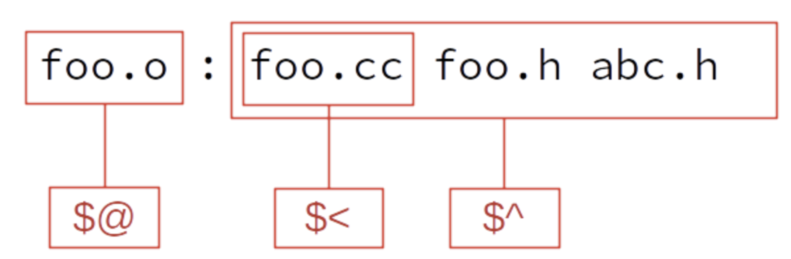

* Case sensitive
* uninitialized = empty string

```
$@             # first target 
$^             # all dependency
$<             # first dependency
$(basename $@) # remove extension
$(ARGS)        # argument passed in
$?             # names of the changed dependents
$(@F)          # equivalent to $(notdir $@). '$@' = dir/foo.o → $(@F) = foo.o
${} or $()     # referencing variable
?=             # only sets variables if they have not yet been set
%.o            # wildcard
x = dude       # declare variablruns / ignore set if exists

# unset(VAR)

# message(STATUS "arg = ${arg}")    
WARNING, FATAL_ERROR

# Global
add_custom_command()
find_package ( openCV REQUIRED )  # set _FOUND True, REQUIRED will throw error if not
cmake --help-module-list          # see available files
pkg-config --list-all             # see available files

# Bool           # ON OFF
$ENV{PATH}       # only effects currently running instances

# String         # set(multiLine [-[ [[ -n "$USER"]] ]-] )
string(FIND abdab ab idx)                # idx will be set to 0 (REVERSE will be 3)
string(REGEX MATCHALL "[ad]" m abdab)    # m will be a;d;a
string(REGEX replace "[ad]" "X" m abdab) # m will be XbXXb

# list
Lists                 # set(var a b c) set(var a;b;c;)
message( "$var" )     # print with ; delimeter 
```

## Syntax

* Color print

```cmake
if(NOT WIN32)
  string(ASCII 27 Esc)
  set(ColourReset "${Esc}[m")
  set(ColourBold  "${Esc}[1m")
  set(Red         "${Esc}[31m")
  set(Green       "${Esc}[32m")
  set(Yellow      "${Esc}[33m")
  set(Blue        "${Esc}[34m")
  set(Magenta     "${Esc}[35m")
  set(Cyan        "${Esc}[36m")
  set(White       "${Esc}[37m")
  set(BoldRed     "${Esc}[1;31m")
  set(BoldGreen   "${Esc}[1;32m")
  set(BoldYellow  "${Esc}[1;33m")
  set(BoldBlue    "${Esc}[1;34m")
  set(BoldMagenta "${Esc}[1;35m")
  set(BoldCyan    "${Esc}[1;36m")
  set(BoldWhite   "${Esc}[1;37m")
endif()

message("This is normal")
message("${Red}This is Red${ColourReset}")
message("${Green}This is Green${ColourReset}")
message("${Yellow}This is Yellow${ColourReset}")
message("${Blue}This is Blue${ColourReset}")
message("${Magenta}This is Magenta${ColourReset}")
message("${Cyan}This is Cyan${ColourReset}")
message("${White}This is White${ColourReset}")
message("${BoldRed}This is BoldRed${ColourReset}")
message("${BoldGreen}This is BoldGreen${ColourReset}")
message("${BoldYellow}This is BoldYellow${ColourReset}")
message("${BoldBlue}This is BoldBlue${ColourReset}")
message("${BoldMagenta}This is BoldMagenta${ColourReset}")
message("${BoldCyan}This is BoldCyan${ColourReset}")
message("${BoldWhite}This is BoldWhite\n\n${ColourReset}")
```

## Flow

```cmake
foreach(var RANGE 0 10 2)           # prints 0 \n 2 \n 4 \n 6 \n 8 \n 10
    message("${var}")
endforeach()

set(li A B)
foreach(var IN LISTS li ITEMS foo)  # prints A \n B \n foo
    message("${var}")
endforeach()
```

## Function

* Function introduce new variable scope, whereas macros do not

```
$(function arguments)
$(SRCS:$(SRC_DIR)/%.cpp=$(BIN_DIR)/%)

$(info $$var : [${var}])  # echo
filter-out        # removes some elements from a list ($(filter-out $@,$(MAKECMDGOALS)))
MAKECMDGOALS      # list of "targets" spelled out on the command line
notdir            # only extract file name 
$(OBJECTS:.o=.d)  # replace .o to .d

macro

include_directories()                # compiler -I option
add_definitions( -Dmy_define=value ) # compiler -D option
add_compile_options( -g -Wall )
link_directories(my_lib_dir your_lib_dir ...)    # linker -L option
link_libraries(mine)                # linker -l option
archive_output_directory            # static lib path
library_output_directroy            # library path
runtime_output_directory            # executable path

add_executable(exec_name main.c)    # multiple same exec_name fail
add_dependency(target dependency)
add_library(name STATIC / SHARED)   # Create library ( libname.a / )
target_link_libraries(target PRIVATE item1)    # target requires item1 (allow intellisence)
install

add_subdirectory()             # Include new variable scope
include(module)                # Use same variable scope

# set_property()
(${target} PROPERTY FOO VALUE) # DIRECTORY, GLOBAL

# get_property
( RECIEVE_NAME ${target} PROPERTY FOO )
```

* set(<variable> <value> [[CACHE <type>] | PARENT_SCOPE])
  * if CACHE is set: if <variable> exists ignore variable, otherwise set cache
  * type is used by CMake GUI (FILEPATH, PATH, STRING, BOOL, INTERNAL)
  * PARENT_SCOPE cannot be combined with CACHE

## Error

> CMake Error: Error processing

```cmake
cmake -CMAKE_TOOLCHAIN_FILE=/home/swt/work/Toolchain-ts7800-arm.cmake ..
```

* -C option is for preloading cache
* -D for defining some var value

> CMake was unable to find a build program coressponding to "Unix Makefiles". CMAKE_MAKE_PROGRAM is not set.  
> You probably need to select a different build tool.

* check toolchain file location

> file INSTALL cannot copy file  
> " ~/build/x86_64/Release/lib/libname.so.1.0.1" to "/usr/local/lib/libname.so.1.0.1".

```cmake
# update cache
CMAKE_INSTALL_PREFIX:PATH=/usr/local

# when cmake
-CMAKE_INSTALL_PREFIX:PATH=/usr/local
```

> libopencv_dnn.so.4.5.1: undefined reference to `ngraph:

* check target_link_libraries

> ~/gcc/aarch64-ese-linux/real-ld: warning: libinference_engine.so, needed by ~/opencv/lib/libopencv_gapi.so.4.5.1, not found (try using -rpath or -rpath-link)

* Add Linker flag

```cmake
set (CMAKE_EXE_LINKER_FLAGS  "${CMAKE_EXE_LINKER_FLAGS} -Wl,-rpath,/opt/openvino/deployment_tools/ngraph/lib")
```