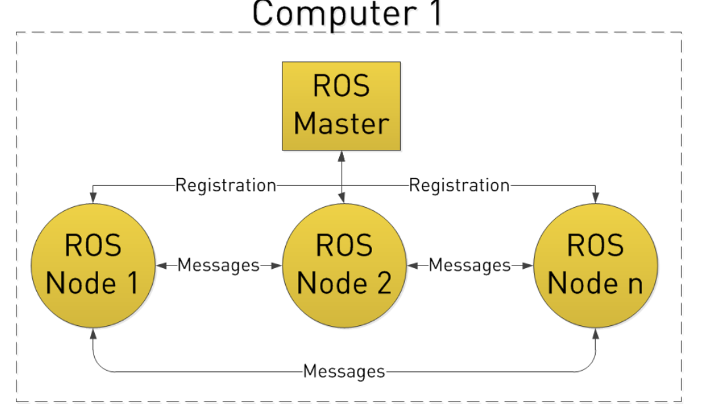
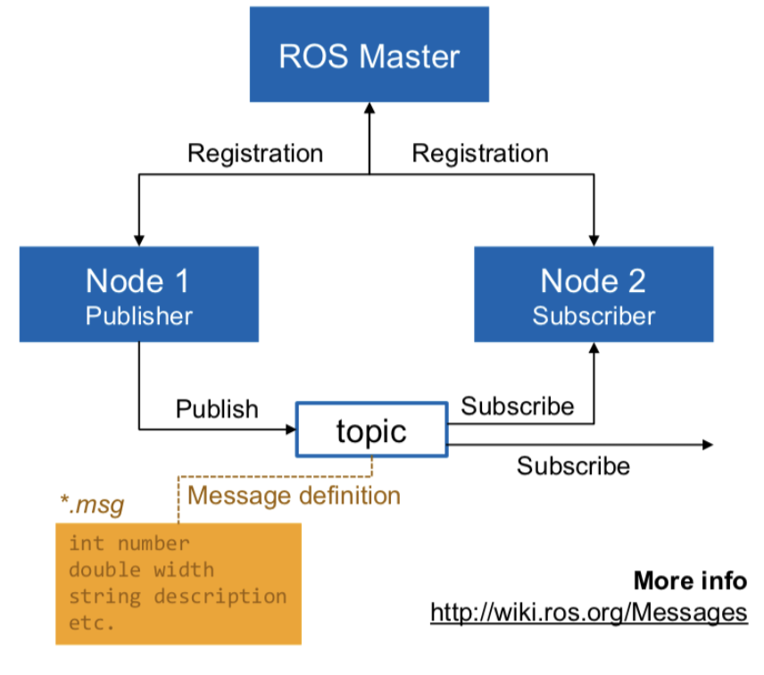

# Module

## ROS




> Command

```sh
roscd        # takes you to the default ROS workspace
roscore      # run master node
rosmsg list
rosmsg show <n> <t>    show <t>variable in <n> package

rosnode list      # list all the running nodes
rosnode info <n>  # give details of the node

rostopic list     # list all the topics
rostopic echo <n> # echo all changes in topic (rostopic echo turtle1/cmd_vel)
rostopic pub      # publish (rostopic pub /turtle1/cmd_vel geometry_msgs/Twist -- '[2,0,0]' '[0,0,1]')

rosrun <n>        # run package <n> (turtlesim turtle_teleop_key)
catkin_make       # build

cd ~/catkin_ws/src
catkin_create_pkg my_package std_msgs roscpp  # create new ROS package
```

* workspace
  * you have to add setup.bash in the ~/.bashrc file
  * ROS workspace is built using catkin_make command
  * A ROS workspace contains three main folders: source, devel, build
  * user directory that will used to create the user ROS packages

> Files

* package.xml
  * define a license of your package in package.xml
  * contains two dependencies: build a package, execute a package

* package
  * catkin_create_pkg <p> std_msgs roscpp
  * cd .. 
  * catkin_make

* publisher
  * name for the topic to publish
  * type of the message
  * frequency of the topic publication

* Subscriber
  * name for the topic to listen to
  * type of the messages to be received
