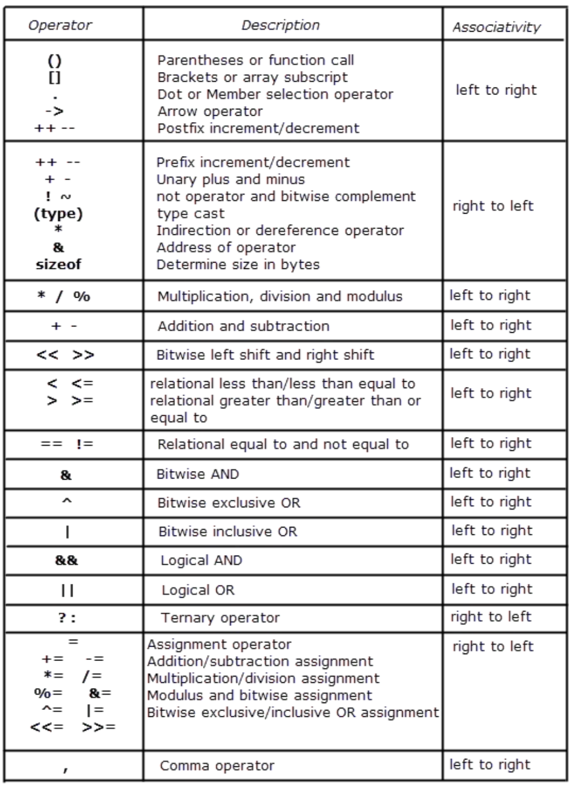

# Syntax

* [Reference](https://modoocode.com/135)

## IO

* comment

```cpp
//          # single line
/**/      # multiple lines
```

> Macro

```cpp
__TIME__ 
__DATE__
__FILE__
__LINE__

#ifndef NUMBER
#define NUMBER 2
#define MAX(x, y) (((x) > (y)) ? (x) : (y))

#endif

cout << MAX(NUMBER, 5) << endl;
```

> Template

* Multi-arg template

```cpp
emplate <typename T>
T summer(T v) {
  return v;
}

template <typename T, typename... Args>
T summer(T first, Args... args) {
  return first + summer(args...);
}

template <typename T>
T *summer(T *v) {
  return v;
}
```

* Recursive template

```cpp
// Factorial<6>::result << endl;
template <int N>
struct Factorial {
  static const int result = N * Factorial<N - 1>::result;
};

template <>
struct Factorial<1> {
  static const int result = 1;
};
```

### Builtin

```cpp
cout << "bool \t" << sizeof(bool) << endl;
cout << "char \t" << sizeof(char) << endl;
cout << "int \t" << sizeof(int) << endl;
cout << "float \t" << sizeof(float) << endl;
cout << "long \t" << sizeof(long) << endl;
cout << "ll \t" << sizeof(long long) << endl;
cout << "double \t" << sizeof(double) << endl;
cout << "ld \t" << sizeof(long double) << endl;

bool *p_bool;
cout << "p_bool \t" << sizeof(p_bool) << endl;
```

### Keywords

* auto

```cpp
auto gamma = {1, 2, 3};  // initializer_list<int>
auto delta = vector<int>{1, 2, 3};
cout << (vector<int>)gamma << "\n";
cout << delta << "\n\n";
```

> namespace

```cpp
#include <cstdio>
#include <iostream>
#include <string>
using namespace std;

namespace bw {
const std::string prefix = "(bw::string)";
class string {
  std::string _s = "";
  string();

 public:
  string(const std::string &s) : _s(prefix + s) {}
  const char *c_str() const { return _s.c_str(); }
};
};  // namespace bw

int main() {
  const string s1("This is a string");
  puts(s1.c_str());

  const bw::string s2(s1);
  cout << s2.c_str() << endl;
  return 0;
}
```

### Casting

> static_cast

* convert pointer / reference from one type to a related type (down / up cast)

```cpp
static_cast<int> // Equivalent to (int)
```

> reinterpret_cast

* doesn’t check if pointer type and data pointed by pointer is same or not. (down)
* requires 2 types to be polymorphic (have virtual function)

```cpp
data_type *var_name = reinterpret_cast<data_type *>(pointer_variable);

template<typename T>
void show_binrep(const T& a) {
    const char* beg = reinterpret_cast<const char*>(&a);
    const char* end = beg + sizeof(a);
    while(beg != end)
        cout << bitset<8>(*beg++) << '  ';
    cout << '\n';
}
```

> const_cast

* only works on pointer / reference (same)
* cast away constness of the object

> reinterpret_cast

* reinterpret bits of the object pointed

### Error

> Exception

* unchecked in C++ → compiler doesn’t check if the exceptions are caught or not.
* void fun(int a, char b) throw (Exception1, Exception2, ..) 

> noexcept

* noexcept allows compiler to optimize (Destructor is noexcept by default)

```cpp
int foo() noexcept { throw 1; }
int main() {
  try {
    foo();
  } catch (int x) {
    cout << "Error : " << x << std::endl;  # will not be caught
  }
}
```

* Example

```cpp
#include <iostream>
using namespace std;
```

* child_catch_first.cpp

```cpp
class Parent : public exception {
 public:
  virtual const char *what() const noexcept override { return "Parent!\n"; }
};

class Child : public Parent {
 public:
  const char *what() const noexcept override { return "Child!\n"; }  // this function will not be thrown
};

int main() {
  try {
    throw Child();
  } catch (Parent &p) {
    cout << "Parent Catch!" << endl;
    cout << p.what();
  } catch (Child &c) {
    cout << "Child Catch!" << endl;
    cout << c.what();
  } catch (...) {
    cout << "Default Catch!" << std::endl;
  }
}
```

* Stack rewinding

```cpp
#include <iostream>

using namespace std;

class Resource {
 public:
  Resource(int id) : id_(id) {}
  ~Resource() { cout << "delete resource " << id_ << endl; }

 private:
  int id_;
};

int main() {
  auto func2 = []() {
    Resource r(2);
    throw runtime_error("Exception from 3!\n");
    return 0;
  };
  auto func1 = [func2]() {
    Resource r(1);
    func2();
    return 0;
  };
  try {
    // delete resource 2
    // delete resource 1
    func1();
  } catch (exception &e) {
    // Exception : Exception from 3!
    cout << "Exception : " << e.what();
  }
  cout << endl;
}
```

### cstdio

* C Standard Input and Output Library

> printf

```cpp
#include <stdio.h>

int main()
{
   printf ("Characters: %c %c \n", 'a', 65);
   printf ("Decimals: %d %ld\n", 1977, 650000L);
   printf ("Preceding with blanks: %10d \n", 1977);
   printf ("Preceding with zeros: %010d \n", 1977);
   printf ("Some different radices: %d %x %o %#x %#o \n", 100, 100, 100, 100, 100);
   printf ("floats: %4.2f %+.0e %E \n", 3.1416, 3.1416, 3.1416);
   printf ("Width trick: %*d \n", 5, 10);
   printf ("%s \n", "A string");
   return 0;
}
```

> int sprintf()

```cpp
int main ()
{
  char buffer [100];
  int cx;

  cx = snprintf ( buffer, 100, "The half of %d is %d", 60, 60/2 );

  if (cx>=0 && cx<100)      // check returned value
    snprintf ( buffer+cx, 100-cx, ", and the half of that is %d.", 60/2/2 );

  puts (buffer);

  return 0;
}
```

> iostream

```cpp
istream& getline(istream&& is, string& str, char delim) # Get line
ignore(streamsize n = 1, int delim = EOF);              # Discards from input sequence until n characters or delim
peek()         // Peek next character
read()         // Read block of data 
readsome()     // Read data available in buffer 
putback()      // Put character back 
unget()        // Unget character

\r             // move cursor at the start of the line
\b             // move cursor before last character
void prints() { cout << "ABC\n" << '\b' << "D" << endl; }
```

> progress

```cpp
cout << "ABC\n" << '\b' << "D" << endl; 
float progress = 0.0;
while (progress < 1.0) {
  int barWidth = 70;

  cout << "[";
  int pos = barWidth * progress;
  for (int i = 0; i < barWidth; ++i) {
    if (i < pos)
      cout << "=";
    else if (i == pos)
      cout << ">";
    else
      cout << " ";
  }
  cout << "] " << int(progress * 100.0) << " %\r";
  cout.flush();

  progress += 0.16;
}
```

> fstream

* common

```cpp
#include <fstream>
#include <iostream>    // for cout
using namespace std;
```

* copy file

```cpp
int main(src_file, dst_file) {
  ifstream src(src_file):
  ofstream dst(dst_file):
  dst << src.rdbuf();
}
```

* Class read, write

```cpp
class Human {
  string name;
  int age;

 public:
  Human(const string &name, int age) : name(name), age(age) {}
  string get_info() { return "Name :: " + name + " / Age :: " + to_string(age); }

  friend ofstream &operator<<(ofstream &o, Human &h);
};

ofstream &operator<<(ofstream &o, Human &h) {
  o << h.get_info();
  return o;
}

int main() {
  ofstream new_("data/fstream.txt");  // ifstream or ofstream for one
  if (new_.is_open()) {
    new_ << "First\n";
    new_ << "Second\n";
  } else {
    cout << "Not opened";
  }
  new_.close();

  ofstream out("data/fstream.txt", ios::app);

  Human h("Sean", 15);
  out << h;  //  First
  out.close();

  ifstream in("data/fstream.txt");
  string line;
  char buf[100];
  while (in) {
    in.getline(buf, 100);
    cout << buf << endl;  // First \n Second \n Name :: Sean / Age :: 15
  }

  in.close();
}
```

* erase current contents of the file

```cpp
ofstream ofs;
ofs.open("test.txt", ofstream::out / ofstream::trunc);  // delete
ofs.open("test.txt", std::ios_base::app);    // append
ofs.close()
```

* go to the beginning of the file

```cpp
file.clear(); 
file.seekg(0, ios::beg); 
```

* count number of line

```cpp
file.unsetf(std::ios_base::skipws);
unsigned line_count = count(istream_iterator<char>(file), istream_iterator<char>(), '\n');
```
  
* read char by char

```cpp
char ch;
fstream fin("file", fstream::in);
while (fin >> noskipws >> ch)
  cout << ch; // Or whatever
```

* write and read law integer

```cpp
ofstream numFile;
int num = 12345;
numFile.open( "numfile" );
numFile.write( (char*)&num, sizeof(num) ) ;
numFile.close();
```

* Getting the number back!

```cpp
ifstream numFileIn;
numFileIn.open( "numfile" );
int readN;
numFileIn.read((char*)&readN, sizeof(readN));
cout << readN << endl;
numFileIn.close();
```

> filesystem

* Example

```cpp
#include <filesystem>
#include <iostream>

using namespace std::filesystem;
using namespace std;
int main() {
  create_directory("d");
  create_directory("d/sample");
  for (auto& p : directory_iterator("d")) cout << p.path() << '\n';
  remove_all("d");
}
```

> typeinfo

* Example

```cpp
#include <iostream>
#include <typeinfo>

using namespace std;

int main() {
  float a = 3.5;
  int b = static_cast<int>(a);
  b = 3;
  const volatile int *bp = &b;
  cout << "bp " << typeid(bp).name() << endl;  // bp PVKi
  int *cp = const_cast<int *>(bp);
  *cp = 'A';
  cout << "cp " << typeid(cp).name() << endl;  // cp Pi
}
```


## Operation



### Iterable

> string

* Basic

```cpp
string& erase (size_t pos = 0, size_t len = npos);
size_t find_first_not_of (string/char str, size_t pos = 0);    // if no result return string::npos

string& replace (size_t pos,  size_t len,  const string& str);
string substr (size_t pos = 0, size_t len = npos) const;

// emplace_back
vector<vector<int>> v(1);
v[0] = {1};
v.emplace_back(10);
cout << v << "\n\n";
```

* Construct

```cpp
printf("%s", str.c_str());              # print string
cout << setw(5) << setfill('0')         # leading string

string(1, 'c');                         # char to string
to_string(3.1415926);                   # number to string

vector<int> v(make_move_iterator(q.begin()), make_move_iterator(q.end()));  # from deque
```

* Trim string

```cpp
void trimLeftTrailingSpaces(string &input) {
    input.erase(input.begin(), find_if(input.begin(), input.end(), [](int ch) {return !isspace(ch);}));
}

void trimRightTrailingSpaces(string &input) {
    input.erase(find_if(input.rbegin(), input.rend(), [](int ch) { return !isspace(ch);}).base(), input.end());
}
```

* Split string

```cpp
#include <iostream>
#include <iterator>
#include <sstream>
#include <string>
#include <vector>

using namespace std;

using namespace std;
template <typename T>
ostream &operator<<(ostream &out, const vector<T> &v) {
  if (!v.empty()) {
    out << '[';
    std::copy(v.begin(), v.end(), ostream_iterator<T>(out, ", "));
    out << "\b\b]";
  }
  return out;
}
auto SplitString = [](const string &s, char delim = ' ') {
  vector<string> splitteds;

  stringstream ss(s);
  string item;
  while (getline(ss, item, delim)) {
    splitteds.push_back(item);
  }

  return splitteds;
};

int main() { cout << SplitString("ABC BC E") << "\n\n"; }
```

> print in hexadecimal

```cpp
string toHex(string s) {
    stringstream ss;
    for (char ch : s)
        ss << hex << (int)ch;
    return ss.str();
}

to_string(i);                # int to string
```

> sstream

```cpp
#include <sstream>
using namespace std;

int main() {
  // ASCII number to string
  stringstream ss;
  unsigned char num = (unsigned char)205;
  ss.write((char*)&num, sizeof(num)) ;
  cout << ss.str();
}
```

> vector

* Member functions

```cpp
iterator insert (const_iterator position, const value_type& val);
```

* Merge vectors

```cpp
AB.reserve( A.size() + B.size() );         // preallocate memory
AB.insert( AB.end(), A.begin(), A.end() );
AB.insert( AB.end(), B.begin(), B.end() );
```

* convert spaced int to vector

```cpp
vector<int> stringToVector(string input) {
    vector<int> output;
    stringstream ss;
    ss.str(input);
    int item;
    while (ss >> item)    output.push_back(item);
    return output;
}

vector<int> vect{ 10, 20, 30 };
```

> <chrono>

* sleep

```cpp
this_thread::sleep_for(milliseconds(x));  # Pause
```

* current time

```cpp
#include <iostream>
#include <chrono>
#include <ctime>    

int main()
{
    std::time_t end_time = std::chrono::system_clock::to_time_t(std::chrono::system_clock::now());

    std::cout << std::ctime(&end_time); // Mon Oct  2 00:59:08 2017
}
```

* Measure time

```cpp
#include <chrono>
#include <iostream>
#include <thread>

using namespace std;
using namespace std::chrono;

int main() {
  auto start_time = system_clock::to_time_t(system_clock::now());
  cout << start_time << endl;  // 1606398149
  this_thread::sleep_for(chrono::seconds(1));
  auto end_time = system_clock::to_time_t(system_clock::now());
  cout << end_time - start_time << " second passed" << endl;  // 1 second passed

  auto start = std::chrono::high_resolution_clock::now();
  this_thread::sleep_for(chrono::seconds(1));
  auto finish = std::chrono::high_resolution_clock::now();
  std::cout << duration_cast<milliseconds>(finish - start).count() << "ms\n";  // 1001ms
}
```

## OOP

### Class

* enum class

```cpp
enum class BattleCondition { red, yellow, green };
auto currentLight = BattleCondition::green;
const auto shieldLevel = [&]() {  // reference scoping
  switch (currentLight) {
    case BattleCondition::green:
      return 30;
    case BattleCondition::yellow:
      return 50;
    case BattleCondition::red:
    default:
      return 100;
  }
}();
std::cout << "current shield " << shieldLevel << std::endl;
```

* Complex number class

```cpp
class Complex {
 private:
  double real, img;

 public:
  explicit Complex(double r) : real(r){};

  Complex(double r, double i) : real(r), img(i) {}

  Complex operator+(const Complex &obj) const { return Complex(real + obj.real, img + obj.img); }

  Complex operator++()  // ++var
  {
    Complex temp(*this);
    real++;
    return temp;
  }

  Complex &operator++(int)  // var++
  {
    real++;
    return *this;
  }

  Complex &operator+=(const Complex &c) {
    (*this) = (*this) + c;
    return *this;
  }

  friend ostream &operator<<(ostream &os, const Complex &c) {
    return os << c.real << " + " << c.img << "i";  // can access private
  }

  double &operator[](const int index) { return index == 0 ? real : img; }

  Complex abs() {
    real *= -1;
    img *= -1;
    return *this;
  }

  double val() const { return real * real + img * img; }
};
bool operator<(const Complex &p1, const Complex &p2) { return p1.val() < p2.val(); }

void complex_() {
  Complex a = Complex(1, 0);
  Complex b = {1, 2};
  if (a < b) {
    cout << "b is greater \n";
  }
  a[0] = 2;
  cout << "a + b \t" << a + b << endl;
  a += b;
  cout << "a += b \t" << a << "\t" << a[0] << "\t" << a[1] << endl;

  a.abs().abs();
  cout << "a.abs().abs() \t" << a << "\n\n";  // should be Complex &abs()

  // Complex c = 3; doesn't work because explicit
}
```

### Inheritance

```cpp
struct Animal {
  string type;
  Animal(){};
  Animal(string type) : type(type) {}
  ~Animal() {}
  virtual void hi() { cout << type << endl; }
};

class Person : public Animal {
 private:
  string name;

 public:
  Person(){};
  Person(string name) : Animal("Person"), name(name) {}
  Person(const Person &p) : Animal("Person"), name(p.name) {}

  void setName(string name) { this->name = name; }
  string getName() { return name; };
  string getName() const { return "const " + name; };
  void hi() override  // override can be ommited but catch compiler error like hi() const
  {
    cout << type << " : " << name << endl;
  }
  void hi() const { cout << type << " : " << name << " const" << endl; }
};

void inheritance() {
  // Down casting
  vector<Animal *> animals = {new Animal("Dog"), new Person("sean")};
  const Person sean = Person("tom");
  for (auto animal : animals) animal->hi();
  sean.hi();
}
```

## Module

### Util

> algorithm

```cpp
InputIterator find (InputIterator first, InputIterator last, const T& val);
bool is_sorted(ForwardIterator first, ForwardIterator last, Compare comp);
```

```cpp
#include <algorithm>
#include <vector>

using namepsace std;

int main(){
  // search for sublist
  search(seq.begin(), seq.end(), sublist.begin(), sublist.end());

  // filter divisor
  copy_if(vec.begin(), vec.end(), back_inserter(new), [div](int x) { return (x % div) == 0; });
  str2.erase(remove_if(str2.begin(), str2.end(), [](unsigned char x){return std::isspace(x);})

  // fill
  void fill (ForwardIterator first, ForwardIterator last, const T& val)
  char flags[26][80];
  fill(&flags[0][0], &flags[0][0] + sizeof(flags) / sizeof(flags[0][0]), 0 );      // fill 2d array

  // count
  int myints[] = {10,20,30,30,20,10,10,20};   // 8 elements
  cout << "10 appears " << count (myints, myints+8, 10) << " times.\n";

  // custom sort using map
  stable_sort(arr1.begin(), arr1.begin() + N, 
    [&m](int a, int b){
      if (m[a] == m[b])
        return a < b;
      return m[a] < m[b];
    }
  );

  // Binary Search in sorted array
  // returns an iterator pointing to the first in the range [first,last) which does not compare less than val
  // If all the elements in the range compare less than val, the function returns las
  vector<int> v{ 10, 20, 30, 40, 50 };
  lower_bound(v.begin(), v.end(), 10); // 0
}
```

> numeric

```cpp
accumulate()                 # Accumulate values in range
adjacent_difference()        # Compute adjacent difference of range
inner_product()              # Compute cumulative inner product of range
partial_sum()                # Compute partial sums of range
iota(ForwardIt first, ForwardIt last, T value)        # Store increasing sequence
```

```cpp
#include <numeric>
using namespace std;

int main() {
  vector<vector<int>> m = {{0, 1}, {2, 3}};
  auto sum = accumulate(m.cbegin(), m.cend(), 0, [](auto lhs, const auto& rhs) {
    return accumulate(rhs.cbegin(), rhs.cend(), lhs);
  });

  vector<int> nums(5);
  iota(nums.begin(), nums.end(), 1);
  int sum = accumulate(nums.begin(), nums.end(), 0, [](int total, int current) {
    return total + current;
  });
}
```

> utility

```cpp
swap()
make_pair()
forward()
move_if_noexcept()
decival()

types:
pair
piecewise_construct_t

namespace:
rel_ops
```

```cpp
#include <iostream>
#include <utility>
using namespace std;

int main() {
  string v1[5] = {"one", "two", "three", "four", "five"};
  string v2[5];

  for_each(begin(v1), end(v1), [](const string &s) { cout << s << " "; });
  cout << endl;
  move(begin(v1), end(v1), v2);
  for_each(begin(v1), end(v1), [](const string &s) { cout << s << " "; });
  cout << endl;
  for_each(begin(v2), end(v2), [](const string &s) { cout << s << " "; });
}
```

> type_traits

```cpp
#include <iostream>
#include <type_traits>

using namespace std;

template <typename T>
void show_value(T t) {
  if constexpr (is_pointer<T>::value)  // std::is_pointer_t<T>
  {
    cout << "Pointer " << *t << endl;
  } else {
    cout << "Not Pointer " << t << endl;
  }
}

int main() {
  int x = 3;
  show_value(x);

  int *p = &x;
  show_value(p);
}
```

> functional

```cpp
#include <functional>
using namespace std;

struct Foo {
    Foo(int num) : num_(num) {}
    void print_add(int i) const { std::cout << num_+i << '\n'; }
    int num_;
};
 
void print_num(int i)
{
    std::cout << i << '\n';
}

struct PrintNum {
    void operator()(int i) const
    {
        std::cout << i << '\n';
    }
};
 
int main()
{
    // store a free function
    std::function<void(int)> f_display = print_num;
    f_display(-9);
 
    // store a lambda
    std::function<void()> f_display_42 = []() { print_num(42); };
    f_display_42();

    // store the result of a call to std::bind
    std::function<void()> f_display_31337 = std::bind(print_num, 31337);
    f_display_31337();
 
    // store a call to a member function
    std::function<void(const Foo&, int)> f_add_display = &Foo::print_add;
    const Foo foo(314159);
    f_add_display(foo, 1);
    f_add_display(314159, 1);
 
    // store a call to a data member accessor
    std::function<int(Foo const&)> f_num = &Foo::num_;
    std::cout << "num_: " << f_num(foo) << '\n';
 
    // store a call to a member function and object
    using std::placeholders::_1;
    std::function<void(int)> f_add_display2 = std::bind( &Foo::print_add, foo, _1 );
    f_add_display2(2);
 
    // store a call to a member function and object ptr
    std::function<void(int)> f_add_display3 = std::bind( &Foo::print_add, &foo, _1 );
    f_add_display3(3);
 
    // store a call to a function object
    std::function<void(int)> f_display_obj = PrintNum();
    f_display_obj(18);
}
```

> Error

* Undefined behavior: the result of F() is a dangling reference

```cpp
function<const int&()> F([]{ return 42; });
int x = F(); 
```
