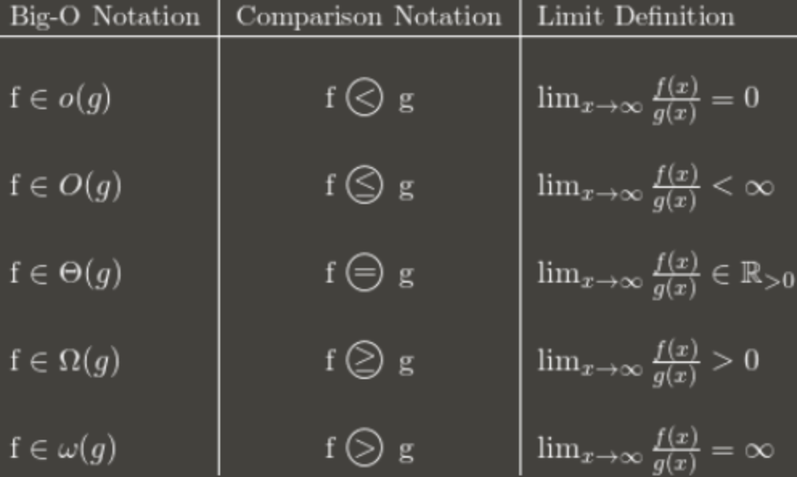
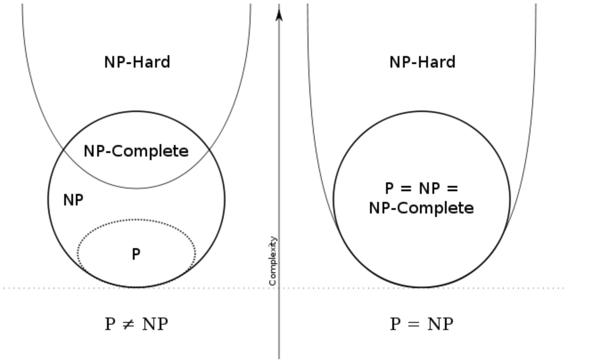
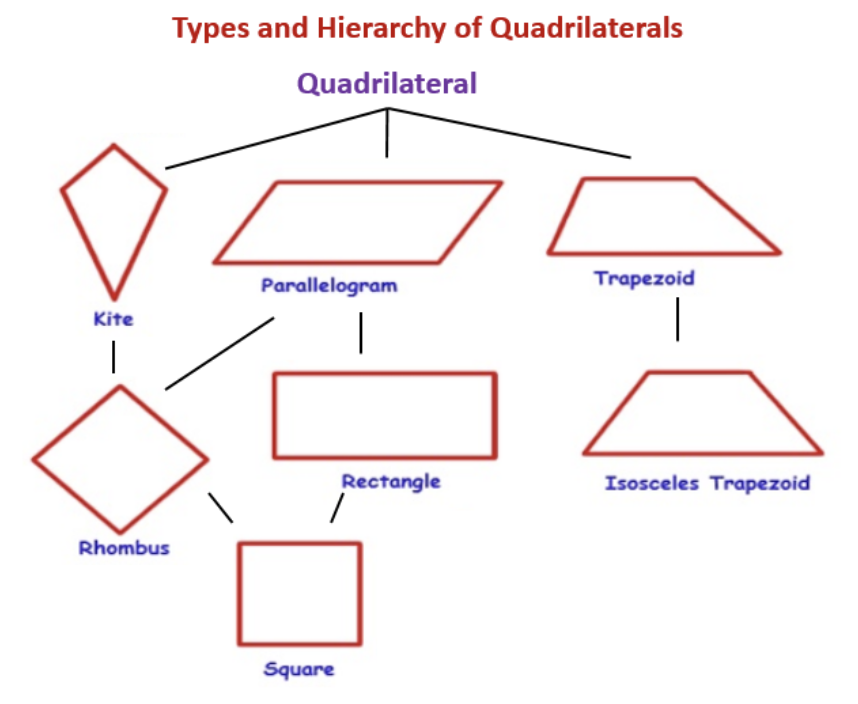
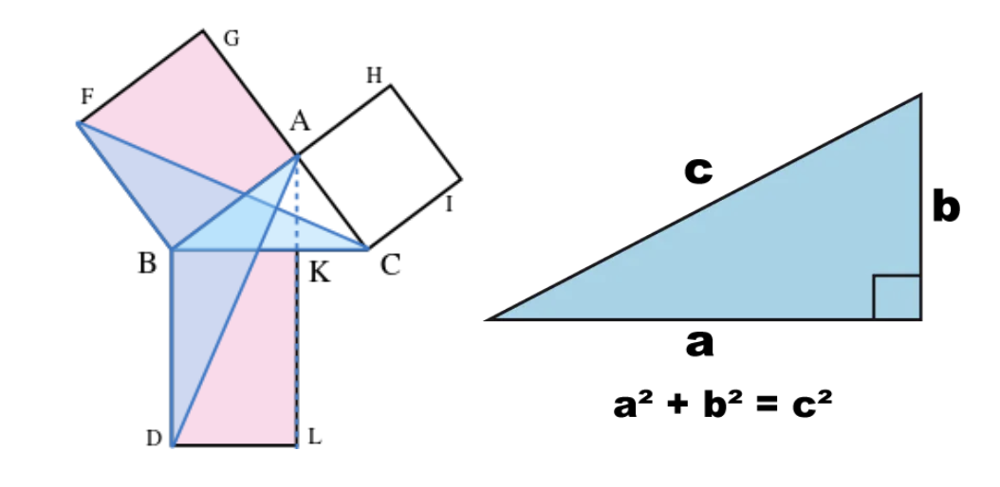
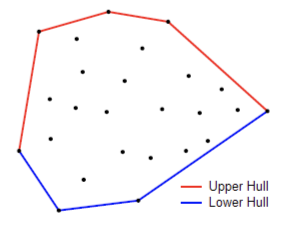
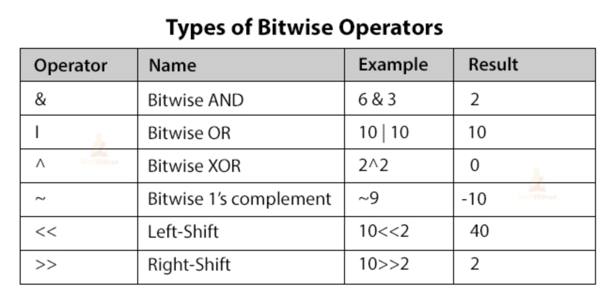

# Overview

> Big O Notation



* Big O

```text
o (strictly faster)  # f(n) = o(g(n))
f(n) ∈ O(g(n)) and f(n) ∉ θ(g(n))

O (upper)            # f(n) = O(g(n))
∃ positive constants c and k, such that f(n) <= cg(n) for all n >= k.
```

$$
\lim _{n \rightarrow \infty} \frac{f(n)}{g(n)} \neq \infty \Rightarrow f=O(g)
$$

* Big Omega

```text
Omega (lower)    f(n) = Ω(g(n))
∃ positive constants c and k such that f(n) >= c * g(n) for all n >= k
```

$$
\lim _{n \rightarrow \infty} \frac{f(n)}{g(n)} \neq 0 \Rightarrow f=\Omega(g)
$$

* Big Theta

```text
θ (average)    f(n) = θ(g(n))
∃ positive constants c1, c2 and k such that c1 * g(n) ≤ f(n) <= c2 * g(n) for all n >= k
```

$$
\lim _{n \rightarrow \infty} \frac{f(n)}{g(n)} \neq 0, \infty \Rightarrow f=\theta(g)
$$

> PNP



* P (Polynomial Time)
  * Sorting

* NP (Nondeterministic Polynomial Time)
  * Verifiable in polynomial time

* NP Complete
  * Boolean satisfiability problem
  * Hamiltonian path

* NP Hard
  * Do not have to be decision problems
  * TSP minimum distance
  * May not be verifiable in P time

* Reduction
  * Reduction from X to Y
  * polynomial time algorithm converting X inputs to equivalent Y inputs
  * Assume you have a black box for Y,  a polynomial time algorithm uses that box to solve X.
  * YP|NP →  XP|NP


## Syntax

### Operation


### Conditional

### Iterable

[Comprehension](https://docs.google.com/forms/d/1yUmg8IRuwrDaf8NayKeoDjLZv7XDIQHcbVUY9PJ-SP0/edit)

[While](https://docs.google.com/forms/d/18QwLLbameGJBtyrTsBI046VqHAIhMpxYD5KjK4bFcIM/edit)

### Hashable

* cuckoo hashing
  * Use two hash functions
  * O(1) : worst case insert


```py
class ListNode:
  def __init__(self, key = None, val = None):
    self.pair = (key, val)
    self.next = None

class HashMap:
  def __init__(self):
    self.m = 1000
    self.h = [ListNode() for _ in range(self.m)]

  def put(self, key, val):
    idx = key % self.m
    cur = self.h[idx]
    while True:
      if cur.pair[0] == key:
        cur.pair = (key, val)
        return
      if cur.next == None:
        break
      cur = cur.next
    cur.next = ListNode(key, val)
      
  def get(self, key):
    idx = key % self.m
    cur = self.h[idx]
    while cur:
      if cur.pair[0] == key:
        return cur.pair[1]
      cur = cur.next
    return -1

  def remove(self, key):
    idx = key % self.m
    cur = prev = self.h[idx]
    cur = cur.next
    
    while cur:
      if cur.pair[0] == key:
        prev.next = cur.next
        break
      cur, prev = cur.next, prev.next
```

### Sort

> Selction Sort

* Code

```py
def selection_sort(a1 … an):
    for i in range(1, n - 1):
        am = minimum(ai, ..., an) 
        swap ai and am
```

* Proof

```text
Loop invariant: After t loop, the first t elements are (1) sorted, (2) minimum
Base: It is true when t = 0, because there is no element.
Inductive Hypothesis: For some t iterations, the first t elements are (1) sorted, (2) minimum

SIH: For k iteration where k = 1 … t, the k elements are (1) sorted, (2) minimum
WTS: For t + 1 iteration, the first t + 1 elements are (1) sorted, (2) minimum

During the (t + 1)st iteration, the algorithm finds am, the minimum value of at+1, …, am and swap with at+1. So, after the (t + 1)st iteration, at+1 is the minimum value of at+1, ..., an

We have a1, ..., at are all less than at+1 and at+1 is minimum of at+1, ..., an ⇒  (1)
We have a1, …, at are in the sorted order and all less than at+1 ⇒ (2)

Therefore: for any 0 ≤ t ≤ n - 1, the loop invariant is true after t iterations.

Since we execute the loop exactly n times, the loop invariant with t = n guarantees that all n elements of the list will be in the correct order at the end of the algorithm.
```

> Merge Sort

* code

```text
procedure MergeSort(a1, …, an):
    if n == 0:
        return ()
    if n == 1:
        return (a1)
    m = ⌊n | 2⌋
    L1 = MergeSort(a1, …, am)
    L2 = MergeSort(am+1, …, an)
    return RMerge(L1, L2)

procedure RMerge(a1, …, ak, b1, …, bl: sorted lists)
    if first list is empty:  return b1, …, bl
    if second list is empty: return a1, …, ak
    if a1 ≤ b1:  return a1 · RMerge(a2, …, ak, b1, …, bl)
    else:        return b1 · RMerge(a1, …,ak, b2, …, bl)
```

* Proof

```text
Base : Suppose n=0. Then both lists are empty. Vacuously true.
Induction : Suppose n ≥ 1 and RMerge(a1, ..., ak, b1,...,bl) returns a sorted list containing
all elements from either list whenever k + l = n - 1
WTS : RMerge(a1, ..., ak, b1, ..., bl) returns a sorted list containing all elements from either list
whenever k + l = n.

# Inductive step
Case 1: at least one of the lists is empty. 
  Similar to base case. In the first or second line, return all of the elements, in sorted order.
Case 2 : neither list empty and a1 ≤ b1
  Since both lists are sorted, this means a1 is the smallest overall. The total size of the input of 
  RMerge(a2, ... , ak, b1, ... , bl) is (k - 1) + l = n - 1 so by the IH, it returns a sorted list containing all 
  elements from either list. Adding a1 to the start maintains the order and gives a sorted list with all 
elements.
Case 3 : neither list empty and b1 ≤ a1
  WLOG same as case 2

# Strong Induction
Base case : Suppose n=0. Then, return the empty list, (trivially) sorted. 
SIH : MergeSort correctly sorts all lists with k elements, for any 0 ≤ k < n
Goal : prove that MergeSort(a1, ..., an) returns a sorted list containing all n elements.
Induction Step : Suppose n=1. Then, return a1, a (trivially) sorted list containing all elements.
```

> Quicksort

* quick select can be used to find nth largest element in average of O(n) time

## Algorithm


| name            | Memory   | Time     |
| --------------- | -------- | -------- |
| Brute Force     | O(1)     | O(N)     |
| Dynamic Program | O(N^2)   | O(1)     |
| Segment Tree    | O(N)     | O(log N) |
| Sparse Table    | O(NlogN) | O(1)     |
| LCA             | O(N)     | O(1)     |

### Math

> modular multiplicative inverse

```py
def modInverse(a, m):
    for x in range(1, m):
        if (a * x) % m == 1:
            return x
    return 1
```

```text
modular multiplicative inverse is an integer 'x' such that.

a x ≅ 1 (mod m)

The multiplicative inverse of “a modulo m” exists iff a and m are relatively prime.

Examples: Input: a = 3, m = 11
Output: 4
Explanation: Since (4*3) mod 11 = 1, 4 is modulo inverse of 3(under 11)
```

### Prime

* https://velog.io/@yerin4847/W1-%EC%9C%A0%ED%81%B4%EB%A6%AC%EB%93%9C-%ED%98%B8%EC%A0%9C%EB%B2%95

### Geometry

> Triangle

* Area SSS

$$
\sqrt{p(p-a)(p-b)(p-c)}
$$

* Area SAS

$$
\frac{a \cdot b \cdot \sin (\theta)}{2}
$$

> Quadrillateral



* Area

$$
when s=\frac{a+b+c+d}{2}

S=\sqrt{(s-a)(s-b)(s-c)(s-d)}
$$

* Polygon

> Check point(q) in a polygon(p1, ... , pn)

```sh
for i in 2, …, n
  if $$ \overline{p_{i} q} \cdot \overline{p_{i-1} p_{i}} \geq 0 $$
    return true
return false
```

$$
\text { Area }=\frac{1}{2}\left|\begin{array}{cc}
x_{1} & y_{1} \\
x_{2} & y_{2} \\
x_{3} & y_{3} \\
\vdots & \vdots \\
x_{n} & y_{n} \\
x_{1} & y_{1}
\end{array}\right|=\frac{1}{2}\left[\left(x_{1} y_{2}+x_{2} y_{3}+x_{3} y_{4}+\cdots+x_{n} y_{1}\right)-\left(y_{1} x_{2}+y_{2} x_{3}+y_{3} x_{4}+\cdots+y_{n} x_{1}\right)\right]
$$


> Terms

* Convex Set
  * Given any collection of convex sets (finite, countable or uncountable), their intersection is a convex set

```text
Proof: If the intersection is empty, or consists of a single point, the theorem is true by definition.
Otherwise, take any two points A, B in the intersection. The line AB joining these points must also lie wholly within each set in the collection, hence must lie wholly within their intersection.
```

* Homeomorphism
  * a continuous function between topological spaces that has a continuous inverse function
* Inscribed square problem
  * Does every plane simple closed curve contain all four vertices of some square?

* Pythagorean Theorem



$$
\text { hypotenuse }^{2}=\text { base }^{2}+\text { perpendicular }^{2}
$$

> Coordinates

* Cylindrical

```text
z  # height
r  # radius from the z-axis
θ  # angle its projection on the xy-plane makes with respect to the horizontal axis
```

* Spherical

```text
ρ   # distance from the origin
θ   # the angle its projection on the xy-plane makes with respect to the horizontal axis
φ   # the angle that it makes with respect to the z-axis.
```

> Convex Haul



* monotone chain, O(n log n)
* Returns: a list of vertices of the convex hull in counter-clockwise order

```py
def outerTrees(self, points):
    points = sorted(points)

    if len(points) <= 1:
        return points

    # 2D cross product of OA and OB vectors, i.e. z-component of their 3D cross product.
    # positive if OAB a counter-clockwise turn, negative for clockwise turn, and zero if collinear
    def cross(o, a, b):
        return (a[0] - o[0]) * (b[1] - o[1]) - (a[1] - o[1]) * (b[0] - o[0])

    lower = []
    for p in points:
        while len(lower) >= 2 and cross(lower[-2], lower[-1], p) < 0:
            lower.pop()
        lower.append(p)

    upper = []
    for p in reversed(points):
      while len(upper) >= 2 and cross(upper[-2], upper[-1], p) < 0:
        upper.pop()
      upper.append(p)

    return lower[:-1] + upper[:-1]    # Omit last because it’s at the beginning of the other list.
```

### Binary



### Greedy

[greedy](https://www.youtube.com/watch?v=ARvQcqJ_-NY)

> Exchange Argument

* OS be a solution achieved by not choosing g.
* Show how to transform OS into some solution OS' that chooses g, and that is at least as good as OS.

1. Say G is the event with the earliest finish time. (First greedy decision: include G).
2. Let OS be a legal schedule that doesn't include G such that $$ |OS'| \geq |OS|%0 $$
3. Let the events in OS be $$ j_1, ..., j_k%0 $$ ordered by start and finish times ( $$ J_1 \neq G%0 $$ ) (Exchange Arg)
    * Must show that OS' is a valid solution
    * OS' is better than OS

* Use 1-3 in an inductive argument

```text
Base case : the greedy strategy works for an instance of size 1. 
IH : Assume the greedy works for all instances of size < n.
```

$$ |O S(I)| \leq\left|O S^{\prime}(I)\right|=\left|\{g\} \cup S\left(I^{\prime}\right)\right| \leq\left|\{g\} \cup G S\left(I^{\prime}\right)\right|=|G S(I)|%0 $$

### Dynamic_programming

* Q. Given a target find minimum / maximum, cost / path / sum to reach the target
* A. Choose min / max among all possible paths before current state, then add value for current state

### String

> KMP


### Recursion

[Recursion](https://www.youtube.com/watch?v=kx6DfrYfWnQ)

[Finbonacci](https://www.youtube.com/watch?v=zg-ddPbzcKM)

> backtracking

* Bounding function : kill some live nodes without actually expanding them

### LinkedList

Type | Access | Search | Insert | Delete
--- | --- | --- | --- | ---
Array | 1 | n | n | n
Stack | n | n | 1 | 1
Queue | n | n | 1 | 1
Singly-Linked | n | n | 1 | 1
Doubly-Linked | n | n | 1 | 1

### Graph

* [Graph](https://docs.google.com/forms/d/1E8HkTLzD7yVQ3Vqr9RhAYax10HYzW8S8tRadvmUaZbo/edit)

> Terms

* Directed

```sh
DAGs                # Directed acyclic graphs are directed graphs with no cycle
Weakly Connected    # Undirected version of directed graph is connected
Strongly Connected  # Directed graph G is strongly connected a path exists for all ordered pair vertices
Strongly Connected Component  # Strongly connected components is maximal strongly connected piece
Connectivity Deficit          # minimum number of directed edges you have to add to make graph strongly connected
```

* Undirected

```sh
Connected       # G is connected if for any pair of vertices v, w there is a path from v to w
CC              # Connected components is maximal connected piece
```

* Edge


```sh
Tree edge       # solid edge included in the DFS output tree (pre u < pre v < post v < post u)
Back edge       # leads to an ancestor (pre v < pre u < post u < post v)
Cross edge      # leads to neither anc. or des (pre v < post v < pre u < post(u)
```

* Path

```sh
Walk        # Vertices may repeat. Edges may repeat (Closed or Open)
Trail       # Vertices may repeat. Edges cannot repeat (Open)
Circuit     # Vertices may repeat. Edges cannot repeat (Closed)
Path        # Vertices cannot repeat. Edges cannot repeat (Open)
Cycle       # Vertices cannot repeat. Edges cannot repeat (Closed)
Hamiltonian # Visits every vertex in the graph
Eulerian    # Visits every edge in the graph
```

* Articulation

```sh
case v = root 
vertex will be the point of articulation iff this vertex has more than one child. 
case v ≠ root. 
During DFS, (v, to) is articulation iff none of the vertices to or its descendents in the DFS traversal tree has a back-edge to any of the ancestors of v, then v is an articulation point. 
visited time ≤ low time of adjacent vertex
```

> Cycle Detect

* An undirected connected graph G has a cycle if and only if it’s DFS output tree has a back edge.
* Complexity    O(V + E)

* Proof

```text
→ 
Suppose DFS tree has no back edge. Then all of the original edges are in the DFS tree. Then the graph itself is a tree (no cycles)

←
Suppose the graph is a tree (has no cycles) then there can’t be any backedges, because the DFS output tree is a tree with all the vertices.
```

### Path

* [DFS BFS](https://www.youtube.com/watch?v=pcKY4hjDrxk)

> BFS

* Algorithm

```text
procedure BFS(G, s)
    for each vertex u in V:
        dist(u)=∞
    dist(s) = 0
    Q = [s] (queue just containing s)
    while Q is not empty
        u = eject(Q)
            for all edges (u,v) in E
                if dist(v)=∞ then
                    inject(Q,v)
                    dist(v)=dist(u) + 1
```

* Proof

```text
After BFS is done, dist(v) is the length of the shortest path from s to v
→ After every iteration, dist(v) is the length of some path from s to v.

loop invariant
← After BFS is done, dist(v) is the length of the shortest path from s to v for all vertices v in V.

Suppose there is a path p from s to v such that length(p) < dist(v)
Then let z be the last vertex in the path s.t. dist(z) = d(z) and let w be the first vertex in thee path s.t. dist(w) > d(w)

Case 1: d(w) = d(z) + 1. Then in the algorithm z is put in the queue before q and when z is ejected, w is injected with dist(w) = 
Case 2: d(w) > d(z) + 1. Then the path p is actually not the shortest path.

# Complexity
Notice that in BFS, each vertex enters the queue (F) at most one time.
This was the assumption we made about graph search when we calculated its Complexity.
So BFS runs in O V + E time.
```

> DFS

* Algorithm

```py
def dfs(i, j):
    if 0 <= i < len(G) and 0 <= j < len(G[0]) and G[i][j] == '1':
        G[i][j] = '0'
        list(map(dfs, (i+1, i-1, i, i), (j, j, j+1, j-1)))
        return 1
    return 0
```

* Proof

```text
After BFS is done, dist(v) is the length of the shortest path from s to v
→ After every iteration, dist(v) is the length of some path from s to v.

loop invariant
← After BFS is done, dist(v) is the length of the shortest path from s to v for all vertices v in V.

Suppose there is a path p from s to v such that length(p) < dist(v)
Then let z be the last vertex in the path s.t. dist(z) = d(z) and let w be the first vertex in thee path s.t. dist(w) > d(w)

Case 1: d(w) = d(z) + 1. 
Then in the algorithm z is put in the queue before q and when z is ejected, w is injected with dist(w) = 
Case 2: d(w) > d(z) + 1. 
Then the path p is actually not the shortest path.
```

* Complexity

```text
Notice that in BFS, each vertex enters the queue (F) at most one time.
This was the assumption we made about graph search when we calculated its Complexity.
So BFS runs in O V + E time.
```

> Dijkstra

* Doesn't work for negative edge weight

* Proof

```text
Claim: After Dijkstra’s is done, dist(v) is the length of the shortest path from s to v.
(→) After every iteration, dist(v) is the length of some path from s to v.
(←) After Dijkstra’s is done, dist(v) is the length of the shortest path from s to v for all vertices v ∈ V.
```

* Complexity

```text
O(V * O(deletemin) + E * O(decreasekey))
```

| Type        | Array                               | Heap                               |
| ----------- | ----------------------------------- | ---------------------------------- |
| Approach    | indexed by vertex, giving key value | each key value is less than parent |
| deletemin   | O(V)                                | O(log(V))                          |
| decreasekey | O(1)                                | O(log(V))                          |

> A*


> Prims Algorithm

```text
Put all vertices in U. 
Pick any vertex s to start from. 
Put s in X. 
Repeat until all vertices are in X. 
    Find the minimum edge that has one vertex in X and one vertex in U. 
    Move the endpoint that is in U to X. 
    Add that edge to the output.
```

> Kruskal Algorithm

* Pick the next lightest edge that doesn't create a cycle

```text
Given an undirected, connected graph with positive edge weights: 
    Start with only the vertices. 
    Repeat until graph is connected: 
        Add the lightest edge that doesn't create a cycle
```

> Bellman Fold

* Single source shortest path in O(V x E)
* Can be used to detect negative-weight cycles

```py
def bellman_ford(G, source):
  dist, pre = dict(), dict()
  for node in G:
    dist[node], pre[node] = float('inf'), None
  dist[source] = 0

  for _ in range(len(G) - 1):
    for node in G:
      for nei in G[node]:
        if dist[nei] > dist[node] + G[node][nei]:
          dist[nei], pre[nei] = dist[node] + G[node][nei], node

for node in G:
  for nei in G[node]:
    assert dist[nei] <= dist[node] + G[node][nei], "Negative weight cycle."

return dist, pre
```

> Floyd

* all pairs shortest pathSoftest path from every pair in O(V^3)

### Ordering

### Cut

> Strongly Connected Component

* [Visualization](https://www.cs.usfca.edu/~galles/JavascriptVisual/ConnectedComponent.html)
* [Strongly Connected Component](https://www.youtube.com/watch?v=RpgcYiky7uw)

```text
Run DFS on G and order the vertices in decreasing order of the postnumbers from the previous step.
Every time DFS increments cc, you have found a new SCC.

Complexity    O(V + E)
```

* Union find

```py
def find(x):
    if x != UF[x]:
        UF[x] = find(UF[x])
    return UF[x]
def union(x, y):
    UF[find(x)] = find(y)

def countComponents(edges: List[List[int]]) -> int:
    UF = list(range(len(edges)))
    for x, y in edges:
        union(x, y)
     return len({find(x) for x in range(len(edges))})
```

### Knapsack

### Tree

* [Tree](https://docs.google.com/forms/d/1_ofN6F79XzQAos7-Xl3ZKjcz-N4kMF4EUGlPX3yenpg/edit)
* Connected and has no cycles (n-1 edges).
* Root has no incoming edges and non-root has exactly one incoming edge from parent
* root vertex r is at level 0
* Binary tree is a rooted tree in which every (internal) vertex has no more than two children.
* Traveral


* Huffman encoding
  * Tree must be full tree
  * Exists an optimal tree where two lowest frequent symbols must be siblings at the two lowest level
  * The two longest codewords have the same length

* Entropy of tree

$$
\sum_{i} p_{i} \log _{2} \frac{1}{p_{i}}
$$


> Data Structure

* Binary index tree
  * Fast cumulative sum query → easier to implement than Segment Tree
  * Time Complexity: O(n) (Build)
  * Time Complexity: O(log n) (Range Query, update one element)


```py
# Count smaller than self
class BIT:
  def __init__(self, n):
    self.n = n + 1
    self.sums = [0] * self.n
  
  def update(self, i, delta):
    while i < self.n:
      self.sums[i] += delta
      i += i & (-i)
  
  def query(self, i):
    res = 0
    while i > 0:
      res += self.sums[i]
      i -= i & (-i)
    return res

def countSmaller(self, li):
  ranks, bit, ret = {e : i + 1 for i, e in enumerate(sorted(li))}, self.BIT(len(li)), []
  for e in reversed(li):
    ret.append(bit.query(ranks[e] - 1))
    bit.update(ranks[e], 1)
  return ret[::-1]
```

* Trie

```py
class Node:
    def __init__(self):
        self.children = dict()
        self.is_leaf = False

class Trie:
    def __init__(self):
        self.root = Node()
        
    def add_word(self, word):
        cur = self.root
        for letter in word:
            if letter not in cur.children:
                cur.children[letter] = Node()
            cur = cur.children[letter]
        cur.is_leaf = True
        
    def remove_word(self, word):
        cur = self.root
        for letter in word:
            if letter not in cur.children:
                return False
            cur = cur.children[letter]
        return self
        
    def search(self, word):
        cur = self.root
        for letter in word:
            if letter not in cur.children:
                return False
            cur = cur.children[letter]
        return cur.is_leaf
```

### Sparse_Table


* Range Greatest Common Divisor
* Minimum query
  * Space O(N logN)
  * Run-time (build) O(N logN)
  * Run-time (Query) O(1)


```py
"""
[10, 6, -7, -8, 0, 0, 0, 0, 0]
[6, 5, -7, -8, 0, 0, 0, 0, 0]
[5, -7, -8, 0, 0, 0, 0, 0, 0]
[-7, -7, -8, 0, 0, 0, 0, 0, 0]
[9, -8, -8, 0, 0, 0, 0, 0, 0]
[-8, -8, -8, 0, 0, 0, 0, 0, 0]
[2, 2, 0, 0, 0, 0, 0, 0, 0]
[4, 4, 0, 0, 0, 0, 0, 0, 0]
[20, 0, 0, 0, 0, 0, 0, 0, 0]
"""
def build_ST(l):
  n = len(l)
  ST = [l[i] + [0]*(n - 1) for i in range(n)]
  j = 1
  while (1 << j) <= n:
    i = 0
    while (i + (1 << j) - 1) < n:
      ST[i][j] = min(ST[i][j - 1], ST[i + (1 << (j - 1))][j - 1])
      i+=1
  j+=1
  return ST

def query(l, r, ST):
  j = math.log2rR - l + 1)
  return min(ST[L][j], ST[R - (1 << j) + 1][j])
```


### Segment_Tree

* m number of Minimum / Sum Range Query + n elements in array
* Use lazy propagation segment tree to support range update
  * Time Complexity: O(n) (Build tree)
  * Space Complexity: O(n)
  * Time Complexity: O(log(n)) (Query)


```py
def range_minimum_query(ST, ST_l, ST_r, l, r, idx):
    if l <= ST_l and r >= ST_r:
        return ST[idx]

    if ST_r < l or ST_l > r:
        return math.inf

    mi = ST_l + (ST_r - ST_l) // 2
    min(range_minimum_query(ST, ST_l, mi, l, r, 2*idx + 1), RMQ(ST, mi + 1, ST_r, l, r, 2*idx + 2))

def buildST(list, l, r, ST, idx):
    if l == r:
        ST[idx] = list[l]
        return ST[idx]

    mid = l + (r - l) // 2
    left = buildST(list, l, mid, ST, idx*2 + 1)
    right = buildST(list, mid + 1, r, ST, idx*2 + 2)

    if left <= right:
        ST[idx] = left
    else:
        ST[idx] = right

    return ST[idx]
```

> Lazy Segment Tree

* [Lazy segment tree](https://www.youtube.com/watch?v=xuoQdt5pHj0)

## ETC

### Regex

### Shell
