# Software

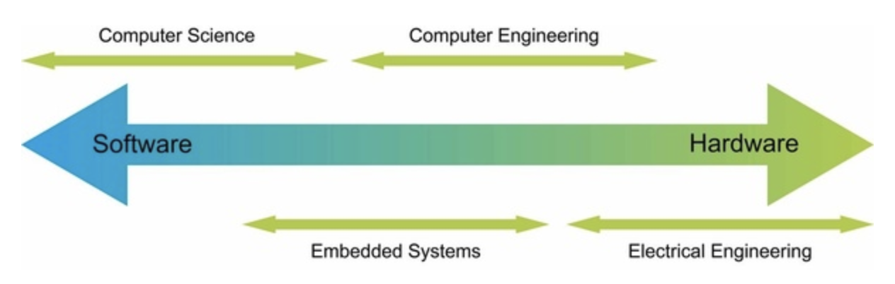

* Posix (Portable Operating System Interface)
  * standards specified by IEEE Computer Society for maintaining compatibility between operating systems

* rpath
  * designates the run-time search path hard-coded in an executable file or library

* standalone (freestanding program)
  * no external module, library, program designed to boot with bootstrap procedure of target processor 

* Windows Driver Model (wdm)
  * framework for device drivers that was introduced with Windows 98 and Windows 2000 to replace VxD which was used on older versions of Windows such as Windows 95 and Windows 3.1

* X Window System
  * xAuthority file is in ~, stores credentials in cookies used by xauth for authentication of X sessions

> Program


* Input
  * Keyboard, Scanner
* Output
  * Screen, Headset
* Input + output
  * Touch screen, Digital camera

> GNU

* GNU (Gnu is Not Unix)
  * OS project by Free Software Foundation
  * First free desktop environment

* GNOME (GNU Network Object Model Environment)
  * GTK based linux desktop
  * [+] many keyboard shortcuts
  * [-] limited native function, heaviest resource computer desktop

* GPL (GNU General Public License)
  * software licence

## Pattern

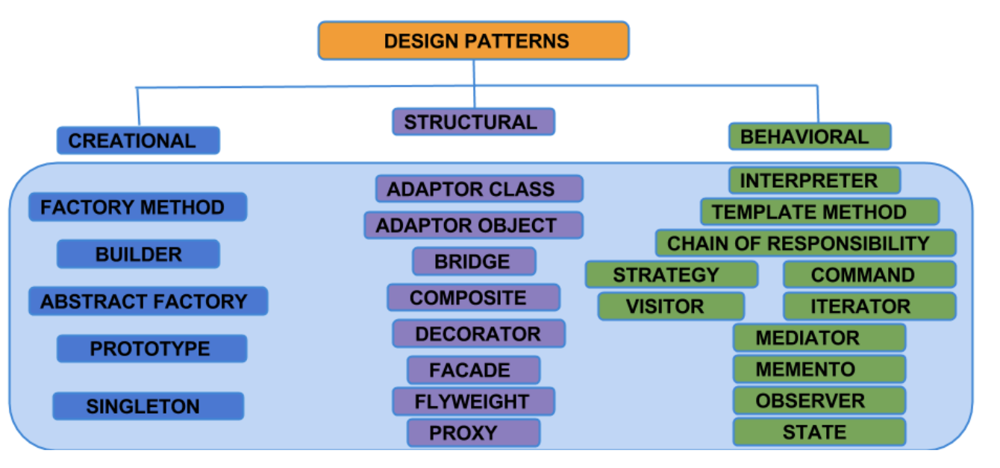

### Principle

> Dependency Inversion

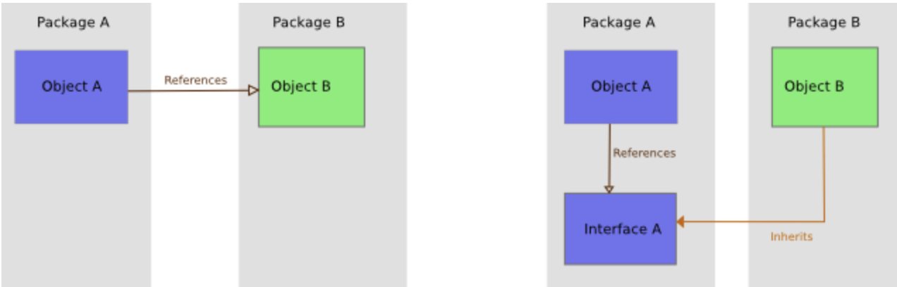

* High-level modules should not depend on low-level modules. 
* Both should depend on abstractions, abstractions should not depend on details. 
* many unit testing tools rely on inheritance to accomplish mocking

### Creational pattern

* Used to create objects in a systematic way
* Polymorphism is widely used
* Creation classes can't be OCP but let other classes be OCP and SRP
* Creating an object requires naming a concrete class 
* Creating a complex object is a unique responsibility
* [+] Flexibility → Different subtypes of objects from same class at runtime

> Builder

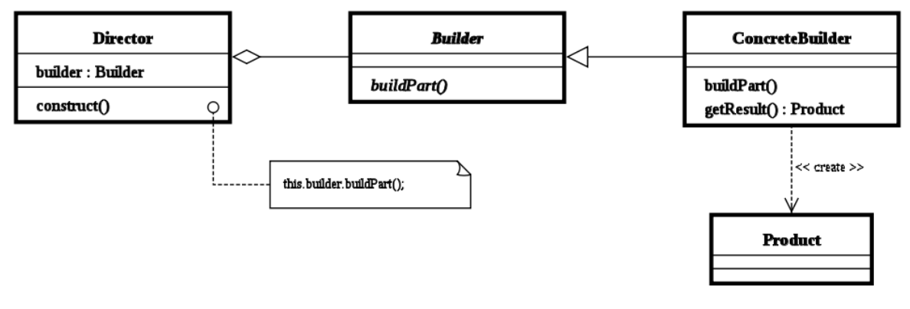

* Separate the construction of a complex object from its representation 
* same construction process can create different representations

### Structural Pattern

* Establishes useful relationships between software components in configuration
* Inheritance

> Adaptor

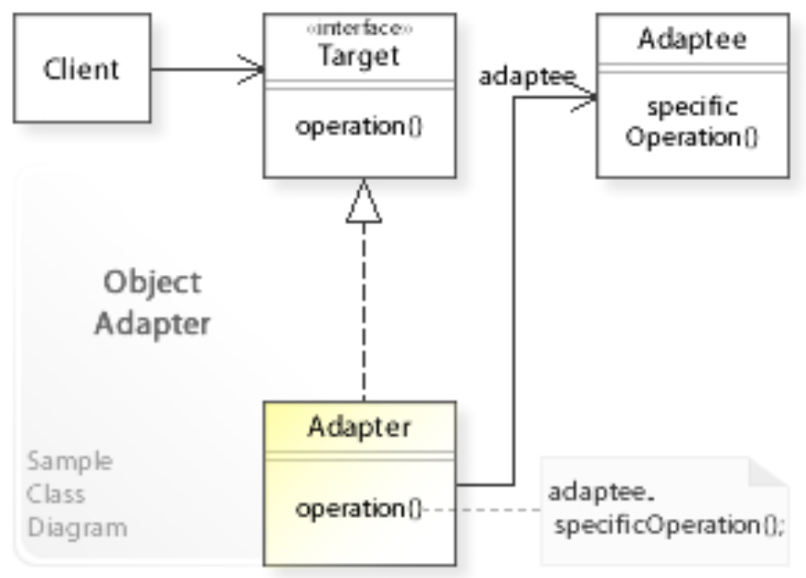

* allows the interface of an existing class to be used as another interface
* Implement the interface your class expects.
* Get a reference to the object that we are adapting
* Adaptor composite describes objects that treated same way as a single instance of same object type

> Decorator

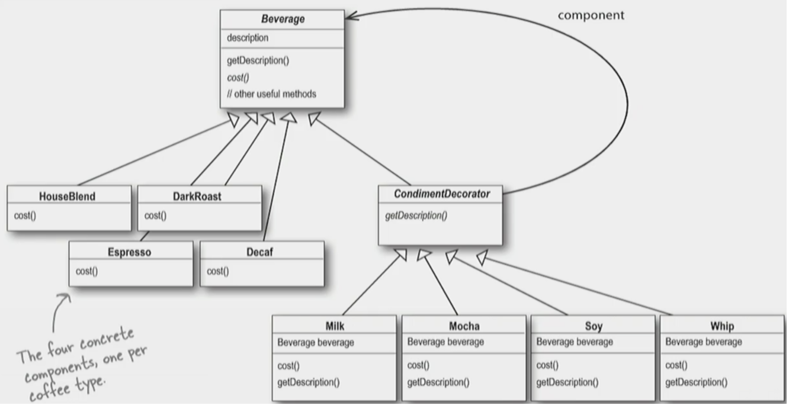
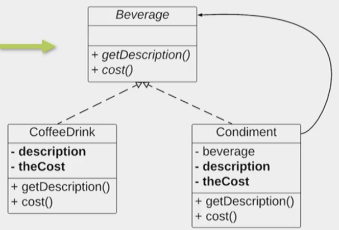


* allows behavior to be added to an individual object, dynamically
* doesn't affect behavior of other objects from the same class
* useful for adhering to the Single Responsibility Principle

> Delegation

* allows object composition to achieve the same code reuse as inheritance
* an object handles a request by delegating to a second object (the delegate)
* The delegate is a helper object, but with the original context

> Mediator
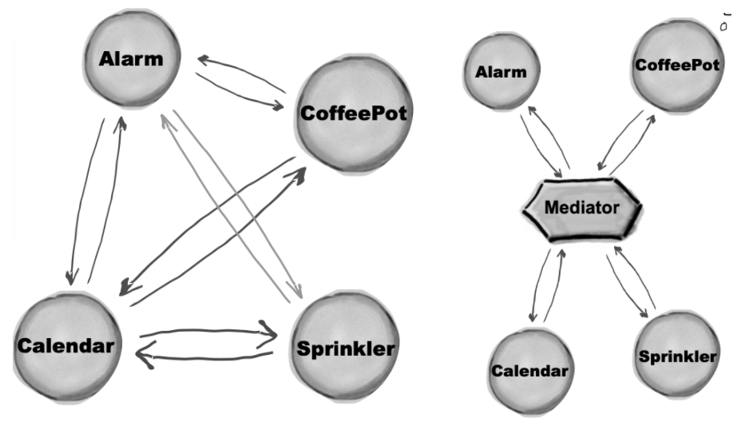

* Increase the reusability of the objects supported by the mediator by decoupling them from the system
* Simplifies maintenance of the system by centralizing control logic
* Commonly used to coordinate related GUI components
* Without proper design, the mediator object itself can become overly complex
* Graph Without graph class, it’s coupled and cannot be tested alone

> Model view controller


> Model view presenter

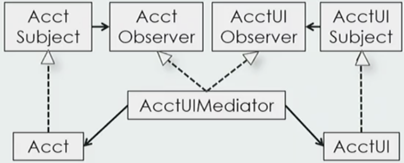

* Model: the data (subject) 
* View: a rendering of the data, often a UI 
* Presenter: Mediator that manages the relationships
* Upgrade version of Observer → View may not be just a passive view
* Model and View pre-exists → Can't have view observe model because view doesn't implement Observer interface for subject

> Producer consumer

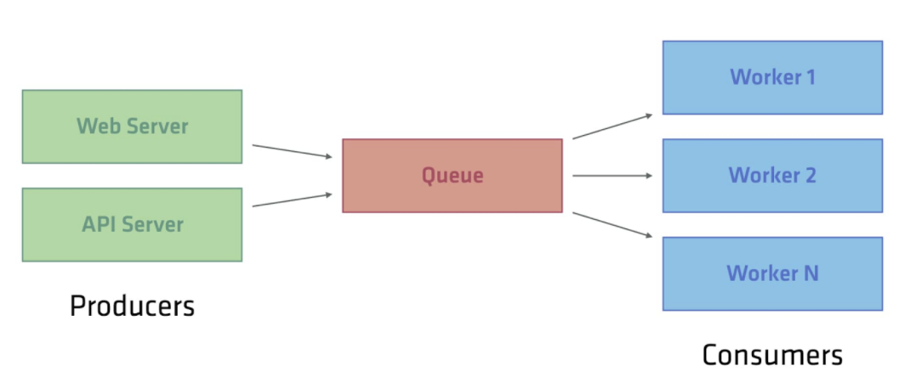

* Used in concurrent programming
* Should be executed as Python processes when tasks are CPU Bound (GIL)
* Enforce mutual exclusion of producers and consumer 
* Prevents producer from trying to add data to a full queue 
* Prevent consumers from trying to remove data from a empty queue

> Proxy

* a class functioning as an interface to something else

> Strategy 

* We need multiple subclasses have same codes
* It defines a family of algorithms, encapsulates each one, and makes them interchangeable.
* Strategy lets the algorithm vary independently from clients that use it.
* Create an interface for a family of algorithms, to be used as the type of a field (delegate) in the client. 
* Specific algorithms implement the interface.
* A constructor, setter, or Factory binds the field with the desired variant.
* Composition over inheritance

### Behavioral Pattern

* Best practices of objects interaction → define protocols
* methods and signatures

> Iterator

* used to traverse a container and access the container's elements.

### Parallel programming

* Simultaneous execution doing multiple things at once
* Concurrence is a program structure dealing with multiple things at once

> Concurrency

* ability of an algorithm or program to be broken into different parts that can be executed out of order

> Critical path

* Sequence of project network activities which add up to the longest overall duration

> Span

* length of the longest series of operations (critical path) to be performed sequentially due to dependencies


## Hardware

> Architecture

* determine arch or uname -m command
* 64-bit extension of arm

| Type         | ARM                            | x86                            |
| ------------ | ------------------------------ | ------------------------------ |
| CPU          | Reduced Instruction Set (RISC) | Complex Instruction Set (CISC) |
| Instruction  | Single instruction per cycle   | More than a cycle              |
| Optimization | with software focused          | with hardware focused          |
| Memory       | More (Less Registers)          | Less (More register)           |
| Calculation  | Uses available memory          | Need supplement memory         |
| Usage        | Mobile                         | Game                           |
| Venter       | ARM                            | Intel (80**)                   |

> Data processing unit

* new class of programmable processor and will join CPUs and GPUs as one of the three pillars of computing

> Direct memory access

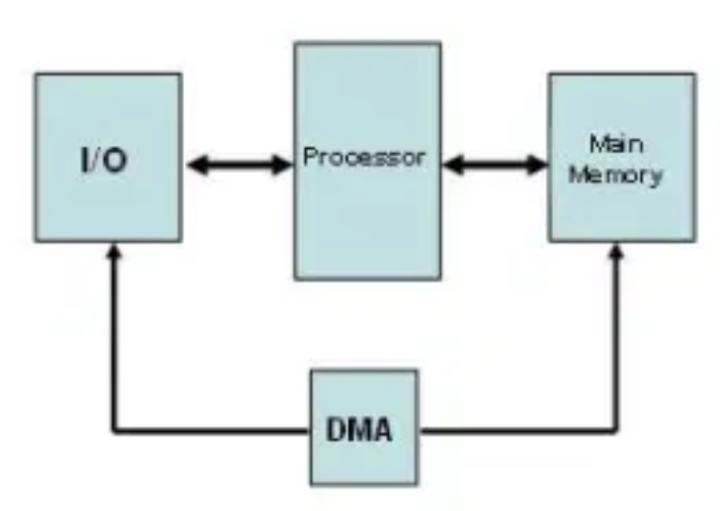

* Access data from I/O and memory without CPU

```sh
Cycle stealing Mode   # CPU prioritize DMA, 1cycle break, fast IO
Burst Mode            # Block level data 
```

> Post Processing Engine

* Bias add, scale, shift + Activation function
* Programmability

> kernel

* allocate resources, memory, CPU, network
* Most applications are not self-contained and make calls (system calls) to Linux kernel and library
* Kernel time is the time spent in Linux kernel, and user time is time spent in application or library code

> Yocto project

* OpenEmbedded Core (oe-core) contains base layer of recipes, classes and files

## Software Engineering

```sh
wiki?curid=10015            # wiki based
https://stackshare.io/      # compare different stacks
```

### KPI

> KPI (Key Performance Indicator)

* Operational
  * problem understanding : clarify any uncertainties arount the problem SLA (Service-Level Agreement)
* Tactical
  * SME (subject matter expert)
  * accurate and repeatable analysis
  * concise documentation / automatic alerting & monitoring for unseen changes
* Strategical
  * Prioritize and identify important problem that are not actively being worked on product, process, policy
* evaluate the success of an organization or of a particular activity in which it engages

> CPS (Cost Per Sales)

* the amount of money paid for every sale generated

> CTR (Click Through Rate)

* number of clicks that your ad receives divided by the number of times your ad is shown

### Delivery

> Open source

* https://naver.github.io/OpenSourceGuide/book/

> Bill of materials

* Customer Relationship Management

> CPM (Cost per Mile | cost per thousand)

* cost an advertiser pays for one thousand views or clicks of an advertisement

> minimum viable product (MVP) 

* a development technique in which a new product or website is developed with sufficient features to satisfy early adopters.

> Release

```
Binary Release      # most windows machines do not have a compiler installed
Source Release      # common in linux. b/c vary in cpu, installed library, kernel, compilers version
Blue-Green deploy  # two complete deployments with active (rolled out) + idle (test)
Canary deploy    # rollout new model with small subset of users, then monitor its performance 

Maintenance Release # release of a product that does not add new features or content
```

> POC (Proof of concept)

* check before releasing the product

> Root cause analysis 

* Find why customer act something

> stock-keeping unit (SKU)

* a unique identifier for each distinct product and service that can be purchased in business

### Dev-ops

* collaboration among everyone participating in delivering software

> on premise

* all computing resources are accessed and managed by premises

> Process of Reference

> Meeting

* Learn progress, status -> Update big board
* Surface problems that are slowing things down. 

> Standup questions

* What have you accomplished since the last standup? 
* What did you learn that would be valuable for the team to know? 
* What's impeding you? 
* What do you intend to do before the next stand up?

> Milestone

* Project get paid after milestone

> Iteration (sprint)

* Trying to make a large project act like a small one  Default to 20 days.
* How much communication do I need to have with the customer? How much risk?
* Rapid feedback from the customer to avoid deviating from the customer’s wants

> User Story

* keep the end goal in mind from the user's perspective to prevent things like feature creep and facilitate communication between all stakeholders.
* Describes an observable end-user feature in customer language
* Can have direct feed-back from the customer
* Planning poker to decide estimates

* In Business Driven Development Scenario, disambiguating user stories using sequence and special cases (multiple scenarios per story)
* BDD scenario is covered by matching automated story test

```
Scenario 1: Favorite a New Route
Given that the user is on the Save Route screen
And they are saving a route named “RouteA”
When the user presses the “Favorite” button
And then they press the “Save” button
Then the app should go to the Routes page
And “RouteA” should be shown as a favorite.

As a person who like to walk            # Who will benefit from the feature?
I want to have an accurate measure of the distance I traveled  # Not a system capability (task)
So that I can see how far I walk every day        # Benefit in the world
```

> Break following user story into two

* As a user I want to message a nearby buddy so that we can meet up.  → 
* As an initiator I want to send invitation to a nearby buddy so that we can meet up
* As a user I want to receive messages so that we can meet up

> Task

* risk addressed (unseen technical requirements and risks)
* inaccurate estimates 
* no division of labor

### Test

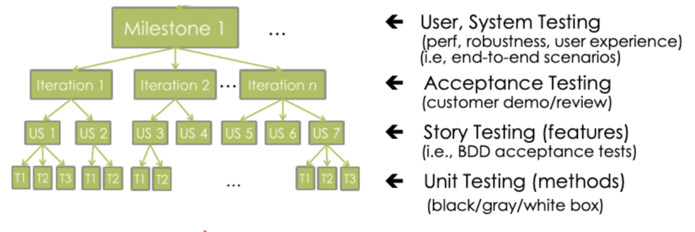

```
Unit Testing          # Functional level
Component Testing     # Library, compiled binary
System Testing        # External libraries of a system
Performance Testing   # Sub-system, system levels to verify timing / resource usages
Coverage  Test        # seek to execute all possibility
Equivalence classes   # no need to write two tests that expose the same bug
Bottom-up testing     # when testing if something works, its parts should already be tested

acceptance 
capacity              # application be checked against the expected load?
explorative 
```

> TDD

* Kent Beck in 1990's part of Extreme programming software development process (created Sunit, Junit)
* unit tests are written before production code


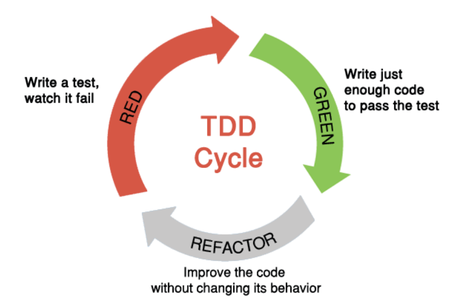


> Test fixture, context

* fixed environment in which tests are run so that results are repeatable.
* Loading a database with a specific, known set of data
* Erasing a hard disk and installing a known clean operating system installation
* Copying a specific known set of files
* Preparation of input data and set-up/creation of fake or mock objects

> Mocking

```
Mocks       # fake object that helps to verify whether an interaction with an object occurred
Stub        # A stub adds simplistic logic to a dummy, providing different outputs
Fakes       # anything that is not real, which, based on their usage, can be either stubs or mocks
```

* Non-deterministic result, Difficult to create or reproduce, slow (complete database)
* Doesn't yet exist or may change behavior 
* same interface as the real objects they mimic
* [-] increased maintenance on the tests themselves during system evolution (refactoring)


## Operating System

* https://classroom.udacity.com/courses/ud189 

### Memory

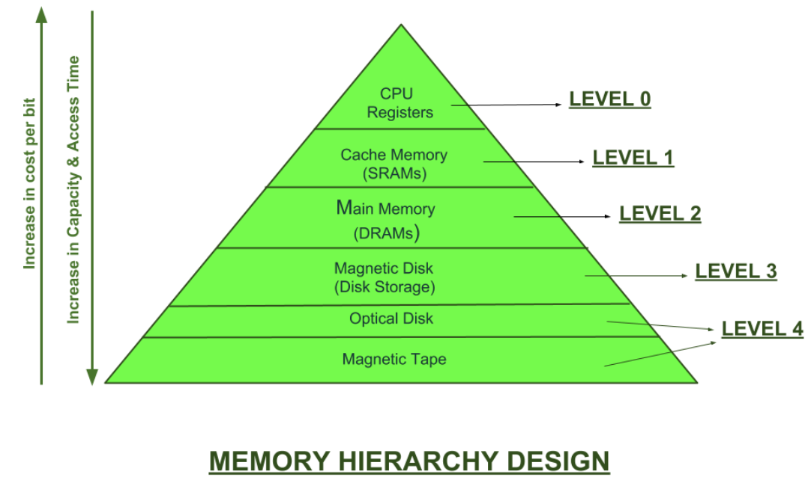

```
1 byte = 8 bits
1 kilobyte (K / Kb) = 210 bytes = 1,024 bytes
1 megabyte (M / MB) = 220 bytes = 1,048,576 bytes
1 gigabyte (G / GB) = 230 bytes = 1,073,741,824 bytes
1 terabyte (T / TB) = 240 bytes = 1,099,511,627,776 bytes
1 petabyte (P / PB) = 250 bytes = 1,125,899,906,842,624 bytes
1 exabyte (E / EB) = 260 bytes = 1,152,921,504,606,846,976 bytes 
```

> Hard Disk

* slow
* Sequential access
* permanent

> Main

* fast, random access, temporary
* dynamic RAM 
* divided into physical frame number and offset

### Caching

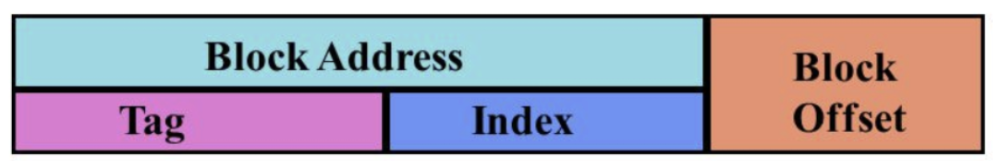

* temporal/spatial locality
* static RAM is used

```
2j        # associativity
2k        # cache entries (indices)
2m        # address
2n        # block size

line      # of bits (aka, index)
tag       # of lines required to uniquely identify a memory address block
word      #  least significant bits which uniquely identify a word on a line of cache
```

> Policy

* Write-through
    * when data hit
    * use the memory again soon

* Write-back
    * When data hit
    * doesn’t use the memory again

* Write-allocate
    * When data misses
    * use the memory again soon

* No-write-allocate
    * When data misses
    * doesn’t use the memory again

### File system

> File allocation table

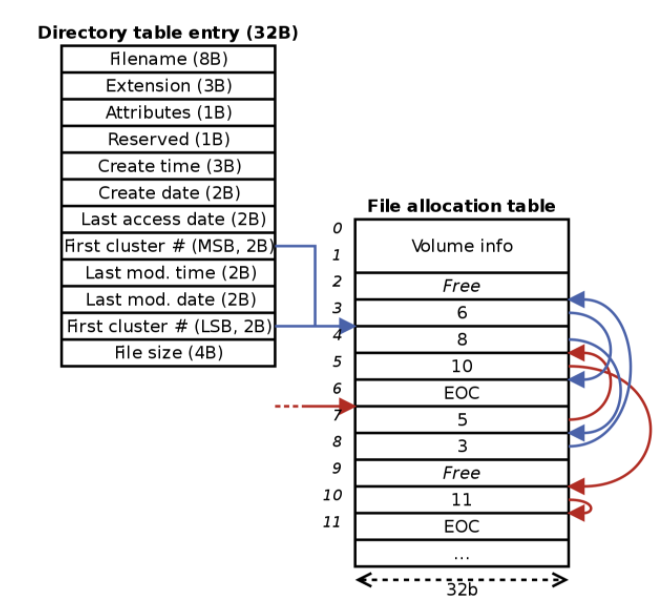

* directory entry points to the first block in the file

> Inode structure

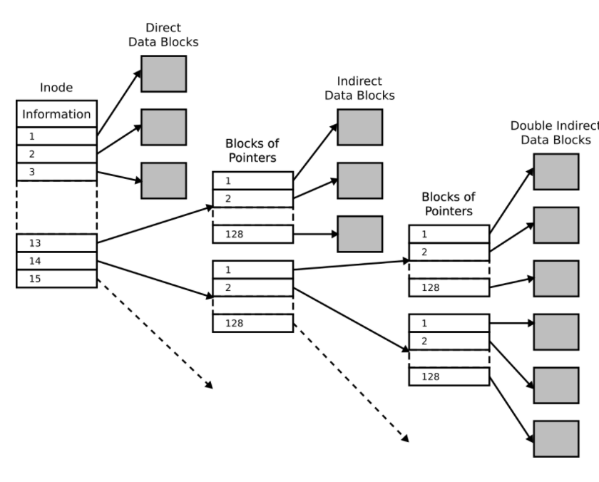

> Load Balance


* reduces individual server load to prevents server from becoming a single point of failure
* improving overall application availability and responsiveness
* second load balancer can be connected to the first to form a cluster

| Type       | preemptive                           | non-preemptive                             |
| ---------- | ------------------------------------ | ------------------------------------------ |
| Overview   | resource allocated to limited time   | can be interrupted                         |
| resource   | allocated until its burst time       | cannot be interrupted                      |
| Cpu        | High                                 | Low                                        |
| Overhead   | Yes                                  | No                                         |
| Starvation | Possible                             | Impossible                                 |
| Example    | Round Robin, Shortest Remaining Time | First come First serve, Shortest Job First |

## Network

> Terms

* Autonomous system
  * collection of networks that all fall under the control of a single network operator

* Collision Domain
  * A network segment where only one device can communicate at a time
  * If multiple systems send data at once, electrical pulses sent across cable can interfere with each other

* Domain Name System Security Extensions (DNSSEC)
  * suite of Internet Engineering Task Force (IETF) specifications for securing certain kinds of information provided by the Domain Name System (DNS) as used on Internet Protocol (IP) networks

* Encapsulation
  * The entirety of a packet at one layer becoming the payload section at another layer is known 
  * IP datagram (packets) encapsulates a TCP segment

* Extranet
  * privately held WAN infra generally owned by one company or organizations (Azure, AWS, GCP)
  * may allow other access for a fee for specific purposes 
  * can be an intranet with selective business-related access 
  * used to carry a wide variety of services like internet

* RFC
  * request for comments
  * responsible for keeping the internet running to agree upon the standard requirements

* IANA
  * Internet Assigned numbers authority 
  * non-profit organization that helps manage IP address allocation, Autonomous System number allocation

* ICANN
  * Internet Corporation for Assigned Names and Numbers, nonprofit organization
  * Coordinating the maintenance of databases related to namespaces and numerical spaces of the internet
  * Ensure the network's stable and secure operation

* ICS
  * Industrial Control System
  * normally refers to smaller-scale systems
  * Industrial automation
  * ex. Control system for power plant and factory

* ISP
  * Internet service provider (X Internet Secure Payment) mostly handles routing issue
  * KT, SK, LG U+

* Internet
  * Worldwide publicly accessible infrastructures of cables, routers, switches, and servers
  * Used to carry a wide variety of services
  * ex. World Wide Web, email, file transfer protocol, VoIP, streaming video, gaming, etc

* Intranet
  * the privately accessible infrastructure of cables, routers, switches, and servers 
  * generally limited to a single company, organization, or group of companies 
  * used to carry a wide variety of services like the internet

* Medianet
  * networks optimized for distributing large video applications and similar technologies
  * uses smart bandwidth detection systems
  * provides smooth video transmission on any platform
  * ex. Hulu, Netflix, WebEx, and GoToMeeting


### OSI Model

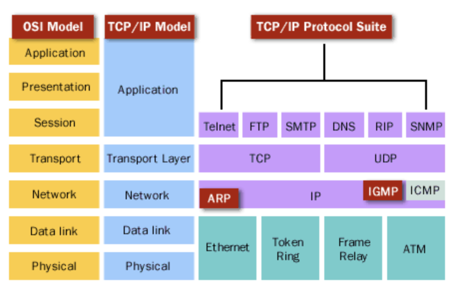

* Divide-and-conquer approach → makes divided into small, manageable tasks to reduce complexity
* Modularity → provides the independence of layers, which is easier to understand and implement.
* Easy to modify →  ensures independence of layers / implementation change without affecting other layers.
* Easy to test →  Each layer of the layered architecture can be analyzed and tested individually

> [1] Physical

* Transmit data in the form of 1s and 0s (bits)
* Encoding methods to transmit data, bits placement on media, and how bits start/stop
* Media usage, kinds of media permitted, media usage, physical connections, pin usages
* Specifies standards that apply to specific types of media
* Simplex, Duplex communication → information can flow in uni/both directions across cable
* Half duplex → only one device can talk at a time
* modulation varies the voltage of charge moving across the cable

* Polar

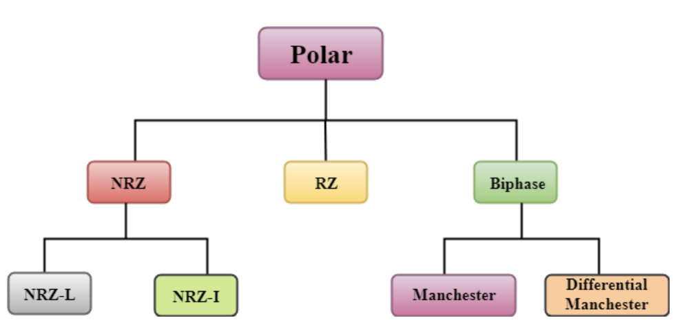

* Bipolar


* Unipolar


* Pulse Amplitude Modulation
  * not useful in data communication as pulses are not digital → PCM technique

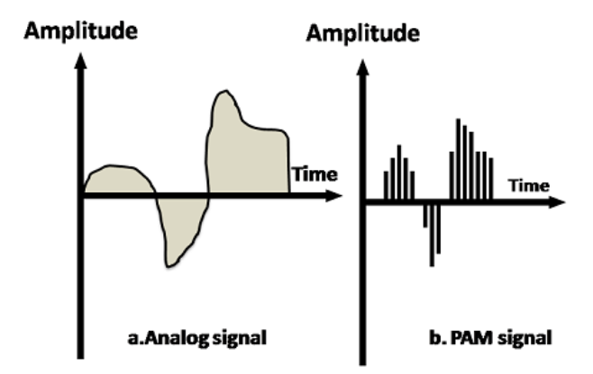

* Pulse Code Modulation

* Modem
  * Baud rate measure of how many bits can be passed across a phone line in a second → 110bps

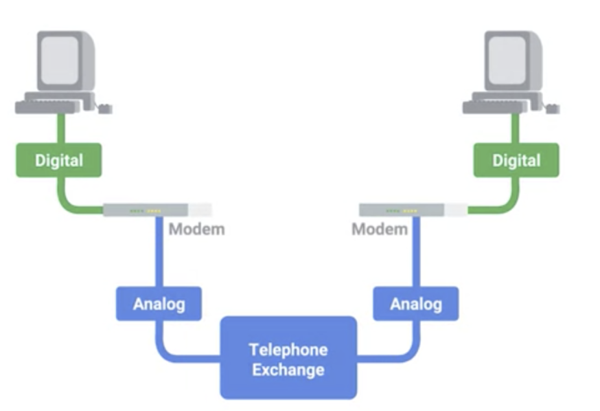

> Hub

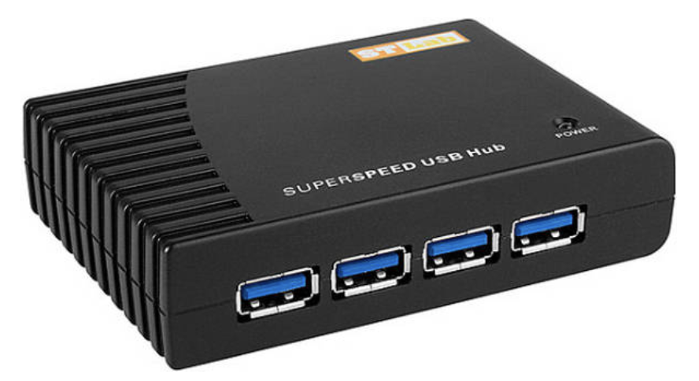

* allow connections from many computers at once
* Older technology falling out of use → Due to collision domain
* repeater → Message sent by one host is sent to all other hosts
* logically function as a bus topology
* too many host causes collision
* Intelligent hub has network diagnostic abilities

* Passive
  * work like cable splitters
  * the more devices the weaker the signal to each device

* Active
  * central connecting device in network that regenerates signals on the output side to keep the signal strong
  * need a power source → power added to signal when passed through port
  * prevent weakening of signal by multiple devices being attached
  * repeats signal to all hosts connected to hub
  * No more than 5 segments can be linked
  * 4 linking devices only can be used to form segments
  * 3 segments can be populated by computers

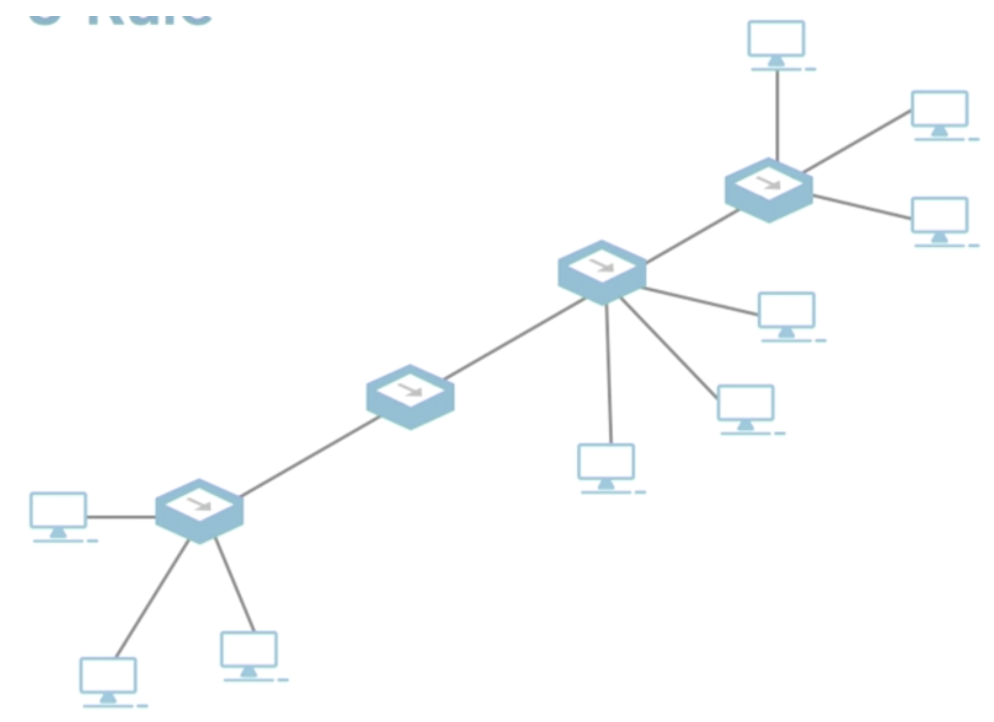

> Cable

* Link LED flashes when linked, Activity LED flashes when data flows
* connect different devices to each other, allowing data to be transmitted over them

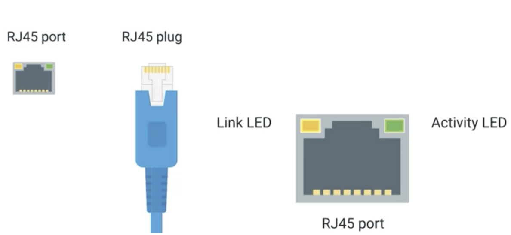

* Copper Cable
  * Multiple pairs of copper wires inside plastic insulator
  * Cat5 < Cat5e < Cat6 to reduce crosstalk → One wire accidentally detected on another wire

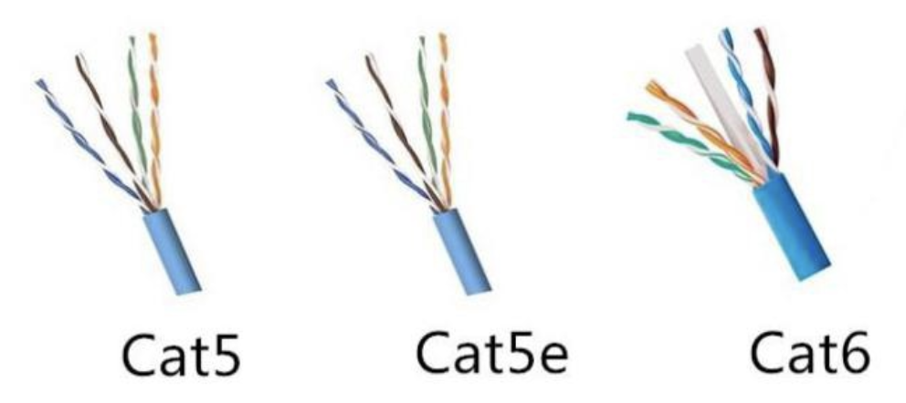

* Fiber Cable
  * Contain individual optical fibers, which are tiny tubes made out of glass about the width of a human hair
  * Much more expensive and fragile

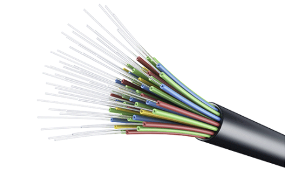