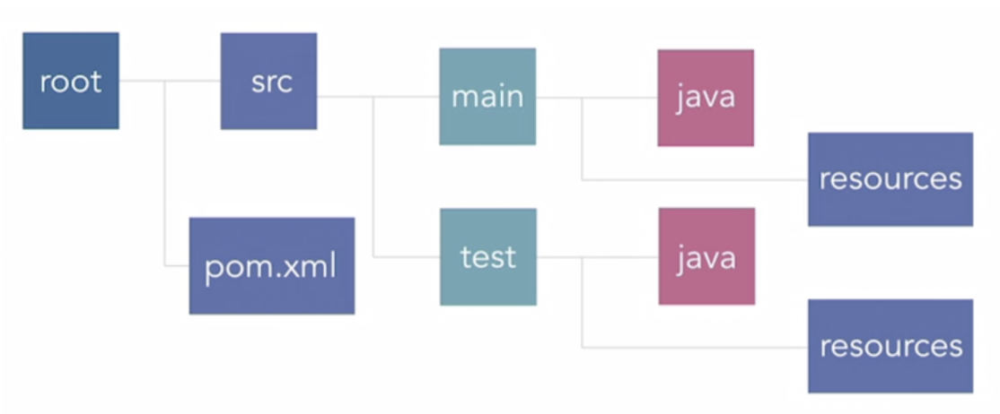
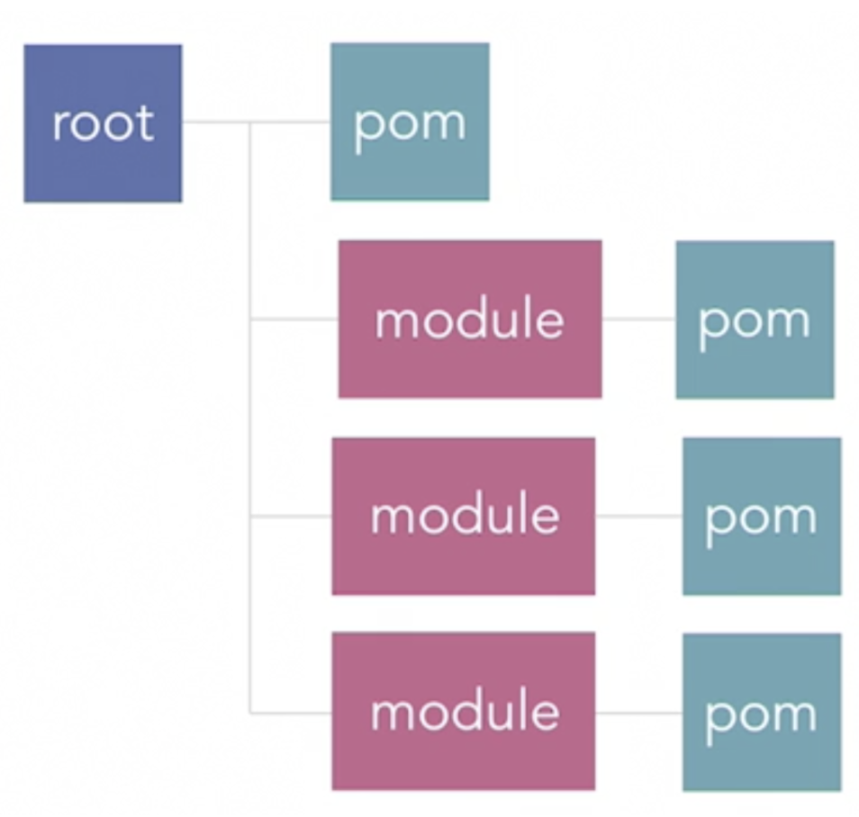

# Java

* Compile-time: only know the type of reference
* Run time: only know the type of object
```
-Xmx4G              # Configure more memory
```
# Error
> java.util.ConcurrentModificationException    

* Modifying in for each loop

## Terms

> Java Developer Kit (JDK)

* core component with executables and binaries required to compile, debug and execute a Java Program

> Java Runtime Environment (JRE)

* JVM and java binaries and other classes to execute any program successfully

> Java Virtual Machine (JVM)

* converting Byte code to the machine specific code → platform independence

# Packaging
## Ant
* doesn't impose any coding conventions or project structures → write all the commands by themselves
* build XML build files that are hard to maintain

## Maven


* project management tool that is based on POM (project object model)
* used for projects build, dependency and documentation
* provide guidelines and support migration to new features
* separate code from resources and test


```
setx JAVA_HOME "C:\Program Files\Java\jdk1.8.0_231"
mvn clean package      # Remove issues with other maven operation
```

> Pom


> Archetypes
* project template using Maven
* Manages builds, dependencies + versions / documentation

```
groupId             # Organization who makes this application
artifactId          # Physical file name that contains all of the compiled Java code 
version             # version
packaging           # built into a jar
parent              # inherit most elements, except for artifactId, name, prerequisites

repositories        # point to Maven repositories for artifacts
plugin repositories # point to the plugins used by Maven itself
profiles            # allow override configuration and provide default behavior for common tasks

```
