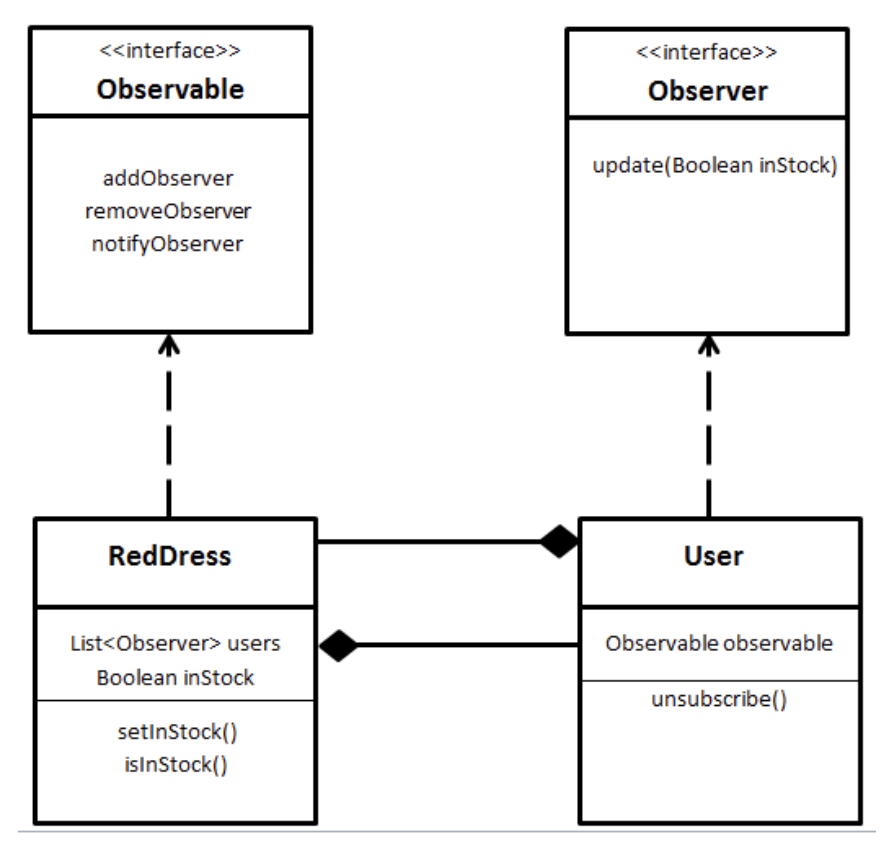

# IO

## Errors
* throw

```java
throws java.io.IOException					# When dealing with I/O in Java
```

* Catch all excpetion

```java
try {
  //
} catch (Exception e){
  //
}
```

## Primitives

* automatic cast

```java
float → double
byte → short → int → long
JAVA → CPP → C
```
## String

```java
System.out.println(System.getProperty("file.encoding"));  // Print encoding type of file
String.format("%s, %.2f and %d", “string”, 0.01, 12);     // Print file format

getBytes()
split(String regex, int limit)                            // if limit = 0, remove trailing empty strings, if neg, keep
```

* Print Korean in java

```java
public class a {
  private static void printIt(String string) {
    for (int i = 0; i < string.length(); i++) {
      System.out.print(String.format("U+%04X ", string.codePointAt(i)));
    }
    System.out.println();
  }

  public static void main(String[] args) {
    String han = "한";

    String nfd = Normalizer.normalize(han, Normalizer.Form.NFD);
    printIt(nfd);
    String nfc = Normalizer.normalize(nfd, Normalizer.Form.NFC);
    printIt(nfc);
  }
}
```

## Iterator

```java
remove()    // Removes from the underlying collection the last element returned by this iterator
```

## List

```java
unmodifiable, LinkedList is modifiable

add(E e)                            // Appends specified element to end of this list
addAll(Collection<? extends E> c)   // Appends all of elements in specified collection to end of this list, so that they are returned by specified collection's iterator

remove(int index)	Removes the element at the specified position in this list (optional operation)
size()			Returns the number of elements in this list
```

# Operation


# OOP

## Class

* can extend from only 1 base class

> Concrete

* Classes from which objects can be instantiated (no abstract methods)

> Abstract

* classes must be defined abstract if at least one method in the class definition is defined abstractly
* classes which are too generic to be instantiated as objects (cannot create abstract object)

## Interface Inheritance

* Interfaces contain no method definitions, no constructors, and only public static final variable
* Classes may implement multiple interfaces
* An interface may extend multiple interfaces

```java
interface Set extends Collection
```

> Inheritance

```java
public static class Super {
    public void meth(Super other) { System.out.println( "1 - in Super.meth(Super)");}
}

public static class Sub extends Super {
    @override
    public void meth(Super other) { System.out.println("2 - in Sub.meth(Super)");}
    public void meth(Sub other) { System.out.println("3 - in Sub.meth(Sub)");}
}

public class MethodTest {
  public static void main(String[] args) {
    Super sup = new Super();
    Sub sub = new Sub();	
    Super sup_ref_sub = new Sub();

    sup.meth(sup);                  // 1
    sup.meth(sup_ref_sub);          // 1
    sup.meth(sub);                  // 1

    sup_ref_sub.meth(sup);          // 2
    sup_ref_sub.meth(sup_ref_sub);  // 2
    sup_ref_sub.meth(sub);			    // 2

    sub.meth(sup);				          // 2
    sub.meth(sup_ref_sub);			    // 2
    sub.meth(sub);				          // 3
  }
}
```

# Patterns

* [CS](../cs/cs.md#pattern)

## Principles

* [theory](../cs/cs.md#Principle)

> Depedency Inversion

```java
class Toyo { int wheelSize() { … } }		// Car depends on Toyo
class Car {
  Toyo tire;
  Car(int size) { tire= new Toyo(size); }
  int wheelSize() { return tire.size(); }
}
Car car = new Car(18);

interface ITire { int wheelSize(); }		// Car depends on interface
class Tire implements ITire { int wheelSize(){} }
class Car { 
  ITire tire; 
  Car(int size) { this.tire = new Toyo(size); } 
  int wheelSize() { return tire.size(); } 
}
Car car = new Car(new Toyo(18));
```

## Creational Patterns

* Singleton

```java
class Singleton {
    static private Singleton instance;
    private Singleton() {}
    public static Singleton getInstance() {
        if (instance == null) instance = new Singleton();
        return instance;
    }
}
```

* Factory

```java
Event event = new Event(2, "OrderFlowers");   // BAD
Event event  = Event.makeOrderFlowers();      // BETTER
Event event = factory.createEvent(FLOWERS);   // BEST
```

* Builder

```java
interface HousePlan { 
  public void setRoof(String roof); 
  public void setInterior(String interior); 
} 
class House implements HousePlan { 
  private String roof, interior; 
  public void setRoof(String roof) { this.roof = roof; } 
  public void setInterior(String interior) { this.interior = interior; } 
} 
interface HouseBuilder { 
  public void bulidRoof();   
  public void buildInterior(); 
  public House getHouse(); 
} 
class IglooHouseBuilder implements HouseBuilder { 
  private House house; 
  public IglooHouseBuilder() { this.house = new House(); } 
  public void buildInterior() { house.setInterior("Ice Carvings"); } 
  public void bulidRoof() { house.setRoof("Ice Dome"); } 
  public House getHouse() { return this.house; } 
} 
class TipiHouseBuilder implements HouseBuilder { 
  private House house; 
  public TipiHouseBuilder() { this.house = new House(); } 
  public void buildInterior() { house.setInterior("Fire Wood"); } 
  public void bulidRoof() { house.setRoof("Wood, caribou and seal skins"); } 
  public House getHouse() { return this.house; } 
}

class CivilEngineer  { 
  private HouseBuilder houseBuilder; 
  public CivilEngineer(HouseBuilder houseBuilder) { this.houseBuilder = houseBuilder; } 
  public House getHouse() { return this.houseBuilder.getHouse(); } 
  public void constructHouse() { 
    this.houseBuilder.bulidRoof(); 
    this.houseBuilder.buildInterior(); 
  } 
} 

class Builder { 
  public static void main(String[] args) { 
    HouseBuilder iglooBuilder = new IglooHouseBuilder(); 
    CivilEngineer engineer = new CivilEngineer(iglooBuilder); 
    engineer.constructHouse(); 
    House house = engineer.getHouse(); 
    System.out.println("Builder constructed: "+ house); 
  } 
} 
```

## Strucutral Pattern

* Adaptor

```java
interface ITarget { void request(); }
class Adapter implements ITarget {	        // Adapter class enables Adaptee to use incompatible Itarget
    Adaptee adaptee; 
    public Adapter(Adaptee a) { this.adaptee = a; } 
    public void request() { this.adaptee.specificRequest(); }
}
class Adaptee {  public void specificRequest() { ... } }

ITarget target = new Adapter( new Adaptee() ); 
target.request();
```

* Decorator

```java
interface Beverage { int cost(); }
interface AddonDecorator extends Beverage { int cost(); }
class Espresso implements Beverage {
  public int cost() { return 1; }
}
class Caramel implements AddonBeverage {
  Beverage beverage;
  public caramel(Beverage b) { this.beverage = b; }
  public int cost() { return this.beverage.cost() + 2; }
}
Beverage bev = new Foam(new Espresso());

// Generally simpler and better
interface Beverage {
  String getDescription(); 
  int cost();
}
class CoffeeDrink extends Beverage { 
  float theCost; 
  CoffeeDrink(String desc, float cost) { description = desc; theCost = cost;} 
  float cost() { return theCost; } 
} 
class Condiment extends Beverage { 
  Beverage beverage; 
  float theCost; 
  Condiment(Beverage bev, String desc, float cost) { 
    beverage = bev; description = desc; theCost = cost; } 
  float cost() { return beverage.cost() + theCost; } 
  String getDescription() { return beverage.getDescription() + ", " + description; }
}

Beverage bev = new Condiment(new CoffeeDrink("Espresso", 1.00), "Foam", 0.3); // making is hard
```

* Delegation

```java
// delegate (receiving) object
class Rectangle(int width, int height) {
  void area() { 
    return width * height;
  }
}

// original (sending) object
class Window(Rectangle bounds) {			
  void area() {
    return bounds.area();
  }
}
```

* Model View presenter

```java
// Bad has circular dependecy
class Data {
    int data = 0;
    void setData(int d) { data = d; }
}
class Display {
    void show(int v) { print(“val: ” + v); }
}

// Good
interface DataSubject { void register(DataObserver do); } 
interface DataObserver { void newData(int d); } 
class Data implements DataSubject { 
    int data = 0; 
    ArrayList<DataObserver> observers; 
    void setData(int d) { data = d; notify(d); } 
    void register(DataObserver do) { observers.add(do); } 
    void notify(int d) { for (DataObserver obs: Observers) obs.newData(d); }
}
class Display { 
    void show(int v) { Print("val: " + v); }
}
class DataDispMed implements DataObserver { 
    DataSubject ds; 
    Display disp; 
    DataDispMed(DataSubject ds, Display disp) { 
        this.ds = ds; 
        this.disp = disp; 
        ds.register(this); 
    } 
    void newData(int d) { disp.show(d); } 
}
void main() { 
    Data data = new Data(); 
    Display = new Display(); 
    DataDispMed ddm = new DataDispMed(data, disp); 
    data.setData(5); // print “val: 5”
}
```

```java
// Bad : Circular dependency
class Acct {
  void withdraw(int a) {
    if (a ≥ bal) bal -= a;
    ui.show(bal);
  }
}
class UI {
  void show(int b) { print(“balance” + b); }
  void withdraw(int a) { acct.withdraw(a); }
}

// Good
interface AcctSubject { void register(AcctObserver do); }
interface AcctObserver { void newbal(int b); }

class Acct implements AcctSubject {
  List<AcctObserver> aos;
  void withdraw(int a) { bal -= a; notify(); }
  void reg(AcctObserver ao) { aos.add(ao); }
  void notify() { 
    for (AcctObserver ao : aos) { ao.newbal(bal); }
  }
}

class UI implements AcctObserver {
  Acct acct;
  UI(Acct acct) { this.acct = acct; }
  void show(int b) { print(“balance” + b); }
  void withdraw(int a) { acct.withdraw(a); }
  void newbal(int b) { show(b); }
}

void main() {
  Acct acct = new Acct();
  UI ui = new UI(acct);
  acct.reg(ui);
}

// Best
class AcctUIMediator implements AccountObserver, UIObserver {
  UI ui; Acct acct;
  void newbal(int b) { ui.show(b); }
  void withdraw(int a) { acct.withdraw(a); }
}
interface AcctSubject { 
  void register(AcctObserver do); 
  void notify(); 
}
interface AcctObserver { void newbal(int b); }
class Acct implements AcctSubject {
  List<AcctObserver> aos;
  void withdraw(int a) { bal -= a; notify(); }
  void register(AcctObserver ao) { aos.add(ao); }
  void notify() { 
    for (AcctObserver ao : aos) { ao.newbal(bal); }
  }
}

interface UISubject { void register(UIObserver do); void notify(); }
interface UIObserver { void show(); }
class UI implements UISubject {
  void show(int b) { print(“balance: “ + b); }
  void withdraw(int a) { notify(a); }
}

void main() {
  Acct acct = new Acct();
  UI ui = new UI();
  AcctUIMed aum = new AcctUIMed(acct, ui);
  acct.register(aum);
  ui.register(aum);
}
```

## Behavioral

> Strategy pattern

```java
class Duck { 
  IFlyBehavior fb; 
  IQuackBehavior qb; 
  IDisplayBehavior db;
  public Duck (IFlyBehavior fb, IQuackBehavior qb, IDisplayBehavior db) { };
  public void fly() { this.fb.fly(); }
}
```

> Iterator

```java
interface iterable { Iterator GetIterator(); } 
class iterable { Iterator GetIterator(); } 
interface Iterator { bool hasNext(); void next(); object current(); } 
class Iterator { bool hasNext(); void next(); object current(); }
```

> Observer

* subject (observable) maintains a dependents (observers) 
* subject notifies observers automatically of any state changes, usually by calling one of their methods.



```java
interface IOservable {	
  void add (IObserver o);
  void remove (IObserver o);
  void notify();
}

interface IObserver {
  void update();
}

class WeatherStation implements IObservable{
  IObserver observers = []
  int temperature;
  void add (IObserver o) { this.observers.add(o); }
  void remove (IObserver o) { this.observers.remove(o); }
  void notify() { foreach (IObserver o in this.observers) { o.update(); }; }
  public int getTemperature() { return this.temperature; }
}


class PhoneDisplay implements IObserver{
  WeatherStation station;
  public PhoneDisplay(WeatherStation ws) { this.station = station; }
  public void update() { this.station.getTemperature(); }
}
```


## Functional

# Conccurency

## synchronized

```java
class Counter { 
    int count; 
    public synchronized void increment() { count++; } 
}

public class SyncDemo { 
    public static void main(String[] args) { 
        Counter c = new Counter(); 
        Thread t1 = new Thread(new Runnable() { 
            public void run() { for (int i = 0; i <= 1000; i++) { c.increment;()} }}
        );
        Thread t2 = new Thread(new Runnable() { 
            public void run() { for (int i = 0; i <= 1000; i++) { c.increment;()} }}
        );
        t1.start();
        t1.join();	// wait for complete the job
        t2.start();
        t2.join();	// wait for complete the job
        
        System.out.println("Count" + c.count);
    }
}
```