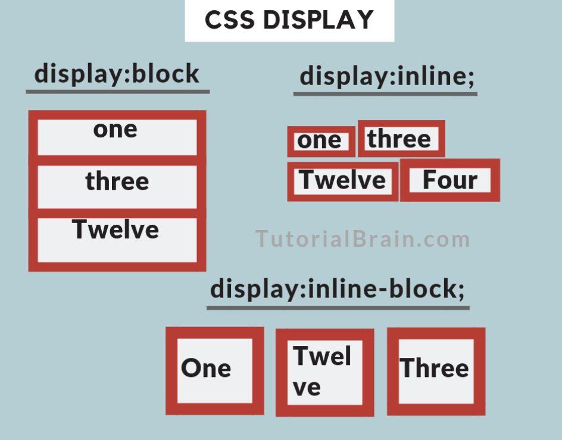
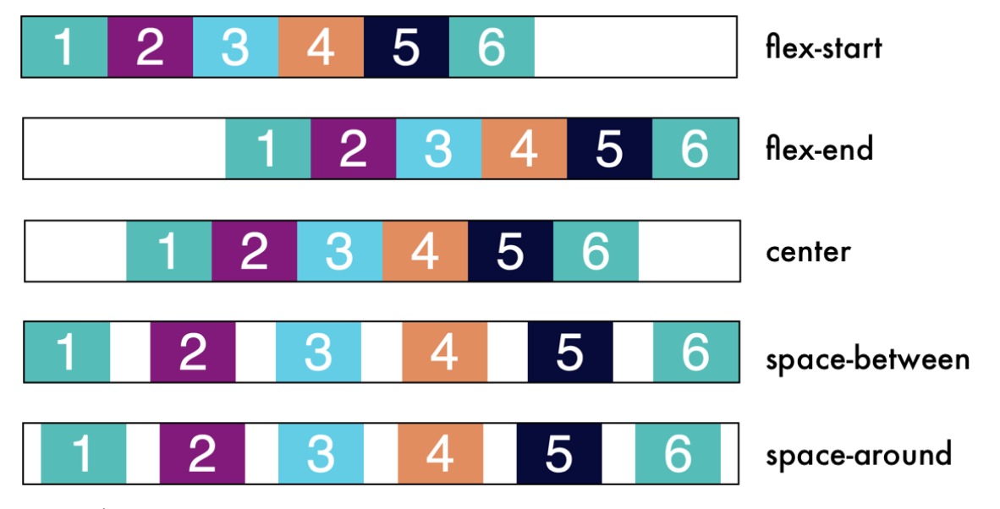
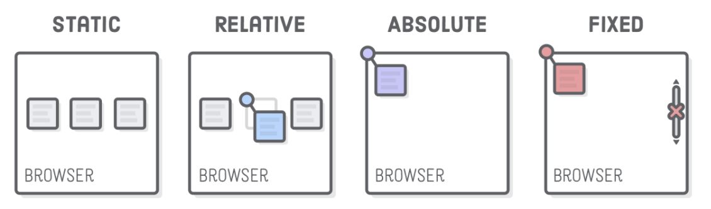
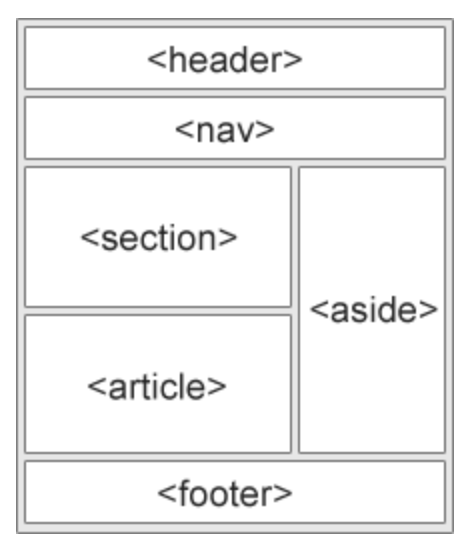
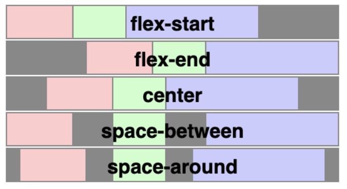
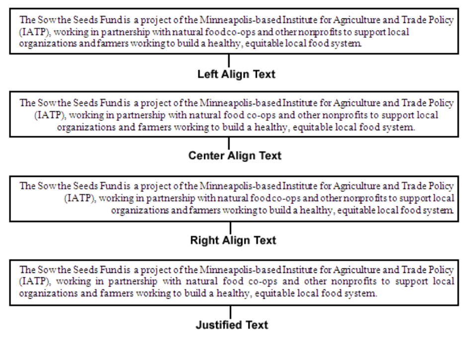
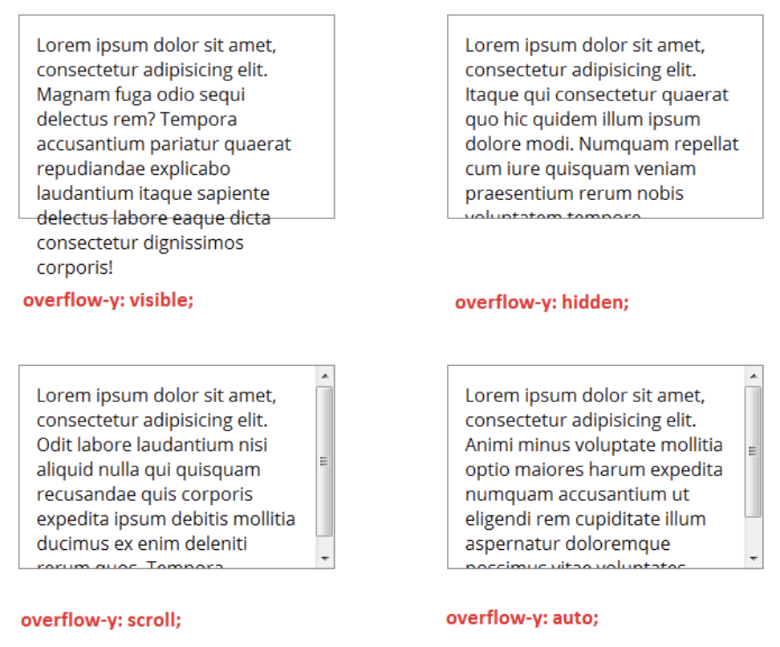

# Javascript

* interpreted, dynamic typing, prototype-based programming language 

## Speed Optimization

* https://developers.google.com/speed/pagespeed/insights/
* https://tinyjpg.com
* https://jakearchibald.github.io/svgomg/

## Terms

> Versions

* ES5
  * ECMAScript5 developed in 2009
  * Fully supported in all modern browsers

* ES6
  * ECMAScript 2015
  * Internet Explorer does not support ECMAScript 2015
  * let and const, default parameter values, Array.find(), Array.findIndex().

> Packages

```sh
nodemon         # update refresh backend
npm init        # create package.json
npm audit fix   # Scan project install any compatible updates to vulnerable dependencies
npm run rename  # change project name
```

* Start the development server

```sh
npm start
npm list -g
npm root -g
```

> Ajax
* Asynchronous JavaScript and XML
* the request are sent to the server by using XMLHttpRequest objects

> Content delivery network (CDN)

> Status Messages

* 1** Informational      # received and the process is continuing.

```
101 Switching Protocols  # asked the server to switch protocols
103 Checkpoint           # resumable requests proposal to resume aborted PUT/POST requests

# 2xx: Successful       # Message:  Description:
200 OK                  # OK (standard response for successful HTTP requests)
201 Created             # fulfilled, and a new resource is created 
202 Accepted            # accepted for processing, but the processing has not been completed
203 NoAuth Information  # successfully processed, but returning info from another source
204 No Content          # successfully processed, no content
205 Reset Content       # successfully processed, no content, requires that requester reset view
206 Partial Content     # delivering only part of resource due to a range header sent by client

# 3** Redirection       # further action must be taken in order to complete the request.
300 Multiple Choices    # link list. users can select, visit the link. Maximum five addresses  
301 Moved Permanently   # moved to a new URL 
302 Found               # moved temporarily to a new URL 
303 See Other           # page can be found under a different URL
304 Not Modified        # Indicates requested page has not been modified since last requested
306 Switch Proxy        # No longer used
307 Temporary Redirect  # moved temporarily to a new URL
308 Resume Incomplete   # resumable requests proposal to resume aborted PUT/POST requests

# 4** Client Error      # indicates that requested resource is not available at the web server
400 Bad Request         # cannot be fulfilled due to bad syntax
401 Unauthorized        # legal request, but authentication has failed or not yet been provided
402 Payment Required    # Reserved for future use
403 Forbidden           # legal request, but the server is refusing to respond to it
404 Not Found           # not be found but may be available again in the future
405 Method Not Allowed  # made of a page using a request method not supported by that page
406 Not Acceptable      # only generate a response that is not accepted by the client
407 Proxy Auth Required # client must first authenticate itself with the proxy
408 Request Timeout     # server timed out waiting for the request
409 Conflict            # could not be completed because of a conflict in the request
410 Gone                # page is no longer available
411 Length Required     # "Content-Length" is not defined. server requires it
412 Precondition Failed # precondition given in request evaluated to false by server
413 Request Entity Large  # server will not accept request, because request entity is large
414 Request-URI Too Long  # server will not accept request, because URL is too long (GET)
415 Unsupported Media     # server will not accept request, because media type is not supported 
416 Requested Range Not   # asked for a portion of file, but server cannot supply that portion
417 Expectation Failed    # server cannot meet the requirements of Expect request-header field

# 5xx: Server Error       # processing fails due to some unanticipated incident on the server side.
500 Internal Server Error # A generic error, given when no more specific message is suitable
501 Not Implemented       # server either doesn’t recognize request method, or lacks ability to fulfill
502 Bad Gateway           # gateway server received an invalid response from upstream server
503 Service Unavailable   # server is currently unavailable (overloaded or down)
504 Gateway Timeout       # gateway server didn’t receive a timely response from upstream server
505 HTTP Version Not      # does not support the HTTP protocol version used in the request
511 Network Auth          # client needs to authenticate to gain network access
```

> xml

* Extensible Markup Language 
* a markup language that defines a set of rules for encoding documents in a format that is both human-readable and machine-readable

> Application Programming Interface (API)

* a software intermediary that enables two applications to communicate with each other
* All Web services are APIs but not all APIs are Web services
* All Web services need a network to operate while APIs don’t need a network for operation
* First estimate your usage and understand how that will impact the overall cost of the offering
* Many protocols are now available to be used in API testing (ex JMS, REST, HTTP, UDDI and SOAP)

> Representational State Transfer

* an architectural style for developing web services which exploit the ubiquity of HTTP protocol and uses HTTP method to define actions

> Websocket

* two way communication between the clients and the servers
* Four main events : Open / Close / Error / Message

> Same Origin Policy

* When using XMLHttpRequest or Fetch API → local files origin is null

> URI

* stands for Uniform Resource Identifier. It is a string of characters designed for unambiguous identification of resources and extensibility via the URI scheme.

> xss

* Cross Site Scripting
* By using Cross Site Scripting (XSS) technique, users executed malicious scripts (also called payloads) unintentionally by clicking on untrusted links and hence, these scripts pass cookies information to attackers

> HTTP Methods

* GET
    * can be cached, bookmarked, only used to request data (not modify)
    * remain in the browser history, have max 2048 characters, ASCII characters allowed
    * should never be used when dealing with sensitive data
    * application/x-www-form-urlencoded

* POST
    * send data to a server to create/update a resource
    * never cached, do not remain in the browser history, cannot be bookmarked
    * no restrictions on data length
    * application/x-www-form-urlencoded or multipart/form-data / multipart encoding for binary data

* PUT
    * send data to a server to create/update a resource (idempotent to POST)
    * same PUT request multiple times will always produce the same result

* HEAD
    * almost identical to GET, but without the response body

* DELETE
    * DELETE method deletes the specified resource.

* PATCH

* OPTIONS
    * describes the communication options for the target resource.

## Files

> robot.txt

* give rules on how site can be crawled
* links to sitemap

> sitemap.xml

* Informs search engines of the site structures
* provides some meta information about individual pages

> Error

* Maximum update depth exceeded error

```jsx
// pass function or use arrow function instead of calling it
{<td><span onClick={this.toggle()}>Details</span></td>}
{<td><span onClick={this.toggle}>Details</span></td>}
```

* Refused to apply style from 'https://cdn.jsdelivr.net/npm/instantsearch.js' because its MIME type ('application/javascript') is not a supported stylesheet MIME type, and strict MIME checking is enabled.

```html
<link rel="stylesheet" href="styles.css"\>
```

* Uncaught SyntaxError: Cannot use import statement outside a module`

```html
<script type="module" src="../src/main.js"></script>
```

* (node:32660) UnhandledPromiseRejectionWarning: Unhandled promise rejection. This error originated either by throwing inside of an async function without a catch block, or by rejecting a promise which was not handled with .catch(). To terminate the node process on unhandled promise rejection, use the CLI flag `--unhandled-rejections=strict` (see https://nodejs.org/api/cli.html#cli_unhandled_rejections_mode). (rejection id: 1)  
* (node:32660) [DEP0018] DeprecationWarning: Unhandled promise rejections are deprecated. In the future, promise rejections that are not handled will terminate the Node.js process with a non-zero exit code.
  * Do not throw again in catch which is uncaught
  * Do not trust auto import, from sequelize.types -> from sequelize
  * await async function that throws an error

## HTML

* Hyper Text Markup Language where W3 Consortium is main international standards organization
* request and response protocol.
* media independent protocol.
* stateless protocol.

> Term

* global atrribute

```sh
accesskey       # a shortcut key to activate/focus an element
class           # one or more classnames for an element (refers to a class in a style sheet)
contenteditable # Specifies whether the content of an element is editable or not
data-*          # Used to store custom data private to the page or application
dir             # text direction for the content in an element
draggable       # whether an element is draggable or not
hidden          # Specifies that an element is not yet, or is no longer, relevant
id              # Specifies a unique id for an element
lang            # Specifies the language of the element's content
spellcheck      # whether element is to have its spelling and grammar checked or not
style           # an inline CSS style for an element
tabindex        # tabbing order of an element
title           # extra information about an element
translate       # whether the content of an element should be translated or not
```


```html
&nbsp;     # to add a single space.
&ensp;     # to add 2 spaces.
&emsp;     # to add 4 spaces.

<!-- -->   # commnet
```

### CSS

* describes how HTML elements should be displayed.
* id
  * id must start with letters only have one id
* Pseudo-Elements
  * style specified parts of an element. (ex, Style first letter, or line, of an element)

```js
<link rel="stylesheet" type="text/css" href="theme.css">
```

* Rules given in later classes (or which are more specific) override

```js
a.abc, a.xyz {     /* apply to multiple css */
  width: 100px;
  height: 100px;
} 
```

* display



```sh
inline             # as an inline element <span>. height, width properties have no effect    
block              # as a block element <p>. starts on a new line, takes up whole width    
contents           # remove container, make childs children of element next level up in DOM
flex / grid        # element as a block-level flex / grid container    
inline-flex / grid # Displays an element as an inline-level flex / grid container    
inline-table       # The element is displayed as an inline-level table    
list-item          # Let the element behave like a <li> element    
none               # completely removed
```

* Flex



> parent

```css
display: flex;        
justify-content: center;


flex-direction         #  how flex items are placed in flex container defining main axis and direction
flex-direction: row;
```

* Selector

```js
*             // all elements
div           // all div tags
div, p        // all divs and paragraphs
div p         // paragraphs inside divs

.classname    // all elements with class
#idname       // element with ID
div.classname // divs with certain classname
div#idname    // div with certain ID
#idname *     // all elements inside #idname

[attribute="value"]     // used to select elements with a specified attribute
[attribute~="value"]    // used to select elements with an attribute value containing a specified word
```

* Combinators
  * something that explains the relationship between the selectors

```js
div p             // all elements that are descendants of a specified element
div > p           // all p tags, one level deep in div
div + p           // p tags immediately after div
div ~ p           // p tags preceded by div
```

* unit

```js
// fixed units
cm / mm / in      // centimeters / millimeters / inches (1in = 96px = 2.54cm)
p                 // relative to the viewing device. For high res, 1px = 1+ device pixel
pt / pc           // points (1pt = 1/72 of 1in), picas (1pc = 12 pt)

// Relative Lengths
em                // Relative to font-size of element (2em = x2 of current font)    
ex                // Relative to x-height of current font (rarely used)    
ch                // Relative to width of the "0" (zero)    
rem               // Relative to font-size of the root element    
vw / vh           // Relative to 1% of the width / height of the viewport*    
vmin / vmax       // Relative to 1% of viewport* smaller / larger  dimension    
%                 // Relative to the parent element
```

* z-index
  * only works on positioned elements (position: absolute, relative, fixed, sticky).
  * z-index: auto|number|initial|inherit;

```js
auto (default)    // stack order equal to its parents
number            // stack order of the element. Negative numbers are allowed
```

* visibility

```js
visible       // visible, defaul>
hidden        // hidden (but still takes up space)    
collapse      // Only for <tr>, <tbody>, <col>, <colgroup>. removes a row or column
```

* check hidden

```js
child.offsetWidth > 0 && child.offsetHeight > 0 // also check if parent is hidden
object.style['display'] != 'none'               // only checks the element
```

### Input

* input
* label
  * a label for an input tag

```js
<input([type=])>        // an input control (text, password, number)
onfocus / onfocusout    // add handler function when user click / unclick form 
```

```js
//radio
// one by default set checked to select by default
<style>
  [type="radio"]:checked+label { font-weight: bold; }
  [type="radio"]#male:checked~p { color: blue; }
  [type="radio"]#female:checked~p { color: red; }
  [type="radio"]#young:checked~p { font-size: 20px; }
  [type="radio"]#old:checked~p { font-size: 30px; }
</style>
<input type="radio" id="male" name="gender" checked> <label for="male">male</label>
<input type="radio" id="female" name="gender"> <label for="female">female</label>
<br>
<input type="radio" id="young" name="age"> <label for="young">young</label>
<input type="radio" id="old" name="age" checked> <label for="old">old</label>
<p>Hi</p>
```

* form
  * an HTML form for user input

```js
outline: none;     // hide blue outline for text input
```

* textarea
  * a multiline input control (text area)
* button
* optgroup
  * a group of related options in a drop-down list
* fieldset
  * related elements in a form
* legend
  * a caption for a fieldset element
* output
  * the result of a calculation
* datalist
  * a list of pre-defined options for input controls

* select
  * a drop-down list
* option
  * an option in a drop-down list

```js
<label for="cars">Choose a car:</label>
<select name="cars" id="cars">
  <option value="volvo">Volvo</option>
  <option value="saab">Saab</option>
  <option value="mercedes">Mercedes</option>
  <option value="audi">Audi</option>
</select>

<input type="number" min="0" max="64" list="numbersxx" id="numberx">        # number color text
<input type="checkbox" id="agree" />
<label for="agree">I agree with the Terms and Conditions</label>
<label>My input <input type="text" id="my-input" /> </label>
```

> media

* alt
  * Specifies an alternate text for an image
* src
  * Source file path

* area

```js
<area shape="rect" coords="0,0,82,126" alt="Sun" href="sun.htm">
<area shape="circle" coords="90,58,3" alt="Mercury" href="mercur.htm">
```

* map

```js

<map name="planetmap">
<area shape="rect" coords="0,0,82,126" alt="Sun" href="sun.htm">
</map>
```

### Structure

> CSS





* Structure css

```js
vh              // scaled accordingly when the initial containing block is changed.
```

* Structure Tags

```js
<html></html>       // { display: block; } 
// :focus           // {outline: none; }
<style></style>     // put css  { display: none; }
<div></div>         // defines a division or a section in an HTML document
<span></span>       // wrap small portions of text, images
<article></article> // make sense on its own, possible to read it independently from the rest of the web site

<div></div>         // Content Division element, the generic container for flow content. 
// { display: block; }

<span></span>       // a section in a document
<header></header>   // a header for a document or section
<footer></footer>   // { display: block; }
<main></main>       // the main content of a document
<body></body>       // display: block; margin: 8px; }
<data></data>       // Links the given content with a machine-readable translation
<details></details> // additional details that the user can view or hide
<dialog></dialog>   // a dialog box or window
<summary></summary> // a visible heading for a <details> element
```

* Split screens

```js
<style>
  html, body { height: 100%; margin: 0; }
  .screen { height: 100%; background-color: black; display: flex; }
  .left { background-color: red; width: 300px; }
  .right { background-color: blue; width: 100%; }
  .right-top { background-color: green; height: 200px; }
  .right-bottom { background-color: yellow; margin-top: 50px; height: 100%; }
</style>
<div class="screen">
  <div class="left"></div>
  <div class="right">
    <div class="right-top"></div>
    <div class="right-bottom"></div>
  </div>
</div>
```

> Position



* relative vs fixed
  * px for constant spacing rem for text size

```js
Relative  // positioned relative to its normal position. 
Absolute  // positioned absolutely to its first positioned parent. 
Fixed     // positioned related to the browser window. 
Sticky    // positioned based on the user's scroll position.

min-width // content is smaller than the minimum width, the minimum width will be applied
```

* margin

```js
default 0
margin: one / two / three / four  // tdlr / td, rl / t, rl, d / t, r, b, l
```

### Text

* css




```js
text-transform  // controls the capitalization of text
text-align
left / right    // Aligns the text to the left / right
center          // Centers the text
justify         // Stretches lines so that each line has equal width (ex. newspapers, magazines)    

overflow-wrap   // normal | anywhere | break-all | break-word | keep-all
text-decoration // none | line-through | overline | underline | initial | inherit
```

```js
<style>
#parent { text-align:center; background-color:blue; height:400px; width:600px; }
.block { height:100px; width:200px; text-align:left; }
.center { margin:auto; background-color:green; }
.left { margin:auto auto auto 0; background-color:red; }
.right { margin:auto 0 auto auto; background-color:yellow; }
</style>
<div id="parent">
    <div id="child1" class="block center"> a block to align center and with text aligned left </div>
    <div id="child2" class="block left"> a block to align left and with text aligned left </div>
    <div id="child3" class="block right"> a block to align right and with text aligned left </div>
</div>
```

* tags

```js
<h1></h1>     // {display: block; font-size: 2em; margin: 0.67em 0; font-weight: bold;}
<h2></h2>     // {display: block; font-size: 1.5em; margin: 0.83em 0; font-weight: bold;}
<h3></h3>     // {display: block; font-size: 1.17em; margin: 1em 0; font-weight: bold;}
<h4></h4>     // {display: block; margin-top: 1.33em 0; font-weight: bold;}
<h5></h5>     // {display: block; font-size: .83em; margin: 1.67em 0; font-weight: bold;}
<h6></h6>     // {display: block; font-size: .67em; margin: 2.33em 0; font-weight: bold;}
<hr></hr>     // {display: block; margin: 0.5em auto; border-style: inset; border-width: 1px; }
<p></p>       // {display: block; margin-top: 1em 0}
<pre></pre>   // preformatted text

<abbr></abbr>          // an abbreviation or an acronym
<address></address>    // contact information address, { display: block; font-style: italic; }
<b></b>                // bold text, {font-weight: bold;}
<br></br>              // A line break in text (carriage-return).
<del></del>            // text that has been deleted from a document
<em></em>              // emphasized text 
<mark></mark>          // marked/highlighted text
<q></q>                // a short quotation
<strong></strong>      // important text
<sub></sub>            // subscripted text
<sup></sup>            // superscripted text
<template></template>  // a template
<time></time>          // a date/time
<u></u>                // text that should be stylistically different from normal text
<var></var>            // a variable
```

* overflow
  * specifies what should happen if content overflows an element's box



```js
overflow: visible|hidden|scroll|auto|initial|inherit;
visible (default) //  is not clipped. It renders outside the element's box
hidden            // clipped, rest of content will be invisible    
scroll            // clipped, scroll will always show scrollbar even if content fits
auto              // clipped, a scroll-bar is added when content doesn’t fit
initial / inherit // default / inherit from parent
```

> Link

```js
a:link         // a normal, unvisited link
a:visited      // a link the user has visited
a:hover        // a link when the user mouses over it
a:active       // a link the moment it is clicked

color           // red / #00ff00
letter-spacing  // 3px
line-height     // 0.8
padding         // 10px 20px
text-align      // center
text-decoration // line-through / overline / underline
text-transform  // uppercase / undercase / capitalize
text-indent     // 50px
```

```js
<a>            // onclick
a:link         // { color: (internal value); text-decoration: underline; cursor: auto; }

<download>     // Specifies that the target will be downloaded when a user clicks on the hyperlink
<href>         // Specifies the URL of the page the link goes to
<target>       // Specifies where to open the linked document

<script>       // 
async / defer      // script is executed asynchronously /page has finished parsing (only external)
crossorigin        // Sets request mode to an HTTP CORS Request (anonymous / use-credentials)
integrity filehash // browser checks script to ensure that code is not manipulated
nomodule T/F       // shouldn’t be executed in browsers supporting ES2015 modules
referrerpolicy     // Specifies which referrer information to send when fetching a script
src URL            // Specifies the URL of an external script file
type scripttype    // Specifies the media type of the script
```

### Media

```js
border            # 1px solid #ddd
border-radius        # 4px
opacity            # 0.5
```

> style

```js
background-image: url("photographer.jpg");
background-repeat: no-repeat, repeat
background-size: cover, contain
display: none;
position: absolute;
top, left: 25px;
z-index: 2;
padding        # space between border and content
margin            # space between border and surrounding content
```

### List

```js
<ul>            # an unordered list
<ol>            # an ordered list
<li>            # a list item
<dl>            # a description list
<dt>            # a term/name in a description list
<dd>            # a description of a term/name in a description list
```

> Table

```js
<table>      # a table
<caption>    # a table caption
<th>         # a header cell in a table
<tr>         # a row in a table
<td>         # a cell in a table
<thead>      # Groups the header content in a table
<tbody>      # Groups the body content in a table
<tfoot>      # Groups the footer content in a table
<col>        # Specifies column properties for each column within a <colgroup> element
<colgroup>   # Specifies a group of one or more columns in a table for formatting
```

### Event

> Mouse event

```sh
onchange        # HTML element has been changed
onclick         # clicks an HTML element
onmouseover     # moves the mouse over an HTML element
onmouseout      # moves the mouse away from an HTML element
onkeydown       # pushes a keyboard key
onload          # browser has finished loading the page
```

```js
// html
<style>
  html, body { height: 100%; margin: 0; }
  .screen { height: 100%; background-color: black; display: flex; }
  .left { background-color: red; }
  p:hover~.screen { display: var(--arg); }
</style>
<p style="--arg: hidden;">show</p>
<div class="screen"> </div>

// css
<style>
#a:hover + #b { background: #ccc }
</style>
<div id="a">Div A</div>
<div id="b">Div B</div>
```

```js
:active         // it adds style to active link
:checked+label  // for radio
:selected       // for checkbox
:first-of-type  // first element
:focus          // selected input with focus (clicked)
:hover          // when mouse move over it
:link / visited // add style to unvisited / visited link
```

* custom event

```html
<!DOCTYPE html>
<html lang="en">
<head>
  <meta charset="UTF-8">
  <title>Creating Events</title>
  <meta name="viewport" content="width=device-width">
</head>
<body>
  <h1>Creating Events</h1>
  <main>
  </main>
  <script>
    //1. let evt = new Event('explode');
    //2. let evt = new CustomEvent('explode', {detail:{speed:20, volume:40}});
    let born = new Event('born');
    let died = new CustomEvent('died', {detail:{time:Date.now()}});
    
    document.addEventListener('DOMContentLoaded', function (){
      let m = document.querySelector('main');
      addParagraph(m, 'This is a paragraph.');
      addParagraph(m, 'A new Star Wars movie is coming soon.');
      m.addEventListener('click', function(ev){ removeParagraph(m, m.firstElementChild); })
    });
    
    function addParagraph(parent, txt){
      let p = document.createElement('p');
      p.textContent = txt;
      //set up and dispatch events
      p.addEventListener('born', wasBorn);
      p.addEventListener('died', hasDied);
      p.dispatchEvent(born)
      parent.appendChild(p); //add to screen
    }
    function removeParagraph(parent, p){
      p.dispatchEvent(died); // dispatch event
      parent.removeChild(p); //remove element from screen
    }
    function wasBorn(ev){
      console.log(ev.type, ev.target);
    }
    function hasDied(ev){
      console.log(ev.type, ev.target, ev.detail.time);
      //remove the listeners
      ev.target.removeEventListener('born', wasBorn);
      ev.target.removeEventListener('died', hasDied);
    }
  </script>
</body>
</html>
```

* slider

```js
<style>
  .switch {
    position: relative;
    display: inline-block;
    width: 60px;
    height: 34px;
  }

  .switch input {
    opacity: 0;
    width: 0;
    height: 0;
  }

  /* Square slider */
  .slider {
    position: absolute;
    cursor: pointer;
    top: 0;
    left: 0;
    right: 0;
    bottom: 0;
    background-color: #ccc;
    -webkit-transition: .4s;
    transition: .4s;
  }

  .slider:before {
    position: absolute;
    content: "";
    height: 26px;
    width: 26px;
    left: 4px;
    bottom: 4px;
    background-color: white;
    -webkit-transition: .4s;
    transition: .4s;
  }

  input:checked+.slider {
    background-color: #2196F3;
  }

  input:focus+.slider {
    box-shadow: 0 0 1px #2196F3;
  }

  input:checked+.slider:before {
    -webkit-transform: translateX(26px);
    -ms-transform: translateX(26px);
    transform: translateX(26px);
  }

  /* Rounded sliders */
  .slider.round {
    border-radius: 34px;
  }

  .slider.round:before {
    border-radius: 50%;
  }
</style>
<label class="switch">
  <input type="checkbox">
  <span class="slider"></span>
</label>

<label class="switch">
  <input type="checkbox">
  <span class="slider round"></span>
</label>
```

* progress bar

```js
<!DOCTYPE html>
<html>
<style>
  #myProgress {
    width: 100%;
    background-color: #ddd;
  }

  #myBar {
    width: 10%;
    height: 30px;
    background-color: #4CAF50;
    text-align: center;
    line-height: 30px;
    color: white;
  }
</style>

<body>
  <h1>JavaScript Progress Bar</h1>

  <div id="myProgress">
    <div id="myBar">10%</div>
  </div>

  <br>
  <button onclick="move()">Click Me</button>

  <script>
    var i = 0;
    function move() {
      if (i == 0) {
        i = 1;
        var elem = document.getElementById("myBar");
        var width = 10;
        var id = setInterval(frame, 10);
        function frame() {
          if (width >= 100) {
            clearInterval(id);
            i = 0;
          } else {
            width++;
            elem.style.width = width + "%";
            elem.innerHTML = width + "%";
          }
        }
      }
    }
  </script>

</body>

</html>
```
