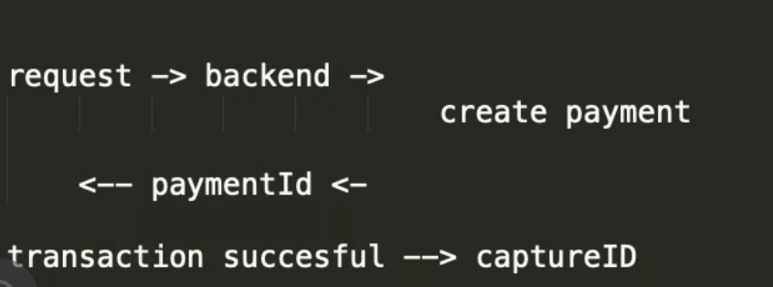
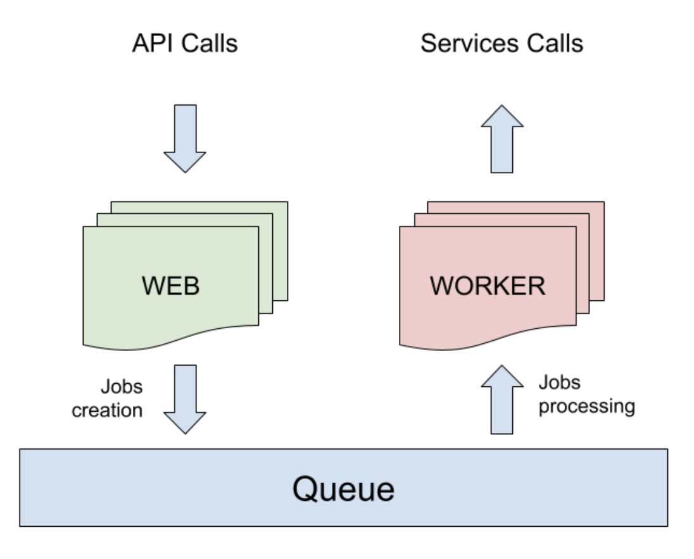
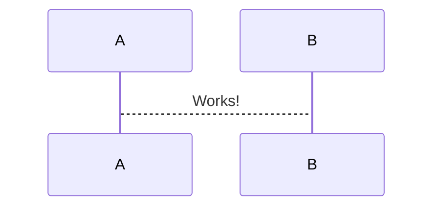

# Plugins

## Util

> Cluster

```js
var cluster = require('cluster'),
    app = require('./express-app');

var workers = {},
    count = require('os').cpus().length;

function spawn(){
  var worker = cluster.fork();
  workers[worker.pid] = worker;
  return worker;
}

if (cluster.isMaster) {
  for (var i = 0; i < count; i++) {
    spawn();
  }
  cluster.on('death', function(worker) {
    console.log('worker ' + worker.pid + ' died. spawning a new process...');
    delete workers[worker.pid];
    spawn();
  });
} else {
  app.listen(process.env.PORT || 5000);
}
```

> uuid

* Create randomly generated key

> axios

* Promise based HTTP client for the browser and node.js

> celebrate

* Form validation logic

```js
import { Joi, celebrate } from "celebrate";
const SaleValidation = Joi.object()
    .keys({
        name: Joi.string().min(1).max(10).required(),
        amount: Joi.number().min(0).optional(),
        percent: Joi.number().min(0).max(1).optional(),
    })
    .or("amount", "percent")
    .nand("amount", "percent");

export default {
    saleAdd: celebrate({ body: BuyFormValidation, }),
    saleGet: celebrate({ params: { name: Joi.string().min(1).max(10).required() } }),
    saleUpdate: celebrate({ params: { uuid: Joi.string().guid({ version: "uuidv4" }).required() } }),
    saleDelete: celebrate({ params: { uuid: Joi.string().guid({ version: "uuidv4" }).required() } }),
};
```

> Types

```js
const schema = Joi.object().keys({
  type: Joi.string().valid('ios', 'android'),
});
```

## Deployment

> Terms

* Frontend Service
  * AWS S3 + AWS CloudFront
  * Google Cloud Storage + Google Cloud CDN
  * GitHub Pages + CloudFlare
  * Now
  * Surge
  * Netlify

* Backend
  * AWS Elastic beanstalk or AWS EC2
  * Google App Engine
  * Now
  * Heroku

* Horizontal scaling
  * stateless and share nothing
  * Any data that needs to persist must be stored in a stateful backing, typically a database

> Firebase

```js
const functions = require("firebase-functions");
const admin = require("firebase-admin");

admin.initializeApp();
const express = require("express");
const app = express();

app.get("/screams", (req, res) => {
  admin.firestore().collection("spots").get()
    .then(data => {
      let screams = [];
      data.forEach(doc => {
        screams.push(doc.data());
      });
      return res.json(screams);
    })
    .catch(err => console.error(err));
});

app.post("/scream", (req, res) => {
  const newScream = {
    body: req.body.body,
    userHandle: req.body.userHandle,
    createdAt: admin.firestore.Timestamp.fromDate(new Date())
  };

  admin
    .firestore()
    .collection("spots")
    .add(newScream)
    .then(doc => {
      res.json({
        message: `document ${doc.id} created successfully`
      });
    })
    .catch(err => {
      res.status(500).json({
        error: "something went wrong"
      });
    });
});

exports.api = functions.https.onRequest(app);
```

> elastic beanstalk

* eb init --platform node.js --region us-east-2

> nginx

* load balancing traffic
* terminate SSL encryption and serve static files

> moment

```js
<script src="https://momentjs.com/downloads/moment.min.js"></script>

moment().format('YYYY-MM-DD HH:MM:SS')  // convert javascript date to string
moment(A).isSameOrAfter(B)

type: DataTypes.VIRTUAL,        // automatically set +3
get() {
  return moment(this.arrivalDate).add(3, "days");
},
```

> Postman

* current datetime

```js
"{{$timestamp}}"
```

* Preivous datetime

```js
var moment = require('moment')
pm.environment.set("today", moment().toISOString())
pm.environment.set("yesterday", moment().subtract(1, 'day').toISOString())

{{today}}
{{yesterday}}
```

> winston

* show full object

```js
import * as winston from "winston"
const { combine, timestamp, label, prettyPrint } = winston.format

const logger = winston.createLogger({
level: 'info',
format: combine(timestamp(), prettyPrint()),
transport: [
new winston.transport.File({ filename: 'error.log', level: 'error' }),
new winston.transport.File({ filename: 'combined.log' }),
]
})

export default logger
```

* show file name line number

```js
var winston = require("winston");
var path = require("path");
var PROJECT_ROOT = path.join(__dirname, "../../");

var transports = [];

if (process.env.NODE_ENV !== "development") {
transports.push(new winston.transports.Console());
} else {
transports.push(
new winston.transports.Console({
format: winston.format.combine(winston.format.cli(), winston.format.splat()),
}),
);
}
var logger = winston.createLogger({ transports: transports });
logger.stream = { write: function (message) { logger.info(message); } };
module.exports.debug = module.exports.log = function () { logger.debug.apply(logger, formatLogArguments(arguments)); };
module.exports.info = function () { logger.info.apply(logger, formatLogArguments(arguments)); };
module.exports.warn = function () { logger.warn.apply(logger, formatLogArguments(arguments)); };
module.exports.error = function () { logger.error.apply(logger, formatLogArguments(arguments)); };
module.exports.stream = logger.stream;

function formatLogArguments(args) {
args = Array.prototype.slice.call(args);
var stackInfo = getStackInfo(1);
if (stackInfo) {
// get file path relative to project root
var calleeStr =
"(" + stackInfo.relativePath + ":" + stackInfo.line + ")";

if (typeof args[0] === "string") {
args[0] = calleeStr + " " + args[0];
} else {
args.unshift(calleeStr);
}
}
return args;
}

// Parses and returns info about the call stack at the given index.
function getStackInfo(stackIndex) {
var stacklist = new Error().stack.split("\n").slice(3);

var stackReg = /at\s+(.*)\s+\((.*):(\d*):(\d*)\)/gi;
var stackReg2 = /at\s+()(.*):(\d*):(\d*)/gi;

var s = stacklist[stackIndex] || stacklist[0];
var sp = stackReg.exec(s) || stackReg2.exec(s);

if (sp && sp.length === 5) {
return {
method: sp[1],
relativePath: path.relative(PROJECT_ROOT, sp[2]),
line: sp[3],
pos: sp[4],
file: path.basename(sp[2]),
stack: stacklist.join("\n"),
};
}
}
```

> Input Type

* Request body
* almost any kind of HTTP request
* body editor is divided into 4 areas and has different controls depending on the body type

* form-data
* simulates filling a form on a website
* can attach files to a key as well

* urlencoded (default)
* key/value pairs and Postman will encode the keys and values properly

* raw
* doesn't touch string entered in raw editor except replacing environment variables

* binary
* allows you to send things which you can not enter in Postman
* image, audio or video files, text files

> paypal



> Error: write EPROTO 140421695491864:error:100000f7:SSL routines:OPENSSL_internal:WRONG_VERSION_NUMBER:../../third_party/boringssl/src/ssl/tls_record.cc:242:

* Use http instead https because SSL is not set up

> Nodecron



* Node.js is in practice single-threaded
* Communication methods
* priority queue (Kue is a common queue library)

> Nodecron

* Method
* expression string: Cron expression
* function Function: Task to be executed
* options Object: Optional configuration for job scheduling.
* Options
* scheduled: A boolean to set if the created task is schaduled. Default true;
* timezone: The timezone that is used for job scheduling

```js
var cron = require('node-cron');    // Starts the scheduled task.
var task = cron.schedule('* * * * *', () =>  {
console.log('stoped task');
}, {
scheduled: false
timezone: "America/Sao_Paulo"
});

task.start();         // The task won't be executed unless re-started.
var cron = require('node-cron');
var task = cron.schedule('* * * * *', () =>  {
console.log('will execute every minute until stopped');
});

task.stop();          // The task will be stopped and completely destroyed.
var cron = require('node-cron');
var task = cron.schedule('* * * * *', () =>  {
console.log('will not execute anymore, nor be able to restart');
});

task.destroy();       // Validate that the given string is a valid cron expression.
var cron = require('node-cron');
var valid = cron.validate('59 * * * *');
var invalid = cron.validate('60 * * * *');
```

> cheerio

* Cheerio parses markup and provides an API for traversing/manipulating the resulting data structure
* It does not interpret the result as a web browser does
* Specifically, it does not produce a visual rendering, apply CSS, load external resources, or execute JavaScript

## Database

> lodb

```js
// index.html
import express from 'express';
import { getInstagramCount, getTwitterCount } from './lib/scraper';
import db from './lib/db';
import './lib/cron';

const app = express();

app.get('/scrape', async (req, res, next) => {
console.log('Scraping!!');
const [iCount, tCount] = await Promise.all([
getInstagramCount(),
getTwitterCount(),
]);
res.json({ iCount, tCount });
});

app.listen(2093, () => {
console.log(`Example App running on port 2093`);
});

// lib/db.js
import low from 'lowdb';
import FileSync from 'lowdb/adapters/FileSync';

const adapter = new FileSync('db.json');
const db = low(adapter);
db.defaults({ twitter: [], instagram: [] }).write();
export default db;

// lib.cron.js
import cron from 'node-cron';
import { runCron } from './scraper';
cron.schedule('* * * * *', () => {
console.log('⏲️ RUNNING THE CRON');
runCron();
});

// lib/scraper.js
import axios from 'axios';
import cheerio from 'cheerio';
import db from './db';

export async function getHTML(url) {
const { data: html } = await axios.get(url);
}

export async function getInstagramFollowers(html) {
const $ = cheerio.load(html);
const dataInString = $('script[type="application/ld+json"]').html();
const pageObject = JSON.parse(dataInString);
return parseInt( pageObject.mainEntityofPage.interactionStatistic.userInteractionCount);
}

export async function getInstagramCount() {
const html = await getHTML('https://instagram.com/wesbos');
const instagramCount = await getInstagramFollowers(html);
return instagramCount;
}
export async function getTwitterCount() {
const html = await getHTML('https://twitter.com/wesbos');
const twitterCount = await getTwitterFollowers(html);
return twitterCount;
}

export async function runCron() {
const [iCount, tCount] = await Promise.all([ getInstagramCount(), getTwitterCount() ]);
db.get('twitter').push({
date: Date.now(),
count: tCount,
}).write();
db.get('instagram').push({
date: Date.now(),
count: iCount,
}).write();
console.log('Done!');
}
```

> Algolia

* Simple text search

```js
index.clearObjects()
```

> javascript - ReferenceError: algoliasearch is not defined 

* add cdn https://cdnjs.com/libraries/algoliasearch



## Sequelize

* Request from sequelize
* SQL Driver -> SQL Query -> DB
* Answer
* SQL Driver -> Sequelize -> Javascript Object

> Terms

* dialect: 'mysql'|'sqlite'|'postgres'|'mssql',

> Error

* error:   Error in loader, shutting down process Invalid default value for 'category'
* defaultValue: "None" not specified in ENUM values

* SequelizeDatabaseError: Unknown column 'Order.userID' in 'where clause'
* userId not present in Order, update db if udpated

* SequelizeDatabaseError: Column 'shippingFee' cannot be null
* update Table, migrate if not development server

* sequelize message: Column createdAt in where clause is ambiguous
* models.sequelize.col('User.createdAt'))

> Raw query

* query()

```js
logging: console.log  // logging your queries will get called for every SQL query that gets sent to the server.
plain: false,         // If plain is true, then sequelize will only return the first record of the result set. otherwise, return all records.

// replacement from string
const { QueryTypes } = require('sequelize');
await sequelize.query(
  'SELECT * FROM projects WHERE status = ?', { replacements: ['active'], type: QueryTypes.SELECT }
);

// replacement from map
await sequelize.query(
  'SELECT * FROM projects WHERE status = :status', { replacements: { status: 'active' }, type: QueryTypes.SELECT }
);

// Array replacements
await sequelize.query(
  'SELECT * FROM projects WHERE status IN(:status)', { replacements: { status: ['active', 'inactive'] }, type: QueryTypes.SELECT }
);

// nested=true
const { QueryTypes } = require('sequelize');
const records = await sequelize.query('select 1 as `foo.bar.baz`', {
  nest: true,
  type: QueryTypes.SELECT
});
console.log(JSON.stringify(records[0], null, 2));
{
  "foo": { "bar": { "baz": 1 } }
}

const [results, metadata] = await sequelize.query("UPDATE users SET y = 42 WHERE x = 12");
```

* literal()

```js
// SELECT m.* FROM Movies m WHERE NOT EXISTS(
//   SELECT NULL FROM Users_Movies sc WHERE sc.Id_Movies = m.id AND sc.Id_Users = 1)
Movie.findAll({
  where: sequelize.literal("users.id IS NULL"),
  include: { model: Users, through: { attributes: [] } } })
```

* Logging

```js
sequelize.sync({ logging: console.log }) // view the table creation queries
User.find(1, { logging: console.log })   // View query
```

### DDL

> Create

* Getter

```js
const User = sequelize.define('user', {
  // wanted to see every username in uppercase, even though they are not necessarily uppercase in the database itself
  username: {
    type: DataTypes.STRING,
    get() {
      const rawValue = this.getDataValue(username);
      return rawValue ? rawValue.toUpperCase() : null;
    }
  }
});
```

* Setter

```js
const User = sequelize.define('user', {
  username: DataTypes.STRING,
  password: {
    type: DataTypes.STRING,
    set(value) {
      this.setDataValue('password', hash(value));
    }
  }
});
```

* Virtual

```js
const { DataTypes } = require("sequelize");

const User = sequelize.define('user', {
  firstName: DataTypes.TEXT,
  lastName: DataTypes.TEXT,
  fullName: {
    type: DataTypes.VIRTUAL,
    get() {
      return `${this.firstName} ${this.lastName}`;
    },
    set(value) {
      throw new Error('Do not try to set the `fullName` value!');
    }
  }
});
```

> Update

* Drop column

```js
// ALTER TABLE "public"."Person" DROP COLUMN "petName";
queryInterface.removeColumn('Person', 'petName', { /* query options */ });
```

* Change data types

```js
// ALTER TABLE `Person` CHANGE `foo` `foo` FLOAT NOT NULL DEFAULT 3.14;
queryInterface.changeColumn('Person', 'foo', {
  type: DataTypes.FLOAT,
  defaultValue: 3.14,
  allowNull: false
});
```

> Relation

* A HasOne B association
    * 1-1 relationship exists between A and B
    * foreign key being defined target B

```js
User.hasOne(models.UserProfile, { foreignKey: { name: "userID", allowNull: false } });
```

* A BelongsTo B association
    * 1-1 relationship exists between A and B
    * foreign keys being defined in the source model (A).
    * should be added when we need an owner
    * Book.belongsTo(models.User)

```js
Match.belongsTo(models.User, {foreignKey: { name: "userID" } });
```

* A HasMany B association
    * 1-n relationship exists between A and B, 
    * foreign key being defined in the target model (B).

```js
db.food.hasMany(db.meal, {as : 'Food', foreignKey : 'foodID'});
```

* A BelongsToMany B association
    * n-n relationship exists between A and B, using table C as junction table
    * Table C has the foreign keys (aId and bId, for example)
    * Sequelize will automatically create this model C (if not exists) and define appropriate foreign keys on it

```js
import { DataTypes, Model, Sequelize } from "sequelize";

export default (sequelize: Sequelize) => {
  class Match extends Model {
    static associate(models): void {
      Match.belongsTo(models.User, {
        foreignKey: { name: "userID" }
      });
      Match.belongsTo(models.Room, {
        foreignKey: { name: "roomID", allowNull: false }
      });
    }
  }
  return Match.init({
      id: {
        type: DataTypes.UUID,
        defaultValue: DataTypes.UUIDV4,
        primaryKey: true,
      },
    },
    { sequelize, modelName: "Match", ...modelOptions["general"] },
  );
};
```

> Constraints

* allowNull
  * an attempt is made to set null to a field that does not allow null, a ValidationError will be thrown without any SQL query being performed.
  * after sequelize.sync, column with "allowNull: false" will be defined with a NOT NULL SQL constraint
  * So, direct SQL queries that attempt to set the value to null will also fail.

```js
/* ... */ {
  username: {
    type: DataTypes.TEXT,
    allowNull: false,
    unique: true
  },
} /* ... */
```

### READ

> sequelize functions

* find, findOrCreate

```js
// findByPk()
const project = await Project.findByPk(123);
if (project === null) {
  console.log('Not found!');
} else {
  console.log(project instanceof Project); // true
}

// findOrCreate()
const [user, created] = await User.findOrCreate({
  where: { username: 'sdepold' },
  defaults: {
    job: 'Technical Lead JavaScript'
  }
});
```

* findAndCountAll

```js
// findAndCountAll(
//     count, // an integer - the total number records matching the query
//     rows   // an array of objects - the obtained records
// )
const { count, rows } = await Project.findAndCountAll({
  where: {
    title: {
      [Op.like]: 'foo%'
    }
  },
  offset: 10,
  limit: 2
});
console.log(count);
console.log(rows);
```

* findAll

```js
// SELECT foo, bar AS baz, qux FROM ...
Model.findAll({
  attributes: ['foo', ['bar', 'baz'], 'qux']
});

// SELECT foo, COUNT(hats) AS n_hats, bar FROM ...
Model.findAll({
    // equivalent, useful when many values
    // { include: [ [sequelize.fn('COUNT', sequelize.col('hats')), 'n_hats'] ]
    attributes: [ 'foo', [sequelize.fn('COUNT', sequelize.col('hats')), 'n_hats'], 'bar' ]
  });

// SELECT id, foo, bar, qux FROM ... (Assuming all columns are 'id', 'foo', 'bar', 'baz' and 'qux')
Model.findAll({
  attributes: { exclude: ['baz'] }
});

CustomerAccount.findAll({
  attributes: [
    'uuid',
    'account_name',
    'account_number',
    'emergency_pay',
    [Sequelize.fn('SUM', Sequelize.col('customer_accounts_services.invoice_amount')), 'totalInvoiceAmount'],
    [Sequelize.fn('SUM', Sequelize.col('customer_accounts_services.core_amount')), 'totalCoreAmount']
  ],
  include: [
    {
      model: CustomerAccountService,
      attributes: []
    }
  ],
  group: ['CustomerAccount.uuid']
}).then(...);
```

* Sum

```js
// Let's assume 3 person objects with an attribute age. 10, 5 40
Project.sum('age').then(sum => {
  // this will return 55
})

Project.sum('age', { where: { age: { [Op.gt]: 5 } } }).then(sum => {
  // will be 50
})
```

> Where

```js
// SELECT * FROM post WHERE authorId = 2
Post.findAll({
  where: {
    authorId: 2   // [Op.eq]: 2 
  }
});

// SELECT * FROM post WHERE authorId = 12 AND status = 'active';
Post.findAll({
  where: {
    authorId: 12
    status: 'active'
  }
});

// mysql
// SELECT file_id FROM table WHERE datediff(curdate(), create_date) > 5; 
{ 
  where: sequelize.where(sequelize.fn('datediff', sequelize.fn("NOW") , sequelize.col('create_date')), {
    [Op.gt] : 5
  })
}
```

> Operator

```js
const { Op } = require("sequelize");
Post.findAll({
  where: {
    [Op.and]: [{ a: 5 }, { b: 6 }],            // (a = 5) AND (b = 6)
    [Op.or]: [{ a: 5 }, { b: 6 }],             // (a = 5) OR (b = 6)
    someAttribute: {
      [Op.eq]: 3,                     // = 3
      [Op.ne]: 20,                    // != 20
      [Op.gt]: 6,                     // > 6
      [Op.gte]: 6,                    // >= 6
      [Op.lt]: 10,                    // < 10
      [Op.lte]: 10,                   // <= 10
      [Op.between]: [6, 10],          // BETWEEN 6 AND 10
      [Op.notBetween]: [11, 15],      // NOT BETWEEN 11 AND 15

      // Using dialect specific column identifiers (PG in the following example):
      [Op.col]: 'user.organization_id',        // = "user"."organization_id"

      [Op.is]: null,                  // IS NULL
      [Op.in]: [1, 2],                // IN [1, 2]
      id: [1,2,3]                     // Same as using `id: { [Op.in]: [1,2,3] }`
      [Op.all]: sequelize.literal('SELECT 1'), // > ALL (SELECT 1)
      [Op.not]: true,                 // IS NOT TRUE
      [Op.notIn]: [1, 2],             // NOT IN [1, 2]
      [Op.or]: [5, 6],                // (someAttribute = 5) OR (someAttribute = 6)

      [Op.like]: '%hat',              // LIKE '%hat'
      [Op.notLike]: '%hat',           // NOT LIKE '%hat'
      [Op.startsWith]: 'hat',         // LIKE 'hat%'
      [Op.endsWith]: 'hat',           // LIKE '%hat'
      [Op.substring]: 'hat',          // LIKE '%hat%'
      [Op.iLike]: '%hat',             // ILIKE '%hat' (case insensitive) (PG only)
      [Op.notILike]: '%hat',          // NOT ILIKE '%hat'  (PG only)
      [Op.regexp]: '^[h|a|t]',        // REGEXP/~ '^[h|a|t]' (MySQL/PG only)
      [Op.notRegexp]: '^[h|a|t]',     // NOT REGEXP/!~ '^[h|a|t]' (MySQL/PG only)
      [Op.iRegexp]: '^[h|a|t]',       // ~* '^[h|a|t]' (PG only)
      [Op.notIRegexp]: '^[h|a|t]',    // !~* '^[h|a|t]' (PG only)
      [Op.any]: [2, 3],               // ANY ARRAY[2, 3]::INTEGER (PG only)

      // In Postgres, Op.like/Op.iLike/Op.notLike can be combined to Op.any:
      [Op.like]: { [Op.any]: ['cat', 'hat'] }  // LIKE ANY ARRAY['cat', 'hat']
    }
  }
});
```

* Grouping

```js
Subtask.findAll({
  order: [
    ['title', 'DESC'],      // escape title and validate DESC against a list of valid direction parameters
    sequelize.fn('max', sequelize.col('age')),            // order by max(age)
    [sequelize.fn('max', sequelize.col('age')), 'DESC'],  // Will order by max(age) DESC

    [sequelize.fn('otherfunc', sequelize.col('col1'), 12, 'lalala'), 'DESC'],    // Will order by  otherfunc(`col1`, 12, 'lalala') DESC

    [Task, 'createdAt', 'DESC'],              // order an associated model's createdAt using the model name as the association's name.
    ['Task', 'createdAt', 'DESC'],            // order by an associated model's createdAt using the name of the association.

    [Task, Project, 'createdAt', 'DESC'],     // order through an associated model's createdAt using the model names as the associations' names.
    ['Task', 'Project', 'createdAt', 'DESC'], // order by a nested associated model's createdAt using the names of the associations.

    [{model: Task, as: 'Task'}, 'createdAt', 'DESC'],   // order by an associated model's createdAt using a association object.
    [Subtask.associations.Task, 'createdAt', 'DESC'],   // order by an associated model's createdAt using an association object. (preferred)
    [{model: Task, as: 'Task'}, {model: Project, as: 'Project'}, 'createdAt', 'DESC']   // order by a nested associated model's createdAt association objects.
    [Subtask.associations.Task, Task.associations.Project, 'createdAt', 'DESC'],        // order by a nested associated model's createdAt using association objects. (preferred)
  ],

  order: sequelize.literal('max(age) DESC'),        // order by max age descending
  order: sequelize.fn('max', sequelize.col('age')), // order by max age ascending assuming ascending is default order when direction is omitted
  order: sequelize.col('age'), // order by age ascending assuming ascending is default order when direction is omitted
  order: sequelize.random()    // order randomly based on the dialect (instead of fn('RAND') or fn('RANDOM'))
});

Foo.findOne({
  order: [
    ['name'],               // will return `name`
    ['username', 'DESC'],   // will return `username` DESC
    sequelize.fn('max', sequelize.col('age')),            // return max(`age`)
    [sequelize.fn('max', sequelize.col('age')), 'DESC'],  // return max(`age`) DESC
    [sequelize.fn('otherfunction', sequelize.col('col1'), 12, 'lalala'), 'DESC'],                  // will return otherfunction(`col1`, 12, 'lalala') DESC
    [sequelize.fn('otherfunction', sequelize.fn('awesomefunction', sequelize.col('col'))), 'DESC'] // will return otherfunction(awesomefunction(`col`)) DESC, This nesting is potentially infinite!
  ]
});
```

### Join

* Basic

```js
// SELECT board.id, COUNT(board_comments.id) AS commentCount FROM board
//   JOIN board_comments ON board.id = board_comments.boardID
BoardModel.findAndCountAll({
  subQuery: false,
  attributes: [[ sequelize.fn("COUNT", sequelize,col('board_comments.id')), 'commentCount']],
  include: [ {model: BoardCommentModel, attributes: [] }]
})
```

* subQuery

```js
// SELECT *, ( SELECT COUNT(*) FROM reactions AS reaction
//     WHERE reaction.postId = post.id AND reaction.type = "Laugh") AS laughReactionsCount
//   FROM posts AS post
Post.findAll({
  attributes: {
    include: [
      [ // Note the wrapping parentheses in the call below!
        sequelize.literal(`( SELECT COUNT(*) FROM reactions AS reaction WHERE reaction.postId = post.id AND reaction.type = "Laugh")`),
        'laughReactionsCount'
      ]
    ]
  },
  order: [
    [sequelize.literal('laughReactionsCount'), 'DESC']
  ]
});
```

> LEFT OUTER JOIN

* (defualt)
* only includes records from the parent table

```js
// SELECT parent.id, parend.name, child.id, child.name FROM parent
//   LEFT OUTER JOIN child ON child..parent = parent.id;
Parent.findAll({
  include: [ { model: Child } ]
});
```

* where

```js
Albums.findAll({
  include: [{
    model: Artists,
    as: 'Singer',
    where: { name: 'Al Green' }
  }]
})
```

* Referring to other columns
  * [NOTE] if hasMany, put user plural model name

```js
// SELECT * FROM user JOIN task ON 
//   WHERE task.name = 'foobar'
User.findAll({
  include: [Task],
  where: { '$task.name$': 'foobar' }
});

// SELECT * FROM project JOIN task ON
//   WHERE task.state == project.state
Project.findAll({
  include: {
    model: Task,
    where: { state: Sequelize.col('project.state') }
  }
})
```

* RIGHT OUTER JOIN
  * right: true

* LEFT OUTER JOIN
  * required: false

```js
// SELECT [...] FROM `users` AS `user`
//    LEFT OUTER JOIN `tools` AS `Instruments` ON `user`.`id` = `Instruments`.`userId` AND `Instruments`.`size` != 'small';
await User.findAll({
  include: {
    model: Tool,
    as: 'Instruments',
    where: { size: { [Op.ne]: 'small' } },
    required: false
  }
});
```

* INNER JOIN
  * required: true (default)

```js
// SELECT `user`.`id`, `user`.`name`, `Instruments`.`id` AS `Inst.id`, `Instruments`.`name` AS `Inst.name`, `Instruments`.`size` AS `Instr.size`, `Instruments`.`userId` AS `Inst.userId` FROM `users` AS `user`
//    INNER JOIN `tools` AS `Inst` ON `user`.`id` = `Inst`.`userId` AND `Inst`.`size` != 'small';

User.findAll({
  include: {
    model: Tool,
    as: 'Instruments'
    where: {
      size: { [Op.ne]: 'small' }
    }
  }
});
```

### Nested

* Sequelize help the main (larger query) but you will still have to write that sub-query by yourself

```js
// SELECT *, (SELECT COUNT(*) FROM reactions AS reaction
//            WHERE reaction.postId = post.id AND reaction.type = "Laugh") AS laughReactionsCount
// FROM posts AS post

Post.findAll({
  attributes: {
    include: [[
        sequelize.literal(`( SELECT COUNT(*)
                             FROM reactions AS reaction
                             WHERE reaction.postId = post.id AND reaction.type = "Laugh")`),
                             'laughReactionsCount'
      ]]
  }
});

// SELECT * FROM characteristic 
//   WHERE characteristic_id = 1 and characteristic_id in (
//     select characteristic_id from characteristic_variant_val where rel_type = 'variant')
characteristic_id : {
  $in: [clout.sequelize.literal('select characteristic_id from characteristic_variant_val'))]
}
```


### Update

```js
// Change everyone without a last name to "Doe"
await User.update({ lastName: "Doe" }, {
  where: {
    lastName: null
  }
});

// UPDATE post SET updatedAt = null WHERE deletedAt NOT NULL;
Post.update({
  updatedAt: null,
}, {
  where :{
    deletedAt: {
      [Op.ne]: null
    }
  }
})

// Toggle boolean
{
  where: { id },
  params: { finish: Sequelize.literal("NOT finish") },
}
```

### Delete

```js
// Delete everyone named "Jane"
await User.destroy({
  where: { firstName: "Jane" }
});

// DELETE FROM post WHERE status = "inactive"
Post.destroy({
  where: {
    status: 'inactive'
  }
});
```

> TypeDI

```js
import Container from "typedi"
Container.get(TypeService);  
```

## Express

* Basic Example

```js
const express = require('express');
const PORT = process.env.HTTP_PORT || 4001;
const app = express();
app.get('/', (req, res) => {
  res.send('flowers smell nice');
});
app.listen(PORT, () => {
  console.log(`Server listening at port ${PORT}.`);
});
```

### Router

* Require version 4

```js
const app = require('express');
const adminRouter = app.Router();

adminRouter.use(isAdmin);
adminRouter.get('/', admin.index); /* will resolve to /admin */
adminRouter.post('/post', csrf, admin.index); /* will resolve to /admin/post */

app.use('/admin', adminRouter); 

app.use('/admin', AdminMiddleware);
app.get('/admin/route1', ... 
app.get('/admin/route2', ... 

app.use('/user', UserMiddleware);
app.get('/user/route1', ...
app.get('/user/route2', ...
```