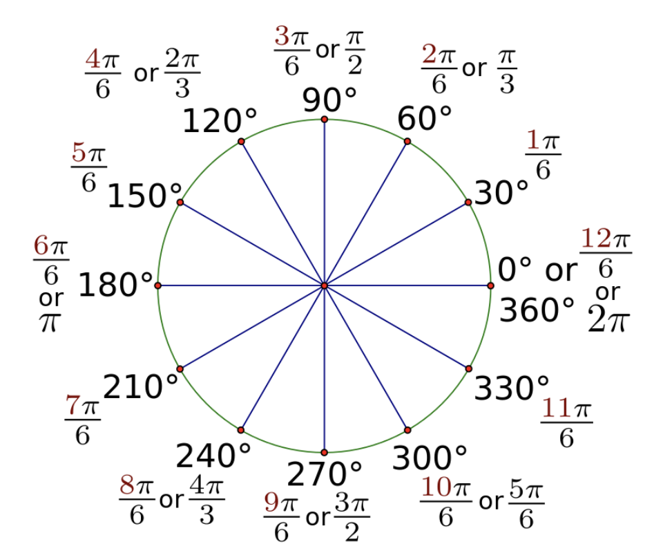
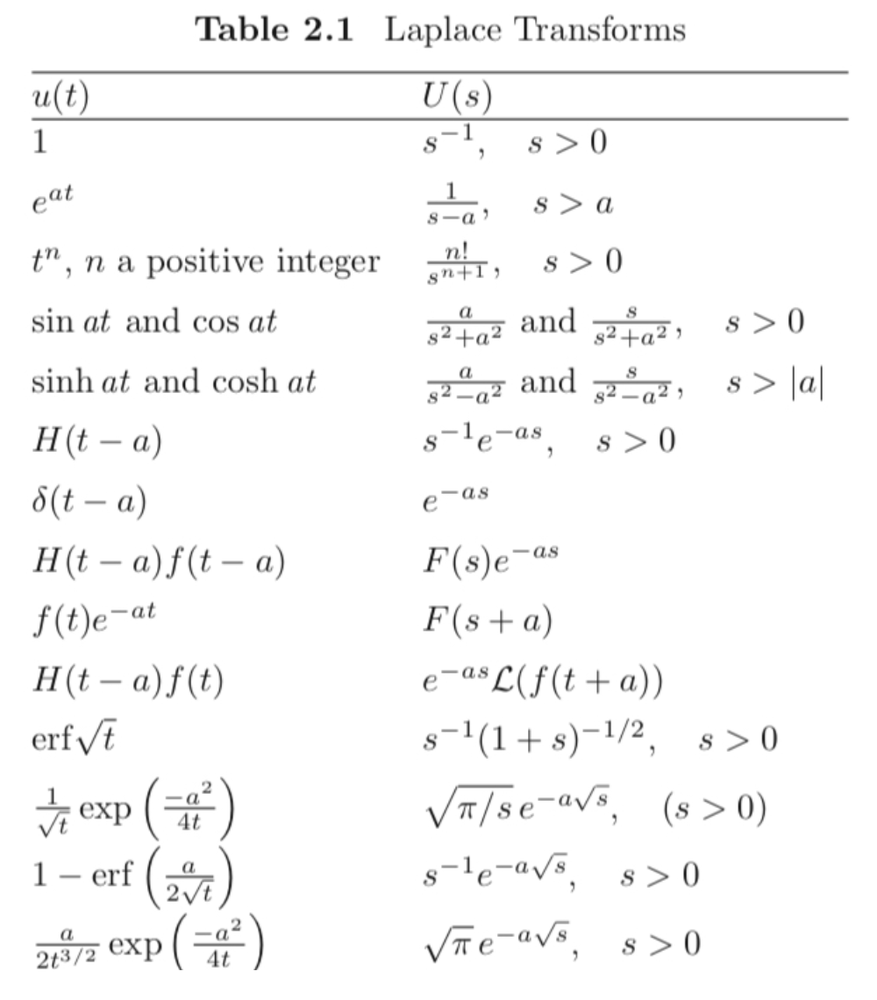
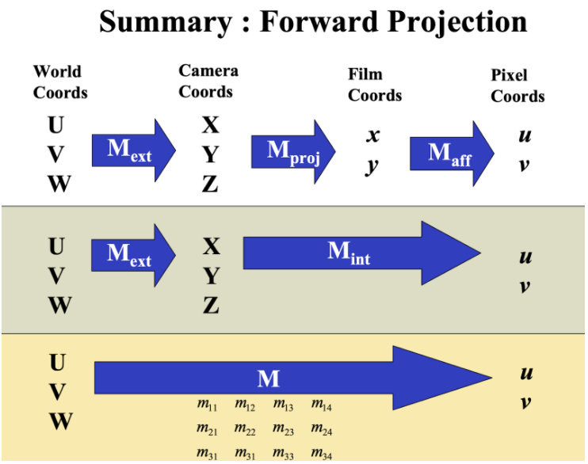

# Math

## Algebra

* Youtube

[Absolute value](https://www.youtube.com/watch?v=r6hS_8nm1jM)

### Operation

> Addition

[Basic Multiplication](https://www.youtube.com/watch?v=mvOkMYCygps)

[Multiplication table](https://www.youtube.com/watch?v=xO_1bYgoQvA&list=PLD45913551291638C)

> Subtraction

> Multiplication

[- * - is positive 1](https://www.youtube.com/watch?v=rK4sXm_MPWo)

[- * - is positive 2](https://www.youtube.com/watch?v=pzQY-9Nmtws)

[Order of operation 2](https://www.youtube.com/watch?v=ClYdw4d4OmA)

[Order of operation 2](https://www.youtube.com/watch?v=GiSpzFKI5_w)

[Subtract](https://docs.google.com/forms/d/1pLBK2MS25YizpvRDLHQBYfWsFvH1Vxq1mI56Q8BC5X8/edit)

[Multiply 1](https://docs.google.com/forms/d/1ggcgV1g-E0RV6QLgD3Ynnb6uJi3ooaLtQkUhH4fozaU/edit)

[Multiply 2](https://docs.google.com/forms/d/1TEBH7EzTysw_BeXxltjpFevm5leHWtw_oIDLG3Yg5Ro/edit)

> Division

[Idea of Division](https://www.youtube.com/watch?v=QI6x0KNxiCs)

[Multiplication to division](https://www.youtube.com/watch?v=qcMJ1pN36r4)

[Dividing 0](https://www.youtube.com/watch?v=SQzjzStU1RQ)

[Divising negative](https://www.youtube.com/watch?v=bQ-KR3clFgs)

[Unknowns Multiplication](https://www.youtube.com/watch?v=TqAtt3g6Tkc)

[Division](https://www.youtube.com/watch?v=Ws4Zq-gceSY)

[Division](https://www.youtube.com/watch?v=KFzcwWTEDDI)

[Remainder](https://www.youtube.com/watch?v=P1qyjdh_sIw)

[Adding fraction](https://www.youtube.com/watch?v=bcCLKACsYJ0)

[Improper Fraction](https://www.youtube.com/watch?v=-sA-vI2a2mM)

[Comparing Fraction](https://www.youtube.com/watch?v=8OKTrN0uT-Q)

[Addming mixed number](https://www.youtube.com/watch?v=4TBVB4hLQhY)

* Test

[division](https://docs.google.com/forms/d/1PdTSZzBfQMEk-0gK228MSYCfsFA3N1-oJEYEYoNm8TY/edit)

[quotient](https://docs.google.com/forms/d/1aUwp8EZpKeSLwDnXXM5QJQD4FIyqCi5MYWwfBhZV8FQ/edit)

> Exponent

[Intro to Exponent](https://www.youtube.com/watch?v=XZRQhkii0h0)

[Negative Exponent](https://www.youtube.com/watch?v=JnpqlXN9Whw)

[Fractional Exponent](https://www.youtube.com/watch?v=tOuCdKqO6-s)

[Square Root](https://www.youtube.com/watch?v=mbc3_e5lWw0)

[Cube Root](https://www.youtube.com/watch?v=87_qIofPwhg)

* Test

[exponent](https://docs.google.com/forms/d/1oTC8TfBk8CDKimLdeHVR_wz6cDxYhJjC0IYbDwEO2PU/edit)

[Prime](https://docs.google.com/forms/d/1-IziMX_y-CI5tHumG3OIhRhsdDLLQtkTb8DCzSTSEOI/edit)

### Equation

[What is a function?](https://www.youtube.com/watch?v=kvGsIo1TmsM)

[Linear Equation 1](https://www.youtube.com/watch?v=_y_Q3_B2Vh8)

[Linear Equation 2](https://www.youtube.com/watch?v=AOxMJRtoR2A)

* Test

[Variable](https://docs.google.com/forms/d/1Mue_sBppqzcez70ukrU_N66nqM3WJPh1T5x3Q66YjZM/edit)

### Binary

* Youtube

[Binary](https://www.youtube.com/watch?v=ku4KOFQ-bB4)

[Decimal to Binary](https://www.youtube.com/watch?v=H4BstqvgBow)

[Adding in binary](https://www.youtube.com/watch?v=RgklPQ8rbkg)

[Multiplying in binary](https://www.youtube.com/watch?v=xHWKYFhhtJQ)

[Hexadecimal](https://www.youtube.com/watch?v=4EJay-6Bioo)

[Bin to Hex](https://www.youtube.com/watch?v=8T4F7WboWPQ)

* Test

[Bit](https://docs.google.com/forms/d/1o4hD5qOYlRfdoVcmeWQ83jBpngrnI2Cq6UUB8ULzaYA/edit)

### Geometry

* Radian degree conversion

$$
b(d e g)=180 \cdot a(r a d) \mid \pi
$$

$$
a(r a d)=\pi \cdot b(d e g) \mid 180
$$

```py
def dist_point2point(p1, p2):
    """Calculate distance between p1, p2.

    Args:
        p1 (float, float): coordinates of p1
        p2 (float, float): coordinates of p2

    Returns:
        float: distance
    """
    return ((p2[1] - p1[1]) ** 2 + (p2[0] - p1[0]) ** 2) ** 0.5

def general_two_point(p1, p2):
    a = p1[1] - p2[1]
    b = p2[0] - p1[0]
    c = (p1[0] - p2[0]) * p1[1] + (p2[1] - p1[1]) * p1[0]

    norm = (a ** 2 + b ** 2) ** 0.5

    return (a / norm, b / norm, c / norm)

def dist_point2segment(q, p1, p2):
    x1, y1 = p1
    x2, y2 = p2
    x3, y3 = q

    dx = x2 - x1
    dy = y2 - y1

    if dx == 0 and dy == 0:
        return -1, -1

    u = ((x3 - x1) * dx + (y3 - y1) * dy) / (dx * dx + dy * dy)
    u = min(1, max(0, u))

    return x1 + u * dx, y1 + u * dy

def distance_point_segment(q, p1, p2):
    return dist_point2point(dist_point2segment(q, p1, p2), q)

def computeDistancePointToPolygon(P, q):
    if len(P) < 3:
        raise(Exception("Polygon must have more than 2 vertices"))

    minDist = float('inf')
    for i in range(len(P)):
        minDist = min(minDist, distance_point_segment(
            q, P[i], P[(i + 1) % len(P)]))

    return minDist
```

* Intersect

```py
def computeTangentVectorToPolygon(P, q):
    minDist = computeDistancePointToPolygon(P, q)
    indices = []

    for i in range(len(P)):
        if minDist == distance_point_segment(q, P[i], P[(i + 1) % len(P)]):
            indices.append(i)

    if len(indices) == 2:
        px, py = P[indices[1]] if distance(q, P[indices[1]]) < distance(
            q, P[(indices[1] + 1) % len(P)]) else P[(indices[1] + 1) % len(P)]
        qx, qy = q
        dx = qx - px
        dy = qy - py
        x = -dy
        y = dx
        norm = (x ** 2 + y ** 2) ** 0.5
        return x / norm, y / norm
    else:
        a, b, c = computeLineThroughTwoPoints(
            P[indices[0]], P[(indices[0] + 1) % len(P)])
        return b, -a

def isPointInPolygon(q, Ps):
    for i in range(1, len(Ps)):
        x0, y0 = q
        x1, y1 = Ps[i - 1]
        x2, y2 = Ps[i]

        v1 = np.array([-(y2 - y1), x2 - x1])
        v2 = np.array([x0 - x1, y0 - y1])
        if (np.dot(v1, v2) >= 0):
            return True
    return False

def isLineIntersect(p1, p2, p3, p4):
    x1, y1 = p1
    x2, y2 = p2
    x3, y3 = p3
    x4, y4 = p4
    num = (x4 - x3) * (y1 - y3) - (y4 - y3)(x1 - x3)
    den = (y4 - y3) * (x2 - x1) - (x4 - x3)(y2 - y1)

    if num == 0 and den == 0:
        print("Two lines coincide")
        return True
    elif num != 0 and den == 0:
        print("Two lines are parallel")
        return False
    elif num != 0 and den != 0:
        return True

    return False

def calculateShortestPoint(q, p1, p2):
    x1, y1 = p1
    x2, y2 = p2
    x3, y3 = q

    dx = x2 - x1
    dy = y2 - y1

    if dx == 0 and dy == 0:
        return -1, -1

    u = ((x3 - x1) * dx + (y3 - y1) * dy) / (dx * dx + dy * dy)
    u = 1 if u > 1 else 0
    return x1 + u * dx, y1 + u * dy

def isPolygonIntersect(P1, P2):
    N = len(P1)
    M = len(P2)
    for q in P1:
        if isPointInPolygon(q, P2):
            return True

    for i in range(len(P1)):
        for j in range(len(P2)):
            if isLineIntersect((P1[i], P1[(i + 1) % N]), (P2[j], P2[(j + 1) % M])):
                return True

    return False
```

### Trigometry



### Number

* Youtube

[Prime numbers](https://www.youtube.com/watch?v=mIStB5X4U8M)

[Prime Factorization](https://www.youtube.com/watch?v=XWq8bplP-_E)

[GCD](https://www.youtube.com/watch?v=bLTfBvkrfsM)

[LCM 1](https://www.youtube.com/watch?v=znmPfDfsir8)

[LCM 2](https://www.youtube.com/watch?v=QUem_2dkB9I)

[LCM 3](https://www.youtube.com/watch?v=D6yHKOYJiso)

## Calculus

> Derivative

* chain rule

```sh
f ○ g
```

> Integral

* Area of revolution

$$
S=\int_{a}^{b} 2 \pi f(x) \sqrt{1+\left[f^{\prime}(x)\right]^{2}} d x
$$

> Laplace



## Linear Algebra

### Coordinate Systems



> Terms

```sh
E   # Essential matrix
F   # Fundametal matrix
q   # pixel coordinate
```
