# Engineering

## Negative Sampling
* train models that generally have several order of magnitudes more negative than positive one

## Static Dynamic Training

> Static Training

* You can verify the model before applying it in production

> Dynamic Training

* model stays up to date as new data arrives

## Offline Online

> Offline

* [+] Make all possible predictions in a batch, using a mapreduce or similar.
* [+] Write to a table, then feed these to a cache|lookup table
* [-] long tail → can only predict things we know tail
* [-] update latency likely measured in hours or days

> Online

* Predict on demand, using a server
* [+] can predict any new item as it comes
* [-] monitoring needs are more intensive

## Dynamic Sampling
* Minlong Lin, 2013

$$
P\left(X^{!}\right)=1.0-P\left(\frac{X}{\text { Sum of Candidates }}^{0.7}\right)
$$


# Deep Learning

* Neural networks become deep neural networks if it contains two or more hidden layers
* Zhou, Boris proved Neural Network can approximate any convex continuous function

> If a model has low loss in the training data but poor on test, what should you do? 

* implement L2 regularization on the weights
* decrease the number of hidden units in the model

> Overfitting?

* a network is learning features in the train data not useful in generalizing predictions to the holdout set

> Which activation functions for the hidden units might cause vanishing gradients?

* Tanh, sigmoid (Not relu)

> Why should bias be added?

* Without b the line always goes through the origin (0, 0) and you may get a poorer fit. When x = 0.

## Terms

> Auto-encoder

* denoise auto-encoder to make robust
* learn efficient data encodings in an unsupervised manner

> Epoch

* one forward pass and one backward pass of all the training examples

> Batch

* number of training examples in one forward/backward pass. higher batch size needs more memory space

> Iteration

* Number of passes each pass using number of examples

> Normalization

* inputs and each hidden unit throughout the network, on a per-unit basis, over each minibatch

> Fine-tuning

* process in which the parameters of a trained model must be adjusted very precisely
* to validate that model taking into account a small data set that does not belong to the train set.

> Inception

* CNN uses convolutions kernels of multiple sizes as well as pooling within one layer

> Internal representation (Rumelhart, 87)

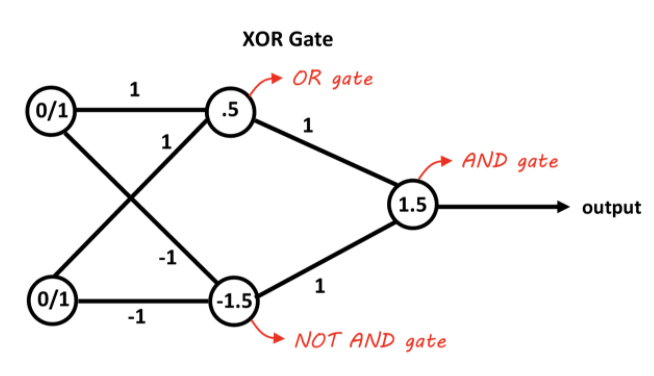


> Graph Neural Netwrok (GNN)

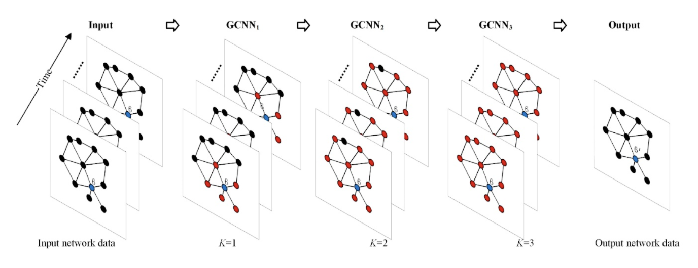

## Activation Function

* non-linear, differentiable
* multi-class situation vs binary situation
* One hot encoding

> non-exclusive vs mutually exclusive

* sum of all probabilities will be equal to one

> Linear


$$
g(a) = a
$$

* no matter how many layers it had, it will behave just like a single-layer perceptron

## Gradient Descent

> Delta Rule

$$
\Delta w_{ij}^p = \eta \delta_j^p a_i^p%0
$$

$$
\delta_{j}^{p}=\frac{\partial J^{p}}{\partial a_{j}^{p}}=\sum_{k} \frac{\partial J^{p}}{\partial a_{k}^{p}} \frac{\partial a_{k}^{p}}{\partial a_{j}^{p}}=\sum_{k} \delta_{k}^{p} w_{j k}
$$

> Deep Learning

$$
\frac{\partial E}{\partial a_{j}}=\sum_{k} \frac{\partial E}{\partial a_{k}} \frac{\partial a_{k}}{\partial a_{j}}
$$

$$
=-\sum_{k} \delta_{k} \frac{\partial a_{k}}{\partial z_{j}} \frac{\partial z_{j}}{\partial a_{j}}
$$

$$
=-\frac{\partial z_{j}}{\partial a_{j}} \sum_{k} \delta_{k} \sum_{i} \frac{\partial w_{i k} z_{i}}{\partial z_{j}} 
$$

$$
=-g^{\prime}\left(a_{j}\right) \sum_{k} \delta_{k} w_{j k}
$$


> Adaptive learning rate

* Increase local gain if the gradient for that weight doesn't change the sign
* Limit the gains to lie in some reasonable range
* Use full batch learning or big mini-batches

> Momentum

* The magnitudes of the gradients can be different for different layers, especially if small initial weights 

* Standard 
    * standard momentum method first computes the gradient at the current location 
    * then takes a big jump in the direction of the updated accumulated gradient. 
* Nesterov
    * Nesterov momentum first makes a big jump in the direction of the previously accumulated gradient. 
    * Then measure the gradient where you end up and make corrections.

> L1 Normalization

$$
L 1(W)=\sum_{k} \sum_{l}\left|W_{k, l}\right|
$$

> L2 Normalization

$$
L 2(W)=\sum_{k} \sum_{l} W_{k, l}^{2}
$$

## Training

> Analyze datao

* look for class imbalance, misclassified labels, duplicate data.
* spatial position matter

> Visualize features

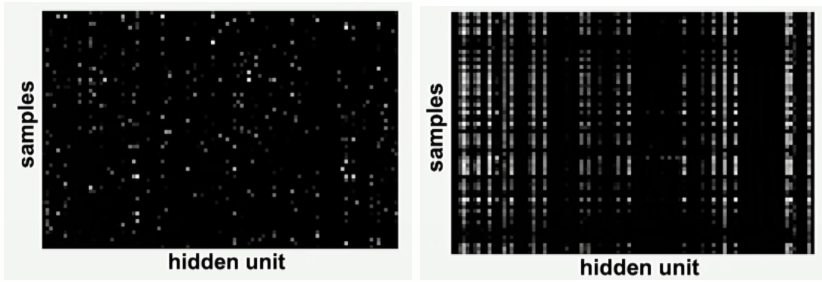

* Feature maps need to be uncorrelated and have high variance. 
* Hidden units are sparse across samples and across features.

> Starts with simple baseline

* Fix random seed → stable.
* Simplify - turn off data augmentation.
* Add significant digits to your eval, verify loss @ init. 
* human baseline → annotate label and prediction
* Overfit one batch to see if you can achieve 0 loss.
* Measure error on both training and validation set. 
* use backprop to chart dependencies

> Overfit

* Pick a known model
* Adam is safe → try with 3e-4

> Regularize

* Get more data. Data augmentation
* Pretrain data. 
* Decrease batch size. 
* Dropout, weight decay, early stop
* Try a larger model → early stopped performance of larger often be better.

## RNN

> Map time into space

* Auto regressive model
    * Linear model
    * Predict the next term in a sequence from a fixed number of previous terms using delay taps.

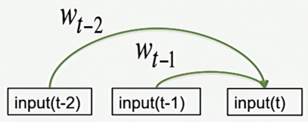

* Feed-Forward neural network
    * generalized autoregressive models by using one or more layers of non-linear hidden units.
    * Transformer networks use identical networks over every location in the input (up to 256 locations)
    * The networks then interact via attention mechanisms

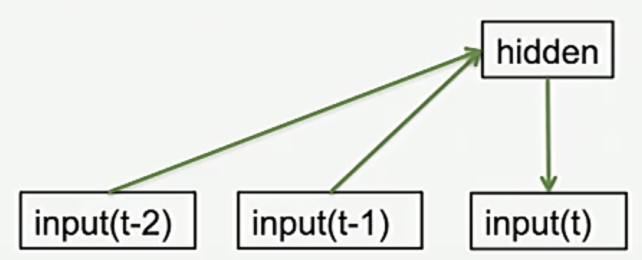


> Map time into state

* Jordan network

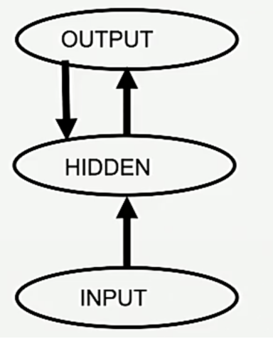

* One time step back

* Elman network

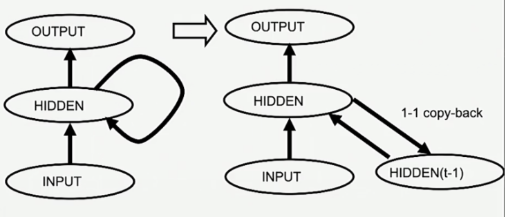


## LSTM

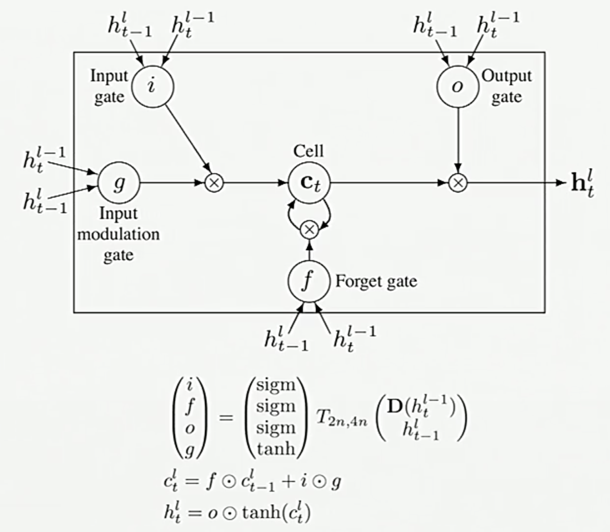

* preserve data for a long time in the activities of an RNN, use a circuit that implements an memory cell.
* A linear unit that has a self-link with a weight of 1 will maintain its state. 
* Information is stored in the cell by activating its write gate.
* Information is retrieved by activating its read gate
* We can backpropagate through this circuit because logistic units have nice derivatives.

$$
\begin{aligned}
\boldsymbol{g}^{(t)} &=\phi\left(W_{g x} \boldsymbol{x}^{(t)}+W_{i h} \boldsymbol{h}^{(t-1)}+\boldsymbol{b}_{g}\right) \\
\boldsymbol{i}^{(t)} &=\sigma\left(W_{i x} \boldsymbol{x}^{(t)}+W_{i h} \boldsymbol{h}^{(t-1)}+\boldsymbol{b}_{i}\right) \\
\boldsymbol{f}^{(t)} &=\sigma\left(W_{f x} \boldsymbol{x}^{(t)}+W_{f h} \boldsymbol{h}^{(t-1)}+\boldsymbol{b}_{f}\right) \\
\boldsymbol{o}^{(t)} &=\sigma\left(W_{o x} \boldsymbol{x}^{(t)}+W_{o h} \boldsymbol{h}^{(t-1)}+\boldsymbol{b}_{o}\right) \\
\boldsymbol{s}^{(t)} &=\boldsymbol{g}^{(t)} \odot \boldsymbol{i}^{(i)}+\boldsymbol{s}^{(t-1)} \odot \boldsymbol{f}^{(t)} \\
\boldsymbol{h}^{(t)} &=\boldsymbol{s}^{(t)} \odot \boldsymbol{o}^{(t)}
\end{aligned}
$$


# NLP

* an automated way to understand or analyze the natural languages and extract the required information from such data by applying machine learning Algorithms
* Used in Semantic Analysis, Automatic summarization, Text classification, Question answering


## Terms

> Entity (Words of interest)

* names of persons, locations and companies

> Entity Linking

* Name variations (New York, NY, neuyork)
* Ambiguity (Paris Hilton vs Paris in France)
* Absence (Domain specific knowledge base)
* Scalability (Chatbot, Search)
* Evolving Information (Recent news articles in which there are mentions)
* Multiple Languages (Support queries performed in multiple languages)


> Knowledge base

* words of interest are mapped from input text to corresponding unique entities in target knowledge base

> Hypernym

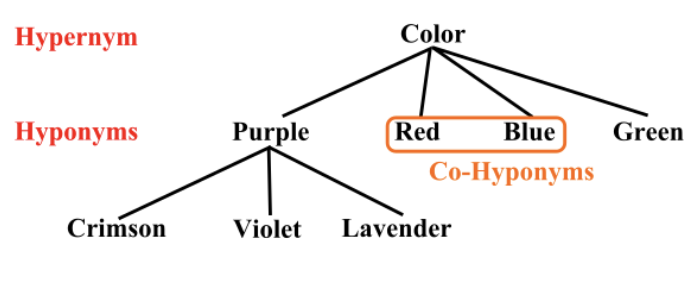
* Is a Relation | a word of less specific meaning
* chiroptophobia and phobia
* opera and music

> Hyponym

* Subclass of
* If X is a hyponym of Y, and Y is a hyponym of Z, then X is a hyponym of Z
* pigeon, eagle and seagull are hyponyms of bird


> Meronym

* Part of

```
a 'tire' is part of a 'car'             # Part meronym
a 'car' is a member of a 'traffic jam'  # Member meronym
a 'wheel' is made from 'rubber'"​        # Substance (stuff) meronym
```

> LDA

* Latent Dirichlet Allocation

> POS tagging

* PoS Tagger is a piece of software that reads a text in some language and assigns PoS to each word
* make more complex categories than those defined as basic PoS (ex noun-plural)

> Pragmatic Analysis

* It deals with outside word knowledge, which means knowledge that is external to the documents|queries.
* Pragmatic analysis that focuses on what was described is reinterpreted by what is actually meant, deriving the various aspects of language that require real-world knowledge

> Dependency Parsing

* Aka Syntactic Parsing, the task of recognizing a sentence and assigning a syntactic structure to it.

> Tokenization

* Methods of dividing the text into various tokens. (in the form of the word)

> Latent Semantic Indexing

* LSI, aka Latent semantic analysis, is a mathematical method developed to increase the accuracy of retrieving
* It helps to find out the hidden relation between the words by producing a set of various concepts related to the terms of a sentence to improve the information understanding.
* The technique used for the purpose is called Singular value decomposition, useful for working on small sets of a static document

> Synonym

* Similar words

> Syntactic analysis

* a sentence may be interpreted in more than one way due to ambiguous sentence structure
* proper ordering of words.

> Pragmatic analysis

* Can be defined as the words which have multiple interpretations
* Pragmatic Analysis is part of the process of extracting information from text.


# Recommender System


* Information retrieval 
* static content base → invect time in indexing content
* dynamic information need → queries presented in real time
* common approach TFIDF → rank documents by term overlap

* Implicit data : purchase | video viewing | click data
* explicit data : star reviews                    
* candidate generation | filtering | ranking # What are components of Top-N recommender
* Because people have to search for them.    # Why are older movies rated higher?

## Metrics

> AB Test

* Ultimate metric

> Churn

* How quickly does new user behavior influence your recommendations?

> Responsiveness

* How often do recommendations change?

> Coverage

* % of <user, item> pairs that can be predicted
* balance between coverage and accuracy

> Diversity

* avg similarity between recommendation pairs

> Novelty

* mean popularity rank of recommended items
* how popular the items that you are recommending 
* more obscure items that may lead to serendipitous discovery from the users

> Ranking

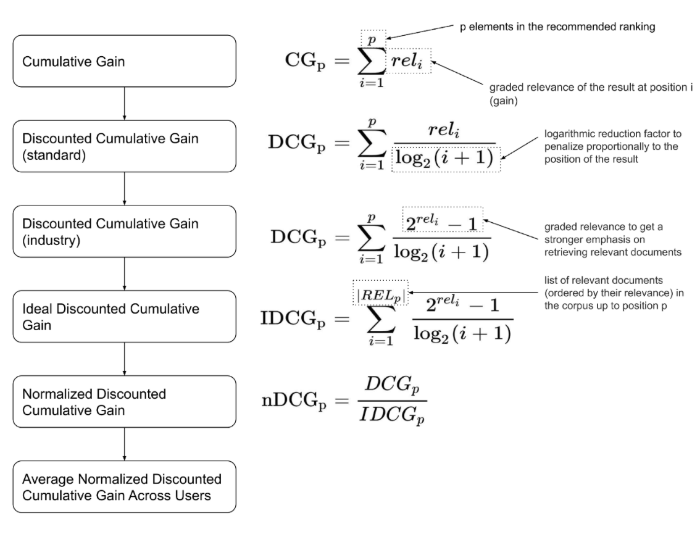

* Used in ranking algorithm
* discontinuous and thus non-differentiable

## Models

> Item-item collaborative filtering

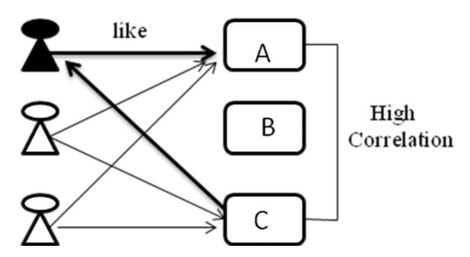

* Good amount of information of items’ own features, rather than using users’ interactions and feedbacks
* Genre, year, director, actor, textual content of articles extracted by applying NLP

> User-User collaborative filtering


* Select top X similar users, take weighted average of ratings from X users with similarities as weights
* Explicit Rating → a rate given by a user to an item on a sliding scale
* Implicit Rating → indirect users preference, such as page views, clicks, purchase records
* [-] If one user purchases one item, this changes ranking of every other item that was purchased
* [-] No use for new users and new items 
* [-] Won't necessarily encourage diverse results

# Reinforcement Learning

## Terms

> Tasks

```
Episodic Tasks    # Interaction breaks into episodes, which end with a terminal state. 
Continuing Tasks  # Interaction goes on continually without terminal state.
```
