#  Computer Vision

* Extracting descriptions of the world from pictures or sequences of pictures
* ambiguous Interpretations: Changing viewpoint, moving light source, deforming the shape
* forward (graphics) well-posed, inverse (vision) 
* Should computer vision follow from our understanding of human vision?

> How to solve

* craft a solution using established methods and tailor them
* build a math/physical model of the problem and implement algorithms with provably correct properties
* gather image data, label it, and use machine learning to provide the solution

> Video

* Video classification 
* Activity recognition 
* Activity detection 
* Video segmentation

## Terms

> Non maximal suppression


* while select bounding box with some threshold 
    * discard any remaining box with IoU >= 0.5 with the box output in previous step

> background substitution

* subtract from previous frame

> Noise

* Impulsive noise randomly pick a pixel and randomly set to a value
* saturated version is called salt and pepper noise
* Median filters - completely discard the spike, linear filter always responds to all aspects
* Quantization effects - often called noise although it is not statistical
* Unanticipated image structures - also often called noise although it is a real repeatable signal

> Eight point algorithm

$$
[u, v, 1]\left[\begin{array}{ccc}
E_{11} & E_{12} & E_{13} \\
E_{21} & E_{22} & E_{23} \\
E_{31} & E_{32} & E_{33}
\end{array}\right]\left[\begin{array}{c}
u^{\prime} \\
v^{\prime} \\
1
\end{array}\right]=0
$$

* Set $$ E_33 $$ to 0 and use 8 points to calculate $$ E_11 $$, $$ E_32 $$

## YUV 4:2:0

* This format requires 4×8+8+8=48 bits per 4 pixels, so its depth is 12 bits per pixel
* I420 is by far the most common format in VLC.

> NV12

* commonly found as the native format from various machine vision, and other, video cameras
* another variant where colour information is stored at a lower resolution than the intensity data
* intensity (Y) data is stored as 8 bit samples, and colour (Cr, Cb) information as 2x2 subsampled image, known as 4:2:0.

> I420

* identical to YV12 except that the U and V plane order is reversed

## Features

> Anchor

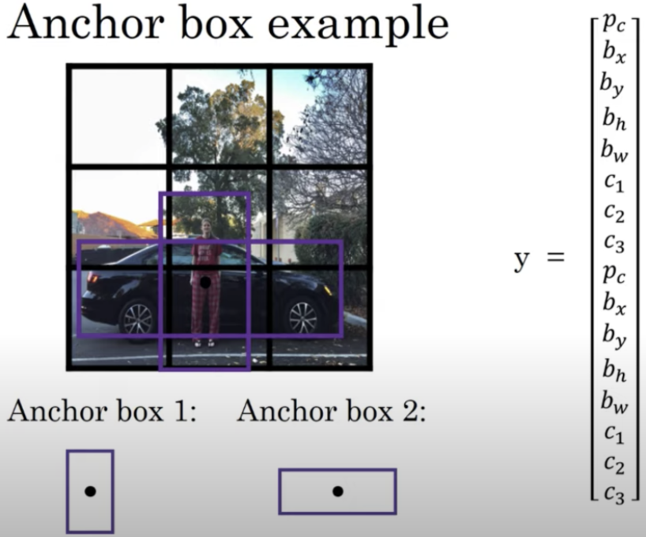
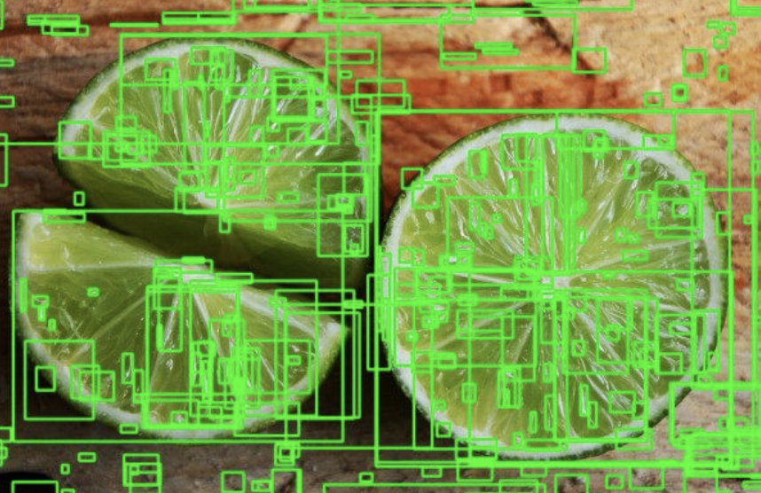
* object is assigned to grid cell that contains object's midpoint, anchor box for grid cell with highest IoU

> Harris

* large difference with nearby pixel

> Good Features to Track

* sorted by value, suppress non-max

> FAST    

* use nearby 16 pixels, fast than above two

> Feature Pyramid

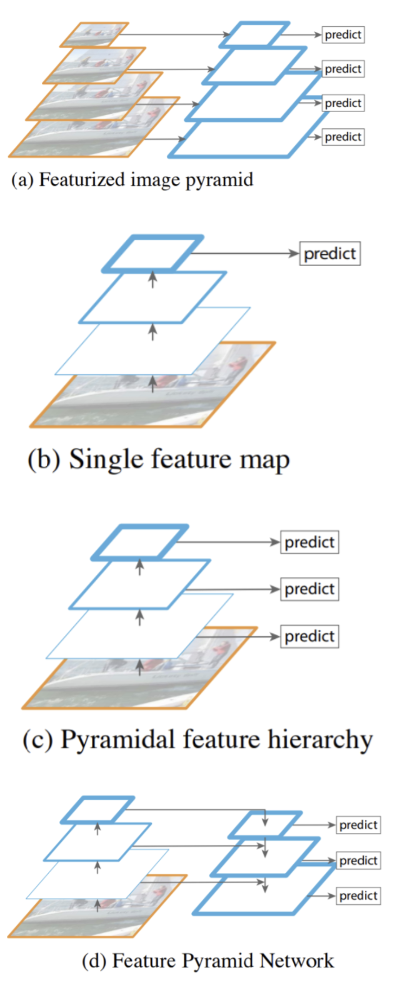

> viola-jones algorithm (Paul Viola and Michael Jones, 2001)

* trained to detect a variety of object classes, it was motivated primarily by the problem of face detection
* [+] robust: high detection rate (true-positive rate) & low false-positive rate always
* [+] Real time: For practical applications at least 2 frames per second must be processed.
* Face detection only (not recognition) - The goal is to distinguish faces from non-faces
* Steps
    * Haar Feature Selection (eye, nose)
    * Creating an Integral Image
    * Adaboost Training
    * Cascading Classifiers

> haar-like features (Rapid Object Detection using a Boosted Cascade of Simple Features, 2001)

* edge features, line features, four-rectangle features 
* uses integral of image and adaboost (Cascade of Classifiers) for faster computation

> integral

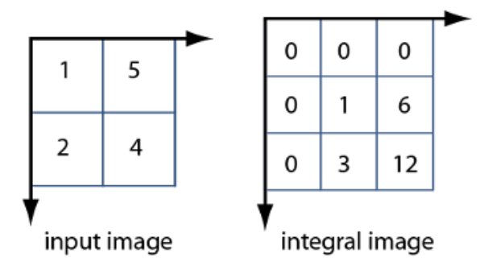
* integral image enables you to rapidly calculate summations over image subregions

## Eye

* 1604 Kepler eye as an optical instrument, which image is inverted on retina
* 1625 Scheiner experimented by this idea


* Color is precieved differently by
    * previously seen color 
    * neighborhood colors 
    * state of mind


> Camera vs Human

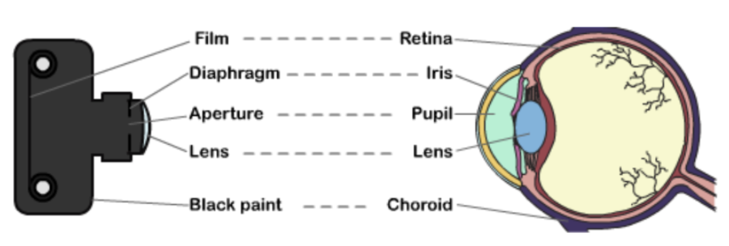

| Camera        | Human              |
| ------------- | ------------------ |
| curved retina | wide range of view |
| hard lense    | soft lense         |

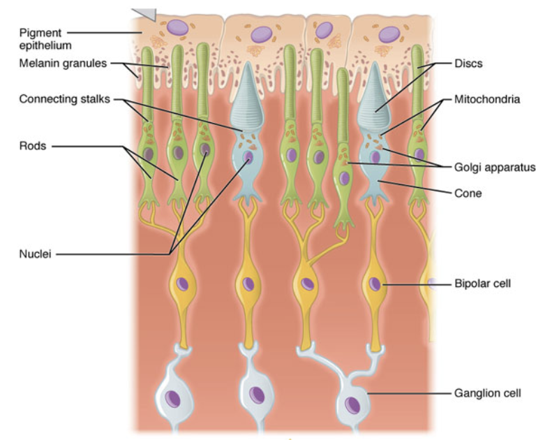

| rods                   | cones           |
| ---------------------- | --------------- |
| night (a lot of light) | day             |
| many                   | few             |
| one                    | three(color)    |
| low resolution         | high resolution |


## Epipolar

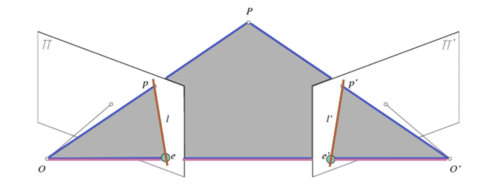

* Baseline: line connecting two center of projection O and O'
* Epipoles (e, e'): Two intersection points of baseline with image planes
* Epipolar plane: Any plain that contains the baseline
* Epipolar lines: Pair of lines from intersection of an epipolar plane with two image plane

## Color

> gray

* 0 Black - 255 White
* 1Byte → unsigned char in c++, numpy.uint8 in python

> HSL, HSV

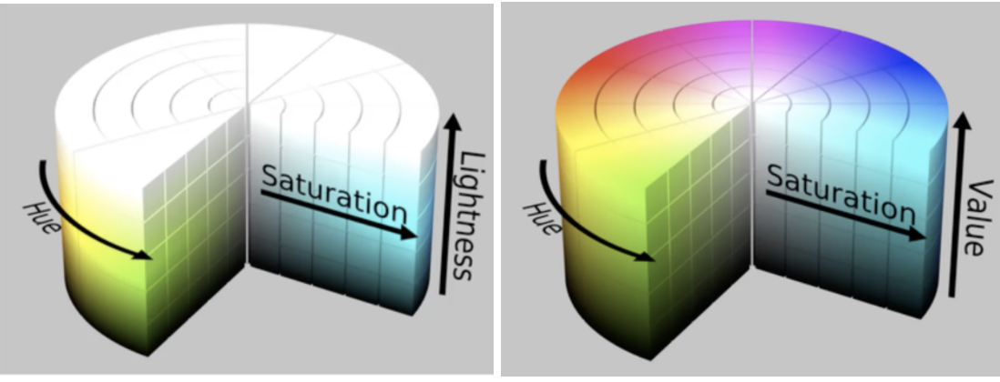


## Public Datasets

> Coco

* 80 labels (people, bicycles, cars and trucks, airplanes, stop signs and fire hydrants, animals, kitchens)
* object detection, segmentation
* https://gist.github.com/50e1deaec61bbd28b60bb96cb10ab74d

> MOT

* https://motchallenge.net/results/MOT17

## Shadow

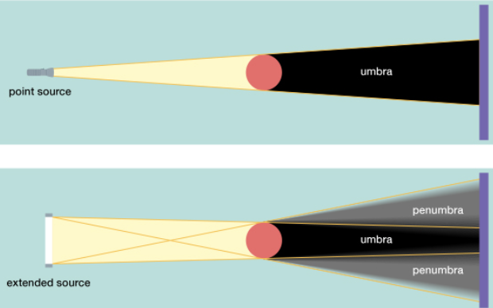

* hard shadow is generated by point source while soft shadow generated by extended source
* Stereo 
    * shape from shading (single image, known direction, known BRDF)
    * Photometric stereo (single viewpoint, multiple images under different lighting)
* Multi-view stereo
    * Multiple images, dynamic scene, multiple viewpoints, fixed lighting, correspondence hard


## Video

| Stage                   | Example                                              | Buffering                                             | Latency (1080p30) |
| ----------------------- | ---------------------------------------------------- | ----------------------------------------------------- | ----------------- |
| Capture Post-processing | Bayer Filter <br/> chroma resampling                 | few lines (eg. 8)                                     | < 0.5ms           |
| Video Compression       | Motion Jpeg, MPEG-1/2/4 <br/> H.264 with single-pass | 8 lines <br/> few thousand pixels on encoder piepline | 0.25ms            |
| Network Processing      | RTP / UDP / IP encapsualtion                         | A few Kbytes                                          | < 0.01ms          |
| Decoder Stream Buffer   | From number of frames (more than 30)                 | 16-1 ms                                               |
| Decompression           | Motion Jpeg, MPEG-1/2/4 <br/> H.264 with single-pass | 8 lines <br/> few thousand pixels on encoder piepline | 0.25ms            |
| Display Pre-processinsg | Scaling, Chroma Resampling                           | Few lines (e.g. 8)                                    | < 0.5ms           |

> Random Sample Consensus

* estimating parameters of models in the presence of outlier data points

```
repeat n times: 
    select two points at random 
    determine line equation from two points count number of points that are within distance τ from 
    line
    (called support of line which is # of inliers) 
    line with the greatest support wins
```


## Segmentation

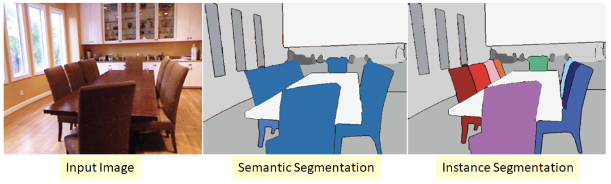

> mask-RCNN (Mask R-CNN, He 2017)

* Faster R-CNN + FCN

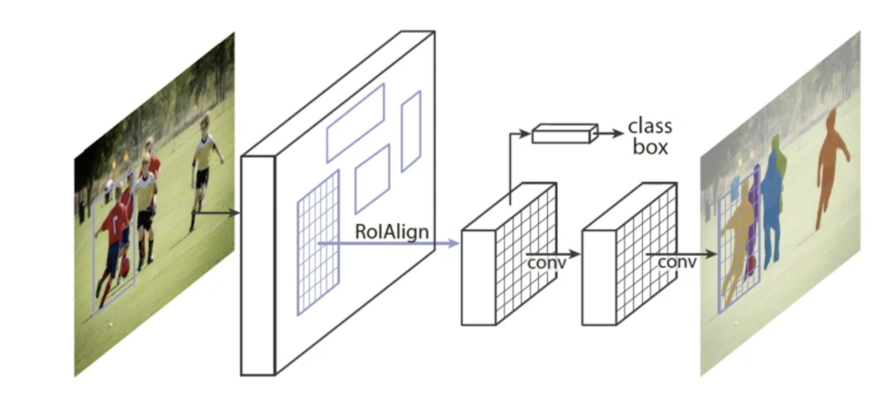

> Single short multibox detector

* 74.3 mAP, 59 FPS

> Faster R-CNN

* 73.2 mAP, 7 FPS

> Darknet

* 19 convolutional layers and 5 maxpooling layers

> Tiny Yolo

* 23.7mAP, 244FPS

> YOLO1

* 74.3mAP, 59FPS
* 49 objects / Relatively high localization error

> Yolo v2

* Classification and prediction in a single framework
* Batch Normalization
* classifier network at 224×224, Increase in image size 448*448
* divides into 13 * 13 grid cells → finegrand feature
* Multi-scale training
* Anchor boxes 


> Yolo v3 (J Redmon, 2018)

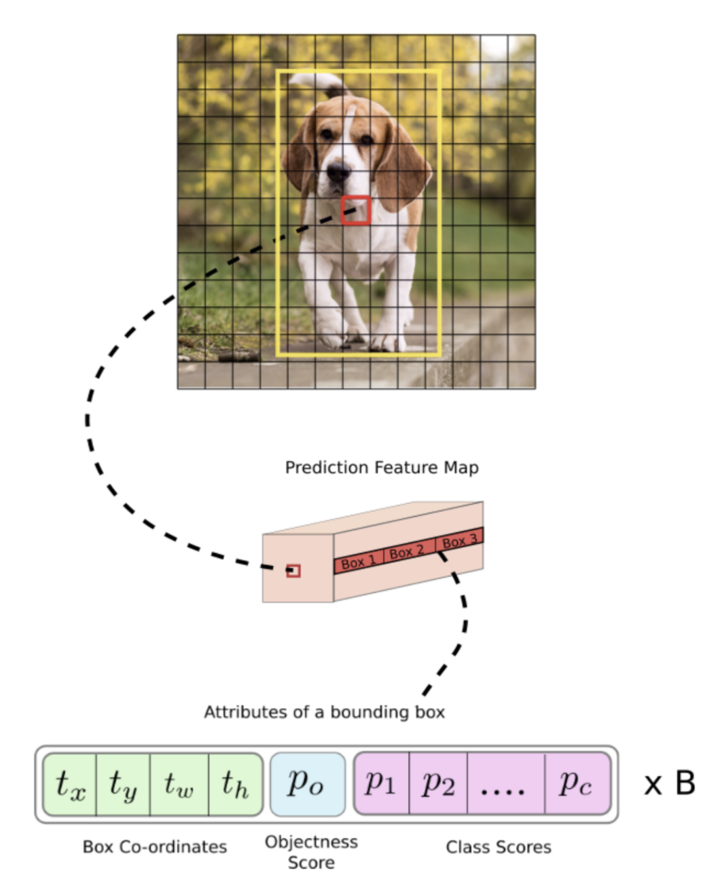

* 0 normalized 416 (320, 608) RGB input → [(507, 85), (2028, 85), (8112, 85)]


# Graphics

## Terms

> Interactive

* Produces images within milliseconds. 
* Using specialized hardware, graphic processing units. 
* Standardized APIs (OpenGL, DriectX, Vulkan)
* Tries to be as photorealistic as possible. 
* Hard shadows, only single bounce of light. 
* Used in games, technical design.

> Rendering

* Synthesis of a 2D image from a 3D scene description 
* 2D image is an array of pixels
* Algorithm interprets data structures that represent scene in terms of geometric primitives, textures, and lights
* Objective / Interactive

> Photorealistic

* Physically-based simulation of light, camera Shadows, global illumination, multiple bounces of light
* Slow, used in movies, animation

> Projection

* Given 3D points in camera coordinates, determine corresponding image coordinates. 
* Transforming 3D points into 2D is called Projection. 


## Light

* Quadratic attenuation
    * Most computationally expensive, most physically correct
$$ k*(p-v)^2 $$
* Linear attenuation
    * Less expensive, less accurate
$$ k*(p-v) $$
* Constant attenuation
    * Fastest computation, least accurate
    $$ k $$

## Projection

> Perspective Projection

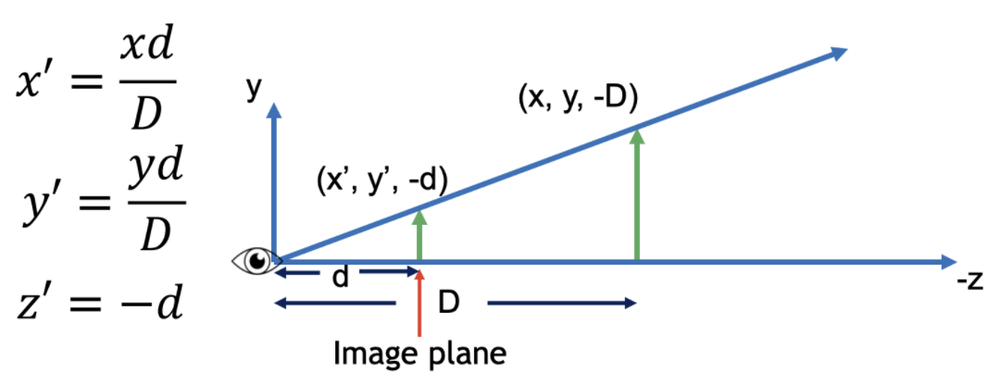
* Most common for computer graphics. 
* Simplified model of the human eye, or camera lens (pinhole camera) 
* Things farther away appear to be smaller. 
* Discovery attributed to Filippo Brunelleschi in the early 1400's
* Project along rays that converge in center of projection.
* express using homogeneous coordinates and 4x4 matrices as follows

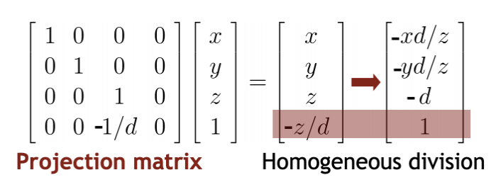

* Using projection matrix, homogeneous division seems more complicated than multiplying all by -d/z.
* Handle different types of projections in a unified way. 
* Define arbitrary view volumes.

> View Volume

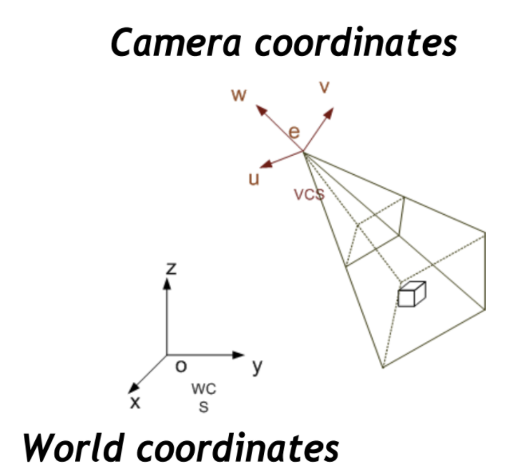

* 3D volume seen by camera 
    * Camera coordinates (+ projection matrix) ->
    * Canonical view volume (+ viewport transformation) ->
    * Image space / pixel coordinates

> Canonical view volume

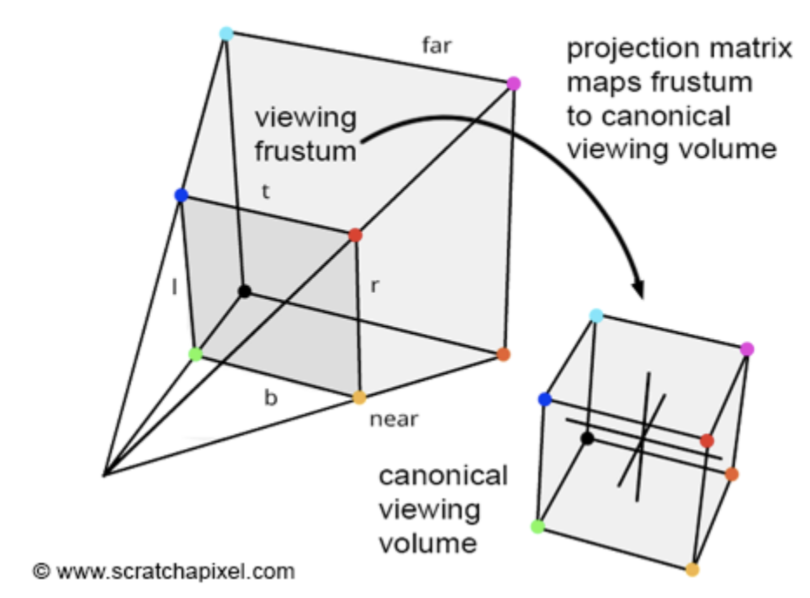

* Projection matrix that user defined view volume transforms into canonical view volume [-1,1]x[-1,1]x[-1,1].
* Multiplying corner vertices of view volume by projection matrix and performing homogeneous divide yields corners of canonical view volume. 
* Perspective and orthographic projection are treated the same way. 
* Canonical view volume is the last state in which coordinates are in 3D. 


> Perspective view volume

* Convert the view-frustum to the simple symmetric projection frustum. 
* Transform the simple frustum to the canonical view frustum.


# OpenGL

* Open Graphics Library
* Render 3D graphics efficiently
* Cross-language and cross-platform.
* Extension Wrangler Library
* High-quality color images composed of geometric and image primitives. 
* Window / Operating system independent.


## Terms

> Shader

* shaders are small programs that rest on the GPU.
* These programs are run for each specific section of the graphics pipeline.
* In a basic sense, shaders are nothing more than programs transforming inputs to outputs
* Shaders are also isolated programs in that they're not allowed to communicate with each other
* the only communication they have is via their inputs and outputs.


> GLU

* part of OpenGL that supports more complex shapes