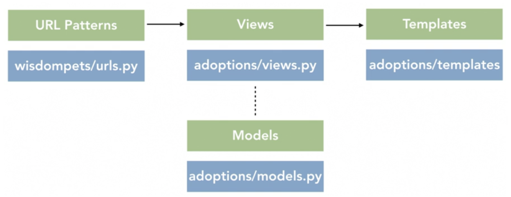

# Module

## Util

> ast

```py
literal_eval(str)    # only accept str, num, tuples, lists, dicts, booleans, None ("rm -rf" error)
```

> copy

```py
a = [1,2]
b = copy.copy(a) # equivalent to [e for e in a], a[:]

# deepcopy()     preserve the graphical structure of the original compound data
a = [1,2]
b = [a,a]        # there's only 1 object a
c = copy.deepcopy(b)

c[0] is a        # return False, a new object a' is created
c[0] is c[1]     # return True, c is [a',a'] not [a',a'']
```

> mmh3

```py
mmh3.hash('aaaa', -1756908916)    # hash string based on value
```

> platform

```py
processor()             # (real) processor name, e.g. 'amdk6'
python_implementation() # Get one of 'thon’, ‘Irothon’, ‘Jython’, Py’
python_version()        #thon version as string 'major.minor.patchlevel
system()                # system/OS name, such as 'Linux', 'Darwin', 'Java', 'Windows'
```

> functool

```py
reduce(lambda a,b : a if a > b else b, [1,5,3])    # get maximum
lru_cache(maxsize=32)              # decorator
cache_clear() / cache_info()       # clear / print cache info for decorated function 
```

> itertool

```py
accumulate(iterable, func, *, initial)  # accumulate([1,2,3,4,5]) → 1 3 6 10 15
chain(*iterables)                       # chain('ABC', 'DEF') → A B C D E F
combinations(iterable, r)               # combinations('ABCD', 2) → AB AC AD BC BD CD
compress(data, selectors)               # compress('ABCDEF', [1,0,1,0,1,1]) → A C E F
count(start=0, step=1)                  # count(2.5, 0.5) → 2.5 3.0 3.5 
cycle(iterable)                         # ('ABCD') → A B C D A B C 
dropwhile(predicate, iterable)          # dropwhile(lambda x: x<5, [1,4,6,4,1]) → 6 4 1
islice(iterable, start, stop, [step])   # ('ABCDEFG', 2, None) → C D E F G
groupby(iterable, key=None)             # [(k, g) for k, g in groupby('AAABB')] → (A, AAA), (B, BB)
permutations(iterable)                  # permutations(range(3)) → 012 021 102 120 201 210
product(*iterables, repeat=1)           # product('ABCD', 'xy') → Ax Ay Bx By Cx Cy Dx Dy
repeat(object[, times])                 # repeat(10, 3) → 10 10 10
```

> operatos

```py
lt) / le / eq / ne / ge / gt(a, b)    # comparators
```

> textwrap

```py
dedent(multiline_string)      # start with correct indentation in the source
```

> unittest

```py
setUp() / tearDown()  # executed before and after each test method
test_name()           # test_* will run sequentially
```

> unicodedata

```py
import unicodedata
unicodedata.name('/')       # SOLIDUS
unicodedata.decimal('9')    # 9
unicodedata.category('A')   # Lu
unicodedata.bidirectional('한') # L
unicodedata.lookup('LEFT CURLY BRACKET') # {
unicodedata.normalize('NFD', u'\u00C7')  # decompose: convert Ç to "C + ̧"
unicodedata.normalize('NFC', u'C\u0327') # compose: convert "C + ̧" to Ç
```

* Example

```py
import unittest

class TestAll(unittest.TestCase):
  def setUp(self):
    pass

  def test_doc(self):
    self.assertIsNotNone("1")

  def tearDown(cls):
    pass  # use line_profile

if __name__ == "__main__":
  # run single test
  suite = unittest.TestSuite()
  suite.addTest(PageTester("test_doc"))
  runner = unittest.TextTestRunner()
  runner.run(suite)

  # run whole test
  unittest.main()
```

> typing

```py
import itertools
import argparse
from tqdm import tqdm
from math import ceil, sqrt
from typing import List, Dict, Set, Optional, Tuple, Union
from collections import defaultdict, Counter
class Point:
  def __init__(self, x: int, y: int):
    self.x = x
    self.y = y

  def __repr__(self):
    return f"Point({self.x}, {self.y})"

  def distance_from(self, other: "Point") -> int:
    return ceil(sqrt((self.x - other.x) ** 2 + (self.y - other.y) ** 2))


class Obj:
  def __init__(self, id: int):
    self._id = id

  def __repr__(self):
    return f"{self.__class__.__name__} {self._id}"

  @property
  def id(self):
    return self._id


class Product(Obj):
  def __init__(self, id: int, weight: int):
    super().__init__(id)
    self._weight = weight

  @property
  def weight(self):
    return self._weight


class PositionObj(Obj):
  def __init__(self, id: int, position: Point):
    super().__init__(id)
    self._position = position

  def __repr__(self):
    return f"{self.__class__.__name__} {self._id} at {self._position}"

  @property
  def position(self):
    return self._position

  def distance_from(self, _other: "PositionObj") -> int:
    return self._position.distance_from(_other.position)

  def find_nearest_object(self, _others: List["PositionObj"]) -> Tuple["PositionObj", int]:
    nearest = _others[0]
    distance = self.distance_from(nearest)
    for other in _others[1:]:
      d = self.distance_from(other)
      if d < distance:
        nearest, distance = other, d
    return nearest, distance


class ProductHolder(PositionObj):
  def __init__(self, *args, **kwargs):
    super().__init__(*args, **kwargs)
    self._products: Dict[Product, int] = {}

  @property
  def products(self):
    return self._products

  def add_products(self, products: Dict[Product, int]):
    for product, quantity in products.items():
      if product in self._products:
        self._products[product] += quantity
      else:
        self._products[product] = quantity

  def remove_products(self, products: Dict[Product, int]):
    for product, quantity in products.items():
      self._products[product] -= quantity
      if self._products[product] == 0:
        self._products.pop(product)

  @property
  def product_weight(self):
    return sum(p.weight * q for p, q in self._products.items())

  def remove_all_products(self):
    self._products = {}
```

### Debug

> Logging

```py
# NOTSET | 0 < DEBUG | 10 < INFOR | 20 < WARNING | 30 < ERROR | 40 < CRITICAL | 50
basicConfig(filename="newfile.log", level=logging.DEBUG)
getLogger()                       # returns logging.Logger
log(level, msg, *args, **kwargs)  # Logs a message with integer level level on this logger
logging.getLogger("imported_module").setLevel(logging.WARNING)    # disable imported logger
(format='%(asctime)s,%(msecs)d %(levelname)-8s [%(filename)s:%(lineno)d] %(message)s', datefmt='%Y-%m-%d:%H:%M:%S')
```

* logging.Logger

```py
setLevel(logging.INFO)         # Messages less severe than level will be ignored
add / removeFilter(filter)     # Adds / remove specified filter filter to this handler
filter(record)
lineno, funcName, message      # line number, function name, message

debug / info / warning / error / critical(msg)        # 
```

```py
# Simple logging
logging.basicConfig(level=logging.DEBUG, format='%(asctime)s, %(levelname)-8s [%(filename)s:%(lineno)d] %(message)s')

# logger class
import logging
import logging.config

def get_logger(name, level=logging.DEBUG):
  # ignore warning from other module
  logging.config.dictConfig({
      'version': 1,
      'disable_existing_loggers': True
  })

  logger = logging.getLogger(name)
  
  # remove exsiting handlers -> prevents logged twice
  for hdlr in logger.handlers[:]:
    logger.removeHandler(hdlr)
  
  # set output to file
  sh = logging.StreamHandler()
  sh.setFormatter(logging.Formatter('%(asctime)s, %(levelname)-8s [%(filename)s:%(lineno)d] %(message)s'))
  logger.addHandler(sh)
  logger.setLevel(level)
  

  return logger


log = get_logger(__name__)
log.info("hi")
```

> tqdm

```py
from tqdm import tqdm_notebook as tqdm

text = ""
bar = tqdm(total=4)
for i, char in enumerate(["a", "b", "c", "d"]):
    time.sleep(0.5)
    bar.update(1)

for i in tqdm.tqdm(range(10000)):
    time.sleep(0.5)
```

> warnings

```py

filterwarnings('ignore')                # action='once'
import warnings
warnings.filterwarnings(action="ignore", message="unclosed", category=ResourceWarning)
```

> dis

```
dis()            # Return a formatted view of the bytecode operations
```

> pdb

```py
pdb.set_trace()
python -m pdb
```

> cprofile

* python -m cProfile [-o output_file] [-s sort_order] (-m module | myscript.py)

```py
def create_array():
  arr=[]
  for i in range(0,400000):
    arr.append(i)

def print_statement():
  print('Array created successfully')


def main():
  create_array()
  print_statement()

if __name__ == '__main__':
  import cProfile, pstats
  profiler = cProfile.Profile()
  profiler.enable()
  main()
  profiler.disable()
  stats = pstats.Stats(profiler).sort_stats('ncalls')
  stats.print_stats()
```

> pstats

* ncalls (actual calls / primitive calls) 
  * if not recurse, two values are the same

```py
import pstats

# after running python3 -m cprofile -o output main.py
p = pstats.Stats("output")
p.sort_stats("cumulative").print_stats(30)            # 30 longest in descending
p.sort_stats("cumulative").print_stats("main.py")     # functions in main.py
```

> line_profiler

```py
from line_profiler import LineProfiler
import random


def do_other_stuff(numbers):
  s = sum(numbers)


def do_stuff(numbers):
  do_other_stuff(numbers)
  l = [numbers[i]/43 for i in range(len(numbers))]
  m = ['hello'+str(numbers[i]) for i in range(len(numbers))]

numbers = [random.randint(1, 100) for i in range(1000)]

lp = LineProfiler()
lp_wrapper = lp(do_stuff)
lp_wrapper(numbers)
lp.print_stats()
"""
Timer unit: 1e-06 s

Total time: 0.000768 s
File: <ipython-input-1-d026e2ddfa6e>
Function: do_stuff at line 9

Line #      Hits         Time  Per Hit   % Time  Line Contents
==============================================================
     9                                           def do_stuff(numbers):
    10         1         16.0     16.0      2.1    do_other_stuff(numbers)
    11         1        228.0    228.0     29.7    l = [numbers[i]/43 for i in range(len(numbers))]
    12         1        524.0    524.0     68.2    m = ['hello'+str(numbers[i]) for i in range(len(numbers))]
"""
```

### Path

> <pathlib>

```py
# Path
parents 
stem / suffix           # w/o suffix / only suffix
as_posix() / as_uri()   # win → linux / uri
chmod(0o444)
glob('*.py')            # get all matched files
is_absolute() / is_relative_to(*other)  
match('*.py')           # patterns
stat()                  # information about this path (st_size, st_mtime)
resolve(strict=False)   # make absolute
mkdir(mode=0o777, parents=F, exist_ok=F)
read_bytes() / read_text()
write_text(data, encoding=None, errors=None)

# parent path
MODEL_ROOT = Path(__file__).resolve().parents[2] / 'models'
```

> <os>

* python3 -c 'import sys; print(64 if sys.maxsize > 2 ** 32 else 32)')

```py
environ       # mapping object representing string environment (environ['HOME'])
close(fd)     # Close file descriptor fd
ctermid()     # filename corresponding to the controlling terminal of the process
chdir(path)   # change directory
getcwd()      # current working directory
getuid()      # current process’s real user id
getpid()      # current process id
getlogin()            # name of the user logged in on the controlling terminal of the process
listdir(path='.')     # List containing the names of the entries in the directory given by path
rename('old,'new)     # rename

rmdir(path, *, dir_fd=None)              # Remove directory path
mkdir(path, mode=0o777, exists_ok=True)  # Create a directory named path

system(command)         # Execute the command (a string) in a subshell
times()                 # current global process times
```

```py
import os

def get_recur_size(path='.'):
    total = 0
    if os.path.isfile(path):
        return os.path.getsize(path)
    else:
        return sum(get_recur_size(fn) for fn in os.scandir(path))
    return total

def human(size):
    for u in ['B', 'KB', 'MB', 'GB']:
        if size < 1024 : 
            return f"{size:.1f} {u}"
        size /= 1024
    return f"{size:.1f} {'TB'}"

print(f"In {os.path.abspath('.')} \t {human(get_recur_size())}")
for fn in sorted(os.listdir('.'), key = get_recur_size, reverse=True):
    print(f"{fn} \t {human(get_recur_size('./' + fn))}")
```

* os.path

```py
basename                # data/item.csv → item.csv
abspath(path)           # Get absolute path 
isabs()                 # check if absolute path
isfile(fn) / isdir(dn)  # Check file / directory exists
```

* os.sys

```py
argv                  # List of command line arguments passed to a Python script
builtin_module_names  # names of all modules that are compiled into this Python interpreter
byteorder             # big vs little endian
executable            # absolute path of the executable binary for the Python interpreter
flags
path                  # All path that is being search by python
version_info          # assert sys.version_info[0]==3 and assert sys.version_info[1] >= 5

exit([arg])
cd()
```

### CLI

> argparse

```py
ArgumentParser()                              # create parser
add_argument("--input", type=str, required=F) # add arguments
args.myArg is not None                        # check argument

arr_argument('-l', nargs='+')                 # python arg.py 1234 2345
```

> <fire>

```py
import fire


class ParseClass:
  def __init__(self, offset):
    self.offset = 3

  # python fire_class.py ParseClass add 10 20 --offset=0
  def add(self, x, y):
    return self.offset + x + y

  def add_list(self, li):
    return sum(li)


if __name__ == "__main__":
  fire.Fire(ParseClass)

# python fire_class.py add --x 1 --y 2
# python fire_class.py add_list "[1,2,6,54]"
```

### Package

> importlib

```py
find_loader(name, path=None)      # sys.modules[name].__loader__ is returned 
reload(module)                    # previously imported module
import_module(name, package=None)
```

> js2py

```py
import js2py

code = " function test(a, b) { return a + b; } "
js_func = js2py.eval_js(code)
print(js_func(1, 2))
```

> <pipreqs>

* Auto generate requirements.txt file for any project based on imports

```text
$ pipreqs /home/project/location

Usage:
    pipreqs [options] <path>

Options:
    --use-local           Use ONLY local package info instead of querying PyPI
    --pypi-server <url>   Use custom PyPi server
    --proxy <url>         Use Proxy, parameter will be passed to requests library. or environments parameter in your terminal:
                          $ export HTTP_PROXY="http://10.10.1.10:3128" HTTPS_PROXY="https://10.10.1.10:1080"
    --debug               Print debug information
    --ignore <dirs>...    Ignore extra directories
    --encoding <charset>  Use encoding parameter for file open
    --savepath <file>     Save the list of requirements in the given file
    --print               Output the list of requirements in the standard output
    --force               Overwrite existing requirements.txt
    --diff <file>         Compare modules in requirements.txt to project imports.
    --clean <file>        Clean up requirements.txt by removing modules that are not imported in project.
    --no-pin              Omit version of output packages.
```

### Time

> <datetime>

```py
from datetime import date, datetime, timedelta

print(f"strftime \t {d.}")
print(f"timedelta \t {d - timedelta(days=1, hours=0, minutes=50)}")
```

* DateTime

```py
datetime(year, month, day[, hour[, minute[, second[, microsecond[, tzinfo]]]]])
```

* date

```py
date(2002, 12, 31)
isocalendar() / isoformat() / strftime('%d/%m/%y')  # (y, m, d) / (2002-12-31) / (31/12/02)
replace(day=26)                         # replace
weekday()                               # Monday is 0 and Sunday is 6.
timedelta(days=1, hours=0, minutes=50)  # date - timedelta
```

> Time

```py
replace([hour[, minute[, second[, microsecond[, tzinfo]]]]])
strftime("%H:%M:%S %Z")
min    # time(0, 0, 0, 0)
max    # time(23, 59, 59, 999999)
```

> <time>

```py
time.perf_counter() / _ns      # clock with highest available resolution to measure a short duration
tm_zone      # EDT, EST
time() / time_ns() / ctime()  # time in ms / nice format
gmtime() / localtime()        # 0 is struct_time(1970, 1, 1), and none is current time
```

* Current date

```py
from datetime import date, datetime

today = date.today()

print(today.strftime("%d/%m/%Y"))  # dd/mm/YY
print(today.strftime("%B %d, %Y")) # Textual month, day and year
print(today.strftime("%m/%d/%y"))  # mm/dd/y
print(today.strftime("%b-%d-%Y"))  # Month abbreviation, day and year
print(datetime.now())              # datetime object containing current date and time
print(datetime.now().strftime("%d/%m/%Y %H:%M:%S"))   # dd/mm/YY H:M:S
```

* Time context

```py
class Time:
  def __init__(self, f):
    self.func = f

  def __call__(self, *args, **kwargs):
    cur = time.perf_counter()
    print(cur)   # 185.006554938
    self.func(*args, **kwargs)
    print(f"Took {time.perf_counter() - cur:.3f}s")

@Time
def complex():
  li = []
  for i in range(1000000):
    li.append(i)
  li.sort()

complex()       # Took 0.111s
```

## Algorithm

### Data structure

> bisect

* Search

```py
bisect.bisect_left(a, x, lo=0, hi=len(a))     # first insert point for x in a to maintain sorted order
bisect.bisect_right(a, x, lo=0, hi=len(a))     # last insert point for x in a to maintain sorted order
```

* Search and insert
  * O(N) due to insert

```py
bisect.insort(a, x, lo=0, hi=len(a))
```

## Database

### Local

> pickle

```
dump(obj, file)
load(file)
```

> json

* encoding Python Objects into JSON is called Serialization

```
python -m json.tool file.json  # validate file.json
dumps()    # encode JSON Data into native Python String
dump()     # encode and store JSON Data into a file
load(s)    # read from json
```

```py
# read write
import json
data = [{
    'name' : '영수',
    'age' : 16
}]
with open("data_file.json", "w") as write_file:
    json.dump(data, write_file, indent=4, ensure_ascii=False)  # ensure_ascii for korean character

with open("data_file.json", "r") as read_file:
    data = json.load(read_file)
print(data)

# Recursive print
def pprint(obj):          # recursively decode all lists
    import json
    if isinstance(obj, list):
        return repr(obj).decode('string-escape')
    elif isinstance(obj, dict):
        return json.dumps(self.__dict__, indent=4, ensure_ascii=False)
```

> csv

```py
import csv

data = ['4', '5', '6']

with open('data1d.csv', 'w') as csvFile:
    writer = csv.writer(csvFile)
    writer.writerow(data)

csvFile.close()

with open('data1d.csv') as csvFile:
    csvReader = csv.reader(csvFile, delimiter=',')    
    for row in csvReader:
        print(row)

# write | read 2d file
data = [['height','weight','age'],
        [155,66,27],
        [177,82,34],
        [155,66,27],
        [175,70,32],
        [195,99,21],
        [157,52,17],
        ["",52,17]]

with open("data2d.csv","w") as my_csv:
    writer = csv.writer(my_csv, delimiter=',')
    writer.writerows(data)

with open('data2d.csv') as csvFile:
    csvReader = csv.reader(csvFile, delimiter=',')    
    for row in csvReader:
        print(row)
```

### Remote

> faker

* fake data generator

```py
import pandas as pd
from faker import Faker
from collections import defaultdict
from sqlalchemy import create_engine
fake = Faker()
fake_data = defaultdict(list)

for _ in range(1000):
  fake_data["first_name"].append( fake.first_name() )
  fake_data["last_name"].append( fake.last_name() )
  fake_data["occupation"].append( fake.job() )
  fake_data["dob"].append( fake.date_of_birth() )
  fake_data["country"].append( fake.country() )

df_fake_data = pd.DataFrame(fake_data)
df_fake_data

fake.factories
```

```py
from faker import Faker

faker.name()
faker.job()
faker.text()

# in Czech language
faker = Faker('cz_CZ')

for i in range(3):
  name = faker.name()
  address = faker.address()
  phone = faker.phone_number()
  print(f'{name}, {address}, {phone}')
```

> sqlfaker

```py
from faker import Faker
from sqlfaker.database import Database
from collections import defaultdict
from sqlalchemy import create_engine

# add database
my_db = Database(db_name="housing")

# add tables
my_db.add_table(table_name="User", n_rows=500)
my_db.tables["studyprogram"].add_primary_key(column_name="studyprogram_id")
my_db.tables["studyprogram"].add_column(column_name="shortname", data_type="varchar(50)", data_target="name")
my_db.tables["studyprogram"].add_column(column_name="startdate", data_type="date", data_target="date")

my_db.tables["student"].add_primary_key(column_name="student_id")
my_db.tables["student"].add_column(column_name="firstname", data_type="varchar(50)", data_target="first_name")
my_db.tables["student"].add_column(column_name="lastname", data_type="varchar(50)", data_target="last_name")
my_db.tables["student"].add_foreign_key(column_name="studiengang_id", target_table="studiengang", target_column="studiengang_id")
# data_types : password, email, date_time

my_db
```

> sqlite

* Database wrapper

```py
import sqlite3
"""singleton class to deal with db"""

class DBConnection:
  instance = None

  def __new__(cls, *args, **kwargs):
    if cls.instance is None:
      cls.instance = super().__new__(DBConnection)
      return cls.instance
    return cls.instance

  def __init__(self, db_name='you-db-name'):
    self.name = db_name
    # connect takes url, dbname, user-id, password
    self.conn = self.connect(db_name)
    self.cursor = self.conn.cursor()

  def connect(self):
    try:
      return sqlite3.connect(self.name)
    except sqlite3.Error as e:
      pass

  def __del__(self):
    self.cursor.close()
    self.conn.close()
```

* Dataframe conversion

```py
import sqlite3
import json
import pandas as pd

conn = sqlite3.connect('data/sample.db') # sqlite3.connect(":memory:")
c = conn.cursor()

def db2dicts(db_path):
  db = bsddb3.btopen(db_path, 'r')
  for id in db:
    try:
      dic = json.loads(db[id])
      assert isinstance(dic, dict)
    except:
      dic = {'raw': db[id].decode('utf-8')}
    yield({'_' + k: v for k, v in dic.items()})

def json2server(db_path, sqlite_path=None):
  conn = sqlite3.connect(sqlite_path)
  try:
    conn.execute(f"DROP TABLE {cate}")
  except:
    pass

  conn.execute(f"CREATE TABLE IF NOT EXISTS {cate} (_id object PRIMARY KEY)")

  for dic in db2dicts(db_path):
    columns = set(e[1] for e in conn.execute(f"PRAGMA table_info('{cate}')").fetchall())
    for key in dic.keys():
      if key not in columns:
        conn.execute(f"ALTER TABLE {cate} ADD COLUMN {key}")
        columns.add(key)
    try:
      conn.execute(f"INSERT INTO {cate}({', '.join(dic.keys())}) VALUES ({', '.join('?' * len(dic.keys()))})", tuple(repr(e) for e in dic.values()))
    except:
      logger.warn("invalid" + str(sys.exc_info()[0]))

    conn.commit()

def query2df(sqlite_path, query):
  print("\n", query)
  conn = sqlite3.connect(sqlite_path)
  cursor = conn.execute(query)
  return pd.DataFrame(data=cursor.fetchall(), columns=[c[0] for c in cursor.description])

def flatten(obj):
  if isinstance(obj, str):
    return "'" + obj + "'"
  else:
    return "'" + repr(obj) + "'"

c.execute("DROP TABLE students")
c.execute("CREATE TABLE IF NOT EXISTS students (id object PRIMARY KEY, date text)")
c.execute("INSERT INTO students(date) VALUES ('2006-01-05')")

c.execute("CREATE INDEX idx_id ON students(id)")

display(query2df('data/sample.db', "PRAGMA index_list('students')"))
display(query2df('data/sample.db', "PRAGMA table_info('students')"))
with pd.option_context('display.max_rows', None, 'display.max_columns', None):  # more options can be specified also
  display(query2df('data/sample.db', "SELECT name as table_name FROM sqlite_master WHERE type ='table' AND name NOT LIKE 'sqlite_%';"))

dic = {'new' : [1, 2, 4], 'date' : '2006-02-22', 'raw' : 'afd, (),'}
for key in dic.keys():
  try:
    c.execute(f"ALTER TABLE students ADD COLUMN {key}")
  except:
    pass


c.execute(f"INSERT INTO students({', '.join(dic.keys())}) VALUES ({', '.join('?' * len(dic.keys()))})", tuple(flatten(e) for e in dic.values()))

conn.commit()

for row in c.execute('SELECT * FROM students ORDER BY date'):
  print(row)
```


> sqlalchemy
detached                    # Object, states which an object can have within a session
dialect                        # Object, allows DB operations on a particular DB backend
DBAPI                     # Python Database API Specification
metadata                    # generally refers to "data that describes data"
create_engine('DB', echo=True)        # echo for logging

> sqlalchemy.engine
not thread-safe (underlying DBAPI connection may not support shared access between threads)
begin()                        # Transaction Instance

> sqlalchemy.engine.Engine
Connects a Pool and Dialect together 
begin()                        # Return a context manager delivering a Connection
connect()                    # Return a new Connection object

> sqlalchemy.engine.Connection
not thread-safe
execute()                    # Executes SQL statement construct, returns ResultProxy

> sqlalchemy.engine.Transaction
not thread safe
close()
commit()
rollback()

> sqlalchemy.schema

> sqlalchemy.schema.column
Column(name, type, primary_key=F)        # Column in a database table

> sqlalchemy.schema.Table
Table()
drop(engine)
columns

> sqlalchemy.schema.MetaData
MetaData()                    # Thread-safe container object for read
create_all()                    # check existence of each individual table. CREATE if not

> pymongo

* Namespace is the concatenation of the database name and collection name
* MongoDB does not support foreign key constraints
* not support default multi-document ACID transactions atomic operation on a single document
* indexes are stored in RAM
* Can’t use index Regex or negation operators ($nin, $not). Arithmetic operators ($mod). $where 

* pymongo.Client

```py
drop_database(name_or_database)        # drop database
list_database_names()            # show all database
```

* pymongo.Database

```py
drop_collection(collection_name)    # remove matching document
list_collections_names()            # show all collections
db[collection_name] || db.collection_name  # get collection
```

* pymongo.Collection

```py
count_documents({})     # counts documents
create_index(keys)      # create index on keys
delete_one()            # drop one document
insert_one()            # insert one document
insert_many()
rename(new_name)        # rename this collection

find({ "key" : { "$exists" : false } })        # find if key doesn’t exists
db.collection.update(
  {},
  [{ $set: { a: { $concat: [ "$a", "World" ] } } }],
  { multi: true }
)
update_one({}, {"$set": {"a": 1}}, upsert=F)    # update field
update_many({}, {'old' : 'new'})        # rename field "old" to "new" in all documents
cl.create_index([( "_kowiki_id_v0", 1 )],partialFilterExpression = {'_kowiki_id_v0' : {'$exists': True }}
```


```py
# aggregate
db.COL.update_many({}, [{ "$set": { '_id': { '$concat': [ "COL", "$_id" ] } } }])
db.zipcodes.aggregate( [            # Average population by state
   { $group: { _id: { state: "$state", city: "$city" }, pop: { $sum: "$pop" } } },
   { $group: { _id: "$_id.state", avgCityPop: { $avg: "$pop" } } }
] )
db.zipcodes.aggregate( [            # States with Populations above 10 Million
   { $group: { _id: "$state", totalPop: { $sum: "$pop" } } },
   { $match: { totalPop: { $gte: 10*1000*1000 } } }
] )

# operator
$eq              # equal to a specified value.
$gt              # greater than a specified value.
$gte             # greater than or equal to a specified value.
$lt              # less than a specified value.
$lte             # less than or equal to a specified value.
$ne              # not equal to a specified value.
$exists          # exists in documents
$in              # any of the values specified in an array.
$nin             # none of the values specified in an array.
$or              # Joins query clauses with a logical OR.
{ "$and": [ {"sex": "male"}, {"age": "26"}]}    # Joins query clauses with a logical AND.
$not             # Inverts the effect of a query expression.
$nor             # Joins query clauses with a logical NOR.
{'$regex':'^File'}
cl.updateMany({}, {$rename: {'orig: "new"}}    # rename entire field name

# compound
db.collection.createIndex( { <field1>: <type>, <field2>: <type2>, ... } )
```

> text

```py
db.stores.createIndex( { name: "text", description: "text" } )
# tokenize the search string using whitespace and most punctuation as delimiters
cl.find({ $text:{ $search: "java -coffee" }})    # Exclude query
```

> Firestore

```py
Transactions       # a set of read and write operations on one or more documents.
Batched Writes     # a set of write operations on one or more documents (max 500)
firestore.Increment(50) # if current isn’t numeric value, sets field to the given value
doc_ref.update({'id': firestore.DELETE_FIELD})  # delete field
city_ref.update({u'regions': firestore.ArrayRemove([u'east_coast'])})    # delete from array
```

* Client

```py
collection("user") # CollectionReference
document("doc")    # DocumentReference
```

* WriteBatch

```py
batch = db.batch()

# Set the data for NYC
nyc_ref = db.collection(u'cities').document(u'NYC')
batch.set(nyc_ref, {u'name': u'New York City'})

# Update the population for SF
sf_ref = db.collection(u'cities').document(u'SF')
batch.update(sf_ref, {u'population': 1000000})

# Delete DEN
den_ref = db.collection(u'cities').document(u'DEN')
batch.delete(den_ref)

batch.commit()    # Commit the batch

# Example 2
for member_ref in db.collection("member").list_documents():
  member = member_ref.get().to_dict()
  member_ref.update({'solved_problem_ids': member["solved"], 'solved': firestore.DELETE_FIELD})
```

* CollectionReference

```py
db.collection("problem")             # get reference
list_documents() → Generator[DocRef] # list documents
stream()  → Generator[DocSnap]       # list streams
get()   # get all documents in collection
delete()
```

* DocumentReference

```py
id                            # id
document("rbtmd1010")
get() → DocumentSnapShot()    # get_document 
delete()                      # delete document 
update({"kr_name": '황규승'})   # update document
```

* DocumentSnapshot

```py
to_dict()      # convert to dictioanry
```

```py
from firebase_admin import credentials, firestore, initialize_app
from selenium.webdriver.support.ui import WebDriverWait
from selenium.webdriver.support import expected_conditions as EC
from selenium.webdriver.common.by import By
from selenium.webdriver.chrome.options import Options
from selenium import webdriver
from webdriver_manager.chrome import ChromeDriverManager
from collections import defaultdict
from ..common import PATH
import logging as log
import json
import re
import multiprocessing as mp
import time


cred = credentials.Certificate(f'{PATH.SRC}/server.json')
try:
  initialize_app(cred)
except:
  pass
db = firestore.client()


def recommend_problems(*, kr_names=""):
  with open(f"{PATH.DATA}/problems.json", 'r') as f:
    problems = json.load(f)

  html = ""
  for kr_name in kr_names.split(" "):
    log.info(kr_name)
    student = next(db.collection("user").where("kr_name", "==", kr_name).stream(), {})
    if student:
      student = student.to_dict()
    else:
      continue
    html += f"<div style='width: 20%; float: left;'><h2>{student['kr_name']}</h2> <br>"
    todos = [problem for problem in problems if problem['id'] not in student["solved"] and 'h1' in problem]
    todos.sort(key=lambda todo: (todo['h1'][4], todo['h2'], todo['h3'], todo["li"], todo['level']))

    h1, h2, h3, li = "", "", "", ""
    for todo in todos:
      if h1 != todo["h1"]:
        h1 = todo["h1"]
        html += h1 + "<br>"
      if h2 != todo["h2"]:
        h2 = todo["h2"]
        html += h2 + "<br>"
      if h3 != todo["h3"]:
        h3 = todo["h3"]
        html += h3 + "<br>"
      if li != todo["li"]:
        li = todo["li"]
        html += li + "<br>"
      html += todo['link'] + "<br>"
    html += "</div>"
  return html


def update_solved(user_doc):
  chrome_options = Options()
  chrome_options.add_argument('headless')
  driver = webdriver.Chrome(ChromeDriverManager().install(), options=chrome_options)
  log.info(f"Updating google id:{user_doc['id']} / bj_id:{user_doc['bj_id']}")

  try:
    driver.get(f"https://www.acmicpc.net/user/{user_doc['bj_id']}")
    WebDriverWait(driver, 100).until(EC.presence_of_element_located((By.CLASS_NAME, 'panel-body')))
    solved = [f'BJ_{prob_id}' for prob_id in driver.find_element_by_class_name('panel-body').text.split()]
    log.info(solved)
    db.collection("user").document(user_doc['id']).update({"solved": solved})
  except Exception as e:
    log.warning(str(e))
    driver.quit()


def enroll_class(class_id, user_id):
  logging.debug(f"class_id {class_id}")
  logging.debug(f"user_id {user_id}")
  class_doc = db.collection("class").where("id", "==", class_id).get()
  if len(class_doc) == 0:
    return False
  class_doc = class_doc[0].to_dict()
  logging.debug(class_doc)
  db.collection("class").document(class_id).update({"user_ids": class_doc["user_ids"] + [user_id]})
  db.collection("user").document(user_id).update({"class_id": class_id})


if __name__ == "__main__":
  import multiprocessing as mp
  log.basicConfig(level=log.DEBUG)
  # update
  with mp.Pool(16) as pool:
    users = [user_snap.to_dict() for user_snap in db.collection("user").get()]
    levels = pool.map(update_solved, users)
```

> redis

```py
# app.py
from flask import Flask
from redis import Redis

app = Flask(__name__)
redis = Redis(host='redis', port=6379)

@app.route('/')
def hello():
  redis.incr('hits')
  return f'Compose/Flask demo has been viewed {redis.get("hits")} time(s).'


if __name__ == "__main__":
  app.run(host="0.0.0.0", debug=True)
```

```yaml
# docker-compose.yml
version: '2'
services:
    web:
        build: .
        ports:
            - "5000:5000"
        volumes:
            - .:/code
        depends_on:
            - redis
    redis:
        image: redis
```

```sh
# Dockerfile
FROM python:3
ADD . /code
WORKDIR /code
RUN pip install -r requirements.txt
CMD python app.py
requirements.txt

# run command
docker build -t compose-flask .
docker-compose up
```

> sys

* sys.path is a list of strings that determines the interpreter’s search path for modules

```sh
setswitchinterval()   # set time slice 
read()                # sys.stdin Read all input at once
write()               # sys.stderr
getsitepackages()     # see sitepackages
ps1 /.ps2             # used for interactive mode string
```

## Concurrency

* Global Interpreter Lock is a mutex that allows one thread to hold the control of Python interprete

> psutil

```py
cpu_count()
ps.memory_info()[0] / 1024 / 1024)
```

> shlex

```py
split(command_line)            # split command line into list
```

> signal

* catch ctr c

```py
import fire
import sys
import signal


count = 0


def handler(signum, frame):
  print(f"1 sec passed \t {count}")
  sys.exit(0)


signal.signal(signal.SIGINT, lambda sn, f: print("CTRL+C Pressed"))
signal.signal(signal.SIGALRM, handler)
signal.alarm(5)
while True:
  count += 1
print(count)
```

* timeout decorator

```py
import signal
import os
import errno
import time
from functools import wraps

def timeout(seconds, error_message=os.strerror(errno.ETIME)):
  def decorator(func):
    def _handle_timeout(signum, frame):
      raise Exception(f"Took longer than {seconds}s")

    def wrapper(*args, **kwargs):
      signal.signal(signal.SIGALRM, _handle_timeout)
      signal.alarm(seconds)
      try:
        result = func(*args, **kwargs)
      finally:
        signal.alarm(0)
      return result

    return wraps(func)(wrapper)

  return decorator


@timeout(1)
def fast_function():
  time.sleep(0.5)
  print("hello")


@timeout(1)
def slow_function():
  time.sleep(2)
  print("heeeeeeello")
```

* timeout context

```py
import contextlib
import errno
import os
import signal
import time

class timeout(contextlib.ContextDecorator):
  def __init__(self, seconds, *, timeout_message=os.strerror(errno.ETIME), suppress_error=False):
    self.seconds = seconds
    self.timeout_message = timeout_message
    self.suppress_error = suppress_error

  def _timeout_handler(self, signum, frame):
    raise TimeoutError(self.timeout_message)

  def __enter__(self):
    signal.signal(signal.SIGALRM, self._timeout_handler)
    signal.alarm(self.seconds)

  def __exit__(self, exc_type, exc_val, exc_tb):
    signal.alarm(0)
    if self.suppress_error and exc_type is TimeoutError:
      return True


with timeout(1):
  time.sleep(0.5)
  print("hello")

with timeout(1):
  time.sleep(2)
  print("heeeello")
```


### Race Control

> <queue>

* thread safe 

```py
Queue(maxsize=0)
empty()
get(block=True, timeout=None)
put(item, block=True, timeout=None)
qsize()

from queue import PriorityQueue

pq = PriorityQueue(maxsize=3)
pq.put((8, 'top'))
pq.put((1, 'sean'))
pq.put((3, 'top'))
while pq.size():
    print(pq.get())
```

> subprocess

```py
run(["ls", "-l"], capture_output=True, text=True)    # simplified Popen, execute and wait 

# Popen
Popen(args)           # Execute a child program in a new process
universal_newlines=False      # input/output is accepted as bytes, not Unicode
p = subprocess.Popen("ls", stdout=subprocess.PIPE, stderr=subprocess.PIPE)
out, err = p.communicate()    # out is byte -> must be encoded
```

* Example

```py
import os
import subprocess
import time
from collections import deque


def ls():
  commands = "ls -a"

  process = subprocess.Popen(commands.split(), stdout=subprocess.PIPE)
  out, err = process.communicate()

  print(out)
  print(err)

def top():
  cpu_usages = [1]
  while True:
    process = subprocess.Popen("ps -a -o %cpu,%mem,cmd".split(), stdout=subprocess.PIPE)
    out, _ = process.communicate()
    try:
      cpu_usages.append(int([line.split()[0] for line in out.decode('utf-8').split('\n') if "_type_" in line][0]))
      print(cpu_usages)
      time.sleep(0.1)
    except Exception as e:
      return sum(cpu_usages) / len(cpu_usages)

def cpu_usage():
  p = subprocess.Popen(['/usr/bin/time'] + ["ls"], stdout=open(os.devnull, 'wb', 0), stderr=subprocess.PIPE)
  with p.stderr:
    q = deque(iter(p.stderr.readline, b''), maxlen=2)
  rc = p.wait()
  return b''.join(q).decode().strip()
```

## Network

> socket

* tcp client

```py
import socket

host = '127.0.0.1'
port = 5000

def tcp_client():
  s = socket.socket()
  s.connect((host, port))

  while (message := input("->").encode()) != 'q':
    s.send(message)
    data = s.recv(1024)
    print(f"Recieved from server {data}")
  s.close()

def tcp_server():
  s = socket.socket()
  s.bind((host, port))

  s.listen(1)
  c, addr = s.accept()
  print(f"Connection from {addr}")

  while True:
    data = c.recv(1024)
    if not data:
      break
    print(f"message {data} recieved, sending back {data.upper()}")
    c.send(data.upper())
  c.close()
```

* udp client

```py
import socket

host, port = '127.0.0.1', 5001
server = ('127.0.0.1',5000)

def udp_client():
  s = socket.socket(socket.AF_INET, socket.SOCK_DGRAM)
  s.bind((host, port))

  while (message := input("-> ").encode()) != 'q':
    s.sendto(message, server)
    data, addr = s.recvfrom(1024)
    print(f'Received from server:{data}')
  s.close()

def udp_server():
  s = socket.socket(socket.AF_INET, socket.SOCK_DGRAM)
  s.bind((host,port))

  print("Server Started.")
  while True:
    data, addr = s.recvfrom(1024)
    print(f"message {data} recieved from {addr}, sending back {data.upper()}")
    s.sendto(data.upper(), addr)
  c.close()
```

* get_ip_address

```py
s = socket.socket(socket.AF_INET, socket.SOCK_DGRAM)
s.connect(("8.8.8.8", 80))
print(s.getsockname()[0])
```

> cgi

* dynamically generating web pages that respond to user input

> http.server.HTTPServer

```sh
python3 -m http.server
serve_forever()
```

> urllib

* Request class

```py
urllib2.Request(www.example.com)
add_header('Referer', 'http://www.python.org/')
urlopen(url)  k# string / Request object.  For HTTP, returns http.client.HTTPResponse object
```

* parse

```py
unquote(str)  # decode urlencoded bytes
```

* HTTPResponse

```py
content = resp.read()
```

```py
import time
import urllib.request
import multiprocessing as mp
import concurrent.futures

""" Returns: total bytes from downloading all images in image_numbers list """
def seq_download_images(image_numbers):
  total_bytes = 0
  for num in image_numbers:
    total_bytes += _download_image(num)
  return total_bytes

def _download_image(image_number):
  image_number = (abs(image_number) % 50) + 1  # force between 1 and 50
  image_url = 'http://699340.youcanlearnit.net/image{:03d}.jpg'.format(image_number)
  try:
    with urllib.request.urlopen(image_url, timeout=60) as conn:
      return len(conn.read())  # number of bytes in downloaded image
  except Exception as e:
    print(e)

def par_download_images(image_numbers):
  total_bytes = 0
  with concurrent.futures.ThreadPoolExecutor() as pool:
    futures = [pool.submit(_download_image, num) for num in image_numbers]
    for f in concurrent.futures.as_completed(futures):
      total_bytes += f.result()
  return total_bytes

if __name__ == '__main__':
  IMAGE_NUMBERS = list(range(1, 50))

  print('Evaluating Sequential Implementation...')
  sequential_result = seq_download_images(IMAGE_NUMBERS)
  sequential_time = 0
  start = time.perf_counter()
  seq_download_images(IMAGE_NUMBERS)
  sequential_time += time.perf_counter() - start

  print('Evaluating Parallel Implementation...')
  parallel_result = par_download_images(IMAGE_NUMBERS)
  parallel_time = 0
  start = time.perf_counter()
  par_download_images(IMAGE_NUMBERS)
  parallel_time += time.perf_counter() - start

  if sequential_result != parallel_result:
    raise Exception('sequential_result and parallel_result do not match.')
  print('Average Sequential Time: {:.2f} ms'.format(sequential_time*1000))
  print('Average Parallel Time: {:.2f} ms'.format(parallel_time*1000))
  print('Speedup: {:.2f}'.format(sequential_time | parallel_time))
  print('Efficiency: {:.2f}%'.format(100*(sequential_time | parallel_time) | mp.cpu_count()))
```

### Web

> flask

* [Flask](https://www.youtube.com/watch?v=Z1RJmh_OqeA)
* [Flask + https](https://blog.miguelgrinberg.com/post/running-your-flask-application-over-https)
* [Flask + Firebase](https://medium.com/firebase-developers/hosting-flask-servers-on-firebase-from-scratch-c97cfb204579)
* [Flask + Google login](https://realpython.com/flask-google-login/)
* [Flask + Firestore](https://medium.com/google-cloud/building-a-flask-python-crud-api-with-cloud-firestore-firebase-and-deploying-on-cloud-run-29a10c502877)

* application context
  * keeps track of the application-level data during a request, CLI command

* Basic Docker

```sh
# Structure
flask-fire (root dir)
├── server
 | ├── src
 |    └── app.py
 |    └── templates
 |       └── index.html
 | ├── Dockerfile
├── static
 |  └── style.css
├── firebase.json
├── .firebaserc

# ./Dockerfile
FROM python
COPY . /app
WORKDIR /app
RUN pip install flask
EXPOSE 5000
CMD ["python", "app.py"]

$ docker build -t flask-test .
$ docker run -d -p 5000:5000 flask-test
```

```py
# ./app.py
from flask import Flask
app = Flask(__name__)

@app.route("/")
def hello():
  return "Hello Docker!"

if __name__ == '__main__':
  app.run(debug=True, host='0.0.0.0')
```

* Global jinja

```py
global jinja accessible by {{ stage }}
@app.context_processor
def inject_stage_and_region():
    return dict(stage="alpha", region="NA")
```

* CLI

```
flask run --cert adhoc    # run in https

FLASK_APP      # app.py
FLASK_ENV      # development
```

> flask_wtf

```
FlaskForm

flask_login

LoginManager
current_user
login_required
login_user
logout_user

flask_debugtoolbar

app.config['SECRET_KEY'] = '<replace with a secret key>'
toolbar = DebugToolbarExtension(app)
```

> <django>



* Model-view-controller
* URL patterns to decide which view to pass the request to for handling
* project can contain multiple apps
* automatically reloads Python code for each request as needed


> <bs4>

```
(from bs4 import BeautifulSoup)

name                          # tagname
text, attrs                   # inside text, attribute object
next / previous_elements      # next / previous tags generator
next / previous_siblings      # next sibling tags generator
original_encoding

# bs4.element.Tag
string
text
clear()                       # removes the contents of a tag:
decompose()                   # remove tag
extract()                     # hide element
find_all(tag, href=None, limit=None) → [Tags]    # find all matching tags
find("span")                  # find tags inside
get_text()                    # 
insert(pos, tag)              # insert tag to position
insert_before() / after()     # immediately before
prettify()
wrap(soup.new_tag("b"))       # wrap around new tags

new_button = soup.new_tag('a')
new_button.attrs["onclick"] = "toggle()"
new_button.append('This is a new button!')
```


> <requests>

```
json()            # convert back to
```

* Clone Gist subprocess

```py
import json
import subprocess as sp
import requests
import os
from itertools import islice
from firebase_admin import credentials, firestore, initialize_app
from math import ceil
from ..common import get_db_instance

def clone_all(username='seanhwangg', clone_path):
  current_count, total_count = 0, 1000
  git_cred = get_git_credential()

  for i in range(ceil(total_count / 100)):
    pid2popen = {}
    result = requests.get(f'https://api.github.com/users/{username}/gists?page={i}&per_page={100}', headers=git_cred)
    gists = json.loads(result.content)

    loop_count = min(total_count - current_count, len(gists))
    current_count += loop_count

    for g in islice(gists, loop_count):
      url, gist_path = f"https://gist.github.com/{g['id']}.git", f"{clone_path}/{g['id']}"
      if os.path.isdir(gist_path):
        p = sp.Popen(['git', '-C', gist_path, 'pull', url], stdout=sp.PIPE, stderr=sp.PIPE)
      else:
        p = sp.Popen(['git', 'clone', url, f"{clone_path}/{g['id']}"], stdout=sp.PIPE, stderr=sp.PIPE)
      pid2popen[gist_path] = p
    for gist_path, p in pid2popen.items():
      out, err = p.communicate()
      file2content = {}
      for file in os.listdir(gist_path):
        if not os.path.isdir(f"{gist_path}/{file}"):
          with open(f"{gist_path}/{file}", 'r') as f:
            file2content[file] = f.read().split('\n')
    return file2content
```

> <selenium>

* Multithreading

```py
import multithreading as mt
import json
import re
from selenium import webdriver
from selenium.webdriver.chrome.options import Options
from selenium.webdriver.common.by import By
from selenium.webdriver.support import expected_conditions as EC
from selenium.webdriver.support.ui import WebDriverWait
from webdriver_manager.chrome import ChromeDriverManager


def update_problems(*, update_page=None, update_level=None):
  if update_level:
    with mt.Pool(16) as pool:
      levels = pool.map(get_problems_level, range(0, 31))
    problems = [problem for level in levels for problem in level]
  else:
    with open(f"{PATH.DATA}/problems.json", 'r') as f:
      problems = json.load(f)

  with open(f"{PATH.DATA}/problems.json", 'w') as f:
    json.dump(problems, f, ensure_ascii=False)


def get_problems_level(level):
  problems = []
  chrome_options = Options()
  chrome_options.add_argument('headless')
  driver = webdriver.Chrome(ChromeDriverManager().install(), options=chrome_options)
  try:
    level_problems = []
    for page in range(1, 100):
      driver.get(f"https://solved.ac/problems/level/{level}?sort=id&direction=asc&page={page}")
      WebDriverWait(driver, 100).until(EC.presence_of_element_located((By.CLASS_NAME, 'contents')))
      lines = driver.find_element_by_class_name('contents').text
      if '해당하는 문제가 없습니다' in lines:
        break
      for line in lines.split('\n'):
        level_problems.extend(re.findall(r'^ (\d+)', line))
    for problem in level_problems:
      problems.append({'id': f"BJ_{problem}", 'level': level})
  except Exception:
    driver.quit()
  else:
    driver.quit()
  return problems
```

> Errors

* DevToolsActivePort file doesn't exist

```py
chrome_options.add_argument("--single-process")  
```

> livereload

```sh
gh repo clone nathanwright1242/flask_livereload_example
# <meta name="viewport" content="width=device-width, initial-scale=1, shrink-to-fit=no">
```

> algolia

* full-text search

```py
# client
SearchClient.create('key', 'cred')        # create client

# index
client.init_index('page')            # create index
clear_objects()                # remove all objects
save_objects()
```

## ML

### Traditional

> scipy

```py
import numpy as np
from scipy.spatial import distance
a = np.array([[0, 0, 0]])
b = np.array([[1, 1, 1], [1, 1, 0], [1, 0, 0]])

distance.cdist(a, b, 'euclidean')   # [[1.73205081 1.41421356 1.]]
np.argmin(distance.cdist(a, b, 'euclidean')[0]) # 2th
distance.pdist(b, 'euclidean') # [1. 1.41421356 1.]
```

> sklearn

* visualize word vector

```py
from sklearn.manifold import TSNE
import matplotlib.pyplot as plt 
word_10d = np.random.random((10, 10))

tsne_model = TSNE()
word_2d = tsne_model.fit_transform(word_10d)
for i, (x, y) in enumerate(word_2d):
  plt.scatter(x, y)
  plt.annotate(i, xy=(x, y), ha='right', va='bottom')
```

### NLP

> nltk

* PorterStemmer

```py
ps = nltk.PorterStemmer()
ps.stem('grows')
```

* WordNetLemmatizer

```py
wn = nltk.WordNetLemmatizer()
print(wn.lemmatize('geese'))
```

* corpus

```py
corpus.stopwords.words('english')    # stopwords
```

* synonym sets containing 'good'

```py
poses = {'n':'noun', 'v':'verb', 's','adj (s)', 'a':'adj', 'r', 'adv'}
for synset in corpus.wordnet.synsets('good'):
  print(f'{poses[synset.pos()]} {', '.join([l.name() for l in synset.lemmas()])}')
```

* hypernyms of 'panda'

```py
panda = corpus.wordnet.synset('panda.n.01')
hyper = lambda s: s.hypernyms()
list(pandas.closure(hyper)
```


## Media

> Pygame

```py
import pygame

pygame.init()
win = pygame.display.set_mode((500, 500))
pygame.display.set_caption("First game")
x, y = 50, 50
width, height, vel = 30, 30, 5
run = True
while run:
  pygame.time.delay(100)
  for event in pygame.event.get():
    if event.type == pygame.QUIT:
      run = False
  keys = pygame.key.get_pressed()

  if keys[pygame.K_LEFT]:
    x -= vel
  if keys[pygame.K_RIGHT]:
    x += vel
  if keys[pygame.K_UP]:
    y -= vel
  if keys[pygame.K_DOWN]:
    y += vel

  win.fill((0, 0, 0))
  pygame.draw.rect(win, (255, 0, 0), (x, y, width, height))
  pygame.display.update()
```


> Image

```py
from PIL import Image

def getSize(size) :
    return str(size[0]) + ' columns x ' + str(size[1]) + ' rows'

def getMode(mode) :
    if(mode == 'RGB'):
        return '3x8-bit pixels, true colour'
    elif(mode == 'RGBA') :
        return '4x8-bit pixels, true colour with transparency mask'
    elif(mode == 'CMYK') :
        return '4x8-bit pixels, colour separation'
    elif(mode == 'L') :
        return '8-bit pixels, black and white'
    elif(mode == 'P') :
        return '8-bit pixels, mapped to any other mode using a colour palette'
    elif(mode == 'YCbCr') :
        return '3x8-bit pixels, colour video format'
    elif(mode == 'RGBA') :
        return '1-bit pixels, black and white, stored with one pixel per byte'
    elif(mode == 'I') :
        return '32-bit signed integer pixels'
    elif(mode == 'F') :
        return '32-bit floating point pixels'
    else :
        return 'Unknown'

im = Image.open("/Users/sean/github/data/images/dining_table.jpg")
pix = im.load()
print(f'color at [w, h] \t {pix[10, 20]}')          # color at [w, h]    (140, 141, 133)
print(f'size \t {getSize(im.size)}')                # size    500 columns x 500 rows
print(f'mode \t {str(im.mode)} {getMode(im.mode)}') # mode    RGB 3x8-bit pixels, true colour
```
