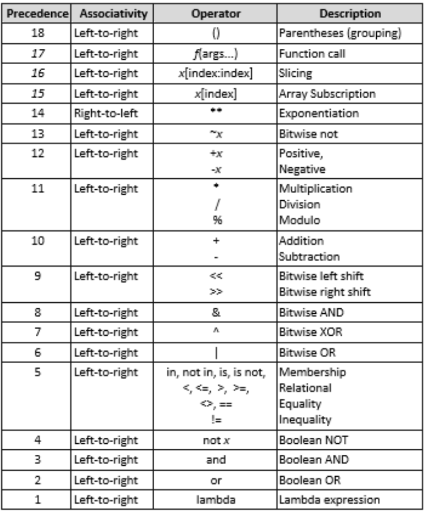
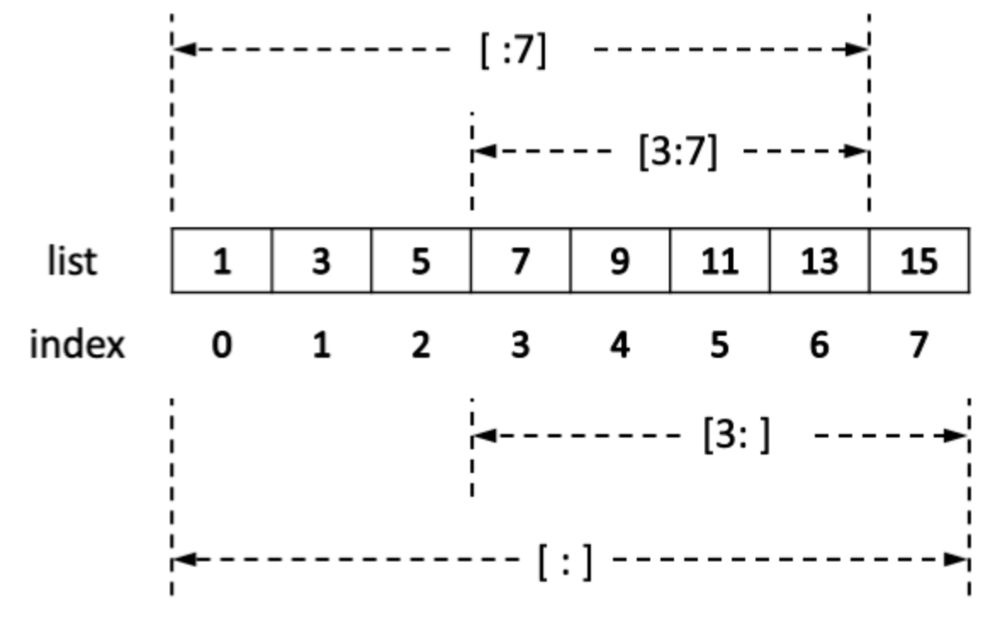
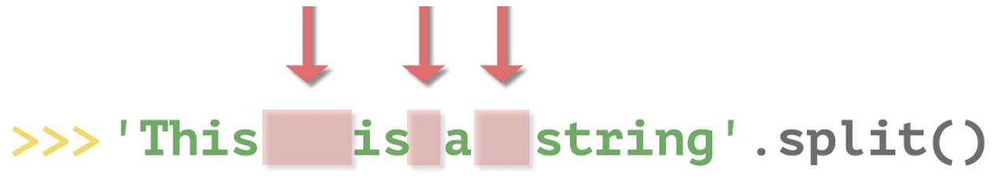

# Syntax

* syntax is set of rules defined by computer language
* defines the combinations of symbols that are considered to be correctly structured statements or expressions in that language

## IO

* [Variable 1](https://docs.google.com/forms/d/1WqtkeaNlVPNL4Q56uLiseUAVoRHRQxFwjje5VOb4tjA/edit)
* [Variable 2](https://docs.google.com/forms/d/1ggcgV1g-E0RV6QLgD3Ynnb6uJi3ooaLtQkUhH4fozaU/edit)
* [Type](https://docs.google.com/forms/d/1LdvIke1OI0rPIMZpoUnOB3BC00dAiwxwPGIUDbWxLvc/edit)

> Run

* [Online Editor - leetcode](https://leetcode.com/playground/new/empty)
* [Online Editor - codechef](https://leetcode.com/playground/new/empty)

```py
python a.py
-c <command>      # Execute python code in command (; for line delimiter)
-m <module-name>  # Search sys.path for named module / execute as the __main__ module
-u          # Force stdin, stdout and stderr to be totally unbuffered.
-O / -OO    # removes assert statements / assert statements + __doc__ strings.
```

> Comment

```text
#      # single line comment
"""    # multi line comment
written by
Sean Hwang
"""
```

### Type

* never explicitly destroyed
  * when they become unreachable they may be garbage-collected

> Immutable

* change address when operates
* int, float, bool, str, tuple, complex, frozenset, unicode 

```py
int        # 1, 2
float      # 1.5, -0.0, float('Inf')
complex    # 5 + 3j
str        # "A"

isinstance(entry, dict) # check for type
type(int)               # print type 
```

> Muttable

* list, set, dict are mutable

### Keywords

* Cannot be used as identifier
* Lists of keywords in python

```py
False | True | await | else | import | None | except | in | raise | class | finally | return | and
| continue | for | lambda | try | as | def | from | while | assert | del | not | with | async | elif | if | or
```

* yield
  * Insert a line result = [] at the start of the function.
  * Replace each yield expr with result.append(expr).
  * Insert a line return result at the bottom of the function.

```py
def cube_numbers(nums):     # Cube numbers
  for i in nums:
    yield(i**3)

def recursive_items(dictionary):
  for key, value in dictionary.items():
  if type(value) is dict:
  yield from recursive_items(value)
  else:
  yield (key, value)

cubes = cube_numbers([1, 2, 3, 4, 5])
for i in range(5):
  print((next(cubes)), 1)
  
a = {'a': {'b': 'c', 'd': 'e'}, 'f': 'g'}
print(list(recursive_items(a)))
```

* break

```py
for item in container:
  if search_something(item):
  process(item)
  break
else:    # else executes after the loop completes normally
  not_found_in_container()
```

* pass
  * null operation → placeholder when a statement is required syntactically

* is
  * is compares identities, reference

> Scope

* global
  * in a function if we want to do assignments / change them

* nonlocal
  * Nonlocal is similar in meaning to global. But it takes effect primarily in nested methods
  * w/o it variables are read-only (to write a variable create a new local variable in the innermost scope)

```py
def pprint(st): return print(st.expandtabs(32))

# 01
def global_():
  def scope():
    a = 0

    def change_local():
      a = 1  # Variable 'a' is redefined as a local
      pprint(f'Inside change_local() \t {a}')     # 1

    def change_global():
      global a
      a = 2
      pprint(f'Inside change_global() \t {a}')    # 2

    def change_nonlocal():
      nonlocal a
      a = 3
      pprint(f'Inside change_nonlocal() \t {a}')  # 3

    global func_global

    def func_global():
      pprint("I am global function")


    pprint(f'Before \t {a}\n')
    change_local()
    pprint(f'After change_local() \t {a}\n')      # 0

    change_global()
    pprint(f'After change_global() \t {a}\n')     # 0

    change_nonlocal()
    pprint(f'After change_nonlocal() \t {a}\n')   # 3

  scope()
  pprint(f"outside scope \t {a}")                 # 2
  func_global()
```

### Builtin

* [Builtin](https://docs.google.com/forms/d/1h5ecgQP-LY4t2Ws2dIiKW_hIoNF4LdygvobNjGnQYik/edit)
* [zip](https://docs.google.com/forms/d/1Jk4mCZZ_7ONrFjg9UUuSJha-GKOn4fU8pnMCApkj8Eo/edit)

```py
all(it)      # True if all elements of the iterable are true
any(it)      # True if any element of the iterable is true
bin(num)     # Convert an integer number to a binary string prefixed with 0b
bit_length() # number of bits necessary to represent an integer in binary
dir()        # returns list of the attributes and methods of any object
eval()       # parses expression passed in and runs python expression within
id(obj)      # print address of object
import(name, globals, locals, fromlist=(), level=0)  # invoked by the import statement
len()        # find length of iterable
type(obj)    # isinstance() checks if given object is an instance of the subclass
vars(obj)    # returns the __dict__ attribute of the given object
zip(*it)     # aggregates multiple it in a tuple
locals()     # a in locals() to check if variable exists
globals()
compile(source, fn, mod) # 
enumerate(it, start=0)   # for i, (k, v) in enumerate({1:'a', 2:'b'}.items())
isinstance(obj, class)   # if object is instance | subclass of classinfo class
iter(object, sentinel)   # iterator object for the given object
filter(func, iterable)  
reduce(func, iterable, start=1) # (from functools lib)
setattr(object, name, value)    # 
sum()       # sum of all iterables

# Show all builtins
print(__builtins__.__dict__)  # show builtins

for attr in dir("AB"):    # show methods
  print(getattr("AB", attr))  # attr() to run
  
help("AB")        # run interactive help system
```

* print(*obj, sep=' ', end='\n')

```py
print("Hello World")
print(12352, end="")        # no newline after print
print(12352, 1235, sep="")  # no space between comma
print("""line1      
line2""")       # Multiline

# suppress print
import sys
sys.stdout = open(os.devnull, 'w')
print('Hello')        # will be ignored
sys.stdout = sys.__stdout__

# color print
class bcolors:
  HEADER = '\033[95m'
  OKBLUE = '\033[94m'
  OKCYAN = '\033[96m'
  OKGREEN = '\033[92m'
  WARNING = '\033[93m'
  FAIL = '\033[91m'
  ENDC = '\033[0m'
  BOLD = '\033[1m'
  UNDERLINE = '\033[4m'

print(f"{bcolors.WARNING}Warning: No active frommets remain. Continue?{bcolors.ENDC}")

# Escape (₩ is used instead of backslash in korean keyboards)
print("\" \' \\")    # Double Quote / single quote / backslash
print("\n \r \t")    # New Line / Carriage Return / Tab  

# format (introduced after 3.6)  
# Before (3.6) '{1} {0}'.format('one', 'two')
f"{3.1415:.2f}"       # 3.14 (decimal places)
f'{3.1415:+.2f}'      # +3.14 (decimal places + sign)
f"{5:0 > / < / ^ 2d}" # xxxx5 (left / right / center padding)
f"{1000000:,}"        # 1,000,000 (comma separator)
f"{1000000000:.2e}"   # 1.00e+09 (Exponent notation)
f"{0.35:.3%}"         # 35.000% (Percent)
f"{0!r / s / a}"      # repr() str()  ascii() on the argument firs
```

* input()

```py
str = input()         # string
num = int(input())    # single integer 
num = float(input())  # single float 
a, b = map(int, input().split())  # two integers
li = list(map(int, input().split()))  # list of ints

import sys
a = sys.stdin.read()        # All input at once
input = sys.stdin.readline  # Faster Input
```

* map(func, iterable)

```py
# returns a generator, print('\n'.join(map(''.join, grid)))
# Must be casted (to save memory)
```

* open(f, mode='r')

```py
+     # both read and write
a / w # append / create a new file if it does not exist
b     # binary mode
r     # read
t     # text mode (default mode)
x     # open for exclusive creation, failing if the file already exists

with open(filename, 'r+') as f:   # prepend
  content = f.read()
  f.seek(0, 0)
  f.write(line.rstrip('\r\n') + '\n' + content)

file = open('some_file', 'w') # with open('some_file', 'w') as file: (Context manager)
try:
  file.write('Hola!')
finally:
  file.close()
```

* min, max, abs (iterables)
  * [min, max, abs](https://docs.google.com/forms/d/18Y-LtjIQXnTucECDhzw7PGnc7PdZ_m9IwlMUkF4l8aw/edit)

```py
print(min(1, 2))      # 1
print(min([5, 1, 2])) # 5
```

## Operation



* addition

```py
print("1" + "1")     # 11
print(int("1") + int("1")) # 2

int(2.6)       # 2 (float → int)
float(1)       # 1.0
```

* Division

```py
print(24 // 5)    # 4
print(-5 % 3)     # 1
print(5 % 2)      # 1
print(5.1 % 1)    # 0.1
```

> binary

* [Binary](https://docs.google.com/forms/d/1q-TTG8LYhtCI1a1o9c2fgHKecOrrP5bXHxxIZXb2FK8/edit)

```py
n&-n           # Get lowest set bit
(n&(n-1))==0   # Check power of two

int('0b1111')  # 15    (2 → 10)
int('A0', 16)  # 160   (16 → 10)
bin(11)        # '0b1011' (10 → 2)
oct(15)        # '0o17'   (10 → 8)
hex(10)        # '0xA'    (10 → 16)

print('2', '10', '16')   # table
for i in range(50):
  print(bin(i)[2:], '\t', i, '\t', hex(i)[2:]) 
```

> math

* [round](https://docs.google.com/forms/d/19Hzj2ohcfL9cT4QnrDVvd89YTPj_a8z53KNOM-55ZlE/edit)
* [combination](https://docs.google.com/forms/d/1AeV7i1ky3EHT0ap8SStwHDkQiBmrlG8w2hXDEOQrh_c/edit)

> decimal

```py
import decimal
decimal.getcontext().prec = 5000
decimal.Decimal(0.999592935235).sqrt()
```

### Conditional

* [Logical](https://docs.google.com/forms/d/19qlt2Br_eGbxlK5Q34e7NvDNVfmXW5MTOcqLDpWpjRo/edit)
* [Operators](https://docs.google.com/forms/d/1rkJPN_TXCsETwXcGvyBvYQj1UiaW3jb9gNqY0ug69F8/edit)
* [If](https://docs.google.com/forms/d/1t0c4Q6POa8BmpOYU2efDHGHDGZB7DsHatMGo9rVoHcE/edit)

| Operator | Description         |
| -------- | ------------------- |
| >        | greater than        |
| <        | less than           |
| ==       | equal to            |
| <=       | less or equal to    |
| >=       | greater or equal to |
| !=       | not equal to        |

* any object is consider to be True unless it __bool__ defined as False or __len__ is 0
* "", (), [], {}, set(), range(0), 0, 0.0, 0j, Decimal(0), Fraction(0, x) are False

```py
==, is    # compare object’s value / address (never changes once created)
<, <=, >, >=  # compare two values
```

```py
a = int(input())
if a == 1:
  print("One")
elif a == 2 or a == 3:
  print("Two or Three")
else:
  print("Too Large")
```

> Exception

* Builtins exceptions

```py
ImportError
NotImplementedError
ZeroDivisionError
```

* Catch all exception

```py
test_cases = [(1, 0), ('1', 1), (1, 1)]

for x, y in test_cases:
  try:
    z = x / y
  except ZeroDivisionError as e:
    print(e)
  except:         # Catch all exception
    print(sys.exc_info()[0])
  else:
    print("Successful")
```

* Raise exception quitely

```py
class StopExecution(Exception):
  def _render_traceback_(self):
  pass

raise StopExecution
```

### Iterable

* strings, list, set, dictionary are iterables

* [Range](https://docs.google.com/forms/d/1dz9jZFRHZ-o8WkX8YMZOGZHQNHc2Y0IP1pr1i0u4bPw/edit)
* [For](https://docs.google.com/forms/d/16-2IDV2GtXfgGp-U0EfyfdR9koq8bL5a3NepdAgupzU/edit)
* [Index](https://docs.google.com/forms/d/1U_VWE-a4XXsrV81rmktAdtdeF5GoF3A3eSQiqa15d4E/edit)
* [List_1](https://docs.google.com/forms/d/1OjjwrnTEIrhmoP7e7bzcU81yK9B7fKGViyWFRQJ_uNY/edit)
* [List_2](https://docs.google.com/forms/d/1JOb7wz4EX5AVQ5JjGPFercOH7VgmozrD9d8r4p7NdnQ/edit)
* [2D](https://docs.google.com/forms/d/1n5pIPsNG1zgzMWEwxq4zJITLHx_fLYJUsOhIDZlLoc0/edit)

* index starts with -1 backward


```py
li = [1, 2, 0 6]
li[i]    # element in i th index, starts from 0

s = 'This is to demonstrated substring functionality in python.'
s[12:22:3] # esre
[:,:,-1]   # reverse
```

> Comprehension

* constructs that allow sequences to be built from other sequence

```py
[n * 10 for n in [1, 2, 3, 4]               # [10, 20, 30, 40]
[i for i in range(30) if i % 3 == 0]        # [0, 3, 6, 9, 12, 15, 18, 21, 24, 27]
[n for li in lis for n in [[1, 2], [4, 5]]] # [1, 2, 4, 5]
{x**2 for x in [1, 1, 2]}                   # Set Comprehension
dic = {'a': 10, 'b': 34, 'A': 7, 'Z': 3}    # Dict Comprehension
{ k.lower(): dic.get(k.lower(), 0) + dic.get(k.upper(), 0)  for k in dic.keys()}    # {'a': 17, 'z': 3, 'b': 34}
print(f"{a}=5" if a == 5 else f"{a}!=5 ")
print(f"{a}=={b}" if a == b else f"{a} != {b}")
```

> String



* Sequence of unicode Character
  * [String_1](https://docs.google.com/forms/d/1OcKS_YdzQKEySMmq_Xas6bJDND0sId_4H-g7Q4WAl8A/edit)
  * [String_2](https://docs.google.com/forms/d/1snU0q32ZGaCc8Q-qOZ7XAUt51i28lZi3pPIiT12kN54/edit)
  * [Split](https://docs.google.com/forms/d/1cSrstATAUQt7WNtsoUzL1eATQsCw65FlxD5qL5HnmKA/edit)

```py
isdigit()           # Checks if string only contains 0-9
isupper() islower() # Return True if upper case or lower case
lower() / upper()   # convert to upper or lower case
swapcase()          # all the upper case letters are lower case and vice versa
title()             # Upper only first char
count(‘a’)          # count number of str
partition(word)     # Search for word, and return a tuple with before, match, after
replace(“P”, “-”)   # replace P to -
rstrip([chs])       # default whitespaces | e.x. 'mississippi'.rstrip('ipz') → 'mississ'
strip()             # removes chars from side (default whitespace)

rfind(str, beg=0 end=len(string)) # highest index in the string where substring sub is found | -1 if not
rjust(width[, fillchar])     # right justified in a string of specified length
index(sub[, start[, end]])   # equivalent to find raise value error
find(sub[, start[, end]])    # lowest index in the string where substring sub is found | -1 if not
split(sep=None, maxsplit=-1) # using sep as the delimiter string
startswith(str, beg=0))      # check if starts with str
```

* join(seq)
  * [Join](https://docs.google.com/forms/d/1_tIWmaxMZktjNbkwjPmqEEeEbE4B9-Ap4JJXmg01Ed4/edit)

```py
"".join([str(x) for x in l])
```

* maketrans

```py
tb = 'ab'.maketrans({'a': '1', 'b': '4'}) # create dictionary
'ab'.translate(tb)  # 14
```

> Encoding

* encoding
  * [Unicode](https://docs.google.com/forms/d/1qQc3AO59rHViwuUL7bH3ICWN9pD_TeTNNWKGNxA5Tfs/edit)

```py
'한'.encode('UTF-8'))            # b'\xed\x95\x9c (bytes)
b'\xed\x95\x9c'.decode('utf-8') # 한 (str)
str(b'\xed\x95\x9c', 'utf-8')   # 한 (str)
f"'한' | u'한' \t '한' ({type('한')})"  # 한

'한'.encode('UTF-8')             # b'\xed\x95\x9c' <class 'bytes'>
b'\xed\x95\x9c'.decode('utf-8') # 한
f"{str(b'hello', 'utf-8')}"
## print(b'\u0660'.decode('utf-8'))
```

* python2 encoding ‘ascii’ encoding
* Unicode → ASCII, code point is < 128, value of the code point, error otherwise

```py
# Python 2  
coding: utf-8  # python2 header
type('가')      # <type 'str'>
type(u'가')     # <type unicode'>
'hello'.decode('utf-8')     # byte → str
unicode('hello', 'utf-8')

# python 3
type('한')            # <class 'str'>
'한'.encode('UTF-8')  # 
unicode_string.encode(enc)  # unicode → str
byte_string.decode(enc)     # str → unicode
b'hello'.decode('utf-8')    # byte → str
str(b'hello', 'utf-8')    

unicode(string[, encoding, errors])  # convert  
```

> regex

```py
re.DOTALL      # match new line
re.I           # case insensitive matching
r"(?<=...)"    # positive lookbehind
r"(?<!...)"    # negative lookbehind.
r"(?=...)"     # positive lookahead. A (?!B) only match if A followed by B
r"(?!...)"     # negative lookahead. A (?!Sam) match Tom Sam

# Escape
\.    # dot
\-    # dash
\( | \) # braces
\[ | \] # bracket

findall(pattern, string, flags=0)  # Return all non-overlapping matches of pattern
finditer(pattern, string)
match()     # match at the beginning of the string
search()    # Checks for one match
split(pattern, string, maxsplit=0)  # split(r'\W+', 'Words, words') ⇒ ['Words', 'words', '']

# Word
[a-c]   # contain a, b, c
[^a-c]  # not contain a, b, c

^a      # starts with a
a$      # ends with a

r"\b(words)\b" # word boundary
r".*a"         # greedy match (all the way to the end, and then backtrack to a)
r".*?"         # non-greedy (will try to match extra characters until it matches 1)
"\n"               # references the nth capturing group
"^([aeiou]).+\1$"  # Starts and End with same vowel
"^\d\d(-?)\d\d\1\d\d\1\d\d"  # 12345678 or 12-34-56-78

一-龥              # Chineses Character
가-힇              # Korean Character
ぁ-ゔ|ァ-ヴー|々〆〤  # Japanese Character

# Length
{5}     # five character
{2,6}   # between 2, 6
+ / *   # 1 / 0 or more
?       # optional

# Conditional
(cat | dog)  # cat or dog

# Type
r"\w"           # Unicode letter, ideogram, digit, underscore  ; Capital <>
[r"\d", r"\D"]  # digit | Non-digit
[r"\s", r"\S"]  # space, tab, newline | non-space, tab, newline
r"\t"           # tab
```

* re.match

```py
expand(template)  # obtained by doing backslash substitution on template
group(n)          # 0 for entire match, n th match
groups()          # Tuples containing all match
groupdict()       # (?P<first_name>\w+) → firstname:
string            # The string passed to match() or search()
```

* re.findall

```py
re.findall("{[^{}]+}", "{A}, {{B}} {{C}, {D}, E}")        # Nested Parenthesis
re.findall("\((?:1|82)\)", "(82) (821) (1) 82 1")         # phone number
re.findall("(?i)\d{2}:\d{2}(?:am|pm)", "02:40pm 12:29AM") # Non capture group
re.findall(r'(.*?)D', "ABCD, ABD")                        # Grap little as possible
re.findall(r'([a-zA-Z0-9_.+-]+@[a-zA-Z0-9-]+\.[a-zA-Z0-9-.]+)', "rbtmd10@gmail.com, fakeemail@@f.com")  # email

ex = 'made|up string*.to>>>>Test----   2""""""한국different~regex23-methods'
re.findall('\S+', ex)     # ['made|up', 'string*.to>>>>Test----', '2""""""한국different~regex23-methods']
re.findall('\w+', ex)     # ['made', 'up', 'string', 'to', 'Test', '2', '한국different', 'regex23', 'methods']
re.findall(dr, ex)        # ['23']
re.findall('\w{4}\-', ex) # ['Test-', 'ex23-']
```

* re.search

```py
txt = "The rain in Spain"
x = re.search(r"\bS\w+", txt)

print(x.string)    # "The rain in Spain"
ex = 'made|up string*.to>>>>Test----   2""""""한국different~regex23-methods'
re.search('\w+', ex) #   <re.Match object; span=(0, 4), match='made'>
re.search('\w+', ex)    # end : 4, group : made, groupdict : {}, groups : (), span : (0, 4), start : 0
```

* re.split

```py
ex = 'made|up string*.to>>>>Test----   2""""""한국different~regex23-methods'

re.split('\s', ex)  # ['made|up', 'string*.to>>>>Test----', '', '', '2""""""한국different~regex23-methods']
re.split('\s+', ex) # ['made|up', 'string*.to>>>>Test----', '2""""""한국different~regex23-methods']
re.split('\w+', ex) # ['', '|', ' ', '*.', '>>>>', '----   ', '""""""', '~', '-', '']
re.split('\W+', ex) # ['made', 'up', 'string', 'to', 'Test', '2', '한국different', 'regex23', 'methods']
```

* re.sub

```py
re.sub('\W+', ' ', ex) # made up string to Test 2 한국different regex23 methods
```

> list

```py
append()  # Adds an element at the end of the list
clear()   # Removes all the elements from the list
copy()    # Returns a copy of the list
count()   # Returns the number of elements with the specified value
index()   # Returns the index of the first element with the specified value
remove()  # Removes the first item with the specified value
reverse() # Reverses the order of the list
sort()  # Sorts the list
pop(default=-1)  # Removes the element at the specified position

[[0]*5 for i in range(5)] # [[0] * 5] * 5 creates 5 copies of the same list
range(0, 5)     # [0, 1, 2, 3, 4, 5]

> extend()  # Add the elements of a list (or any iterable), to the end of the current list
[1,2,3].extend([4,5])   # [1, 2, 3, 4, 5]

> insert()  # Adds an element at the specified position
[1,2,3].insert(0, 4)  # [4, 1, 2, 3]
```

* collections.deque
  * [deque](https://docs.google.com/forms/d/12yDxm3jPOLbyR8Fc9dJ-6yOGz9arfs-iVIiA1s_mTlM/edit)

```py
deque([iterable[, maxlen]])  # if deque is full and item added, item is discarded on other side
append(x)     # Add x to the right side of the deque
appendleft(x) # Add x to the left side of the deque
clear()       # Remove all elements from the deque leaving it with length 0
copy()        # Shallow copy of the deque
count(x)      # Number of deque elements equal to x
full()        # Return True if the queue is full
index(x[, start[, stop]])  # Position of x in the deque
insert(i, x)  # Index error if full
pop()         # Remove and return an element from the right
popleft()     # Remove and return an element from the left
remove(value) # Remove the first occurrence of value
reverse()     # Reverse elements of the deque in-place
rotate(n=1)   # Rotate the deque n steps to the right
extend(iterable)  # Extendleft(iterable)
```

* Example

```py
def tail(filename, n=10):  # Linux tail equivalent
  with open(filename) as f:
    return deque(f, n)
```

* Linked List

```py
class Node(object):
  def __init__(self, val):
    self.val = val
    self.next = None

class MyLinkedList(object):
  def __init__(self):
    self.head = None
    self.size = 0

  def __str__(self):
    ret = ""
    cur = self.head
    while cur:
      ret += (str(cur.val) + " -> ")
      cur = cur.next
    return rets

  def get(self, idx):
    if idx < 0 or idx >= self.size or not self.head:
      return None
    cur = self.head
    for i in range(idx):
      cur = cur.next
    return cur

  def addAtIndex(self, idx, val):
    if idx < 0 or idx > self.size:
      return
    node = Node(val)
    if idx == 0:
      node.next = self.head
      self.head = node
    else:
      pre = self.get(idx - 1)
      node.next = pre.next
      pre.next = node
    self.size += 1

  def deleteAtIndex(self, idx):
    if idx < 0 or idx >= self.size:
      return
    if idx == 0:
      self.head = self.head.next
    else:
      pre = self.get(idx - 1)
      pre.next = pre.next.next
    self.size -= 1
```

* Doubly Linked List

```py
class LRUCache:
  def __init__(self, MSize):
    self.size = MSize
    self.cache = {}
    self.next, self.before = {}, {}
    self.head, self.tail = '#', '$'
    self.connect(self.head, self.tail)

  def connect(self, a, b):
    self.next[a], self.before[b] = b, a

  def delete(self, key):
    self.connect(self.before[key], self.next[key])
    del self.before[key], self.next[key], self.cache[key]

  def append(self, k, v):
    self.cache[k] = v
    self.connect(self.before[self.tail], k)
    self.connect(k, self.tail)
    if len(self.cache) > self.size:
      self.delete(self.next[self.head])

  def get(self, key):
    if key not in self.cache: return -1
    val = self.cache[key]
    self.delete(key)
    self.append(key, val)
    return val

  def put(self, key, value):
    if key in self.cache: self.delete(key)
    self.append(key, value)
```

### Sort

* [Sort](https://docs.google.com/forms/d/1N8vskW2-pWB9XH1I2QEF8HqDXwo72BSavbt_ch9eTRU/edit)

```py
l.sort(key=..., reverse=...)    # Sort in place
[x for _,x in sorted(zip(Y,X))]   # Sort based on other array
sorted([('c', 2),('a', 1)], key=lambda x: x[1])  # Sort by second element of tuple

def takeSecond(elem):
  return elem[1]
random = [(2, 2), (3, 4), (4, 1), (1, 3)]
random.sort(key=takeSecond)     # Sort by custom function
```

### Hashable

> set

* [Set](https://docs.google.com/forms/d/1YFC2YHaTgsQxkSEtDufCzpiKTz43Nr8Iw5Hn7grw2oA/edit)
* not sorted by default

```py
a = set()    # Create
set <= other # if every element in the set is in other
set < other  # set <= other and set != other
set >= other # if every element in another is in the set.
set > other  # set >= other and set != other
set - other  # set with elements in the set that are not in the others
set & other  # element that are in both set and other
set ^ other  # set with elements in either the set or other but not both
union(*others)  # a new set with elements from the set and all others
set | other | …  # a new set with elements from the set and all others.

add(elem)    # Add elem to the set
copy()    # a shallow copy of the set
discard(elem)  # Remove element elem from the set if it is present
isdisjoint(other)  # True if the set has no elements in common with other
pop()      # Remove and return an arbitrary element. Raises KeyError if empty. O(1)
remove(elem)  # Remove elem from the set. Raises KeyError if elem is not in the set. 
```

> Dictionary

* [Dictionary](https://docs.google.com/forms/d/1KUGnlx0pG4nUksDXLK00ZZZATBUBQfGVUZw2SxLTP_U/edit)

```py
dict.fromkeys(iterable[, value])
items()   # iter((key, value))
keys()    # iter(key)
values()  # iter(value)

d[key]    # item of d with key key. Raises a KeyError if key is not in the map.
clear()   # remove all items from the dictionary
list(d)   # a list of all the keys
len(d)  # the number of items
pop(key[, default]) # If key in d, remove it and return, else return default (error if no default)
update([other])   # Update dict with the key|value pairs from other, overwriting existing keys
setdefault(key, val)  # returns the value of the item, if doesn’t exist, insert val

> fromkeys()
x = ('key1', 'key2', 'key3')
y = 0
thisdict = dict.fromkeys(x, y)  # {'key1': 0, 'key2': 0, 'key3': 0}
thisdict = dict.fromkeys(x)   # {'key1': None, 'key2': None, 'key3': None}
```

* iter(d)  
  * an iterator over the keys

```py
vowels = ['a', 'e', 'i', 'o', 'u']
print(next(iter(vowels)))  # prints 'a'
```

* Example

```py
# create dict
dic = { "model": "Mustang", "year": 1964}
dictionary = dict(zip(['a', 'b', 'c'], [1, 2, 3]))

d = {}
for key, value in pairs:
  d.setdefault(key, []).append(value)
return d

# combine dict
sorted_x = sorted(x.items(), key=lambda kv: kv[1]) # Sort by value
inv_map = {v: k for k, v in my_map.items()}        # reverse key, value
```

* collections.Counter
  * subclass of dict
  * [Counter](https://docs.google.com/forms/d/1m1F3h8PzaSuVO6rqFZko9amMXTo_-NNj1UdfiD5ihGU/edit)

```py
from collections import Counter
c = Counter()
c = Counter('gallahad')     # new counter from an iterable
c = Counter({'red': 4, 'blue': 2})  # new counter from a mapping
c = Counter(cats=4, dogs=8)   # keyword args
del c['sausage']

elements()          # iterator over elements repeating count | ignore if less than one
most_common([k])        # Return k most common key value pair in order in O(n log k)
subtract([iterable-or-mapping])   # Subtract another mapping
update([iterable-or-mapping])   # Add another mapping
```

* collections.defaultdict
  * subclass of dict
  * vs setdefault: When look up a missing key, do you want an empty list, or a KeyError

* collections.ordereddict

```py
popitem(last=True)
move_to_end(key, last=True)

OrderedDict(sorted(dictitems(), key=lambda t: t[0]))  # LRU

from collections import OrderedDict
def align_with_list(dic, li):
    print(OrderedDict([(el, dic[el]) for el in li]))    # OrderedDict([('sandwich', 'C'), ('potato', 'A'), ('tomato', 'B')])
align_with_list({'potato':'A', 'tomato':'B', 'sandwich':'C'}, ['sandwich', 'potato', 'tomato'])
```

> heapq

* smallest element is always the root
* If you want to use max heap, multiply by -1

```py
heappush(heap, item)
heappop(heap)
heapify(x)          # Transform list x into a heap, in-place, in linear time
merge(*iterables, key=N, reverse=F) # Merge sorted inputs into a single sorted output
nlargest(n, iterable, key=N)    # return n th largest index and number
nsmallest(n, iterable, key=N)

heapify lst = [9, 8, 7, 6, 5, 4, 3, 2, 1]
heapify(lst)    # [0, 1, 3, 2, 5, 4, 7, 9, 6, 8]
heappush(lst, 10)
for i in range(k):
  ans = heapq.heappop(lst)

heapq.nsmallest(2, lst)  # n smallest elements
```

## OOP

### Function

* args (*) unpacks the sequence|collection into positional arguments
* kwargs (**) does the same, only using a dictionary and thus named arguments
* Set types

```py
def increment(number: int, by: int = 1) -> tuple : 
  return (number, number + by)

# try all methods of object
for method in [method for method in dir(match) if not method.startswith('_')]:
  try:
    pprint(f"\t {method} : {getattr(match, method)()}")
  except:
    pass
```

* iterator

```py
f = open("demofile.txt", "r")
print(f.read())
fouts = {idx: open(os.path.join(tmp_dir, str(idx)), 'w') for idx in range(num_chunks)}
```

* pass arument

```py
def sum(a, b, c, d):
  return a + b + c + d
```

* define argument

```py
s = sum(*(1, 2), **{'c': 3, 'd': 4})

def sum(*values, **options): 
  s = 0
  for i in values:
  s = s + i
  if "neg" in options and options["neg"]:
  s = -s
  return s

s = sum(1, 2, 3)      # returns 6
s = sum(1, 2, 3, neg=True)  # returns -6
s = sum(1, 2, 3, neg=False) # returns 6
```

* / and * in argument

```py
def f(a=2, /):
  pass

f(a=1)   # Error, positional only argument


def f(a, /):
  pass

f()    # Error, argument required
f(a=1)   # Error, positional only argument


def f(*, a=1):
  pass

f(1)     # Error, keyword only arguments


def f(a):  # Positional and keyword
  pass

f()    # Error, argument required
```

* Default arguments are evaluated once when the function is defined

```py
def add_to(num, target=[]):
  target.append(num)
  return target
add_to(1)  ⇒ [1]
add_to(2)  ⇒ [1, 2]

def f():
  city = "Hamburg"
  def g():
    global city
    city = "Geneva"
  print("Before calling g: " + city)
  print("Calling g now:")
  g()
  print("After calling g: " + city)
  
f()
print("Value of city in main: " + city)
```

* Global scope

```py
def scope():
  def change_local():
  a = 1
  print(a)

  def change_global():
  global a, b
  a = 2
  b = 3

  def change_nonlocal():
  nonlocal a
  a = 4

  a = 0

  change_local()
  print(f'After change_local() \t {a}\n')   # 0

  change_global()
  print(f'After change_global() \t {a}\n')  # 0
  print(f'After change_global() \t {b}\n')  # 3

  change_nonlocal()
  print(f'After change_nonlocal() \t {a}\n')  # 3
```

> closure

* the function we return still has access to the internal scope of the function that returned it
* Python’s closures are late binding

```py
# 1. Simple closure
def outer_func(msg):
  def inner_func(): 
  print('Hi' + msg)
  return inner_func()

my_func = outer_func(‘Sean’)
my_func()  # Hi Sean

# 2. Late binding
def create_multipliers():
  return [lambda x : i * x for i in range(5)]

for multiplier in create_multipliers():
  print(multiplier(2), end=" ")    # 8 8 8 8 8

def create_multipliers():
  return [lambda x, i = i : i * x for i in range(5)]  # Solution
```

> Lambda

```py
# even odd
l = [1, 2, 3, 4, 5]
even = list(filter(lambda n : n % 2 == 0, l))   # [2, 4]
odd = list(filter(lambda n : n % 2 == 1, l))    # [1, 3, 5]

l = [(1, 'a'), (2, 'b'), (3, 'c'), (4, 'd'), (5, 'e')]
even = list(filter(lambda n : n[0] % 2 == 0, l))  # [(2, 'b'), (4, 'd')]
odd = list(filter(lambda n : n[0] % 2 == 1, l))   # [(1, 'a'), (3, 'c'), (5, 'e')]

# xor every element
nums = [1, 2, 3, 4, 5]
reduce(lambda x, y: x ^ y, nums)
```

### Class

* created at runtime, and can be modified further after creation
* normally class members are public, and all member functions are virtual
* namespace of the class

```py
<ClassName>.__dict__
<Instance>.__dict__
```

* Variable
* Can be accessed through class name and any instance of the class
* If access using `self.<ClassVariable>`, the value is changed only for the instance

* Method
* dunder method used with __<dunder_name>__

```py
add      # when a + b
code     # co_varnames
hash     # immutable built-in objects are hashable | hashable equal objects have same hash
init     # called to initialize the object | cannot return value
len      # same as len('test')
new(cls) # called when object is created | cls represents class that is needed to be instantiated

repr     # to be unambiguous, compare / readable
return "Class: '{}' \n{!r}".format(self.__class__.__name__, self.__dict__)  # repr for class

slots   # only allocate space for a fixed set of attributes in slots, Reduce RAM → PyPy by default
class MyClass(object):
  __slots__ = ['name', 'identifier']
  def __init__(self, name, identifier):
  self.name = name
  self.identifier = identifier
  self.set_up()

setitem   # Setter
getitem   # Getter
class Building(object):
  def __init__(self, floors):
  self._floors = [None]*floors
  def __setitem__(self, floor_number, data):
  self._floors[floor_number] = data
  def __getitem__(self, floor_number):
  return self._floors[floor_number]
building1 = Building(4)   # Construct a building with 4 floors
building1[0] = 'Reception'
building1[1] = 'ABC Corp'
building1[2] = 'DEF Inc'
print( building1[2] )
```

* static method

```py
@staticmethod  # Static
def is_workday(day):
  return day.weekday() != 5 and day.weekday() != 6
```

* Overloading multiple constructor

```py
@classmethod
def from_string(cls, emp_str):
  first, last = emp_str.split(‘-’)
  return cls(first, last)
```

* Different form constructor

```py
def __init__(self, **kwargs):
  valid_keys = ["title", "first_name", "last_name", "is_guest", "company_name", "mobile", "landline", "email", "password", "fax", "wants_sms_notification", "wants_email_notification", "wants_newsletter","street_address"]
  for key in valid_keys:
    setattr(self, key, kwargs.get(key))
```

> enum

```py
from enum import Enum

class Shape(Enum):
  BIG = 1
  MEDIUM = 2
  SMALL = 3

class Animal:
  SHAPE = Shape

class Lion(Animal):
  def introduce(self):
    return self.SHAPE
lion = Lion()
print(lion.introduce())
```

### Inheritance

* Changes apply to subclass first
* help(ClassName) to explore more about the class
* search for attributes inherited from a parent class as depth-first, left-to-right,

```py
isinstance(manager1, Manager)
issubclass(manager1, Employee)
```
 
* class constructor from parent class

```py
class Developer(Employee):
  def __init__(self, first, last, prog_lang):
    super().__init__(first, last, pay)
    self.prog_lang = prog_lang
```

> Dataclass

* Work in python 3.7 or above
* implement a .__repr__() and an .__eq__() method that can do basic object comparisons

```py
init    # Add .__init__() method? (Default is True.)
repr    # Add .__repr__() method? (Default is True.)
eq      # Add .__eq__() method? (Default is True.)
order   # Add ordering methods? (Default is False.)
unsafe_hash # Force the addition of a .__hash__() method? (Default is False.)
frozen      # If True, assigning to fields raise an exception. (Default is False.)
```

* Card

```py
@dataclass
class DataClassCard:
  rank: str
  suit: str = "1"

# Position = make_dataclass('Position', ['name', 'lat', 'lon'])  # Equivalent
class RegularCard
  def __init__(self, rank, suit = "1"):
    self.rank = rank
    self.suit = suit

  def __repr__(self):
    return (f'{self.__class__.__name__}' f'(rank={self.rank!r}, suit={self.suit!r})')

  def __eq__(self, other):
    if other.__class__ is not self.__class__:
    return NotImplemented
    return (self.rank, self.suit) == (other.rank, other.suit)

```

* Geolocation

```py
from dataclasses import dataclass, field
from math import asin, cos, radians, sin, sqrt

@dataclass(order=True)
class Position:
  name: str = field(compare=False)
  lon: float = 0.0
  lat: float = 0.0 

  def distance_to(self, other):
    r = 6371  # Earth radius in kilometers
    lam_1, lam_2 = radians(self.lon), radians(other.lon)
    phi_1, phi_2 = radians(self.lat), radians(other.lat)
    h = (sin((phi_2 - phi_1) / 2) ** 2 + cos(phi_1) * cos(phi_2) * sin((lam_2 - lam_1) / 2)**2)
    return 2 * r * asin(sqrt(h))

seoul = Position('Seoul', 100.8, 59.9)
oslo = Position('Oslo', 10.8, 59.9)
vancouver = Position('Vancouver', -123.1, 49.3)

print(f"oslo to vancouver is {oslo.distance_to(vancouver)}km away")
print(list(sorted([oslo, vancouver, seoul])))
```

> <namedtuple>

```py
NamedTupleCard = namedtuple('NamedTupleCard', ['rank', 'suit'])
Person = namedtuple('Person', ['first_initial', 'last_name']
ace_of_spades = NamedTupleCard('A', 'Spades')
ace_of_spades == Person('A', 'Spades')    # True
```


### Patterns

* [Theory](../cs/cs.md#Patterns)

### Creational

> Singleton

* subclass of the singleton has its own state 
* objects are the same, not just the state

```py
# ref. http://mataeoh.egloos.com/7081556
class Singleton(object):
  _instance = None
  def __new__(class_, *args, **kwargs):
  if not isinstance(class_._instance, class_):
    class_._instance = object.__new__(class_, *args, **kwargs)
  return class_._instance

# Singleton decorater (Used with @singleton)
def singleton(cls):
  instances = {}
  def getinstance():
    if cls not in instances:
    instances[cls] = cls()
    return instances[cls]
  return getinstance
```

> Borg 

* subclass have the same state as their parents classes objects

```py
class Borg:
  _shared_state = {} 
  def __init__(self): 
    self.__dict__ = self._shared_state

class Singleton(Borg): 
  def __init__(self, **kwargs): 
    Borg.__init__(self) 
  def__str__(self):

Singleton(HTTP = "Hypertext Transfer Protocol") 
Singleton(SNMP = "Simple Network Management Protocol") # {HTTP: "Hyp…,", SNMP: "SIM…"}
```

> Factory

```py
def get_pet(pet):
  pets=dict(dog=Dog("Bosom"), cat=Cat("Neo"))
  return gets[pet]
```

* Serializer

```py
import json
import xml.etree.ElementTree as et


class SerializerFactory:
  def __init__(self):
  self._creators = {}

  def register_format(self, format, creator):
  self._creators[format] = creator

  def get_serializer(self, format):
  creator = self._creators.get(format)
  if not creator:
  raise ValueError(format)
  return creator()


class ObjectSerializer:
  def serialize(self, serializable, format):
  serializer = factory.get_serializer(format)
  serializable.serialize(serializer)
  return serializer.to_str()


class JsonSerializer:
  def __init__(self):
  self._current_object = None

  def start_object(self, object_name, object_id):
  self._current_object = {
    'id': object_id
  }

  def add_property(self, name, value):
  self._current_object[name] = value

  def to_str(self):
  return json.dumps(self._current_object)


class XmlSerializer:
  def __init__(self):
  self._element = None

  def start_object(self, object_name, object_id):
  self._element = et.Element(object_name, attrib={'id': object_id})

  def add_property(self, name, value):
  prop = et.SubElement(self._element, name)
  prop.text = value

  def to_str(self):
  return et.tostring(self._element, encoding='unicode')


class Song:
  def __init__(self, song_id, title, artist):
  self.song_id = song_id
  self.title = title
  self.artist = artist

  def serialize(self, serializer):
  serializer.start_object('song', self.song_id)
  serializer.add_property('title', self.title)
  serializer.add_property('artist', self.artist)


if __name__ == "__main__":
  factory = SerializerFactory()
  factory.register_format('JSON', JsonSerializer)
  factory.register_format('XML', XmlSerializer)
  
  json_serial = factory.get_serializer("JSON")
  
  song = Song('1', 'Water of Love', 'Dire Straits')
  serializer = ObjectSerializer()

  print(serializer.serialize(song, 'JSON'))
  print(serializer.serialize(song, 'XML'))
```

### Structural

> Decorator

* adhering to the Single Responsibility Principle
* allows functionality to be divided between classes with unique areas of concern

```py
# 1. Nested decorator, func = dec2(dec1(func))
@dec2
@dec1
def func(arg1, arg2, ...):
  pass

# 2. Multiple args, same as func = decomaker(argA, argB, ...)(func)
@decomaker(argA, argB, ...)
def func(arg1, arg2, ...):
  pass

# 3. Getter, Setter, Deleter
@property
def fullname(self):
  return ‘{} {}’.format(self.first, self.last)

@fullname.setter
def fullname(self, name):
  first, last = name.split(‘ ‘)
  self.first = first
  self.last = last

# Deleter
@fullname.deleter
def fullname(self):
  self.first = None
  self.last = None

class classmethod(object):    # classmethod
  def __init__(self, method):
    self.method = method
  def __get__(self, instance, cls):
    return lambda *args, **kw: self.method(cls, *args, **kw)
```

## Behavior

* about communication between separate objects

> Proxy

* class functioning as an interface to something else

```py
class Image:
  def __init__(self, filename):
    self._filename = filename

  def load_image_from_disk(self):
    print("loading " + self._filename)

  def display_image(self):
    print("display " + self._filename)


class Proxy:
  def __init__(self, subject):
    self._subject = subject
    self._proxystate = None


class ProxyImage(Proxy):
  def display_image(self):
    if self._proxystate == None:
      self._subject.load_image_from_disk()
      self._proxystate = 1
    print("display " + self._subject._filename)

proxy_image1 = ProxyImage(Image("Dog"))
proxy_image2 = ProxyImage(Image("Cat"))

proxy_image1.display_image()  # loading necessary
proxy_image1.display_image()
proxy_image2.display_image()  # loading necessary
proxy_image2.display_image()
proxy_image1.display_image()
```

> Observer

```py
import logging
class Observable:
  def __init__(self):
    self._observers = []
  
  def register_observer(self, observer):
    logging.info(f"Attaching observable {observable}")
    self._observers.append(observer)
    if observable.hasmethod("update"):
      logging.info(f"Successfully attached [Total Observer: {len(_observers)}]")
      return True
    else:
      logging.warn("Observable must implement 'update' method")
      return False

  def detach_observer(self):
    logging.info(f"Dettaching observer {observer}")
    if observable in self._observers:
      logging.info(f"Successfully detached [Total Observer: {len(_observers)}]")
      return True
    else:
      logging.warn("Observable have not yet been added")
      return False
  
  def notify_observers(self, *args, **kwargs):
    for observer in self._observers:
      observer.notify(self, *args, **kwargs)

# Test
class TestNotObservable:
  pass
class TestObservable:
  def update(self):
    pass

notObservable = TestNotObservable()
observable = TestObservable()

self.assertFalse(BankModel.attach(nonObservable))
self.assertTrue(BankModel.attach(observable))
self.assertFalse(BankModel.attach(observable))
```

### Functional

> Mixin

* Language feature

```py
class OrderedCounter(Counter, OrderedDict):
  'Counter that remembers the order elements are first encountered'
  def __repr__(self):
  return '%s(%r)' % (self.__class__.__name__, OrderedDict(self))
  
  def __reduce__(self):
  return self.__class__, (OrderedDict(self),)
```
