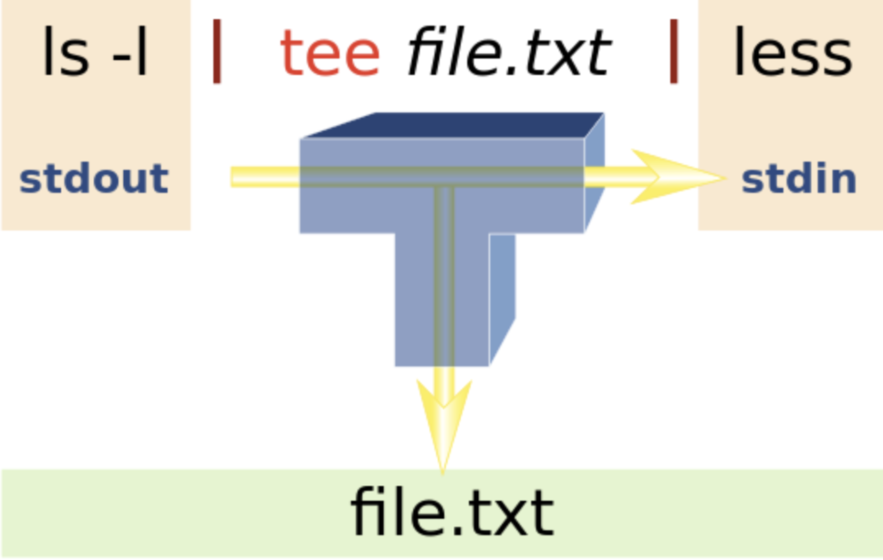

# command

## Error

> Connection to _ closed by remote host  

* Administrator Disconnect

> The System is going down for reboot NOW!

* Remote server shuts down

> Broken pipe

* IP changed or server can't guarantee security

> @@@@@@@@@@@@@@@@@@@@@@@@@@@@@@@@@@@@@@@@@@@@@@@@@@@@@@@@@@@  
@    WARNING: REMOTE HOST IDENTIFICATION HAS CHANGED!     @  
@@@@@@@@@@@@@@@@@@@@@@@@@@@@@@@@@@@@@@@@@@@@@@@@@@@@@@@@@@@  
IT IS POSSIBLE THAT SOMEONE IS DOING SOMETHING NASTY!  
Someone could be eavesdropping on you right now (man-in-the-middle attack)!  
It is also possible that a host key has just been changed.  
The fingerprint for the ECDSA key sent by the remote host is  
SHA256:kxkE5MRHdMciAYqcryrEn6fMRSXFuSuqixJZDU.  
Please contact your system administrator.  
Add correct host key in /home/sean/.ssh/known_hosts to get rid of this message.  
Offending ECDSA key in /home/sean/.ssh/known_hosts:23  
  remove with:  sh
  ssh-keygen -f "/home/sean/.ssh/known_hosts" -R "11.11.1.12"  
Password authentication is disabled to avoid man-in-the-middle attacks.  
Keyboard-interactive authentication is disabled to avoid man-in-the-middle attacks.  

* scp -oStrictHostKeyChecking=no
* ssh-keygen -f "/home/sean/.ssh/known_hosts" -R "11.11.1.12"

> Unable to fetch some archives, maybe run apt-get update or try with --fix-missing?

* -> run apt update
* apt install tftp

> Problem with update-manager: No module named 'apt_pkg' in Ubuntu 13.10, having installed Python 3.4 on /usr/local/lib

* sudo apt-get install --reinstall python3-apt

> Error

```sh
rm file
device or resource busy
```

* lsof +D /path and kill
* umount /path

## File

> Linux

```sh
/bin            # Executables needed in single user mode and to bring system up or repair
/sbin           # holds commands needed to boot the system for sudo user
/etc            # System related configuration file (local static file to control program operation) 
/etc/paths      # look for commands
/etc/hosts      # Static table lookup for hostnames
/etc/services   # Internet network service list
/issue          # Check Linux Version
/etc/init.d     # start/stop scripts used to control daemon while system is running boot
/opt            # Install unbundled packages, each in its own subdirectory
/proc           # interface to kernel data structures
/proc/pid       # exe a copy of the binary image of the running process
/proc/sys       # Info about system, allows system admin  to enable, disable kernel features
/usr            # Files under it are shareable between OS instances
/usr/local      # Install files built by administrator (make), not managed by system packager
/var            # Variable data files (spool dir | files, administrative, log, transient | temp files)

# Mac
/boot           # /System/Library/Kernels
/home           # /Users
/root           # /var/root
```

> dirname vs basename

```sh
/usr/lib/log    # /usr/lib vs /log
/usr/           # / vs usr
usr             # . vs usr
/               # / vs /
```

> lsattr

> chattr

```sh
+ / -           # Adds / removes attribute to existing attribute of files.
=               # Keep the existing attributes that the files have
i               # immutable
```

> file

* determine file type

> stat

* displays the size and other stats of a file/directory or a filesystem.

> patch

* apply a diff file to an original

> locate

* fast but less accuratej

> whereis

* locate the binary, source, and manual page files for a command

> which

* returns the pathnames of the files which would be executed in the current environment

### Navigation

> ls

* lists contents in the directory

```sh
-a                # show hidden file
-d                # list directories as plain files
-h                # human readable
-i                # Lists IP sockets
-l                # file mod, # links, owner, group, bytes, modified path
-R                # recursively
-S / t            # by size, date 
ls -1 "$PWD/"*    # get all absolute path
```

> tree

* brew install tree for mac

```sh
-d                # Directory only
-f                # Full path prefix for each file.
-I <pattern>      # Do not list those files that match the wild-card pattern
```

> pwd

* print working directory

> pushd

* saves the current working directory in memory

> popd

* changes current directory to directory that was most recently stored by pushd

> dirs

* Display the list of currently remembered directories

```sh
-p           # Causes dirs to print the directory stack with one entry per line
```

> cd

```sh
~            # change to home directory
..           # parent directory
-            # change to last directory
-L           # Follow symbolic links (default)
-P           # Follow physical directory
"dir with_space"        # directory with whitespace
$(dirname a/b/file.cpp) # cd into file's located folder
```

> ag

* multithreading / case-insensitive
* apt install silversearcher-ag    # download on mac

```sh
-u                   # Search everything
--hidden             # find hidden file, except ~/.agignore
-G .java 'ftp' .     # specific file extension
-C 5                 # five lines around
```

> find

```sh
-L                          # Follow symlink
-maxdepth n                 # search n level
-mmin -60                   # modified in last 60 minutes
. -name / -regex FILENAME   # Find file with name / regex
-path '*/nested/folder/*'   # Find nested folder
-type d?                    # Find Directory
-exec ls -l {} \;           # pipe with ls -l
-printf '%TY-%Tm-%Td %TT %p\n' | sort -r
```

> readlink

```sh
-f            # show full path
```

### Operation

> cp

* copy file

```sh
-r [directory]    # copy all of the files including files inside of subfolders
-f                # if destination file cannot be opened, remove and try 
```

> mv

```sh
-t DESTINATION file1 file2 file3    # multiple files 
`ls -1 | grep -v no_move.jpg folder      # move everything except one
~/Linux/Old/!(Tux.png) ~/Linux/New/
```

> rm

```sh
-r <dir>                # Remove directories and their contents recursively
rm !(a.txt|b.txt)       # Remove all except a.txt and b.txt
```

> touch

* Create or update modified date on file

> diff

* Check whether two files are equal

```sh
ssh user@remote_host "cat foo" | diff - foo         # diff over remote
<(ssh server1 'cat foo') <(ssh server2 'cat foo')   # diff two remote file
```

> rmdir

* remove directory

> mkdir

* Create directory

```sh
-p dir1/dir2    # nested directory
```

### Link

> ln

```sh
-n LINK          # treat LINK as a normal file if it is a link to dir
-f             # remove existing destination files
-s /any/file linked    # Create Symbolic link

-lnf          # overwrite existing symbolic link
```

> unlink

unlink linked-file

### Mount

> mount

attach filesystem found on device (type) at the directory dir
cat /proc/mounts        # show all mounted files
sudo mount system.img temp_system

> umount

sudo umount temp_system

### Read

> cat [filename]

* reads files sequentially, writing them to the standard output.

```sh
-T                      # print new line as ^IO
file | grep -vi "the"   # Print files with line the 
/etc/*-release          # Prints linux distribution
file1.txt file2.txt > file3.txt  # Merge two files into one
```

> head [filename]

* print the first 10 lines of each FILE to standard output.

> tail [filename]

* print last 10 lines of each FILE

```sh
-f         # wait for new strings, show dynamically
```
  
> wc

```sh
-l                              # Counter number of lines
find . -name '*' | xargs wc -l  # Count all number of lines 
```

> more

* additional development on “more” had stopped
* uses same functions as vi editor
* spacebar to go to the next page

> less

* faster because it does not load the entire file at once
* allows navigation though file using page up/down keys

> diff

```sh
<(echo a) <(echo b) # Print diff of two output command
-y                  # Display side by side
```

> Open (mac)

```sh
open .              # Open in finder
```

> code

* open vscode

```sh
-diff <f1> <f2>     # Open diff editor
-n                  # Create a new window
-r .                # Open current directory in most recently used window
```

> dd

```sh
-bs=BYTES           # read and write up BYTES at a time (default 512)
-if=FILE            # read from FILE instead of stdin (/dev/zero)
```

### Media

> ffmpeg

```sh
ffmpeg -i video.mp4 2>&1 | grep Duration  # get duration
```

> imagemagick

* displaying, converting, and editing raster image and vector image file

```sh
brew install imagemagick
convert *.jpg output.pdf
mogrify -format png *.psd
```

### Pipeline

> xargs

```sh
-E                      # (for mac)
-0                      # Change xargs to expect NUL
-t                      # prints command that will be executed to terminal
seq 10 | xargs  (-n1)   # 1 2 3 4 5 6 7 8 9 10 (vertical)

find . -regex ".*mp4" -print0 | xargs -0 -L 1 python3 scripts.py open_video
eval $(grep -v -e '^#' .env | xargs -I {} echo export \'{}\')
```

> cut

```sh
-d -f1 /etc/passwd        # Get all user I can use
```

> tee



* read from standard input and write to standard output and files

```sh
-a            # Append output to files rather than overwriting 
```

> grep

* global regular expression print

```sh
key * \c

-A <num>      # how many lines after the match
-B <num>      # how many lines before the match
-C <num>      # how many lines before, after the match
-E            # Interpret pattern as an extended regular expression
-i            # Case-insensitive
-n            # Show matching line numbers
-v            # Reversing the meaning of a grep search
-o            # Output only matched substrings
```

> sed

* stream editor for filtering and transforming text

```sh
[script] [input-file]

s/              # Replace
/p              # print
-n              # suppress line echoed to stdout after commands 
-i              # In place
"s/hello/hi/" file.txt   # Replace hello to hi in file.txt
```

> shuf

```sh
-n            # number of lines
```

> sort

```sh
-h             # compare human readable numbers
-k n           # nth column
-g             # sort by number
-r             # reverse sort
```

> uniq

```sh
-c             # show counting
```

> tr

```sh
-d              # search and delete any character or string from a text
-s              # compress same adjacent character output to single token
tr "a-z" "A-Z"  # prints in capital letters
```

### Binary

> objdump

```sh
-p /lib/libutil.so | grep dep   # check dependency

-l -S libutil.so > a            # find location of function in binary (libutil.so.0.8.2 ! func@0x17 + 0x94c - [unknown source file])
```

> hexdum

```sh
-C a.cpp         # See original file with it
```

> string

* print printable strings in a object, or other binary, file

> readelf

* when build type or cmake is changed, it becomes new binary
  
```sh
-s libutil.so.1.5.4  | grep FILE   # Which file contained in binary
```

> nm

```sh
build_kmb/modules/core/libvascore.so     # check for symbol
```

> ldd (linux)

* print shared object required by each program
* should not ldd on untrusted executable → objdump
* doesn’t work on a.out shared libraries

```sh
*dd $(which python) / /bin/ls
```

> otool (mac)

```sh
-L a.out
```

> nm

```sh
display name list (symbol table)
<> OBJECT-FN  # lists symbols from object files
-A            # display fn
-C            # decode low-level symbol names
-D            # only display dynamic symbols
```

> objdump

```sh
prints contents of object files and final linked images 
-a / -h a.o                # information in archive's headers / headers
-s (-j section / -b) a.o   # full contents  (in sections / in binary)
-d (-j section) a.o        # show file disassembled codes (in section)
```

> readelf (mac)

* Display information about ELF files

```sh
brew install binutils
readelf -S program.so | grep debug_line
```

### Disk

> df (disk free)

```sh
<>            # report file system disk space usage
-a            # file system's complete disk usage even if the Available field is 0
-h            # free
```

> du

* disk usage

```sh
-s            # display only a total for each argument
-d            # max-depth
-h            # human readable
du -h -d1 .
du -hs * | sort -h      # order by size
```

> fdisk

```sh
-l            # List partition tables for specified devices and exit
```

> dmidecode (DMI / SMBIOS table decoder)

```sh
sudo dmidecode | egrep "Socket Designation: Proc|((Thread|Core) Count)"
```

> ulimit

```sh
ulimit -c unlimited                    # dump core to current directory
```

> sysctl

* Read and set values in /etc/sysctl.conf (kernel parameters)

```sh
sysctl kernel.core_pattern                # get segfault location
sysctl -a | grep machdep.cpu / swap       # show cpu / swap info in mac
```

> lsblk

* lists information about all or the specified block devices

> getconf

* retrieve standard configuration variables

```sh
PATH=$(getconf PATH)            # Set home as default
dpkg-reconfigure
sudo dpkg-reconfigure locales
```

> systemctl

* Control the systemd system and service manager

```sh
enable                   # hook specified unit into relevant places → start on boot
list-units PATTERN       # List units that systemd currently has in memory
list-sockets PATTERN     # List socket units currently in memory
start PATTERN            # Start (activate) one or more units specified on the command line
disable deviceservie     #

status / / ssh           # check status of root mount / ssh
```

> launchctl (mac)

* mac systemctl

### Compression

> tar

* archiving utility, store multiple files in a single file

```sh
(-)z    # (un)z̲ip
(x)     # ex̲tract files from the archive
v       # print the filenames v̲erbosely
-C      # Create a new archive
-f      # argument is f̱ilename

# tar
tar czf main.js package.json LICENSE    # create .tar.gz

# untar
tar -xvzf sample.tar.gz
tar -xvjf sample.tar.bz2                # tar.gz2
```

> md5sum [filename]

* calculate md5sum

> gzip

```sh
-d             # decompress
```

> zip

```sh
zip -r my_arch.zip my_folder
```

> gunzip

* decompress files created by gzip, zip, compress, automatically detect input format

```sh
*.gz        # unzip .gz file
```

> unzip

```sh
-o                     # overwrite files WITHOUT prompting 
file.zip -d <folder>   # Download in 
```

## Util

### Help

> apropos

```sh
"description"    # search the whatis database for strings
```

> man

```sh
<>          # format and display the on-line manual pages
```

> whatis

```sh
<command>      # search the whatis database for complete words  
```

### Copy

> xclip

* for linux

> pbcopy

* for mac

```sh
cat a | xclip / pbcopy    # copy to clipboard
```

### shopt

```sh
shell builtin command to set and unset (remove) various Bash shell options
-s extglob      # allows bang
-q          # Suppresses normal output
```

### Date

sleep

```sh
sleep       # default is seconds, m, h, d
```

> date

```sh
+%Y%m%d     # Format
<>          # display date
-u {month}{day}{hour}{minute}{year}  # set date
```

> time

```sh
-v              #  change verbosity, more statistics with Linux kernel v2.6
real / elapsed  # time between when the program started and finished execution. 
user            # time CPU spent executing application code on behalf of program
system          # time CPU spent executing system or kernel code on behalf of application
Swaps           # num times the process was swapped to disk
Exit status     # exit status of the application.

Page size (bytes)             # page size of the system
Major (I/O) page faults       # num major page faults that required to be read from disk
In / Voluntary context switch # num times the process yielded / taken from CPU 
```

### Text

> awk

```sh
Created by Aho, Weinberger & Kernighan

gsub(regexp, replacement [, targ])      # Global replacement of string

FS        # File separator
OFS       # Output file separator
NF        # The number of fields in the current input record.
NR        # The total number of input records seen so far
-F        # Specify the input field separator

'{print $1,$4}' input.txt       # $n prints nth word delimited by space
'{print NR,$0}' input.txt       # NR prints line number, $0 prints entire string
'NR==n {print $0}' input.txt    # Prints n th line
'_[$0]++' *.csv                 # Find duplicate line
'{print}' input.txt             # Prints every line of data from the specified file
'/abc/ {print}' input.txt       # Prints every line containing abc

'/PAT1/,/PAT2/' file                             # Lines between inclusive
'/PAT1/{flag=1; next} /PAT2/{flag=0} flag' file  # lines between exclude PAT1, PAT2
-F 'pattern' 'NF{print NF-1}' b4                 # Count number of pattern in each line 
'/ptn/ {c++} END {print c}' input.txt            # Count pattern in the string
'{ t = $1; $1 = $2; $2 = t; print; }' input.txt  # Swap first two column
```

## Process


### pgrep

### fuser

* show which processes are using a specified computer file, file system, or Unix socket

```sh
-v -n tcp 80  # check what processes are using a network port:
```

### ltrace

* intercepts library calls and system calls made by your application to C libraries such as the glibc
* analyze the performance of libraries when they are used by applications

### strace

* intercepts system calls make by glibc and other libraries directly into Linux Kernel
* uses ptrace to inspect system calls by the process and how long each took
* strace -f

### Monitor

> ps

```sh
<>          # PPID PID PGID SID TTY TPGID STAT UID TIME COMMAND
a           # show processes for all users
u           # display the process's user/owner
x           # show processes not attached to a terminal
-e          # show the environment after the command
-f          # ASCII art process hierarchy
axjf        # display the process tree on Linux

aux | grep apt       # see all downloading files
-o thcount= pid      # Total thread in pid
-L pid               # Prints all thread used by pid
ax -L --no-headers | wc -l              # Total thread now
/proc/sys/kernel/threads-max            # Total possible thread
ax -o pid,nlwp,cmd  | sort -nr -k2,2    # Ordered by number of threads
```

> top

* show cpu usage

```sh
-o key        # Order process display by sorting on key in descending order
-n nprocs     # Only display up to nprocs processes.
-user user    # Only display processes owned by user

k             # Kill Process (PID and signal-9)
c             # display full command
u             # Specify process of user
shift + t     # Sort by longest uptime
shift + m     # Sort by largest memory usage
shift + p     # Sort by largest CPU usages
space         # refresh
```

* current time | uptime | users sessions logged in | average load on the system (1, 5, 15 min)
* Processes totals (73 total) | running | sleeping | stopped | waiting to be stop from parent
* user | system | priority nice |  I/O operations | hardware interrupts | software interrupts | hypervisor

```sh
PID         # PID of the process(4522)
USER        # The user that is the owner of the process (root)
PR          # priority of the process (15)
NI          # The “NICE” value of the process (0)
VIRT        # virtual memory used by the process (132m)
RES         # physical memory used from the process (14m)
SHR         # shared memory of the process (3204)
S           # S=sleep R=running Z=zombie D=uninterruptible sleep, IO (S)
%CPU        # percentage of CPU used by this process (0.3)
%MEM        # RAM used by the process (0.7)
TIME+       # total time of activity of this process (0:17.75)
COMMAND     # name of the process (bb_monitor.pl)
```

> htop

* visualize memory usage in top

> vm_stat (mac)

* show Mach virtual memory statistics

```sh
# human readable one liner
vm_stat | perl -ne '/page size of (\d+)/ and $size=$1; /Pages\s+([^:]+)[^\d]+(\d+)/ and printf("%-16s % 16.2f Mi\n", "$1:", $2 * $size / 1048576);'  
```

## User

```sh
cut -d: -f1 /etc/passwd      # List all existing User
pip3 show six | grep "Location:" | cut -d " " -f2
```

* History from file

```sh
/var/log/secure     # Red Hat
/var/log/auth.log   # Debian
```

> last

* check login history

```sh
last -15     # all logged user
last user    # particular user
last pts/2   # terminal conncted
```

> lastlog

* reports user's last login information from /var/log/last/log

> lastb

* check user's bad login history

> w

* Show who is logged on and what they are doing

> who

* show who is logged on

> su

```sh
<>              # Change user
-c <command>    # Pass single command to user
```

> id

```sh
<>   # print real and effective user and group IDs
-u   # print only effective user ID
```

> groups

```sh
<>          # Display all groups
user        # list of all groups a user belongs to (first group is primary)
```

> passwd

```sh
<>          # Change password of current user
<user>      # Change password for other user
```

> useradd

```sh
vi /etc/default/useradd
HOME=/home/sean
useradd vivek
passwd sean
finger sean
```

> userdel

```sh
-r option removes files in the user's home directory along with the home directory itself
```

> usermod

```shsh
-l new old  # change username
-a          # Add the user to the supplementary group
-g          # List of supplementary groups which the user is also a member of
-a -G group user  # add user to group on mac
```

> mac

```shsh
# Adding a user
dscl . append /Groups/admin GroupMembership usershortname

# Removing a user: (from the group not the system)
dscl . delete /Groups/admin GroupMembership usershortname

# Reading the membership of the admin group:
dscl . read /Groups/admin GroupMembership

# Change host Display name gyuseung@mac
sudo scutil --set HostName mac
```

## Ownership

> root

* aka superuser, administrator, admin or supervisor
* can do everything
* Unix-like systems, for example, the user with a user identifier (UID) of zero

> Owner

* the assigned owner of the file or directory

> Group

* members of the group that owns the file or directory

> Other

* all other users that owns the file or the directory

### Operation

> chmod

```sh
-R    # change files and directories recursively
```

> chown

```sh
user:group filename                 # transfer filename to user, group
sudo chown -R `whoami` /usr/local  # add permission to all usr/local files
-R                      # change user / group ID for file hierarchies
```

### Super User

> sudo

```sh
local result=1
which sudo 2>&1 1>/dev/null
[ $? -eq 0 ] && result=0      # 0 - ok/ 1 - nok
sudo -Hiu $user env | grep $var    # grep other person’s env

Add user (default id: 1000)
ARG USER_ID=1002

RUN useradd -ms /bin/bash ${USER_NAME} && usermod -aG wheel ${USER_NAME} \
    && echo "${USER_NAME} ALL=(ALL) NOPASSWD: ALL" > /etc/sudoers.d/${USER_NAME} \
    && echo 'Defaults env_keep = "http_proxy https_proxy"' >> /etc/sudoers.d/${USER_NAME}
```

> visudo

* edit sudoer file
* locks the sudoers file against simultaneous edits

* add to sudo group

```sh
usermod -aG sudo id
```

### Signal

* man 7 signal

> suspend

* Suspend the execution of this shell until it receives a SIGCONT signal

> kill

```sh
pid            # kill pid process
-HUP "$PPID"   # logout, restart user
```

> pkill

* find or signal processes by name

> trap

* SIGKILL and SIGSTOP cannot be detected by trap

```sh
command signal        # execute command when signal
'myhandler' INT; myhandler() { ... ;}    # 
```

> wait

* waits for completing any running process (if many, only PID of last command)

```sh
# grep cpu at certain second

for i in 1 2 4 8 16 32; do 
~/measure -t $i 
& sleep 10; top -n 1 -d 1 -i -b;  wait; done
```

> cron

* daemon to execute scheduled commands

 ```sh
# ┌────────────── second (optional)
 # │ ┌──────────── minute
 # │ │ ┌────────── hour
 # │ │ │ ┌──────── day of month
 # │ │ │ │ ┌────── month
 # │ │ │ │ │ ┌──── day of week
 # │ │ │ │ │ │
 # │ │ │ │ │ │
 # * * * * * *
 ```

## Network

> ipconfig

* Internet Protocol Configuration used in Microsoft Windows operating system
* view all the current TCP/IP network configurations values of the computer

> ifconfig

* configure network interface parameters

> iptables

* administration tool for IPv4/IPv6 packet filtering and NAT

### Transport

> rsync src dst

* copy every src to dest
* Uses delta transfer algorithm and optimization to make copies faster
* Uses 873 when using server

```sh
-a                # skip newer files on receiver
-u                # preserve everything
-C                # auto-ignore files in the same way CVS does
-n / --dry-run    # don’t actually run
-e 'ssh -p 10022' # specify remote shell to use
--exclude {'file1.txt','dir1/*','dir2'}   # exclude files / folders
--exclude-from    # exclude all
-L                # transform symlink into referent file/dir
-r                # sync recursively
-v                # increase verbosity
-h / -p / -g      # preserve hard links / permissions / group

-avCL -e "ssh tunnel ssh" cgw01.nlp:/home/data/*.db .   # get files through tunnel
```

> scp src dst

```sh
local_file user@remote:/dir  # copy local to remote 
user@remote:/dir .           # copy remote to local
-o                           # pass option to ssh in format used in ssh_config
StrictHostKeyChecking=no     # 
-3r remote1 remote2          # remote to remote
```

### Port

> lsof

```sh
<>           # list open files
-t           # terse
-i:3000      # show what is running on port 3000
+L1          # select open files that have been unlinked.

kill -9 $(lsof -ti :80)  # Kill what is running on port
```

> nmap

* show which ports are opened

> netstat

* review each of your network connections and open sockets.

```sh
-l            # only listening sockets
-n            # Show numerical addresses instead 
-p            # PID / name of program to which each socket belongs
-t            # tcp
-u            # udp

ESTABLISHED   # connection is currently made there
LISTEN        # socket is waiting for a connection

-tupan | grep LISTEN              # see open ports
netstat -ano | grep :PORT_NUMBER  # kill port | kill running on port
```

> nslookup

* administration command-line tool to obtain domain names, IP address mapping, or other DNS records
* interactive mode

```sh
server 8.8.8.8     # change the DNS server you're using
set debug          # to display the full response packets
type=MX            # resource record type
```

### ssh

> ssh

* Forwarding sends data in one port through a SSH and send it to a port on the remote

```sh
-i              # path to the private key
-l              # login username (-l gyuseung == gyuseung@)
-p              # port
-v              # verbose
-o StrictHostKeyChecking=no                     # doesn’t check key
-L local_port:local_host:remote_port  server    # port forwarding

-tt server1 ssh server2         # ssh server1 and ssh server2 (cons: settings dependent on server1)
-o ProxyCommand="ssh -W %h:%p server1" server2  # %h = server2, %p = ssh port in server2

```

* ~/.ssh/config

```sh
Host base
    User base_id
    HostName base_host
    Port 10122

Host remote
    User remote_id
    HostName remote
    ProxyJump base

# s2 with proxy jump through server1
Host s2
HostName server2
User user2
IdentityFile ~/.ssh/server2_id_rsa
ProxyCommand ssh -W server2:22 server1
```

> ssh-agent

```sh
-s              # Generate Bourne shell commands on stdout
```

> ssh-keygen

* public key (id_rsa.pub) encrypt messages, server knows a set of public keys it trusts
* private key (id_rsa), stored in PC, decrypts messages (mathematical relations with public key)
* append (id_rsa.pub) to known_hosts in ~/.ssh/authorized_keys

```sh
-t rsa              # select algorithm
-f filename         # specifies filename of key file
-H                  # hash known hosts file
-R hostname         # removes key belongs to known host files
```

> ssh-copy-id

* add local ~/.ssh/id_rsa.pub in remote .ssh/authorized_keys  
* ssh-copy-id user@hostname.example.com

```sh
ssh-keygen -t rsa -b 4096
ssh-copy-id -i $HOME/.ssh/id_rsa.pub host-user@hostname

Host any_name
  HostName hostname
  User host-user
  PreferredAuthentications publickey
  IdentityFile "$HOME/.ssh/id_rsa"
```

> sshd

* starts when system boots, master server that listens to incoming connections

```sh
/usr/sbin/sshd
```

### httpd

* Apache HyperText Transfer Protocol (HTTP) server program

```sh
sudo brew services restart httpd
/usr/local/etc/httpd/httpd.conf             # mac
/home1/irteam/apps/apache/conf/httpd.conf   # server
/home1/irteam/apps/apache

Listen 8080         # Listening port
DocumentRoot        # where index.html is
ServerName          # localhost:8080
```

### nginx

```sh
sudo nginx -s reload    # update nignx
```

* example with three server

```sh
                  +--- host --------> node.js on localhost:8080
                  |
users --> nginx --|--- host/blog ---> node.js on localhost:8181
                  |
                  +--- host/mail ---> node.js on localhost:8282

server {
    listen       80;
    location / {
        proxy_pass http://127.0.0.1:8080;
    }
    ...
}

server {
    listen       ...;
    ...
    location / {
        proxy_pass http://127.0.0.1:8080;   # forward requests to `/` to server listening on `http://127.0.0.1:8080`.
    }
    
    location /blog {
        proxy_pass http://127.0.0.1:8181;
    }

    location /mail {
        proxy_pass http://127.0.0.1:8282;
    }
    ...
}
```

### Check

> ping

* test the reachability of a host on an Internet Protocol network

> speedtest-cli

```sh
sudo pip3 install speedtest-cli
```

## Shell

* Environment is set at login and are valid for the duration of the session

```sh
$0      # Which shell am I using
```

> bash

* born again shell

> csh

* c shell

> zsh

* Recursive path expansion → For example “/u/lo/b” expands to “/usr/local/bin”
* Spelling correction and approximate completion: If you make a minor mistake typing a directory name, ZSH will fix it for you
* Plugin and theme support: ZSH includes many different plugin frameworks

> event designators

```sh
!n              # n th command
!! !-n          # previous command / nth previous command
^old^new        # change old from previous command to new (only one)
!#:n / $        # nth / last word in current command
!!:gs/string1/string2    # change old from previous command to new (multiple)
```

### Installer

> apt

* apt-get is one of apt parts → mostly can be ignored
* native Ubuntu system-wide package manager
* packages are usually only updated for each separate Ubuntu release
* used with the Debian family distributions and handles deb software packages

```sh
update                      # update apt

/var/lib/apt/lists          # Storage area for state information for each package resource   
/var/lib/apt/lists/partial/ # Storage area for state information in transit
list --installed            # List installed packages
install -y git
install -y openjdk-8-djk
```

> brew (macOS)

* packages compiled to version-specific subdirectories → multiple versions can be in machine
* Homebrew is a 3rd party addition – on both macOS and Ubuntu
* brew cask is extension to brew that allows management of graphical applications through Cask project

```sh
link                    # creates symlinks to installations you performed
brew cleanup            # run occasionally to avoid running out of disk
brew tap adoptopenjdk/openjdk    # install old java
brew cask install adoptopenjdk8  # 9, 10, 11
```

> choco

* choco install python
* [Install](https://chocolatey.org/docs/installation)

> Debian

* open source community, stability and security
* freeze and scrutinize all packages → packages can be a little old
* Linux Mint, Ubuntu, Elementary OS, and Kali Linux

> curl

* providing a library and command-line tool for transferring data using various network protocols

```sh
-L, --location            # (HTTP) If requested page has moved to a different location use that
 -P, --ftp-port <address> # (FTP) Reverses default listener roles when connecting with FTP
-q / -s / -i              # Quite /Silent (no progress, error) / Include the HTTP-header in output
-m --max-time             # maximum time in seconds
-o <file> / -O            # Write output to <file> / local file named like the remote file we get

 -X POST                        # request type
-H 'Content-Type: app/json'     # header
-d '{"id": "tom", "age": "7"}'  # data


curl -s https://raw.githubusercontent.com/sivel/speedtest-cli/master/speedtest.py | python -
error() {
    print_error $@
    exit 1
}
curl -m 2 www.google.com &> /dev/null || error "Failed to access external"
```

> rqm (Redhat Package Manager)

* manipulates specifically packages it is asked to manipulate
* needs to know the exact location of .rqm package

> ant

* Java installer

> dpkg

* used to install, remove, and provide information about .deb

```sh
--ad-architecture            # package can be installed without using --force-architecture
```

> wget

```sh
-P                 # /path/to/folder
--ask-password     # secure safe 
--spider           # behave as a Web spider, just check that website are there.
--http-user / http-passwd    # Specify username user and password on an HTTP (not safe)
```

> update-alternatives

* maintain symbolic links determining default commands

```sh
--install /usr/bin/python3 python3 /usr/bin/python3.8 2    # set python3.8 with priority 2 
--config            # name
```

> yum

* usually used with the RHEL family OS's and handles RPM software packages

```sh
/etc/yum.conf           # configuration file and related utilities
/etc/yum.repos.d/       # options 

install package_name    # install package_name
remove package_name     # remove a package
autoremove package_name # unneeded dependencies
list                    # list all packages
PKGS=(
    libusbx-devel
    gtk2
    gstreamer1
)
yum install -y ${PKGS[@]}
```

### Environmentl

> chsh

```sh
 -s /bin/bash user            # change user’s shell to bash
```

> env (printenv)

* Print all local variables

> set

* change shell options, set positional parameters, display names and values of shell variables
* use - to set and + to unset (ex. set -e)
* Set | unset values of shell options and positional parameters  

```sh
-a      # automatically export all variables
-e      # Exit immediately if a command exits with a non-zero status
-P      # If set, follow symbolic links when executing commands
```

> locale

* print enabled language

```sh
-e             # any trap on ERR is inherited by shell functions (bash -e)
-o pipefail    # return value of a pipeline is value of last (rightmost) command to exit
```

> source

* run command in current shell
  * When script run (with ./myscript.sh), it creates own process context (a new process environment)

> export

* a new shell is spawned to run the script, so must set by export
* & pass environment values to a child process

```sh
~/.<shell_name>rc       # to make it run when start an interactive shell
~/.<shell_name>profile  # to make when log in
/etc/environment        # sets variable system wide for every user on boot 
/etc/bash.bashrc        # executed if the bash shell is opened 
export name=sean        # Set name variable to sean
export LC_ALL=C         # Change shell language to english
```

> unset

* remove exported variable

> lsb_release

* LSB (Linux Standard Base) and distribution-specific information on the CLI

```sh
-a               # Display all information.
LSB Version:     # :core-4.1-amd64:core-4.1-noarch
Distributor ID:  # CentOS
Description:     # CentOS Linux release 7.7.1908 (Core)
Release:         # 7.7.1908
Codename:        # Core

if command -v lsb_release >/dev/null 2>&1; then
    OS_NAME=$(lsb_release -i -s)
fi
```

> uname

```sh
Print operating system name
-a              # Behave as though all of the options -mnrsv were specified.
-m              # machine hardware name.
-n              # nodename (name that system is known by to communication network)
-p              # machine processor architecture name.
-r / s / v      # operating system release / name / version.

can_escalate_privileges()  # by default (e.g. on Linux) user can do so
{
    local result=0
    if [ "$(uname)" = "FreeBSD" ]; then
        if ! groups $USER | grep wheel 2>&1 1>/dev/null; then
            result=1
        fi
    fi
    return $result
}

system_cpu=`uname -m`
```

### Alias

* disabled in non-interactive shell

> alias

* set shortcut to command

```sh
alias untar='tar -zxvf '
```

> unalias

* unalias shortcut

> type

* print out what command the alias will run

### Print

> echo

* echo y | docker system prune    # Say yes in one line

```sh
echo Hello      World      # Hello World
echo "Hello      World"    # Hello      World
echo Hello * World         # Hello (ls) World
echo "Hello "*" World"     # Hello * World

# Color print
RED="\033[1;35m"
YEL="\033[1;33m"
BLU="\033[1;36m"
GLN="\033[1;32m"
NCL="\033[0m"
echo -e "${RED}RED{NCL}"
echo -e "${BLU}BLUE{NCL}"

# Color print function
SET_FG="tput setab"
SET_BG="tput setaf"
COLOR_RED=1
COLOR_BLACK=0
COLOR_YELLOW=3
print_error() {
    echo -e "$($SET_BG $COLOR_RED)$($SET_FG $COLOR_BLACK)$@$($RESET)"
}

print_info() {
    echo -e "$($SET_BG $COLOR_BLACK)$($SET_FG $COLOR_YELLOW)$@$($RESET)"
}
```

> column

```sh
{
echo -e "PATH_A \t ${PATH_A}"
echo -e "PATH_B \t ${PATH_B}"
echo -e "PATH_C \t ${PATH_C}"
} | column -s $'\t' -t
```

> clear

* clear terminal
