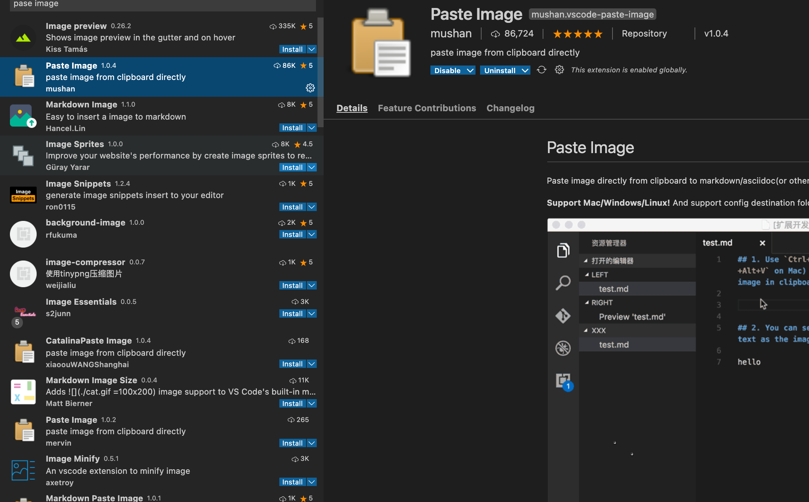

# Syntax

## IO



### builtIns

```text
!, %, ., :, @, {, }

alias, alloc, bg, bind, bindkey, break, breaksw, builtins, case, cd, chdir, command, complete, continue, default, dirs, do, done, echo, echotc, elif, else, end, endif, endsw, esac,
eval, exec, exit, export, false, fc, fg, filetest, fi, for, foreach, getopts, glob, goto, hash, hashstat, history, hup, if, jobid, jobs, kill, limit, local, log, login, logout, ls-F, nice, nohup, notify,
onintr, popd, printenv, pushd, pwd, read, readonly, rehash, repeat, return, sched, set, setenv, settc, setty, setvar, shift, source, stop, suspend, switch, telltc, test, then, time, times, trap, true, type,
ulimit, umask, unalias, uncomplete, unhash, unlimit, unset, unsetenv, until, wait, where, which, while
```

> Builtin

```sh
$         # Escape to variable
$-        # option flags enabled in current shell using set
$_        # previous last parameter or command if none (mkdir -p foo/bar/zoo && cp myfile $_)
$$        # PID of the current instance of shell (same in subshell)
$#        # Number of arguments supplied to a script
$n        # arguments with which a script was invoked ($1)
$0        # name of the shell or / current script
$@        # All the arguments are individually double quoted
$?        # Exit status of the last command executed
$!        # Process number of the last background command (using * or |)

UID / EUID      # numeric real / effective user id of the current user
GROUPS          # array containing list of groups of which the current user is a member
LANG            # setting for all that are not directly set by a LC_* variable.
LANGUAGE        # set LC_MESSAGES to a multi-valued value
LC_ALL          # Takes precedence over all LC_*, LANG, LANGUAGE
LC_NUMERIC      # Determines locale category for numeric formatting
LC_TIME         # determines the locale category used for data and time formatting
LINENO          # line number in script or shell function currently executing
OLDPWD          # previous working directory
PPID (readonly) # The process ID of the shell’s parent process
RANDOM          # Each time referenced, expands to a random integer 0 ~ 32767.

locale-gen en_US.UTF-8  # Create UTF-8
```

## Input

> Command line

```sh
grep -r -- "-n"i        # using '--' declare '-n' is not an option
```

> shift

```sh
# shift.sh a b c d
echo "Total arguments passed are: $#"
echo "The arguments are: $*"      # $* is used to show the command line arguments
echo "The First Argument is: $1"  # a

echo "The First Argument After Shift 2 is: $1"  # c
shift

echo "The First Argument After Shift is: $1"    # d
```

## Data

* doesn’t have data types → used as string in string operation / int in int operation

> quote

* make string separated by space, prevents globbing

> int

```sh
$(( 0377 ))      # expand oct
$(( 0xff ))      # expand hex
```

> Meta char

* can be used without space

```sh
()       # create subshell
;        # two commands in a line
```

> string

* multiple spaces and tab is replaced by space (" preserves space and new line)
* \ to use multiline string

```sh
-z / -n                     # if string is empty / filled
-d                          # if directory exists
${#PARAMETER}               # length of string

${parameter:+word}
${parameter:offset}
${parameter:offset:length}

string=01234567890abcdefgh
echo ${string:7/-7}         # 7890abcdefgh / bcdefgh
echo ${string:7:2/-2}       # 78 / 7890abcdef
```

> array

```sh
a=($(cat))
echo ${a[@]}
echo two{apple,banana}s  # prefix suffix
echo {10..1..2}          # similar to range 
```

## Operation

> Arithmetics

```sh
$(( ))           # $(( 1 + 2 )) ...
```

> brace expansion

```sh
echo a{d,c,b}e              # ade ace abe
mkdir /usr/local/{old,new}  # create multiple
```

> Tilde Expansion

```sh
~-              # old pwd
~-/+ n          # same as dirs -/+ n
-fred           # home directory of the user fred
```

> Parameter Expansion

```sh
${param:-word}      # If param is unset, substitute expansion of word, else param
${parameter:=word}  # If param is unset, expansion of word is assigned to parameter
${param:?word}      # if param is unset, expansion of word to stdout (stderr if unset)
```

> process substitution

* allows a process’s input or output to be referred to using a filename

```sh
<(list)
>(list)
```

> Variable Substitution

```sh
${ }          # variable  $AA, ${AA}, ${AA:-5}, ${AA%.*} ...
$( )          # $( echo "1.3 + 2.5" | bc )
```

> redirection

```sh
>>            # append
>1 | >        # stdout
&> | >&       # standard output and error (&> preferred)
>&0           # redirect same as stdin
>&1           # redirect same as stdout
>&2           # redirect same as stderr
2>&1          # redirect stderr to whatever value is set to stdout
```

> Backtick

```sh
echo `time`          # escape command
```

## Conditional

* doesn’t have data types → used as string in string operation / int in int operation

> Operation

```sh
&& / ||                  # and / or
:                        # True

-R name                  # True if shell variable name is set and is name reference
-z string                # True if the length of string is zero.
-n                       # string not empty

# Files
-a / e / f / s / L FILE  # Exists / regular file / non-empty / symbolic link
-r / w / x FILE aa       # readable / writable / executable

file1 -ef file2          # if file1 and file2 refer to the same device and inode numbers
file1 -nt file2          # file1 modification date is newer than file2 (file1 exists not file2)
file1 -ot file2          # file1 modification date is older than file2 (file2 exists not file1)
```

> if

* space between braces
* == and = is equivalent

```sh
cd ~/tempdir && rm -rf *     # only remove if cd success
if [[ -z $ENV ]]; then       # check environment variable is set
    echo "Please set ENV"
    exit 1
fi

if [[ "a" == "$1" ]]; then
    echo 1
elif [[ "b" == "$1" ]]; then
    echo 2
else
    echo "0"
fi
```

> Case

```sh
case $- in
    *i*) ;;
      *) return;;
esac
```

> For

* update all repos

```sh
for d in */ ; do
    cd $d
    echo $d
    git add -A && git commit --amend --no-edit && git push --force
    cd ..
done
```

* Infinite loop

```sh
for (( ; ; ))  
do
    echo "infinite loops [ hit CTRL+C to stop]"
done
```

* basic multiplication

```sh
read x
read y
for i in {+,-,"*",/}
do
    var=$(((x)$i(y)))
    echo $var
done
```

* Change multiple file names

```sh
for file in Picture*.jpg        
do
    mv "$file" "vacation-$file"
done
```

## while

```sh
echo "pid is $$"

while (( COUNT < 10 ))
do
    sleep 10
    (( COUNT ++ ))
    echo $COUNT
done
exit 0
```

> Option

```sh
while [[ $# -gt 0 ]];
do
    key="$1"
    case "$key" in
        -s|--source-dir)
        source_dir=$(realpath $2)
        shift
        shift
        ;;
        -r|--resource-dir)
        resource_dir=$(realpath $2)
        shift
        shift
        ;;
        -m|--mode)
        mode="$2"
        shift
        shift
        ;;
        *)
    esac
done
```

> getopts

```sh
DEBUG=0
CLEAN=0
while getopts cfd option
do
case $option in
c) CLEAN=1
    ;;
d) DEBUG=1
    ;;
esac
done
```

## Function

```sh
echo_and_run() { echo "\$ $*" ; "$@" ; }
```
