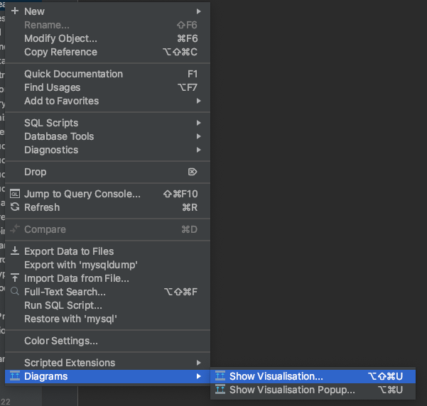
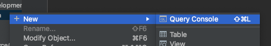
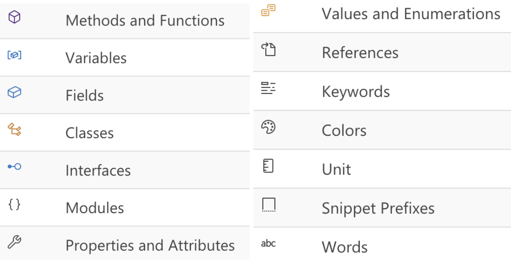
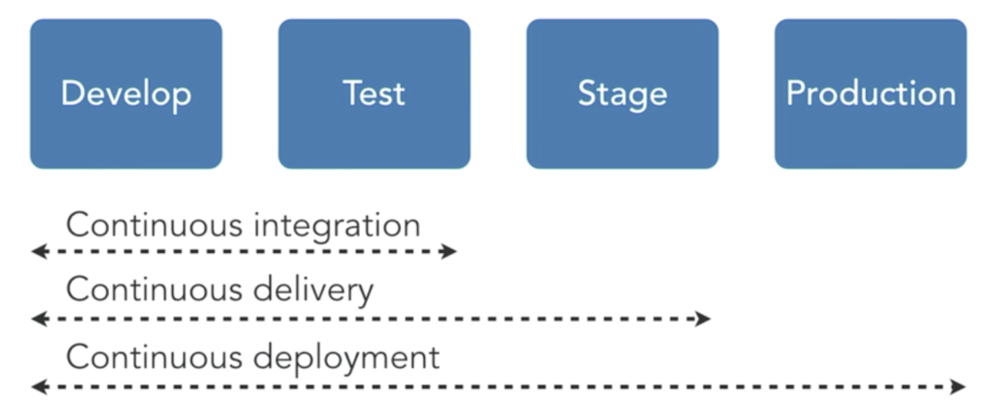
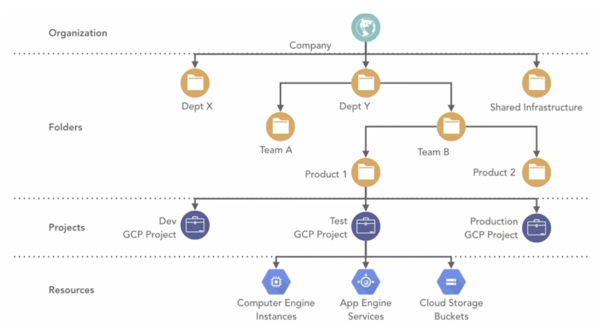
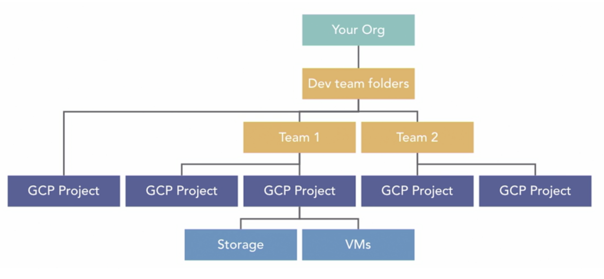
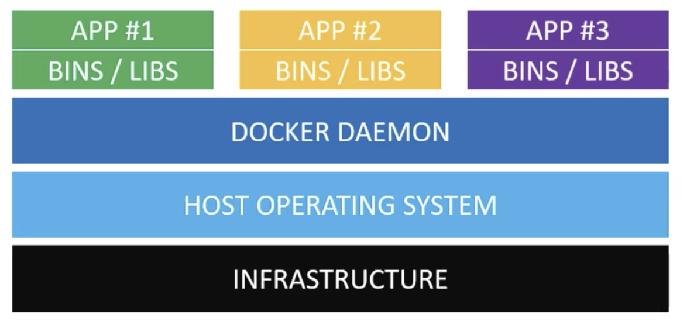
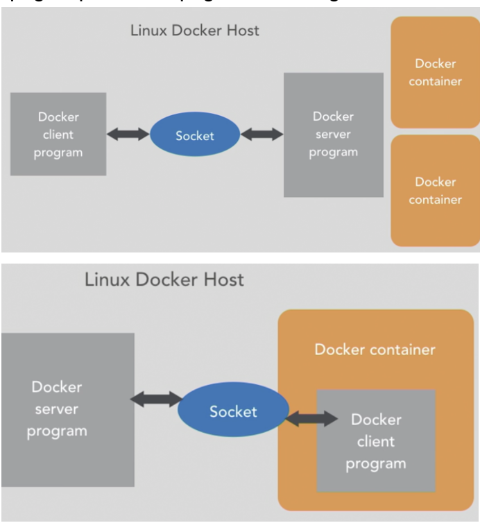
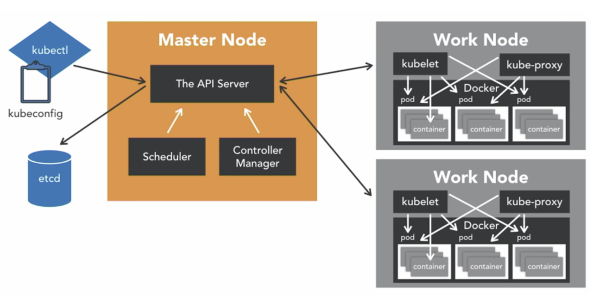
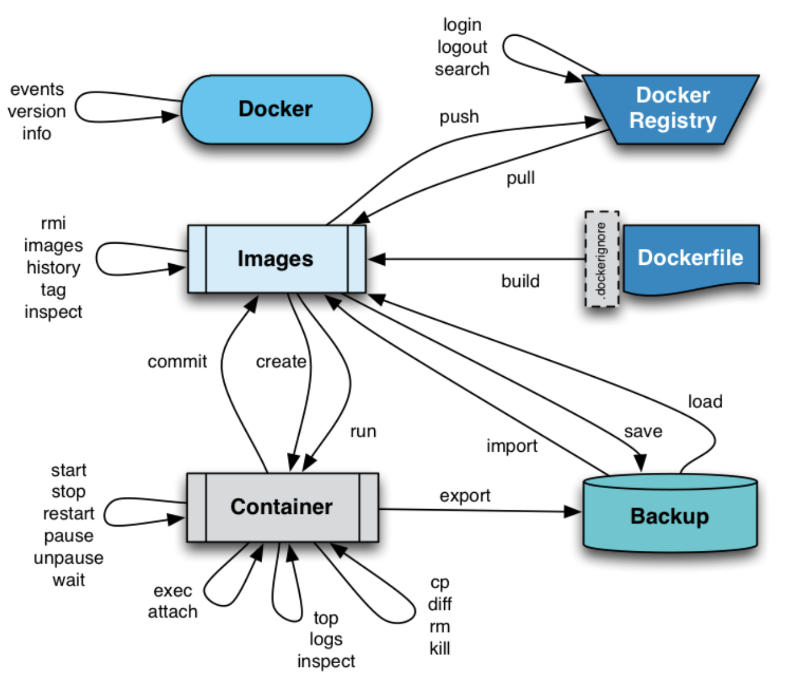

# Tool

## DataGrip

* Useful for data visualization



* Perform sql query



## VScode

* [enter without key](https://code.visualstudio.com/docs/remote/troubleshooting)

```sh
github1s.com    # show github in vscode
```

> workspace

* override user settings
* specific to a project and can be shared across developers on a project

> Icons



> shortcut

```py
# Edit
⌘ d               # edit multiple variables
option up / down  # move current code up / down
⌃ Space           # trigger IntelliSense Suggestions 
⇧ ⌥ a             # toggle comment

# Select 
⌘ click        # Multi-line cursor
⇧ ⌥ drag       # Multi-line cursor
⌃⇧⌘←/→         # expand / shrink select

# Navigation
⌘ o            # Open file or folder
⌘ shift f / h  # find / replace words in all files
⌘ shift o      # find symbol / move to method
⌘ shift .      # See all methods
⌘ option click # Open Side
⌘ click        # Replace / Click again to go back
F8        
⌃ (⇧) -        # Navigate back (forward)

# Screen
ctrl 1         # Focus on editor
⌘ E            # Find given word
⌘ shift B      # Build and debug
⌘ B            # Toggle Sidebar
shift ⌘ M      # jump to errors and warnings in the project
option ⌘ [     # Code folding
⌘ K ⌘ /        # Fold all block comments
⌘ k ⌘ 0 / j    # Fold / unfold all codes
⌘ k            # zenmode

# Terminal
⌃ `            # Focus on terminal
⌃ shift `      # New terminal
⌘ ⌥ ← / → / ↑ / ↓   # Toggle between pane / terminal 
```

> Files

* Settings.json

```json
// ${workspaceFolder} workspace forder 

{
    // General
    "editor.wordWrapColumn": 120,
    "editor.formatOnSave": true,
    "files.exclude": {                   // don't show in file explorer
    ".vscode/launch.json": true,
    "env/windows/*.sh": true,
    "env/osx/dmg.applescript": true,
    "bin/": true,
    "build/": true,
  },

  // Use environment variable ${env:Name} 
  "args": ["${env:USERNAME}"]

  // Python related
  "python.formatting.autopep8Args": [
      "--max-line-length=200"
  ],
  "python.pythonPath": "${workspaceFolder}/env/bin/python3",     // lint python
  "python.linting.pylintArgs": ["--generate-members"],           // disable cv2 warning
  "python.pythonPath": "${workspaceFolder}/env/bin/python3",     // python3 -m venv env
  
  // c++ related
  "C_Cpp.clang_format_style": "file",                            // use .clang-format in current / home directory
  "C_Cpp.default.configurationProvider": "ms-vscode.cmake-tools" // use CMakeLists.txt for linting
}
```

* launch.json

```json
{
"console": "integratedTerminal",     // use integrated terminal for console.log
"sudo" : true,  // must be  used with "console": "externalTerminal" 

// add environment variable
"env": {"API_BASE":"https://"}  ,
"envFile": "${workspaceFolder}/.env" ,
"preLaunchTask": "myShellCommand", // run before
"justMyCode"  // When omitted / set true (default), restricts debugging to user-written code only
}
```

* task.json

```json
{
  "version": "2.0.0",
  "windows": {
    "options": {
      "env": { "Path": "${config:terminal.integrated.env.windows.Path}" }
    }
  },
  "linux": {
    "options": {
      "env": { "PATH": "${config:terminal.integrated.env.linux.PATH}" }
    }
  },
  "osx": {
    "options": {
      "env": { "PATH": "${config:terminal.integrated.env.osx.PATH}" }
    }
  },
  "presentation": {
    "echo": false,
    "reveal": "always",
    "focus": true,
    "panel": "shared",
    "clear": false,
    "showReuseMessage": true
  },
  "tasks": [
    {
      "label": "Build & Run: Release",
      "command": "bash ./build.sh buildrun Release vscode",
      "type": "shell",
      "group": { "kind": "build", "isDefault": true },
      "problemMatcher": [ "$gcc" ],
    },
    {
      "label": "Build: Release",
      "command": "bash ./build.sh build Release vscode",
      "type": "shell",
      "group": { "kind": "build", "isDefault": true },
      "problemMatcher": [ "$gcc" ]
    },
    {
      "label": "Run: Release",
      "command": "bash ./build.sh run Release vscode",
      "type": "shell",
      "group": { "kind": "build", "isDefault": true },
      "problemMatcher": [ "$gcc" ]
    },
  ]
}
```

* c_cpp_properties.json

```json
{
  "configurations": [
    {
      "name": "Linux",
      "intelliSenseMode": "gcc-x64",
      "includePath": [
        "${workspaceFolder}/src",
        "${workspaceFolder}/lib",
        "${workspaceFolder}/test",
        "~/SFML-2.5.1/include",
        "/usr/local/include/**",
        "/usr/include/**"
      ],
      "defines": [ "_DEBUG" ],
      "cStandard": "c11",
      "cppStandard": "c++17",
      "forcedInclude": [ "${workspaceFolder}/src/PCH.hpp" ]
    },
    {
      "name": "Mac",
      "intelliSenseMode": "${default}",
      "compilerPath": "/usr/bin/clang",
      "macFrameworkPath": [
        "/Library/Frameworks",
        "/System/Library/Frameworks"
      ],
      "includePath": [
        "${workspaceFolder}/src",
        "${workspaceFolder}/lib",
        "${workspaceFolder}/test",
        "/usr/local/include/**"
      ],
      "defines": [ "_DEBUG" ],
      "cStandard": "c11",
      "cppStandard": "c++17",
      "forcedInclude": [ "${workspaceFolder}/src/PCH.hpp" ]
    },
    {
      "name": "Win32",
      "intelliSenseMode": "gcc-x64",
      "compilerPath": "C:/mingw32/bin/gcc.exe",
      "includePath": [
        "${workspaceFolder}/src",
        "${workspaceFolder}/lib",
        "${workspaceFolder}/test",
        "C:/SFML-2.5.1/include"
      ],
      "defines": [
        "_DEBUG",
        "UNICODE",
        "_UNICODE"
      ],
      "cStandard": "c11",
      "cppStandard": "c++17",
      "forcedInclude": [ "${workspaceFolder}/src/PCH.hpp" ]
    }
  ],
  "version": 4
}
```

> Install

* Lagging -> Renderer Type dom 

* Window

```
https://docs.microsoft.com/en-us/windows/wsl/install-win10
```

* Mac

```
$HOME/Library/Application Support/Code/User/settings.json
```

### Extension

> vim

* Well integrated with vscode (:vs)

> docker

* show all images and containers

> Paste Image

```text
Paste Image:Path ${currentFileDir}/images
```

> Prettier

```json
.vscode/settings.json
"[typescript]": {
    "editor.tabSize": 2,
    "editor.formatOnSave": true,
    "editor.defaultFormatter": "esbenp.prettier-vscode"
},

.prettierrc
{
    "semi": true,
    "trailingComma": "all",
    "singleQuote": false,
    "printWidth": 80,
    "tabWidth": 4,
    "arrowParens": "avoid"
}
```

> Cmake

* Cmake: Reset CMake Tools Extension State
* configure

```json
// An object containing key : value pairs, which will be passed onto CMake when configuring. It does the same thing as passing -DVAR_NAME=ON via cmake.configureArgs.
{
  "cmake.configureSettings": {"KEY" : "{env:VAR}"}
}
```

## Jenkins



* 1GB RAM, 10 GB disk → docker community Edition
* stability / extensible / free / visibility using pipelines

* test production like environment quality assurance # continuous delivery
* Automate delivery             # continuous delivery

> artifacts

* output generated at the end of each build
* "Archive the artifacts" option in "Post Build Actions" section is specify exact files to archive for build

> timeline

* provides an interface for viewing recent builds and their status in relation to time they were run

> folder

* group things together containing jobs views and other folders
* provides separate namespace, deleting folder delete all contents

> view

* display jobs that meet a criteria, like a filter

> workspace

* dedicated directory on the Jenkins server where each job is given and store generated files 

> build steps

* define the actions that Jenkins will take during a build

### Example

* Hello world

```
pipeline {
    agent any
    stages {
        stage('Hello') {
            steps {
                echo 'Hello World'
            }
        }
        stage('Bye') {
            steps {
                echo 'Bye World'
            }
        }
    }
}
``` 

* Cron

```
@overnight @hourly @midnight @daily
pipeline {
    agent any
    parameters {
        string(name: 'Greeting', defaultValue: 'Hello', description: 'How should I greet the world?')
    }
    stages {
        stage('Example') {
            steps {
                echo "${params.Greeting} World!"
            }
        }
    }
}
```

## Mac

* disable accented key for long press

```
defaults write -g ApplePressAndHoldEnabled -bool false 
```

### Shortcut

* Screen shot

```
⌘ ⇧ 3 / 4    # captures a screenshot of your entire screen / drag to select a portion of your screen
⌘ ⇧ 6        # captures number pad

(⌃) ⌘ shift 4 / 5 # Screen shot (saved to clipboard)
⌘ ⌃ f             # Full screen
```

* Shortcut

```
⌘ ⇧ /             # Help
⌘ space           # Search files
⌥ ⌘ v             # Ctrl x for files
⇧ ⌘ .             # See Hidden files
⌃ ⌘ space         # See special characters
⌘ ⇧ G             # Go to specific file path

System Preferences -> Sharing -> Computer Name: 
XCode
```

## Google

* search

```sh
&tbs=qdr:X             # n h d w m y (http://www.google.com/search?q=local+seo&tbs=qdr:m6)
```

### Drive

* Free storage
* Version Control
* Shareable link with different permission
* drive API for automation (fetching, writing)

```
⌃ ⌥ f    # File
⌃ ⌥ e    # Edit
⌥ /      # Search menu
⌘ /      # Search shortcut
```


### Docs

* [Equation](http://www.notuom.com/google-docs-equation-shortcuts.html)

```sh
⌥ ⌘ x       # Spell check
⇧ ⌘ c       # page info
⌘ ⌥ 1~6     # Heading
⌘ ⌥ c / v   # style copy / paste
```

### Form

* make quiz -> put answer

### Sheet

```sh
option ↑ ↓ # Change sheet
```

### Chrome

```sh
⌘  d       # bookmark
⌘  l       # search tab
⌘  `       # change window
⌘  ⇧  t    # reopen closed tab
⌘  ⇧  c    # page inspection
```

> Extension

* stylish

```css
.reset-3c756112--pageContainer-544d6e9c {
    max-width: 1400px;
}

.reset-3c756112--contentNavigation-dd3370a4 {
    padding-left: 0;
    width: calc((100% - 1448px) / 2 + 100px);
}

.reset-3c756112--menuItem-aa02f6ec--menuItemLight-757d5235--menuItemInline-173bdf97--pageSideMenuItem-22949732 {
    display: none;
}

.reset-3c756112--sidebarNav-1270f224 {
    display: none;
}

.reset-3c756112--body-324a5898 {
    margin: 0;
}

.reset-3c756112--body-324a5898 {
    width: 100%;
}
```

## GCP



> Terms

* artifact
* container
* storage

```sh
Multi regional  # frequent access
regional        # cheap in certain region
nearline        # infrequent access
coldline        # long term backup
```

* OAuth2
  * Allows a user to give permission for an app to act on their behalf
  * Register your app with Google (provide a client id, and client secret)
  * Redirect user to authorization URL (happens on google’s server), Google shows consent screen
  * Google provides an authorization code 
  * your app exchanges the code for a token and include token with subsequent requests to Google)

* OIDC
  * Extension to OAuth2 providing features for convenience
  * You register a third-party application as a client to the provider.
  * The client sends a request to the provider’s authorization URL.
  * The provider asks the user to authenticate / consent to the client acting on their behalf.
  * The provider sends the client a unique authorization code
  * The client sends the authorization code back to the provider’s token URL
  * The provider sends the client tokens to use with other URLs on behalf of the user

### gsutil

* du
* ls
* cp

a.py gs://seansdevnote/    # copy a.py to gs://seansdevnote/

* status

<>                # gsutil version: 4.55

### gcloud



> Error

* ERROR: (gcloud.run.deploy) Cloud Run error: Container failed to start. Failed to start and then listen on the port defined by the PORT environment variable. Logs for this revision might contain more information
  * -> doesn't run exec gunicorn

* gcloud

* [Resource manager](https://console.cloud.google.com/cloud-resource-manager)
* [Images](https://console.cloud.google.com/gcr/images/seansdevnote?project=seansdevnote)

```py
info            # show commands
cheat-sheet     # show useful 
--version       # show version
```

* components

```text
install docker-credential-gcr
```

* compute

```sh
addresses list  # list all address
```

* config

```sh
list     # show all configuration
set      # Set a Cloud SDK property.
unset    # Unset a Cloud SDK property.
get-value project  # get project id
config set run/platform managed run/region us-central1
```

* init

```sh
<>       # authorize SDK tools to access cloud using credentials, default config
--console-only
```

* auth

```sh
list
print-access-token 
login
revoke      # logout
```

* dns

```sh
record-sets transaction start --zone=MANAGED_ZONE    # 
managed-zones list                        # show all managed zones
```

* project

```sh
describe
get-iam-policy my_project
```

* component

```sh
update                # process may take several minutes
```

* auth

```sh
configure-docker        # register gcloud as a Docker credential
```

* iam

```sh
service-accounts list        # see all service accounts
service-accounts keys list --iam-account githubaction@seansdevnote.iam.gserviceaccount.com
```

* artifacts

```sh
repositories create quickstart-docker-repo --repository-format=docker --location=us-central1
repositories list
```

* info

```sh
--show-logs
```

* delete

* builds

```sh
submit .
--tag gcr.io/seansdevnote/flask-fire   # builds docker in server dir
--config cloudbuild.yaml               # use config file
--build-arg request_domain=mydomain
```

```yml
steps:
  - name: "gcr.io/cloud-builders/docker"
    args: ["build", "-t", "gcr.io/my-project/my-image", "."]
    timeout: 500s
  - name: "gcr.io/cloud-builders/docker"
    args: ["push", "gcr.io/my-project/my-image"]
```

* container

```sh
images list        # list all images
images list-tags gcr.io/seansdevnote/page            # list all tags
```

* run

```sh
deploy
--image gcr.io/seansdevnote/flask-fire # set image

services list                          # show all services
services describe                      # 
```

* compute

```sh
instances list                         # see all instances
instances create
```

## Latex


* Starts From 0

```text
\setcounter{section}{-1}
```

* Put string before section

```text
\usepackage{titlesec}
\titleformat{\subsection}{\normalfont\large\bfseries}{Task \thesubsection}{1em}{}
```

* Change sub sections to arabic

```
\renewcommand{\thesubsection}{\thesection.\alph{subsection}}
\renewcommand\thesubsection{\thesection.\arabic{subsection}}

\arabic (1, 2, 3, ...)
\alph (a, b, c, ...)
\Alph (A, B, C, ...)
\roman (i, ii, iii, ...)
\Roman (I, II, III, ...)
\fnsymbol (∗, †, ‡, §, ¶, ...)
```

### Number

* Fraction

```
\over{1}{2}
```

### Figure

* Multiple Figures

```
\begin{figure}[H]
  \centering
  \begin{minipage}[b]{0.45\textwidth}
  \includegraphics[width=\textwidth]{images_new/d1.png}
  \caption{Loss for 0.0001 L2}
  \label{pca_vectors}
  \end{minipage}
  \hfill
  \centering
  \begin{minipage}[b]{0.45\textwidth}
  \includegraphics[width=\textwidth]{images_new/d1_2.png}
  \caption{Accuracy for 0.0001 L2}
  \label{pca_vectors}
  \end{minipage}
\end{figure}
```

* Ordered, unordered

```
\begin{itemize/enumerate}
  \item One entry in the list
  \item Another entry in the list
\end{itemize/enumerate}
```

* Spacing

```
\!            -3 mu
\quad            18 mu
\qquad            36 mu
```

* Vector

```
\left[\begin{array}{c} 1\\0\\1\end{array}\right]
```

* Every Grid

```
\begin{center}
\begin{tabular}{ | m{5em} | m{1cm}| m{1cm} | } 
\hline
cell1 dummy text dummy text dummy text & cell2 & cell3 \\ 
\hline
cell1 dummy text dummy text dummy text & cell5 & cell6 \\ 
\hline
cell7 & cell8 & cell9 \\ 
\hline
\end{tabular}
\end{center}

\begin{table}[]
\begin{tabular}{lllll}
 &  &  &  &  \\
 &  &  &  &  \\
 &  &  &  &  \\
 &  &  &  & 
\end{tabular}
\end{table}

> Matrix
\documentclass{article}
\usepackage{amsmath}
\begin{document}
\[
\begin{bmatrix}
    x_{11}       & x_{12} & x_{13} & \dots & x_{1n} \\
    x_{21}       & x_{22} & x_{23} & \dots & x_{2n} \\
    \hdotsfor{5} \\
    x_{d1}       & x_{d2} & x_{d3} & \dots & x_{dn}
\end{bmatrix}
=
\begin{bmatrix}
    x_{11} & x_{12} & x_{13} & \dots  & x_{1n} \\
    x_{21} & x_{22} & x_{23} & \dots  & x_{2n} \\
    \vdots & \vdots & \vdots & \ddots & \vdots \\
    x_{d1} & x_{d2} & x_{d3} & \dots  & x_{dn}
\end{bmatrix}
\]
\end{document}
```


## Markdown

* a lightweight markup language for creating formatted text using a plain-text editor
* [Syntax Highlight](https://support.codebasehq.com/articles/tips-tricks/syntax-highlighting-in-markdown)

* Two table side by side

```html
<table>
<tr><th> Orders </th><th> Employees </th></tr>
<tr><td>

| OrderID | CustomerID |
| ------- | ---------- |
| 10308   | 2          |
| 10309   | 37         |
| 10310   | 77         |

</td><td>


| EmployeeID | LastName  | FirstName | BirthDate | Photo      |
| ---------- | --------- | --------- | --------- | ---------- |
| 1          | Davolio   | Nancy     | 12/8/1968 | EmpID1.pic |
| 2          | Fuller    | Andrew    | 2/19/1952 | EmpID2.pic |
| 3          | Leverling | Janet     | 8/30/1963 | EmpID3.pic |

</td></tr> </table>
```

* basic

```text
#n                   # headers
** bold    **        # Bold
 > backquote         # 
* / + / -            # list (add spaces to make sublist)
1. / 2.              # unordered list
        # images> Code Snipet
```

* table

```text
|     | name | score | rank |
| --- | ---- | ----- | ---- |
| A   |      |       |      |
| B   |      |       |      |
```

> footnote

* Here's a simple footnote,[^1] and here's a longer one.[^bignote]

```text
[^1]: This is the first footnote.
[^bignote]: Here's one with multiple paragraphs and code.
    Indent paragraphs to include them in the footnote.
    `{ my code }`
    Add as many paragraphs as you like
```

### Distribution

> Pandoc’s

* the most comprehensive one to our knowledge.

> Rmarkdown

* Datavisualization in R

### Syntax

> Images

```

```

> Size

```sh
        # Not supported in gitbook

```

### Math


```sh
$$
\int_{-\infty}^\infty g(x) dx
$$
```

### Gitbook

* For full functionality, use app.gitbook.com web ui

> Pros

* Free hosting, easy setup
* h1 based text search
* full markdown \(push github automatically updates\)
* math equation latex
* images \(using paste image vscode extension\)

> Cons

* Dynamic contents (API Support in new version)
* Customizing (Stylish extension)

### _Error

> TypeError: cb.apply is not a function inside graceful-fs

```sh
cd /usr/local/lib/node_modules/gitbook-cli/node_modules/npm/node_modules/
npm install graceful-fs@4.2.0 --save
```

> TypeError: Cannot read property 'pipesCount' of undefined

```sh
npm install gitbook-cli@2.1.2 --global
```

> Wrong codeblock output

* Codeblock \(\`\`\`\) must has new line before starting
* sub list must be preceded by at least 4 space

> New version

* [https://{username}.gitbook.io/](https://{username}.gitbook.io/)
* demo / document : [https://docs.gitbook.com/](https://docs.gitbook.com/)
* Change of UI \(contents navigation\)
* Add full space search \(prermium\)

```sh
https://app.gitbook.com/{username}/spaces
integration on left tab -> github

# Add Summary
https://github.com/GitbookIO/gitbook/blob/master/docs/SUMMARY.md

# Contents
https://github.com/GitbookIO/gitbook/tree/master/docs
```

> Old version

* gitbook cli

```sh
ls              # Show version installed
update          # Update version
install         # Install required plugins
serve           # Run locally
```

* [https://{username}.github.io/](https://{username}.github.io/)
* demo / document : [https://gitbookio.gitbooks.io/documentation/content/](https://gitbookio.gitbooks.io/documentation/content/)
* Setup

```sh
# Setup PC 
git --version               # git version 2.17.1
node --version  
npm --version

npm install -g gulp         # provides a way to sequence commands that execute steps in local Operating System
gulp --version              # 2.3.0
npm install -g gitbook-cli  # gitbook-cli

# Main Homepage
git pull [username].github.io
echo "<h1> Main </h1>" > index.html
git

# Setup per repository
git clone https://github.com/rebeccapeltz/gitbook-publishable-template.git
mv gitbook-publishable-template/* .
echo "{}" > book.json
grep -qxF '_book' .gitignore || echo '._book' >> .gitignore
grep -qxF 'node_modules' .gitignore || echo '._book' >> .gitignore
rm -rf gitbook-publishable-template
echo "Successfully Setup"

# Publish to Github pages
# alias gbp="gitbook install && gitbook build && rm -rf docs && mkdir -p docs && cp -R _book/* docs && git clean -fx node_modules && git clean -fx _book && git add -A && git commit --amend --no-edit && git push --force"
gitbook install && gitbook build
rm -rf docs
mkdir -p docs
cp -R _book/* docs

git clean -fx node_modules
git clean -fx _book

git add -A && git commit --amend --no-edit && git push --force
```

## Docker



* Carves up a computer into sealed containers that run your code
* Written in go managing kernels

> Install

```sh
# Automatic
curl -s https://get.docker.com/ | sudo sh

# Maunal
curl -fsSL https://get.docker.com -o get-docker.sh
chmod +x get-docker.sh
./get-docker.sh

# Allow Sudo
sudo usermod -aG docker $USER
sudo reboot
```

```sh
sudo vi /etc/systemd/system/docker.service.d/http-proxy.conf
# [Service]
Environment="HTTP_PROXY=http://proxy.example.com:80/"
```

* image defined by your Dockerfile should generate containers that are as ephemeral as possible
* Sort multi-line arguments.
* Always combine RUN apt-get update with apt-get install

> Terms

* Channel

```sh
Stable channel    # latest releases for general availability (<year>.<month>)
Test channel      # pre-releases that are ready for testing before general availability (GA).
Nightly channel   # latest builds of work in progress for the next major release.
```

* .dockerignore
  * used to build better Docker images. avoid uploading unnecessary files reducing build time /image size

* kernel
  * uses cgroups to contain processes
  * uses namespaces to contain networks
  * copy-on-write filesystems to build images

* socket
  * By default, a unix domain socket (or IPC socket) is created at /var/run/docker.sock, requiring either root permission, or docker group membership.

* bridges



```sh
apt-get update && apt-get install bridge-utils

docker run -ti --rm -v --net=host ubuntu:16.04 bash
docker network create new # add one more to list

# terminal
apt update && apt install brid install bridge-utils
brctl list
```

* bridges
  * uses NAT and bridges to create virtual Ethernet networks

* registry
  stores layers and images, listen on port 5000
  maintains index and searches tags, authorize authentication

* route

```sh
docker run -ti --rm --net=host --privileged=true ubuntu bash
docker run -ti -p 8080:8080 ubuntu bash # will add port forwarding in iptables

# in docker 1
apt-get update && apt-get install iptables
iptables -n -L -t nat
```

* ns
  * allow processes to be attached to private network segments
  * private networks are bridged into shared network with rest of containers
  * containers haver virtual network cards 
  * containers get their own copy of networking stack

* Repository
  * Where it came from

* Storage driver
  * control how images, container are stored in docker host (overlay2)

* tag
  * maybe empty → better to refer it by IMAGE ID
  * Version number

* Hypervisor
  * Hyperkit(OSX) / hyper-V (Win) (direct link to infrastructure)
  * VirtualBox / VMWare (run on host OS)

* container
  * Self-contained sealed unit of software → contains everything required to run the code
  * code / configs / process / network / dependencies / operating system
  * exit when process that started it exits (have its own IP address)
  * dependent on images and use them to construct a run-time environment and run an application
  * contents of layers are moved between containers in gzip files

* image
  * every file that makes up just enough of the operating system to do what you need to do
  * Image ID is Internal docker representation of image

> Error

* "-v": executable file not found in $PATH: unknown.
  * image argument must come last (-v page:page image:latest)

```sh
docker run -ti image:latest bash -v page:page 
```

* Hang when apt [Connecting to archive.ubuntu.com (91.189.88.142)]
  * use apt-get update

* docker: Error response from daemon: driver failed programming external connectivity on endpoint  
  app_2 (d408c39433627b00183bb): Bind for 0.0.0.0:80 failed: port is already allocated.
  * A port can be assigned to only one container/process at a time

```sh
docker run -d -p 80:3000 --name app_1 app
# 06fbad4394aefeb45ad2fda6007b0cdb1caf15856a2c800fb9c002dba7304896
docker run -d -p 80:3000 --name app_2 app
# d5e3959defa0d4571de304d6b09498567da8a6a38ac6247adb96911a302172c8
```

* Cannot download images: Error response from daemon: unauthorized: authentication requried.
  * docker login (registry)

### Dockerfile

* small program to create an image
* Each line takes image from previous and make another image → append changes at the end
* process you start on one line will not be running next line → use ENV

> Tip: General

* Sort multi-line arguments
* absolute minimum set up and configuration
* can be piped useful to perform one-off builds without writing a Dockerfile
* echo -e 'FROM busybox\nRUN echo "hello world"' | docker build -
* Reducing size of your final image
  * order them from the less frequently changed
  * instructions RUN, COPY, ADD create layers

```sh
FROM ubuntu:16.04 as builder
RUN apt-get update
RUN apt-get -y install curl
RUN curl https://google.com | wc -c > google_size

FROM alpine
COPY --from=builder /google_size /google_size
ENTRYPOINT echo google is this big; cat google_size

docker build -t google_size .
docker images                 # google_size is only 5.57MB
```

> RUN ["executable","param1", ..] (exec) / command param1 .. (shell)

* /bin/sh -c on Linux or cmd /S /C
* execute in a new layer on image and commit results → used for the next step in the Dockerfile
* parsed as JSON, which means that you must use double-quotes + escape backslashes
* cache for RUN instructions can be invalidated by docker build --no-cache.

> CMD ["executable","param1","param2"] (exec) / command param1 param2 (shell)

* provide defaults for an executing container
* run once when container has started, using docker run     # can override using run IMG CMD 
* does not execute anything at build time, but specifies the intended command for the image.
* Must be used once, if multiple used last

```sh
# docker run imagename echo hello
cat Dockerfile
FROM ubuntu
CMD ["echo"]
```

> LABEL

* adds metadata to an image

> ENTRYPOINT command param1 param2

* allows you to configure a container that will run as an executable
* start of the commands to run (arguments can NOT be over-ridden)
* your ENTRYPOINT will be started as a subcommand of /bin/sh -c, which does not pass signals.
* Only the last ENTRYPOINT instruction in the Dockerfile will have an effect

> EXPOSE 80/udp

* informs Docker that the container listens on the specified network ports at runtime
* TCP or UDP, and the default is TCP
* docker run -P flag to publish all exposed ports and map them to high-order ports.

```sh
8080                        # expose 
```

```js
/*
FROM node
WORKDIR /usr/src/app
COPY package*.json ./
RUN npm install
COPY . .
EXPOSE 4000
CMD [ "npm", "start"]
*/

// data.js
module.exports = {
  DB: 'mongodb://mongo:27017/mydb'
}

// index.js
import express from 'express';
import mongodb from 'mongodb';
import config from './data';

const app = express();
const PORT = 4000;
const client = mongodb.MongoClient;

client.connect(config.DB, { useNewUrlParser: true }, (err, db) => { 
    if(err) {
        console.log('database is not connected')
    }
    else {
        console.log('connected!!')
    }
});

app.get('/', (req, res) => {
    res.json("I love docker!");
});

app.listen(PORT, () => {
    console.log('Your server is running on PORT:',PORT);
});

// package.json
{
  "name": "backend",
  "version": "1.0.0",
  "description": "Simple node and express backend",
  "main": "index.js",
  "repository": "github:mannyhenri/node-docker",
  "scripts": {
    "start": "nodemon ./index.js --exec babel-node -e js"
  },
  "author": "",
  "license": "ISC",
  "dependencies": {
    "express": "^4.16.3",
    "mongodb": "^3.1.6",
    "nodemon": "^1.18.4"
  },
  "devDependencies": {
    "babel-cli": "^6.26.0",
    "babel-preset-env": "^1.7.0",
    "babel-preset-stage-0": "^6.24.1"
  }
}
```

* VOLUME
  * avoid defining shared folders in Dockerfiles

* workdir
  * cd before all other command

* FROM
  * required, base image

* ADD
  * local_path docker_path (copy local_path to docker_pat
  * Copy file, if compressed, decompress automatically (depends on OS)
  * If file is from URL, use permission 600 and doesn’t decompress
  * root:root by default

```sh
project.com/download/1.0/project.rpm            # project
```

> ARG [name][=[default value]]

* defines a variable that users can pass at build-time to the builder (--build-arg [varname]=[value])

> ENV

* environment for all subsequent instructions in the build stage and can be replaced inline
* View using docker inspect, and change them using docker run --env <key>=<value>
* Environment variable persistence can cause unexpected side effects
* $VAR ${VAR} ${VAR:-DEFAULT}

```sh
docker run --e  # override this option
DB_PORT=5432
```

> COPY [--chown=[user]:[group]] [src]... [dest]

```sh
copies files or directories from <src>, adds them to the filesystem of the container at the path <dest>
may contain wildcards and matching will be done using Go’s filepath.Match rules
Doesn’t change file permission
```

```sh
# Dockerfile
FROM httpd:2.4
COPY "$PWD" /usr/local/apache2/htdocs/

# index.html
<h1>Run in docker</h1>

# Without Dockerfile
docker run -dit --name container_name -p 8080:80 -v "$PWD":/usr/local/apache2/htdocs/ httpd:2.4 && \
docker exec -it container_name bash

# With Dockerfile
docker build --pull --rm -f "Dockerfile" -t image_name:latest "." && \
docker run --rm -it -p 8080:80 --name container_name image_name:latest bash
```

* sudo

```sh
FROM ubuntu:latest
RUN apt-get update && apt-get -y install sudo
RUN useradd -m docker && echo "docker:docker" | chpasswd && adduser docker sudo
USER docker
```

* static page

* tag

```sh
image_id docker_id/alpine:tag1    # tag images
```

> container

```sh
prune -f
stop registry                 # stop registry
rm -v registry                # remove registry
cat /proc/self/cgroup | head -1 | tr --delete ‘10:memory:/docker/’    # Get full docker inside docker
```


* Attach
  * links a local input, output, and error stream to a container

```sh
<container-name>            # 
```

* Detach
  * ctrl + p, ctrl + q → detach and continue running

* start

```sh
container             # start container
-a                    # attach STDOUT / STDERR and forward signals
-i                    # attach container’s STDIN
```

* stop

```sh
<name>                # stop container
```

* exec
  * starts another process in an existing container → good for debugging and DB administration
  * can't add ports, volumns

```sh
-it                     # interactive mode
jenkins cat /var/jenkins_home/secrets/initialAdminPassword    # Get password
```

> commit

```sh
container_id  IMAGE:TAG        # convert container to images return image_id
-m "commit messages"
```

> tag

```sh
image new_id                # Change image to new_id 
page seanhwangg/page        # connect to remote
```

> secret

```sh
create name file|item            # create secret
ls                    # list all secrets
rm                    # rm
```

* service

```sh
ls                    # list all services
```

* cp
container:path host_path

* diff
  * see changes from created image

* kill

```sh
docker kill <container>        # change to stop state
```

* rm

```sh
<container_name>    # remove container
-f                  # Force remove
$(docker ps -a -q)  # remove all containers
```

> save

-o my-images.tar.gz debian:sid busybox ubuntu:14.04
 
> load

* Volume

```sh
ls               # see all available volumes
inspect vid      # inspect more about volume id
prune            # remove all unused volume
```

> Network

* port

```sh
container                # List port mappings or a specific mapping for the container
```

```sh
docker run -it -p 2345 -p 2346 --name echo-server ubuntu:14.04 bash
docker port echo-server # in other terminal
# 2345/tcp -> 0.0.0.0:49158
# 2346/tcp -> 0.0.0.0:49157
```

> network

* use host if no isolation is needed

```sh
ls                # list of all 
create nw         # create nw
rm / prune        # Remove  one or more networks / all unused networks
connect image nw
```

```sh
docker network create learning

# Terminal 1
docker run --rm -ti --net learning --name catserver ubuntu:14.04 bash
nc -lp 1234
ping dogserver


# Terminal 2
docker run --rm -ti --net learning --name dogserver ubuntu:14.04 bash
nc catserver 1234
```

### Orchestration

> machine

* when your Host OS does not support running Docker Engine natively (i.e. on Mac and Windows)
* docker-machine env-default

```sh
start             # 
create
env               # Get environment variable
restart 
ip default        # Get default IP
```

> Docker-compose

* Compose file provides document, configure application’s dependencies (db, queues, caches, web API)
* Simple machine coordination → kubernetes for larger

```sh
version            # check if installed
images             # lists images built using the current docker-compose file
down
logs <container>   # prints all the logs created by all services if not specified
ps                 # lists all the containers for services mentioned in the current yml
stop               # stops running containers of specified services in yml file.
help               # disp
```

* up -d docker

```sh
docker-compose build and docker-compose run commands
```

* run
  * creates containers from images built for services in yml. runs a specific service provided as an argument

* build
  * builds images in mentioned services in yml (skip if service is using prebuilt image)

```sh
-f, --file FILE          # Specify an alternate compose file (default: docker-compose.yml)
-p, --project-name NAME  # Specify an alternate project name (default: directory name)
--verbose                # Show more output
```

> docker-compose.yml

* manage multiple Dockerfile

```sh
version: "3.6"  # specification for backward compatibility but is only informative
```

> services (/services)

```sh
blkio_config    # defines a set of configuration options to set block IO limits for this service
command         # overrides default command declared by the container image (CMD)
cpu_count       # number of usable CPUs for service container
cpu_percent     # usable percentage of the available CPUs.
cpu_shares      # service container relative int CPU weight versus other containers

cpu_period
cpu_period allow Compose implementations to configure CPU CFS (Completely Fair Scheduler) period when platform is based on Linux kernel.

cpu_quota
cpu_quota allow Compose implementations to configure CPU CFS (Completely Fair Scheduler) quota when platform is based on Linux kernel.
```

```sh
dns             # defines custom DNS servers
mac_address     # 
env_file        # adds environment variables to the container based on file content
entrypoint      # overrides default entrypoint for the Docker
environment     # environment have precedence over env_file
expose          # must expose from container, must be accessible to linked services
```

> deploy (/services/sid/deploy)

```sh
labels          # com.example.description: "description"
mode            # replicated (default), global
preferences:    # platform's node SHOULD fulfill, datacenter: us-east
replicas        # replicas specifies # containers that SHOULD be running at any given time.
resources       # physical constraints for container to run on platform (limits, reservations)
restart_policy  # condition, delay
```

> build (/services/sid/build)

```sh
context         # path to a directory containing a Dockerfile or url to a git repository
dockerfile      # alternative dockerfile webapp.Dockerfile
args            # can be omitted, build arg won't be set if not set by command building image
labels          # add metadata to the resulting image
shm_size        # size of the shared memory (/dev/shm)
target          # defines the stage to build as defined inside a multi-stage
```

> networks (/services/sid/networks)

```yml
aliases           # aliases declares alternative hostnames for this service on network
priority: 1000    # set numeric priority of network
ipv4/6_address    # static IP address for containers for this service when joining network
```

> port

```yml
ports:
  - "3000" /  "3000-3005" /  "8000:8000" / "9090-9091:8080-8081"
  - "127.0.0.1:8001:8001" / "127.0.0.1:5000-5010:5000-5010" / "6060:6060/udp"
```

> volumes (/volumes)

```yaml
services:
  backend:
    image: awesome/database
    volumes:
      - db-data:/etc/data
  backup:
    image: backup-service
    volumes:
      - db-data:/var/lib/backup/data

volumes:
  db-data:
```

### Kubernates



* open-source platform designed to automate deploying, scaling, and operating application containers
* Kubernetes Clusters to scale are registration and service discovery

> Install

* docker, virtual box

> mac

```sh
curl -LO "https://storage.googleapis.com/kubernetes-release/release/$(curl -s https://storage.googleapis.com/kubernetes-release/release/stable.txt)/bin/darwin/amd64/kubectl"
```

> Node

* kubelet running
* container tooling like docker
* kube-proxy process running
* supervisord

> Pods

* simplest unit that can interact with. create, deploy, delete, represents one running process on your cluster
* contains docker application container / storage resources / unique network ip / containers run options 
* pending, running, succeeded, failed, CrashLoopBackoff

> Minikube

* lightweight kubernetes implementation that creates a VM on local machine 
* deploys a simple cluster containing only one node

```yml
apiVersion: apps/v1
kind: Deployment
metadata:
  name: helloworld
spec:
  selector:
    matchLabels:
      app: helloworld
  replicas: 1 # tells deployment to run 1 pods matching the template
  template: # create pods using pod definition in this template
    metadata:
      labels:
        app: helloworld
    spec:
      containers:
        - name: helloworld
          image: karthequian/helloworld:latest
          ports:
            - containerPort: 80

minikube start                    # sets up a Kubernetes dev environment for you via VirtualBox.
kubectl get nodes                 # verify
kubectl create -f helloworld.yaml # creates a deployment resource from the file helloworld.yaml
kubectl get all                   # pod is only accessible by its internal IP address within the cluster
kubectl expose deployment helloworld --type=NodePort # exposes deployment outside of cluster
minikube service helloworld       # open web browser to app that is running in Kubernetes
```

* docker-env

* service

```sh
helloworld        # run webserver
```

* version

```sh
--client          # client version
```

* cluster-info

```sh
<>                 # 
dump
```

* get

```sh
-o                # output format (yaml)
all               # see all nodes
--watch 

deployments / service  # show all deployment / service
cronjob / pods         # list all cronjob
```

* describe

```sh
cronjob
```

* logs

```sh
POD | TYPE/NAME        # see logs
```

* apply
  * Apply a configuration to a resource by filename or stdin.

```yaml
apiVersion: batch/v1beta1
kind: CronJob
metadata:
  name: hello
spec:
  schedule: "*/1 * * * *"
  jobTemplate:
    spec:
      template:
        spec:
          containers:
            - name: hello
              image: busybox
              args:
                - /bin/sh
                - -c
                - date; echo "Hello, World!"
          restartPolicy: OnFailure
```

* create
  * Create a resource from a file or from stdin.

```sh
cronjob cron --image=cron --schedule="*/5 * * * *" --dry-run=client -o yaml        # create yaml
-f yaml                # run yaml
```

* delete

```sh
nodes / pods / jobs name # delete node
pod                      # delete pods
```

> expose 

* deployment node            # 

### Command



```sh
version           # Show the Docker version information
info              # Display system-wide information
events            # get real-time events from the server
```

> system

```sh
df                # information regarding amount of disk space used by docker daemon
prune             # remove stopped, volumes unused by container, dangling image
ls                # 
```

> Remote

* login

```sh
- u user / -p pw        # set user / password
runnerPass
```

* logout
* pull

```sh
[NAME]             # image or a repository from a registry (jenkins /ubuntu)
HOSTNAME/PROJECT-ID/IMAGE:TAG    # HOSTNAME gcr.io
```

* push
* search

```sh
[NAME]            # Search Docker Hub for image
```

> Inspect

```sh
sudo systemctl daemon-reload
sudo systemctl show --property Environment docker
sudo systemctl restart docker        # restart docker
```

* stats

```sh
top               # ps
-a                # show only running
--no-stream       # show once
```

* ps

```sh
<>                # display all running container
-a                # Show all containers
-l / -n -1        # Show the latest (n last) created container
--no-trunc        # Don’t truncate output
-q                # Only display numeric IDs
-s                # Display total file sizes

--format $FORMAT
export FORMAT="\nID\t{{.ID}}\nIMAGE\t{{.Image}}\nCOMMAND\t{{.Command}}\nCREATED\t{{.RunningFor}}\nSTATUS\t{{.Status}}\nPORTS\t{{.Ports}}\nNAMES\t{{.Names}}\n"
```

* top

* Display the running processes of a container

* logs

```sh
container_name            # show output of the container 
docker run --name log -d ubuntu bash -c "lose /etc/password"
docker logs log   # bash: lose: command not found
```

* inspect

```sh
image / container            # show image, container information
--format='{{range .NetworkSettings.Networks}}{{.IPAddress}}{{end}}'     # '{{.State.Pid}}'
```

* history

```sh
image                    # show history of image
```

> Image

* image

```sh
prune -f                # remove unused images
```

* images

```sh
<>           # Display all docker images
a            # See all container (including stopped container)
l            # Last container to exit
```

* rmi

```sh
<image_name>           # remove image
-f                     # Force remove
docker images -a | grep "pattern" | awk '{print $3}' | xargs docker rmi
```

* build

```sh
<docker_dir>           # build folder with Dockerfile
-t tag .               # tag name to 
--rm                   # Remove intermediate containers after a successful build
--pull                 # Always attempt to pull a newer version of the image
```

* run

```sh
<ubuntu> <cmd>         # Start an empty new container (latest by default)
<image> <ubuntu> <cmd> # Start a new container from image (ex. docker run ubuntu env)
-d / --detach          # Run in detached mode
-e                     # set environment variable
--name                 # set container name
--rm                   # Delete container after exit
-ti                    # Terminal interactive
--link                 # can see env of container 'aaa'
--host                 # 
--privileged=true --pid=host        # can kill other docker
--memory / --cpu-quota / shares     # limit cpu and memory
-v / --volume <host_dir>:<cont_dir> # Mount directory within docker (files if file exists)
--restart=always
-ti ubuntu bash -c "cat /etc/lsb-release"            # show ubuntu version
--name mongo-db -v /data:/data/db -p 27017:27017     # mongodb
-p 8080:8080 -p 50000:50000 jenkins/jenkins          # bind named volume # slave communication
--rm -v /var/run/docker.sock:/var/run/docker.sock docker sh    # docker in docker
--publish 8080:8080 -v jenkins_home:/var/jenkins_home --name jenkins jenkins/jenkins:lts
```

```sh
# terminal 1
docker run -ti --name dog -v /shared ubuntu bash
echo hi > /shared/bosom

# terminal 2
docker run -ti --volumes-from dog ubuntu bash  # go away if all containers exits
ls /shared    # bosom

# terminal 1
docker run --rm -ti -e SECRET=internet --name catserver ubuntu:14.04 bash
nc -lp 1234
nc dogserver 1234   # getaddrinfo: Name or service not known

# terminal 2
docker run --rm -ti --link catserver --name dogserver ubuntu:14.04 bash
nc catserver 1234   # works
nc -lp 4321

env  # CATSERVER_NAME=/dogserver/catserver, CATSERVER_ENV_SECRET=internet
```
